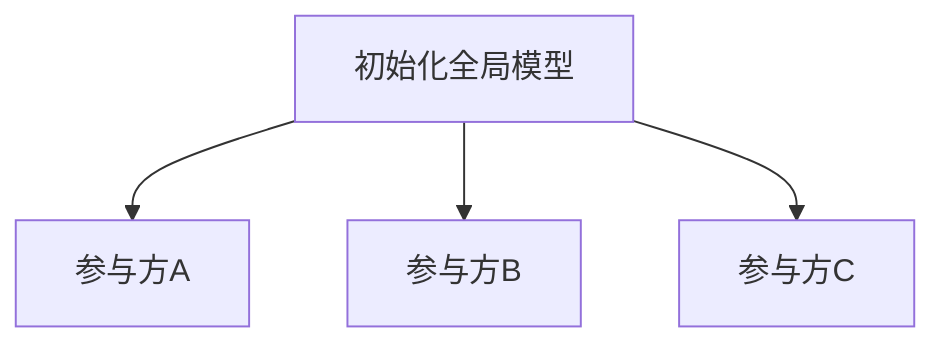
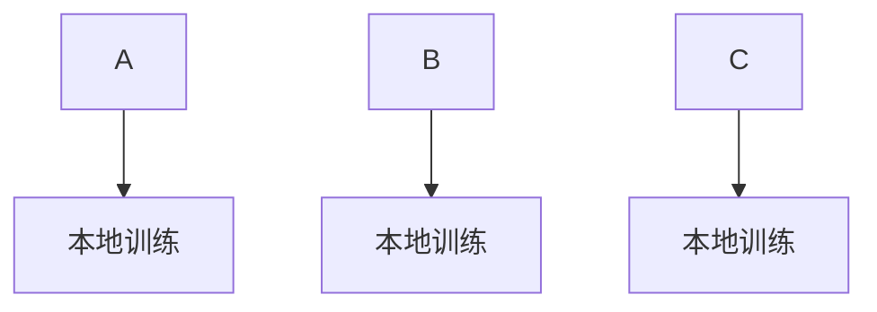
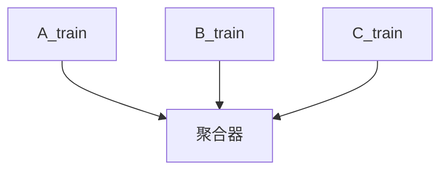
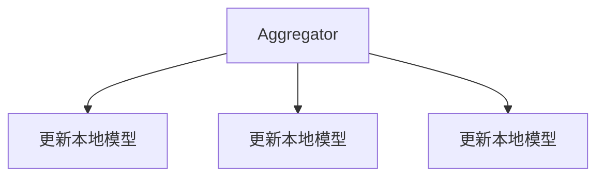
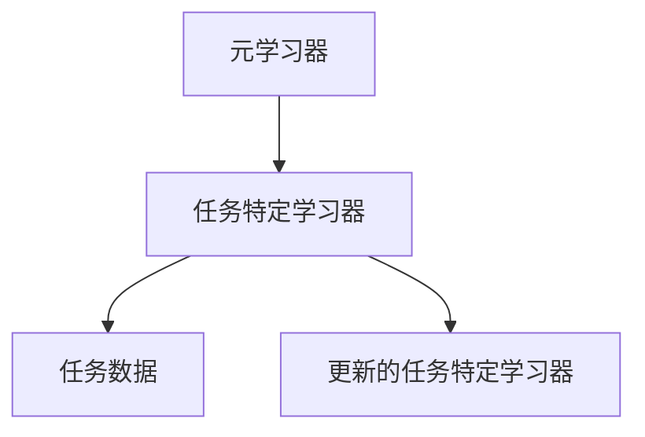
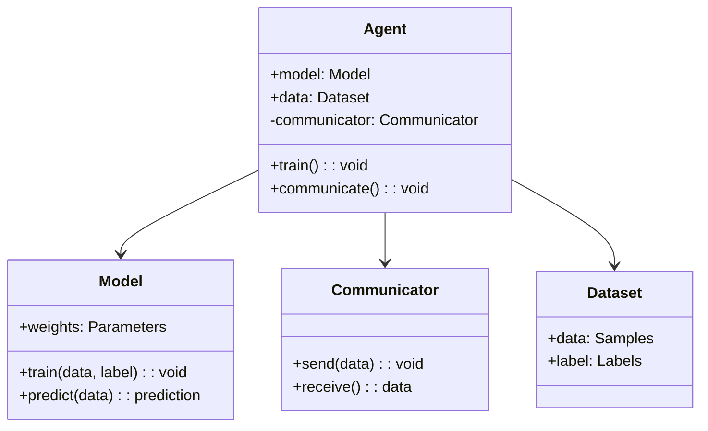
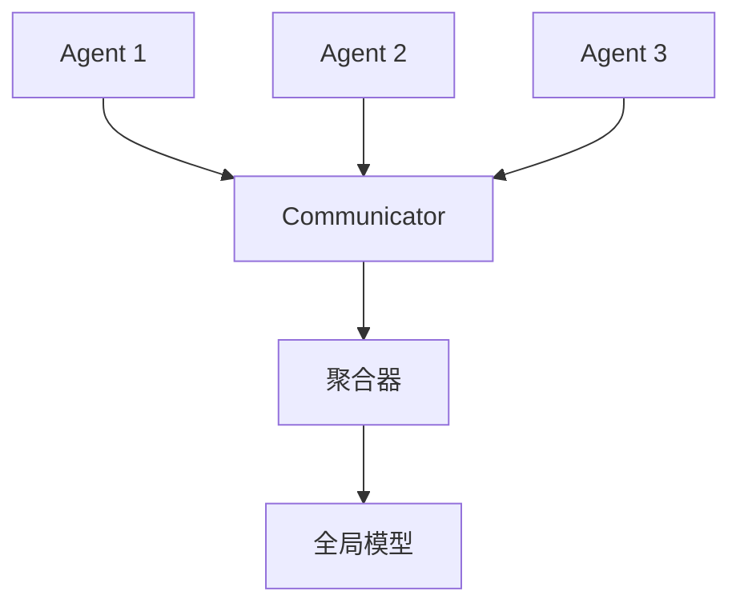
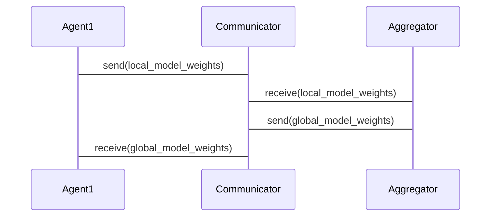

                 


# 联邦元学习在分布式AI Agent中的应用

> 关键词：联邦学习，元学习，分布式AI Agent，算法原理，系统架构，项目实战

> 摘要：本文深入探讨联邦元学习在分布式AI Agent中的应用，从核心概念到算法原理，再到系统架构和项目实战，全面解析如何通过联邦元学习提升分布式AI Agent的协作与学习能力。

---

## 第1章: 联邦元学习与分布式AI Agent概述

### 1.1 背景介绍

#### 1.1.1 问题背景
在分布式系统中，多个AI Agent需要协同工作以完成复杂任务。然而，传统集中式学习方法依赖于中心服务器，存在数据隐私、计算资源受限和通信开销大的问题。这促使我们探索更高效、更隐私保护的分布式学习方法。

#### 1.1.2 问题描述
- 数据隐私：数据分布于不同Agent，无法直接共享。
- 资源限制：Agent可能计算资源有限，无法支持集中式学习。
- 动态环境：Agent需要快速适应变化，传统集中式方法难以满足实时性要求。

#### 1.1.3 解决方案
联邦学习（Federated Learning）和元学习（Meta-Learning）的结合提供了一个可行的解决方案。联邦学习允许在分布式环境中进行联合学习，而元学习则帮助Agent快速适应新任务。

#### 1.1.4 核心概念与联系
- **联邦学习**：分布式环境中，多个参与方在不共享数据的情况下联合训练模型。
- **元学习**：学习如何学习，能够在较少数据下快速适应新任务。
- **分布式AI Agent**：在分布式环境中独立运行的智能体，通过协作完成共同目标。

### 1.2 联邦元学习的应用价值
- **数据隐私**：通过联邦学习保护数据隐私。
- **实时性**：元学习使Agent能够快速适应变化。
- **协作效率**：通过分布式学习提高协作效率。

---

## 第2章: 联邦元学习的核心概念与联系

### 2.1 联邦学习的核心原理

#### 2.1.1 联邦学习的流程
1. 初始化：各参与方下载初始模型。
2. 本地训练：各参与方在本地数据上训练模型。
3. 模型聚合：将各参与方的模型参数进行聚合，更新全局模型。
4. 模型更新：各参与方更新本地模型，重复上述过程。

#### 2.1.2 联邦学习的关键技术
- 数据隐私保护：通过加密和差分隐私技术保护数据。
- 模型聚合方法：如FedAvg（联邦平均）。
- 通信优化：减少数据传输量。

#### 2.1.3 联邦学习的优缺点
- **优点**：保护数据隐私，适用于分布式场景。
- **缺点**：通信开销大，模型收敛速度慢。

### 2.2 元学习的核心原理

#### 2.2.1 元学习的定义与特点
- 元学习：学习如何学习，能够在较少数据下快速适应新任务。
- 特点：快速适应、少样本学习、零样本学习。

#### 2.2.2 元学习的算法框架
1. 元学习器：用于指导任务特定学习器。
2. 任务特定学习器：针对具体任务进行微调。

#### 2.2.3 元学习与传统机器学习的对比
| 对比维度 | 元学习 | 传统机器学习 |
|----------|--------|--------------|
| 数据需求 | 少数据 | 需大量数据    |
| 适应性   | 快速适应新任务 | 需重新训练    |
| 计算效率 | 较低    | 较高          |

### 2.3 分布式AI Agent的核心原理

#### 2.3.1 分布式AI Agent的定义
- 多个智能体在分布式环境中独立运行，通过协作完成共同目标。
- 每个Agent具有自主决策能力。

#### 2.3.2 分布式AI Agent的通信机制
- 通过消息传递进行通信。
- 使用一致性协议确保数据同步。

#### 2.3.3 分布式AI Agent的协作模式
- 协作式：Agent之间协作完成任务。
- 竞争式：Agent之间竞争资源。

### 2.4 联邦元学习与分布式AI Agent的联系

#### 2.4.1 联邦学习在分布式AI Agent中的应用
- **模型训练**：通过联邦学习在分布式环境中训练全局模型。
- **数据隐私**：保护每个Agent的数据隐私。

#### 2.4.2 元学习在分布式AI Agent中的应用
- **快速适应**：元学习帮助Agent快速适应新任务。
- **多任务学习**：元学习适用于多个任务的联合优化。

#### 2.4.3 联邦元学习在分布式AI Agent中的整合
- **联邦元学习框架**：结合联邦学习和元学习，实现分布式环境下的高效学习。
- **协作与适应**：通过联邦学习协作训练模型，通过元学习快速适应变化。

---

## 第3章: 联邦元学习的算法原理

### 3.1 联邦学习的算法流程

#### 3.1.1 初始化


#### 3.1.2 本地训练


#### 3.1.3 模型聚合


#### 3.1.4 模型更新


#### 3.1.5 代码实现
```python
import torch
from torch import nn

# 初始化全局模型
global_model = nn.Linear(2, 1)

# 参与方本地模型
class LocalModel:
    def __init__(self):
        self.model = nn.Linear(2, 1)
    
    def train(self, data, target):
        criterion = nn.MSELoss()
        optimizer = torch.optim.SGD(self.model.parameters(), lr=0.1)
        optimizer.zero_grad()
        outputs = self.model(data)
        loss = criterion(outputs, target)
        loss.backward()
        optimizer.step()

# 聚合器
class Aggregator:
    def aggregate(self, models):
        global_model = models[0].model
        for model in models[1:]:
            with torch.no_grad():
                for param_global, param_local in zip(global_model.parameters(), model.model.parameters()):
                    param_global.data += param_local.data
        return global_model
```

### 3.2 元学习的算法流程

#### 3.2.1 元学习的流程


#### 3.2.2 元学习的数学模型
```latex
$$
\theta = \arg\min_{\theta} \mathbb{E}_{(x,y)\sim D_{\text{task}}} \mathcal{L}(x,y;\theta)
$$
```

#### 3.2.3 元学习的代码实现
```python
import torch

class MetaLearner:
    def __init__(self, model):
        self.model = model
        self.optimizer = torch.optim.Adam(self.model.parameters(), lr=0.001)
    
    def meta_train(self, tasks, inner_steps=5):
        for task in tasks:
            # 内部梯度计算
            loss, grad = self.compute_loss(task, inner_steps)
            # 元梯度更新
            self.optimizer.zero_grad()
            grad_scale = torch.ones_like(grad)
            torch.autograd.backward(loss, grad_scale)
            self.optimizer.step()

    def compute_loss(self, task, inner_steps):
        for step in range(inner_steps):
            loss = self.model(task.x).loss(task.y)
            loss.backward()
        return loss, self.model.parameters()[0].grad
```

---

## 第4章: 系统分析与架构设计方案

### 4.1 问题场景介绍
在一个分布式环境中，多个AI Agent需要协作完成图像分类任务。每个Agent拥有自己的数据集，且数据分布不同。

### 4.2 系统功能设计

#### 4.2.1 领域模型类图


#### 4.2.2 系统架构图


#### 4.2.3 系统接口设计
- **Agent接口**：
  - `train(data, label)`: 在本地数据上训练模型。
  - `communicate()`: 与聚合器通信，发送和接收模型参数。
- **Communicator接口**：
  - `send(data)`: 发送数据。
  - `receive()`: 接收数据。

#### 4.2.4 系统交互流程


---

## 第5章: 项目实战

### 5.1 环境安装
- 安装Python和必要的库：
  ```bash
  pip install torch numpy matplotlib
  ```

### 5.2 系统核心实现

#### 5.2.1 联邦学习实现
```python
import torch

class FederatedLearning:
    def __init__(self, agents):
        self.agents = agents
        self.global_model = self.agents[0].model

    def aggregate(self):
        for agent in self.agents[1:]:
            for param_global, param_local in zip(self.global_model.parameters(), agent.model.parameters()):
                param_global.data += param_local.data

    def train(self, rounds=10):
        for _ in range(rounds):
            for agent in self.agents:
                agent.train()
            self.aggregate()
```

#### 5.2.2 元学习实现
```python
class MetaLearning:
    def __init__(self, model, tasks):
        self.model = model
        self.tasks = tasks

    def train(self, inner_steps=5):
        for task in self.tasks:
            self.inner_train(task, inner_steps)
            self.meta_optimize()

    def inner_train(self, task, inner_steps):
        for step in range(inner_steps):
            loss = self.model(task.x, task.y)
            loss.backward()
            self.model.optimizer.step()
            self.model.optimizer.zero_grad()

    def meta_optimize(self):
        meta_loss = self.model.meta_loss()
        self.model.meta_optimizer.zero_grad()
        meta_loss.backward()
        self.model.meta_optimizer.step()
```

### 5.3 代码应用解读与分析

#### 5.3.1 联邦学习代码解读
- `FederatedLearning`类管理多个Agent。
- `aggregate`方法聚合各Agent的模型参数。
- `train`方法进行多轮训练。

#### 5.3.2 元学习代码解读
- `MetaLearning`类管理元学习过程。
- `inner_train`方法在每个任务上进行内部优化。
- `meta_optimize`方法更新元学习器的参数。

### 5.4 实际案例分析

#### 5.4.1 案例描述
- **任务**：图像分类。
- **数据**：MNIST数据集，分布在多个Agent上。
- **目标**：通过联邦元学习训练一个全局模型，各Agent能够快速适应新类别。

#### 5.4.2 实施步骤
1. 初始化多个Agent，每个Agent拥有部分MNIST数据。
2. 各Agent在本地数据上训练模型。
3. 聚合器聚合各Agent的模型参数，更新全局模型。
4. 元学习器对全局模型进行元优化，提升模型的适应性。

### 5.5 项目小结
- **成功实现**：通过联邦元学习，各Agent在保护数据隐私的前提下实现了模型协作。
- **性能提升**：元学习使模型能够快速适应新任务，提高了整体性能。

---

## 第6章: 最佳实践与总结

### 6.1 小结
联邦元学习在分布式AI Agent中的应用为解决数据隐私和实时适应问题提供了有效的方法。通过联邦学习保护数据隐私，通过元学习提升模型的适应性。

### 6.2 注意事项
- **数据隐私**：确保数据在传输和聚合过程中安全。
- **通信效率**：优化通信机制，减少延迟。
- **模型收敛**：选择合适的模型聚合方法，确保模型收敛。

### 6.3 拓展阅读
- 《Federated Learning: Challenges, Methods, and Future Directions》
- 《Meta-Learning: A Survey》

---

## 作者：AI天才研究院/AI Genius Institute & 禅与计算机程序设计艺术 /Zen And The Art of Computer Programming

---

通过以上结构，我们可以系统地分析和实现联邦元学习在分布式AI Agent中的应用。从理论到实践，本文为读者提供了全面的指导和深入的分析。

