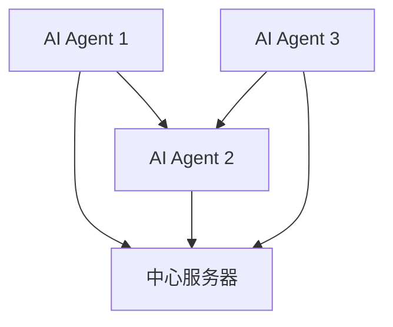
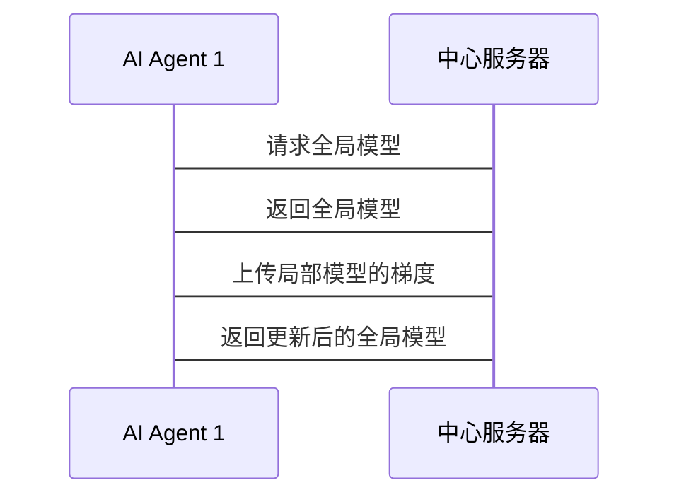

                 


# 联邦学习在AI Agent开发中的应用

> 关键词：联邦学习，AI Agent，分布式机器学习，隐私保护，协作学习，多智能体系统

> 摘要：随着人工智能技术的快速发展，AI Agent在各个领域的应用越来越广泛。然而，AI Agent的开发和应用面临着数据隐私保护、多智能体协作、分布式计算等挑战。联邦学习作为一种新兴的分布式机器学习技术，能够有效地解决这些问题。本文将详细探讨联邦学习在AI Agent开发中的应用，从背景、核心概念、算法原理、系统设计到实际项目，全面解析联邦学习如何助力AI Agent的开发与应用。

---

## 第一部分：背景介绍

### 第1章：联邦学习与AI Agent的基本概念

#### 1.1 联邦学习的基本概念
联邦学习（Federated Learning）是一种分布式机器学习技术，允许多个参与方在不共享原始数据的情况下， collaboratively训练一个全局模型。其核心思想是“数据不动，模型动”，即数据保留在本地，仅模型参数在参与方之间进行交换和更新。

- **核心特点**：
  - **数据隐私**：数据无需集中，保护了参与方的数据隐私。
  - **分布式计算**：适用于数据分布式的场景，如多设备、多机构。
  - **协作学习**：通过模型参数的同步，实现全局模型的优化。

#### 1.2 AI Agent的基本概念
AI Agent（人工智能代理）是指能够感知环境、自主决策并执行任务的智能实体。它可以是一个软件程序、机器人或其他智能系统，具有以下特点：
- **自主性**：能够在没有外部干预的情况下自主决策。
- **反应性**：能够实时感知环境并做出反应。
- **社交能力**：能够与其他Agent或人类进行交互和协作。

#### 1.3 联邦学习与AI Agent的结合
AI Agent的开发和应用中，数据隐私和多智能体协作是两个重要挑战。联邦学习能够通过分布式训练的方式，解决数据隐私问题，同时支持多智能体之间的协作学习。

---

## 第二部分：核心概念与联系

### 第2章：联邦学习的核心概念与原理

#### 2.1 联邦学习的核心概念
- **数据联邦化**：数据分布在不同的参与方，每个参与方持有自己的数据，通过模型参数的同步实现协作学习。
- **模型联邦化**：全局模型通过参与方的局部模型更新进行优化，最终形成一个高性能的全局模型。
- **通信机制**：联邦学习中，模型参数通过安全的通信通道进行同步，确保数据隐私和模型安全。

#### 2.2 联邦学习的原理
- **联邦学习的流程**：
  1. 初始化全局模型。
  2. 参与方下载当前全局模型。
  3. 参与方在本地数据上训练模型，更新局部模型。
  4. 将局部模型的梯度或参数上传到中心服务器，更新全局模型。
  5. 重复上述步骤，直到全局模型收敛或达到预设的训练目标。

- **联邦学习的数学模型**：
  全局模型的优化目标可以表示为：
  $$ \text{min}_{\theta} \frac{1}{N}\sum_{i=1}^{N} f_i(\theta) $$
  其中，$\theta$是模型参数，$f_i$是第$i$个参与方的损失函数。

### 第3章：联邦学习与AI Agent的核心概念联系

#### 3.1 联邦学习与AI Agent的协同工作
- **数据隐私保护**：通过联邦学习，AI Agent可以在不共享本地数据的情况下，与其他Agent协作训练全局模型。
- **多智能体协作**：联邦学习支持多个AI Agent之间的协作学习，提升整体系统的智能性和决策能力。
- **分布式计算**：联邦学习的分布式特性使得AI Agent可以在边缘设备或分布式环境中高效运行。

#### 3.2 联邦学习与AI Agent的核心概念对比

| **概念**       | **联邦学习**                     | **AI Agent**                      |
|----------------|---------------------------------|-----------------------------------|
| 数据存储方式    | 分布式数据，数据不集中           | 数据可以分布或集中               |
| 模型训练方式    | 分布式模型训练，参数同步         | 本地训练或分布式训练             |
| 协作能力       | 支持多参与方协作                | 支持多智能体协作                 |
| 数据隐私       | 高度保护数据隐私               | 数据隐私依赖于联邦学习技术        |

---

## 第三部分：算法与系统设计

### 第4章：联邦学习算法与AI Agent的结合

#### 4.1 联邦学习算法的分类
- **横向联邦学习**：适用于数据特征相同但样本不同的场景，常用于横向数据的聚合。
- **纵向联邦学习**：适用于数据特征不同但样本相同的场景，常用于纵向数据的聚合。
- **多任务联邦学习**：适用于多个任务同时训练的场景，能够提升模型的泛化能力。

#### 4.2 AI Agent中的联邦学习实现

- **AI Agent的训练流程**：
  1. AI Agent接收任务，下载当前全局模型。
  2. 在本地数据上进行训练，更新局部模型。
  3. 将局部模型的梯度或参数上传到中心服务器，更新全局模型。
  4. 重复上述步骤，直到任务完成或达到预设目标。

- **数学公式**：
  全局模型的更新公式为：
  $$ \theta_{\text{global}}^{t+1} = \theta_{\text{global}}^{t} + \sum_{i=1}^{N} \nabla f_i(\theta_{\text{global}}^{t}) \cdot \eta $$
  其中，$\theta_{\text{global}}$是全局模型参数，$\nabla f_i$是第$i$个参与方的梯度，$\eta$是学习率。

### 第5章：系统设计与架构

#### 5.1 系统功能设计
- **数据联邦化**：数据分布在多个AI Agent中，每个Agent持有自己的数据。
- **模型管理**：全局模型通过联邦学习算法进行优化，支持多个AI Agent的协作训练。
- **通信协议**：定义模型参数的同步方式和数据传输的安全性。

#### 5.2 系统架构设计



#### 5.3 接口设计与交互流程

- **接口设计**：
  - `download_model()`: 下载全局模型。
  - `train_model()`: 在本地数据上训练模型。
  - `upload_gradients()`: 上传局部模型的梯度。

- **交互流程图**：



---

## 第四部分：项目实战

### 第6章：联邦学习在AI Agent中的实际应用

#### 6.1 环境安装与配置
- 安装必要的依赖库，如TensorFlow、Keras、Flask等。
- 配置分布式环境，确保多个AI Agent能够通信。

#### 6.2 核心代码实现

```python
import tensorflow as tf
from tensorflow.keras import layers

# 初始化全局模型
def create_model():
    model = tf.keras.Sequential([
        layers.Dense(128, activation='relu'),
        layers.Dense(10, activation='softmax')
    ])
    model.compile(optimizer='adam', loss='sparse_categorical_crossentropy', metrics=['accuracy'])
    return model

# 联邦学习训练过程
def federated_learning_agents(agents, model):
    for agent in agents:
        # 下载全局模型
        agent.download_model(model)
        # 在本地训练
        agent.train_model()
        # 上传梯度
        gradients = agent.get_gradients()
        # 更新全局模型
        model.optimizer.apply_gradients(model.trainable_weights, gradients)

    return model

# 示例AI Agent类
class AI_Agent:
    def __init__(self, data):
        self.data = data
        self.model = create_model()

    def download_model(self, global_model):
        # 下载全局模型参数
        self.model.set_weights(global_model.get_weights())

    def train_model(self):
        # 在本地数据上训练模型
        self.model.fit(self.data, epochs=1, batch_size=32)

    def get_gradients(self):
        # 返回模型梯度
        gradients = []
        for weight in self.model.trainable_weights:
            gradients.append(tf.math.reduce_sum(weight).numpy())
        return gradients
```

#### 6.3 案例分析与结果解读
通过上述代码实现一个简单的联邦学习场景，训练一个分类模型。每个AI Agent在本地数据上进行训练，并将梯度上传到中心服务器。最终，全局模型通过所有参与方的梯度更新，形成一个高性能的模型。

---

## 第五部分：总结与展望

### 第7章：总结与展望

#### 7.1 总结
联邦学习作为一种分布式机器学习技术，能够有效解决AI Agent开发中的数据隐私和协作学习问题。通过联邦学习，AI Agent可以在不共享数据的情况下，与其他Agent协作训练全局模型，提升系统的智能性和决策能力。

#### 7.2 展望
随着联邦学习技术的不断发展，未来AI Agent的应用场景将更加广泛。例如，在多智能体协作、边缘计算、分布式系统等领域，联邦学习将发挥更大的作用。同时，如何进一步优化联邦学习的算法，提升模型的性能和安全性，也是未来研究的重要方向。

---

## 作者：AI天才研究院 & 禅与计算机程序设计艺术

