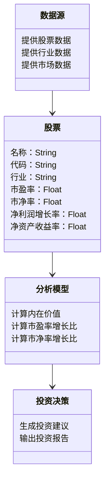
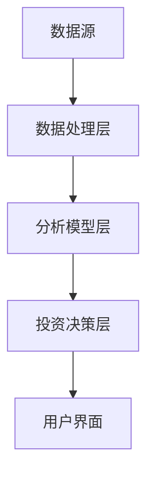

                 


# 肯尼斯·费雪的增长型价值投资

---

## 关键词

- 增长型投资
- 价值投资
- 肯尼斯·费雪
- 股票分析
- 投资策略
- 财务分析
- 估值模型

---

## 摘要

本文深入探讨了肯尼斯·费雪的增长型价值投资理念，结合技术分析与投资策略，详细阐述了其核心概念、数学模型、系统架构及实际应用。通过分析增长型价值投资的选股标准、估值方法及投资组合管理，本文为投资者提供了从理论到实践的全面指导。同时，文章通过案例分析和系统设计，展示了如何将增长型价值投资的理念应用于实际投资中，帮助投资者实现长期稳定的收益。

---

## 第1章：增长型价值投资的背景与核心概念

### 1.1 投资的基本定义

#### 1.1.1 投资的定义与分类

投资是将资金投入某一标的，以期获得未来收益的行为。根据投资对象的不同，可以将投资分为以下几类：

- **股票投资**：通过购买公司股份，获得分红或股价上涨的收益。
- **债券投资**：通过购买政府或企业的债券，获得固定的利息收益。
- **房地产投资**：通过购买房地产，获得租金收入或资本增值。
- **货币市场投资**：通过投资短期货币工具，获得低风险的收益。

#### 1.1.2 股票投资的核心要素

股票投资的核心要素包括：

- **公司基本面**：包括盈利能力、成长能力、财务状况等。
- **市场环境**：包括宏观经济环境、行业趋势、市场情绪等。
- **投资策略**：包括价值投资、成长投资、技术分析等。

#### 1.1.3 投资的基本原则与目标

投资的基本原则包括：

- **分散投资**：避免将所有资金投入单一标的，降低风险。
- **长期持有**：通过长期持有优质资产，获得复利效应。
- **风险管理**：控制投资风险，避免重大损失。

投资的目标通常包括：

- **资本增值**：通过资产增值获得收益。
- **稳定收益**：通过分红、利息等方式获得稳定的现金流。

---

### 1.2 价值投资与成长投资的定义

#### 1.2.1 价值投资的定义与特点

价值投资是由本杰明·格雷厄姆提出的投资理念，强调以低于内在价值的价格买入优质股票，并长期持有。其特点包括：

- **低估值**：寻找市场价格低于内在价值的标的。
- **安全边际**：买入价格与内在价值的差距越大，安全边际越高。
- **长期持有**：价值投资者通常会长期持有优质资产。

#### 1.2.2 成长投资的定义与特点

成长投资是以公司的成长性为核心，寻找具有高成长潜力的公司进行投资。其特点包括：

- **高成长性**：公司收入和利润快速增长。
- **高市盈率**：成长型企业通常市盈率较高。
- **高风险**：成长型企业通常处于快速扩张阶段，风险较高。

#### 1.2.3 价值投资与成长投资的对比

| 对比维度 | 价值投资 | 成长投资 |
|----------|----------|----------|
| 核心目标 | 买入低于内在价值的资产 | 买入具有高成长潜力的资产 |
| 风险特征 | 较低风险 | 较高风险 |
| 投资期限 | 长期持有 | 中长期持有 |
| 适用场景 | 市场低迷或估值过低时 | 市场繁荣或成长型企业较多时 |

---

### 1.3 增长型价值投资的定义

#### 1.3.1 增长型价值投资的定义

增长型价值投资是结合价值投资和成长投资的一种投资策略，强调以合理价格买入具有持续增长潜力的优质企业。其核心在于寻找那些既有安全边际，又具备较强成长性的企业。

#### 1.3.2 增长型价值投资的核心要素

增长型价值投资的核心要素包括：

- **估值合理**：买入价格低于内在价值。
- **成长潜力**：公司具有持续增长的能力。
- **竞争优势**：公司在行业内具有竞争优势。
- **管理团队**：公司管理团队稳定且有能力。

#### 1.3.3 增长型价值投资的适用场景

增长型价值投资通常适用于以下场景：

- **市场估值合理**：市场整体估值处于合理区间。
- **成长型企业较多**：行业中存在较多具有增长潜力的企业。
- **长期结构性牛市**：市场处于长期结构性牛市中。

---

## 第2章：增长型价值投资的核心概念

### 2.1 增长型价值投资的选股标准

#### 2.1.1 盈利能力分析

盈利能力是衡量公司财务健康状况的重要指标。常用的盈利能力指标包括：

- **净利润率**：净利润与营业收入的比率。
- **净资产收益率（ROE）**：净利润与股东权益的比率。
- **毛利率**：毛利与营业收入的比率。

#### 2.1.2 增长能力分析

增长能力分析是衡量公司未来发展潜力的重要指标。常用的增长能力指标包括：

- **收入增长率**：营业收入的年增长率。
- **净利润增长率**：净利润的年增长率。
- **ROE增长率**：净资产收益率的年增长率。

#### 2.1.3 市场地位分析

市场地位分析是衡量公司在行业中的竞争地位的重要指标。常用的市场地位指标包括：

- **市场份额**：公司在行业中的市场份额占比。
- **品牌影响力**：公司的品牌知名度和影响力。
- **竞争优势**：公司在产品、技术、成本等方面的核心竞争优势。

---

#### 2.2 增长型价值投资的分析框架

增长型价值投资的分析框架包括以下几个步骤：

1. **行业分析**：选择具有增长潜力的行业。
2. **公司分析**：筛选出具有竞争优势的公司。
3. **财务分析**：分析公司的盈利能力、增长能力和财务健康状况。
4. **估值分析**：确定公司是否具有合理的估值。
5. **投资决策**：综合以上分析结果，做出投资决策。

---

## 第3章：增长型价值投资的数学模型与估值方法

### 3.1 现金流折现模型（DCF）

#### 3.1.1 DCF模型的原理

现金流折现模型（DCF）是一种常用的估值方法，其核心思想是将公司未来现金流折现，以确定其当前的内在价值。

#### 3.1.2 DCF模型的公式

$$DCF = \sum_{t=1}^{n} \frac{CF_t}{(1 + r)^t}$$

其中：
- $CF_t$：第t年的现金流。
- $r$：折现率。
- $n$：现金流的期限。

#### 3.1.3 DCF模型的应用步骤

1. **预测未来现金流**：预测公司未来几年的现金流。
2. **确定折现率**：选择合适的折现率，通常使用无风险利率加上风险溢价。
3. **计算内在价值**：将未来现金流折现，求和得到公司的内在价值。
4. **比较市场价格**：将计算出的内在价值与市场价格进行比较，判断是否具有投资价值。

---

### 3.2 市盈率与市净率

#### 3.2.1 市盈率（P/E）的定义与计算

市盈率是股票的市场价格与每股收益的比率，公式为：

$$P/E = \frac{P}{E}$$

其中：
- $P$：股票的市场价格。
- $E$：每股收益。

#### 3.2.2 市净率（P/B）的定义与计算

市净率是股票的市场价格与每股净资产的比率，公式为：

$$P/B = \frac{P}{B}$$

其中：
- $P$：股票的市场价格。
- $B$：每股净资产。

#### 3.2.3 市盈率与市净率的对比

| 对比维度 | 市盈率 | 市净率 |
|----------|--------|--------|
| 计算依据 | 每股收益 | 每股净资产 |
| 适用场景 | 初期成长型企业 | 成熟型企业 |
| 优点 | 反映市场对公司未来盈利的预期 | 反映市场对公司资产的评估 |
| 缺点 | 可能高估市盈率较高的成长型企业 | 可能低估市净率较低的成熟型企业 |

---

### 3.3 增长型价值投资的估值工具

#### 3.3.1 市盈率增长比（PEG）

市盈率增长比（PEG）是一种常用的估值工具，公式为：

$$PEG = \frac{P/E}{G}$$

其中：
- $P/E$：市盈率。
- $G$：净利润增长率。

PEG小于1通常被认为是具有投资价值的信号。

---

## 第4章：增长型价值投资的系统架构设计

### 4.1 问题场景介绍

增长型价值投资的系统架构设计需要解决以下问题：

- **数据获取**：如何获取公司财务数据、行业数据和市场数据。
- **数据处理**：如何对数据进行清洗、整理和分析。
- **模型构建**：如何构建增长型价值投资的分析模型。
- **结果输出**：如何将分析结果可视化并输出投资建议。

---

### 4.2 系统功能设计

#### 4.2.1 领域模型设计

领域模型是系统功能设计的核心，以下是增长型价值投资的领域模型：



---

#### 4.2.2 系统架构设计

以下是增长型价值投资系统的架构设计：



---

## 第5章：增长型价值投资的项目实战

### 5.1 环境配置

增长型价值投资的项目实战需要以下环境配置：

- **编程语言**：Python
- **开发工具**：Jupyter Notebook 或 PyCharm
- **数据源**：Yahoo Finance 或其他金融数据源
- **库的安装**：pandas、numpy、matplotlib、yfinance

---

### 5.2 核心实现源代码

以下是增长型价值投资的Python代码实现：

```python
import pandas as pd
import numpy as np
import yfinance as yf
import matplotlib.pyplot as plt

def get_stock_data(ticker, start, end):
    df = yf.download(ticker, start=start, end=end)
    return df

def calculate_dcf(ticker, df):
    # 假设使用5年现金流预测
    CF = df['Adj Close'] * 1000  # 简单假设现金流
    r = 0.10  # 折现率
    dcf = 0
    for t in range(1, 6):
        dcf += CF[t] / (1 + r)**t
    return dcf

def main():
    start_date = '2020-01-01'
    end_date = '2023-01-01'
    ticker = 'AAPL'
    df = get_stock_data(ticker, start_date, end_date)
    dcf_value = calculate_dcf(ticker, df)
    print(f"{ticker} 的DCF值为：{dcf_value:.2f}")

if __name__ == "__main__":
    main()
```

---

### 5.3 案例分析与代码解读

以上代码实现了一个简单的DCF模型，用于计算苹果公司（AAPL）的内在价值。通过实际数据计算，可以得到AAPL的DCF值，并与市场价格进行比较，判断其是否具有投资价值。

---

## 第6章：增长型价值投资的最佳实践与小结

### 6.1 最佳实践 tips

- **长期视角**：增长型价值投资需要长期持有优质资产，耐心等待复利效应的显现。
- **分散投资**：避免将所有资金投入单一标的，降低投资风险。
- **风险管理**：定期审视投资组合，及时调整持仓结构。
- **持续学习**：保持对市场和行业的敏感性，及时更新投资策略。

### 6.2 小结

增长型价值投资是一种结合了价值投资和成长投资的策略，其核心在于寻找那些具有合理估值和持续增长潜力的优质企业。通过系统的分析和科学的估值方法，投资者可以在市场中找到具有长期竞争优势的标的，实现稳健的收益。

---

## 作者

作者：AI天才研究院/AI Genius Institute  
联系邮箱：contact@ai-genius-institute.com  
博客地址：https://www.ai-genius-institute.com

