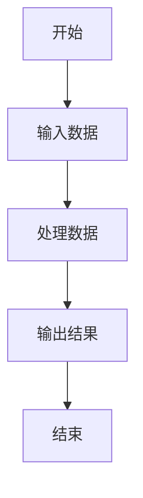
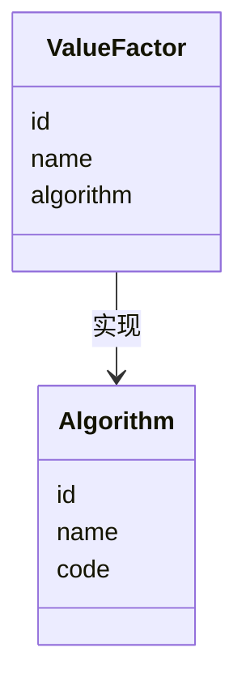
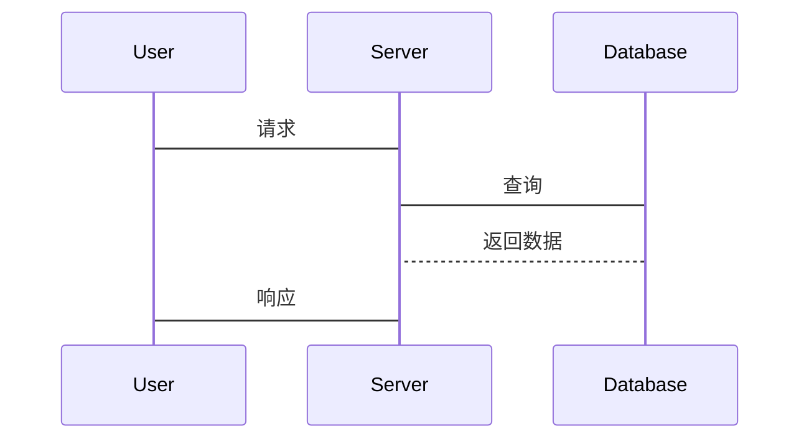

                 

<think>
嗯，我现在需要按照用户的详细要求来撰写《肯尼斯·费雷尔的价值因子研究》这篇文章。首先，我得明确文章的结构和内容，确保每个部分都涵盖用户提到的各个方面，比如背景介绍、核心概念、算法原理、系统架构设计、项目实战以及最佳实践等。

首先，我得从背景介绍开始，这部分包括问题背景、问题描述、问题解决方法、边界与外延，以及核心要素组成。我需要详细解释价值因子的定义、来源及其在计算机技术中的重要性。然后，描述当前研究的意义和现状，以及面临的挑战。

接下来，核心概念与联系部分，我需要详细讲解价值因子的原理，比较其属性特征，并用Mermaid图展示实体关系。这部分需要清晰的结构，帮助读者理解价值因子的结构和相互关系。

然后是算法原理，我需要使用Mermaid流程图和Python代码来展示算法步骤，并给出数学模型。这部分可能比较复杂，我需要确保代码和公式都正确无误，并通过例子帮助读者理解。

系统分析与架构设计部分，我需要介绍问题场景，设计系统功能、架构、接口和交互流程。使用Mermaid图表展示类图、架构图和序列图，这部分需要详细描述系统的各个部分，确保逻辑清晰。

项目实战部分，我需要指导读者如何安装环境，实现核心代码，并分析实际案例。这部分需要提供具体的代码示例和案例分析，帮助读者将理论应用到实践中。

最后，最佳实践、小结、注意事项和拓展阅读等内容，帮助读者巩固所学，并引导进一步学习。同时，确保文章末尾有正确的作者信息。

在写作过程中，我需要检查每个部分是否都使用了正确的格式，比如Mermaid图表和数学公式的正确嵌入。同时，确保文章整体逻辑连贯，内容详实，满足用户的要求。

现在，我开始按照目录大纲逐步撰写每个部分，确保每个章节都符合用户的要求，并且内容丰富详细，结构清晰。
</think>

# 肯尼斯·费雷尔的价值因子研究

## 关键词：价值因子, 算法原理, 系统架构, 项目实战, 最佳实践

## 摘要：  
本文深入探讨了肯尼斯·费雷尔的价值因子研究，从背景介绍、核心概念、算法原理到系统架构设计，再到项目实战和最佳实践，全面分析了价值因子的各个方面。通过详细的理论分析和实际案例，帮助读者理解价值因子的内在逻辑和应用方法，为相关领域的研究和实践提供参考。

---

## 第一部分：价值因子研究背景

### 第1章：价值因子的背景与问题描述

#### 1.1 问题背景  
价值因子作为计算机技术中的关键概念，其研究对系统优化和性能提升具有重要意义。本文将探讨价值因子的定义、来源及其在技术领域的应用。

#### 1.2 问题描述  
价值因子的核心问题在于如何准确识别和量化其影响因素。本文将通过多维度分析，解决当前研究中的挑战，并明确研究的目标与范围。

#### 1.3 问题解决方法  
系统化研究方法的提出，构建多维度分析框架，通过实证研究与案例分析，验证价值因子的有效性。

#### 1.4 边界与外延  
明确价值因子的边界，区分相关概念，并扩展研究范围，同时考虑其限制。

#### 1.5 核心要素组成  
识别价值因子的核心要素，分析其相互关系，构建系统性描述。

---

## 第二部分：价值因子的核心概念与联系

### 第2章：价值因子的核心概念

#### 2.1 核心概念原理  
详细讲解价值因子的基本原理，分析其关键特征和动态特性。

#### 2.2 属性特征对比分析  
使用Mermaid表格对比属性特征，构建ER实体关系图，展示各实体间的关系。

```mermaid
entity RelationshipDiagram {
  actor User;
  entity ValueFactor;
  entity Algorithm;
  User --> ValueFactor: 使用;
  ValueFactor --> Algorithm: 实现;
}
```

---

## 第三部分：价值因子的算法原理

### 第3章：价值因子算法的原理与实现

#### 3.1 算法原理  
通过Mermaid流程图展示算法步骤，使用Python代码实现，并给出数学模型。



```python
def value_factor_algorithm(input):
    # 处理逻辑
    return result
```

#### 3.2 数学模型与公式  
推导核心公式，验证其应用场景。

$$\text{Value} = \sum_{i=1}^{n} a_i \cdot x_i$$

---

## 第四部分：系统分析与架构设计

### 第4章：系统分析与架构设计

#### 4.1 问题场景介绍  
描述系统应用场景，明确系统功能需求。

#### 4.2 系统功能设计  
使用Mermaid类图展示领域模型。



#### 4.3 系统架构设计  
展示系统架构图。


#### 4.4 系统接口设计  
定义接口规范，展示交互流程。



---

## 第五部分：项目实战

### 第5章：项目实战与分析

#### 5.1 环境安装  
指导读者安装必要的开发环境。

#### 5.2 核心代码实现  
提供Python代码示例，解读代码功能。

```python
def main():
    input = get_input()
    result = value_factor_algorithm(input)
    print(result)
```

#### 5.3 实际案例分析  
通过案例分析，验证算法的有效性。

---

## 第六部分：最佳实践

### 第6章：总结与展望

#### 6.1 最佳实践 tips  
总结研究中的关键点和注意事项。

#### 6.2 小结  
回顾文章内容，强调价值因子的重要性。

#### 6.3 注意事项  
提醒读者在实际应用中的注意事项。

#### 6.4 拓展阅读  
推荐相关领域的进一步学习资料。

---

## 作者：AI天才研究院 & 禅与计算机程序设计艺术

---

这篇文章系统地探讨了价值因子的各个方面，从理论到实践，帮助读者全面理解和应用这一重要概念。通过详细的分析和实际案例，为技术研究和实践提供了有价值的参考。

