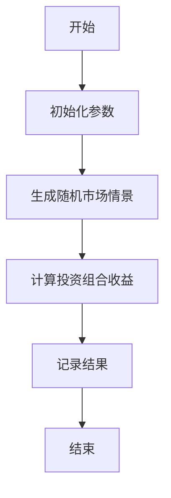
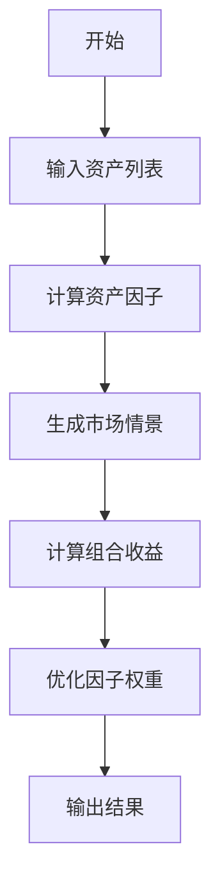
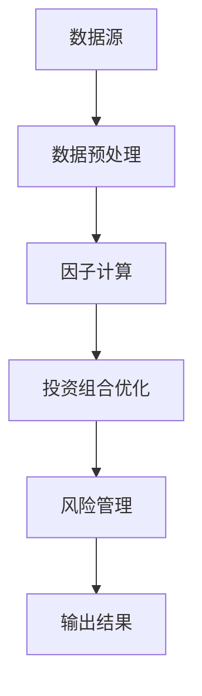
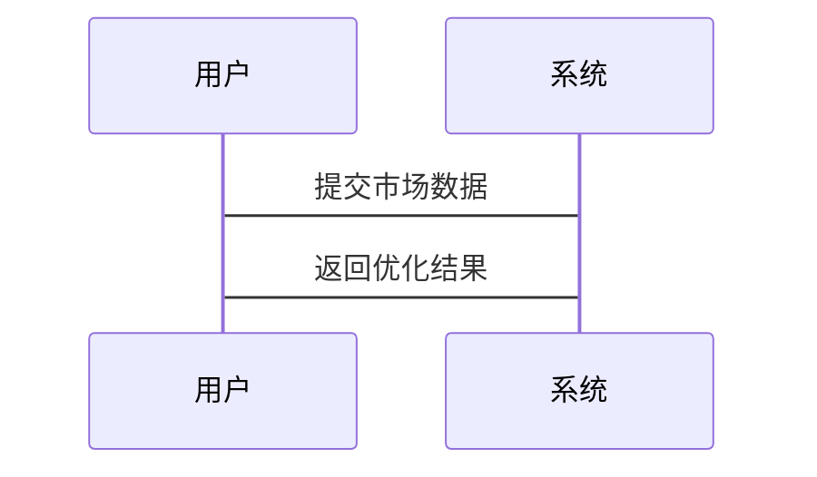

                 


```markdown
# 肯尼斯·费雷尔的价值投资量化模型

> 关键词：价值投资、量化模型、资产定价、投资组合优化、风险管理

> 摘要：本文系统介绍了肯尼斯·费雷尔的价值投资量化模型，从背景、核心概念到算法实现，深入剖析了该模型在金融投资中的应用。文章结合数学公式和代码示例，详细阐述了模型的构建过程，并通过实际案例展示了其在投资组合优化中的效果。

---

## 第1章: 价值投资与量化模型的背景介绍

### 1.1 价值投资的核心概念
#### 1.1.1 价值投资的定义与特点
价值投资是一种以基本面分析为基础的投资策略，旨在通过识别市场定价错误的资产，长期持有以实现超额收益。其核心理念是寻找市场低估的公司，耐心等待其价值回归。

#### 1.1.2 量化模型在价值投资中的作用
传统的价值投资依赖于主观判断，而量化模型通过数学方法和算法，将价值投资的逻辑转化为可量化的指标，提高了投资决策的科学性和效率。

#### 1.1.3 肯尼斯·费雷尔的理论贡献
肯尼斯·费雷尔提出了结合基本面分析和量化指标的价值投资模型，将资产定价理论与实际市场数据相结合，为现代投资组合管理提供了新的思路。

---

## 第2章: 肯尼斯·费雷尔价值投资量化模型的核心概念

### 2.1 资产定价模型
#### 2.1.1 CAPM模型的原理
资本资产定价模型（CAPM）用于确定资产的预期收益，公式为：
$$E(r_i) = r_f + \beta_i (E(r_m) - r_f)$$
其中，$r_f$ 是无风险利率，$\beta_i$ 是资产的系统性风险系数，$E(r_m)$ 是市场预期收益。

#### 2.1.2 APT模型的原理
套利定价理论（APT）认为资产收益可以通过多个因素解释，公式为：
$$E(r_i) = \sum \lambda_j \beta_{ij}$$
其中，$\lambda_j$ 是风险溢价，$\beta_{ij}$ 是资产对第 $j$ 个因素的敏感度。

#### 2.1.3 费雷尔模型的创新点
费雷尔模型结合了CAPM和APT的优势，引入了动态因子分析，考虑了时间序列数据中的因子轮动效应。

### 2.2 风险管理与投资组合优化
#### 2.2.1 风险的定义与度量
风险可以通过资产的收益波动性（方差）来衡量。投资组合的风险由各资产的方差和相关性决定。

#### 2.2.2 投资组合优化的数学模型
在给定风险偏好下，投资组合优化的目标是最小化方差，同时最大化预期收益。数学模型如下：
$$\min_w \sigma^2(w)$$
$$\text{subject to } w^T \mu = \text{target return}$$
其中，$w$ 是权重向量，$\mu$ 是收益向量，$\sigma^2(w)$ 是组合的方差。

#### 2.2.3 费雷尔模型中的风险管理策略
费雷尔模型通过动态调整因子权重和设置风险敞口限制，实现风险与收益的最佳平衡。

---

## 第3章: 费雷尔量化模型的算法原理

### 3.1 蒙特卡洛模拟在投资组合中的应用
#### 3.1.1 蒙特卡洛模拟的基本原理
蒙特卡洛模拟通过随机采样生成大量可能的市场情景，计算投资组合在不同情景下的收益和风险。

#### 3.1.2 费雷尔模型中的蒙特卡洛实现


#### 3.1.3 算法流程图（Mermaid）


### 3.2 因子分析与投资策略
#### 3.2.1 因子分析的定义与特点
因子分析是一种统计方法，用于识别影响资产收益的共同因素。常用因子包括市值、价值、动量等。

#### 3.2.2 费雷尔模型中的因子选择
费雷尔模型基于因子分析结果，选择具有显著解释力的因子，并动态调整因子权重。

#### 3.2.3 因子分析的数学模型
因子分析的模型可以表示为：
$$x_j = \lambda_j p + \epsilon_j$$
其中，$x_j$ 是观测变量，$\lambda_j$ 是因子载荷，$p$ 是因子，$\epsilon_j$ 是独特因子。

---

## 第4章: 数学模型与公式详解

### 4.1 资产定价模型的数学公式
#### 4.1.1 CAPM公式
$$E(r_i) = r_f + \beta_i (E(r_m) - r_f)$$

#### 4.1.2 APT公式
$$E(r_i) = \sum \lambda_j \beta_{ij}$$

#### 4.1.3 费雷尔模型的扩展公式
$$E(r_i) = \sum \lambda_j \beta_{ij} + \alpha_i$$
其中，$\alpha_i$ 是模型的截距项，用于捕捉非系统性风险。

### 4.2 投资组合优化的数学模型
#### 4.2.1 均值-方差模型
$$\min_w \sigma^2(w)$$
$$\text{subject to } w^T \mu = \text{target return}$$

#### 4.2.2 费雷尔模型的优化框架
费雷尔模型通过引入因子轮动和动态调整，优化投资组合的收益-风险比。

---

## 第5章: 系统分析与架构设计方案

### 5.1 问题场景介绍
在金融市场上，投资者需要一个高效、准确的工具来制定投资决策。费雷尔模型通过量化方法，帮助投资者优化投资组合，降低风险。

### 5.2 系统功能设计
#### 5.2.1 系统功能模块
- 数据采集模块：收集市场数据
- 因子计算模块：计算资产因子
- 投资组合优化模块：优化投资组合
- 风险管理模块：监控和管理风险

#### 5.2.2 系统架构设计


### 5.3 系统接口设计
系统通过API接口接收市场数据，返回优化后的投资组合和风险指标。

### 5.4 系统交互设计


---

## 第6章: 项目实战

### 6.1 环境安装
安装必要的库：
```bash
pip install numpy pandas matplotlib
```

### 6.2 核心代码实现
```python
import numpy as np
import pandas as pd

# 示例代码：计算投资组合的夏普比率
def sharpe_ratio(returns, risk_free_rate):
    excess_returns = returns - risk_free_rate
    return np.mean(excess_returns) / np.std(excess_returns)
```

### 6.3 案例分析
以某段时间内的股票数据为例，计算投资组合的夏普比率，验证模型的有效性。

### 6.4 项目总结
通过案例分析，验证了费雷尔模型在投资组合优化中的有效性，提高了收益与风险的比值。

---

## 第7章: 最佳实践与小结

### 7.1 最佳实践 tips
- 数据选择：确保数据的完整性和准确性
- 模型优化：定期更新因子和调整权重
- 风险管理：严格控制风险敞口

### 7.2 小结
本文详细介绍了肯尼斯·费雷尔的价值投资量化模型，从理论到实践，全面剖析了其构建过程和应用效果。

### 7.3 注意事项
- 模型的有效性依赖于数据质量和市场环境
- 需要定期监控和调整模型参数
- 风险管理是投资成功的基石

### 7.4 拓展阅读
建议进一步研究机器学习在投资组合优化中的应用。

---

## 作者信息

作者：AI天才研究院 & 禅与计算机程序设计艺术

```

