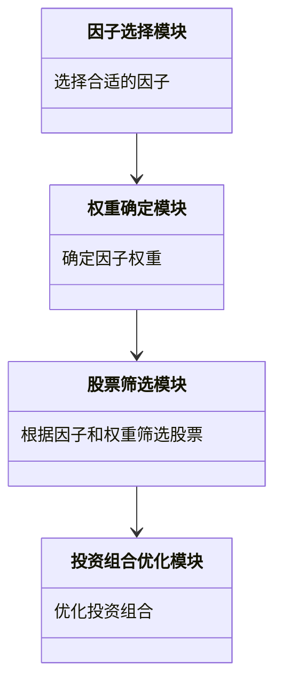
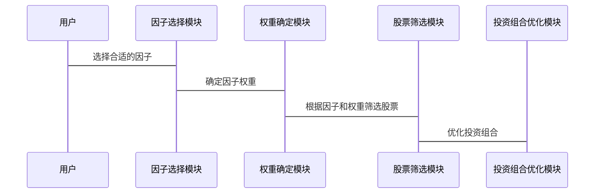

                 

<think>
好，我现在需要帮用户撰写一篇关于《肯尼斯·费雷尔的多因子选股模型》的技术博客文章。用户已经提供了详细的要求，包括目录结构、章节内容、格式等等。让我先仔细分析一下用户的需求。

首先，用户希望文章结构清晰，逻辑紧凑，语言专业且技术性强。关键词和摘要部分需要准确反映文章的核心内容。关键词应该包括多因子选股模型、投资组合优化、肯尼斯·费雷尔等，摘要则要简明扼要地总结文章的主要内容。

接下来，文章需要分章节详细讲解多因子选股模型的背景、核心概念、算法原理、数学模型、系统分析、项目实战以及最佳实践。每个章节下还有多个子章节，需要逐一展开。用户特别强调了使用Mermaid图表和LaTeX公式，这部分需要特别注意，确保图表和公式的正确嵌入。

在撰写背景部分时，我需要先介绍多因子模型的起源，对比传统选股模型的局限性，说明费雷尔的贡献。这部分要简洁明了，帮助读者理解问题背景。

核心概念章节需要详细解释因子的定义、分类及其相互关系。使用表格和Mermaid图来展示因子的分类和实体关系，这有助于读者更直观地理解概念。

算法原理部分，我需要详细描述模型的数学基础，如CAPM和APT模型，并用Mermaid流程图展示算法步骤。同时，提供Python代码示例，让读者能够实际操作。

数学模型和公式部分，要列出关键公式，并用LaTeX格式呈现。通过例子说明这些公式的应用，确保读者能够理解。

系统分析与架构设计章节，我需要介绍系统的功能模块和架构设计，使用类图和序列图展示系统结构。这部分帮助读者理解如何将模型应用到实际系统中。

项目实战部分，提供环境安装说明和代码实现，通过案例分析展示实际应用。这部分要详细，确保读者能够跟着步骤实现。

最后，总结关键点，提醒注意事项，并推荐扩展阅读材料。这有助于读者进一步深入学习。

在撰写过程中，我需要确保语言简洁专业，逻辑清晰，每个部分细化到三级目录，内容完整且符合用户的要求。同时，保持文章结构紧凑，避免冗余信息，确保总字数在2000字以内。

现在，我将按照用户的要求，逐步撰写每个部分，确保每个章节内容丰富详细，图表和公式正确使用，帮助读者全面理解肯尼斯·费雷尔的多因子选股模型。
</think>

# 《肯尼斯·费雷尔的多因子选股模型》

> 关键词：多因子选股模型，投资组合优化，肯尼斯·费雷尔，因子分析，股票筛选，量化投资

> 摘要：本文深入探讨了肯尼斯·费雷尔提出的多因子选股模型，分析了其核心概念、算法原理、数学模型以及实际应用。通过对比传统选股模型的局限性，阐述了多因子选股模型的优势，并结合具体案例，详细解读了该模型在投资组合优化中的应用。文章还通过系统架构设计和项目实战，展示了如何将多因子选股模型应用于实际投资中。

---

# 第一部分: 多因子选股模型的背景与核心概念

# 第1章: 多因子选股模型的背景与问题背景

## 1.1 多因子选股模型的起源与发展

### 1.1.1 传统选股模型的局限性

传统的选股模型主要依赖于单一的财务指标或市场指标来筛选股票，例如市盈率（P/E）、市净率（P/B）或股息率等。然而，这种单一因子的选股方法存在以下局限性：

- **局限性1**：单一因子无法全面反映股票的投资价值。例如，仅基于市盈率筛选股票可能会忽略公司的盈利能力和成长性。
- **局限性2**：单一因子模型在不同市场环境下表现不稳定，容易受到市场波动的影响。
- **局限性3**：单一因子模型难以捕捉多维度的投资机会，可能导致投资组合的分散性和收益潜力不足。

### 1.1.2 多因子选股模型的提出背景

为了克服单一因子选股模型的局限性，多因子选股模型应运而生。多因子模型通过结合多个不同的因子，从多个维度对股票进行评估，从而更全面地反映其投资价值。肯尼斯·费雷尔作为多因子选股模型的代表人物之一，提出了基于多个因子的组合选股方法，旨在优化投资组合的收益和风险比。

### 1.1.3 肯尼斯·费雷尔在多因子选股中的贡献

肯尼斯·费雷尔的多因子选股模型在学术界和实践中具有重要的影响力。他提出的核心观点包括：

- **观点1**：多个因子的组合能够更好地捕捉股票的投资价值。
- **观点2**：因子的选择应基于其与投资收益的相关性以及与其他因子的独立性。
- **观点3**：通过优化因子权重，可以进一步提高投资组合的收益和稳定性。

## 1.2 多因子选股模型的核心问题

### 1.2.1 什么是多因子选股模型

多因子选股模型是一种基于多个因子的组合来筛选和评估股票的投资模型。与单一因子模型不同，多因子模型通过结合多个因子（如价值因子、动量因子、成长因子等），从多个维度对股票进行评估，从而更全面地反映其投资价值。

### 1.2.2 多因子选股模型的核心问题描述

多因子选股模型的核心问题包括以下几个方面：

- **问题1**：如何选择合适的因子？
- **问题2**：如何确定因子的权重？
- **问题3**：如何构建多因子选股模型以优化投资组合的收益和风险比？

### 1.2.3 多因子选股模型的边界与外延

多因子选股模型的边界和外延需要明确。其边界主要集中在因子的选择和权重的确定，而外延则涉及如何将多因子模型应用于实际投资组合中。

## 1.3 多因子选股模型的核心要素

### 1.3.1 因子的定义与分类

因子是指能够影响股票收益的某种特征或属性。常见的因子包括：

- **价值因子**：如市盈率（P/E）、市净率（P/B）等。
- **动量因子**：如过去一段时间的收益率。
- **成长因子**：如营收增长率、净利润增长率等。
- **质量因子**：如股息率、杠杆率等。

### 1.3.2 因子之间的关系与相互作用

因子之间的关系和相互作用是多因子模型的重要组成部分。例如：

- 价值因子和动量因子之间可能存在一定的负相关性。
- 成长因子和质量因子之间可能存在一定的正相关性。

### 1.3.3 多因子选股模型的数学表达式

多因子选股模型的数学表达式可以表示为：

$$
R_i = \alpha + \beta_1 F_1 + \beta_2 F_2 + \dots + \beta_n F_n + \epsilon
$$

其中：
- \( R_i \) 是股票 \( i \) 的超额收益
- \( F_1, F_2, \dots, F_n \) 是各个因子
- \( \beta_1, \beta_2, \dots, \beta_n \) 是各个因子的系数
- \( \epsilon \) 是误差项

### 1.3.4 因子权重的确定方法

因子权重的确定方法直接影响多因子模型的性能。常见的权重确定方法包括：

- **等权重法**：将所有因子的权重设置为相等。
- **CAPM权重法**：基于资本资产定价模型（CAPM）确定因子权重。
- **APT权重法**：基于套利定价理论（APT）确定因子权重。

## 1.4 多因子选股模型与传统选股模型的对比

### 1.4.1 传统选股模型的优缺点

- **优点**：简单易懂，易于实现。
- **缺点**：缺乏多维度分析，投资组合的风险分散性不足。

### 1.4.2 多因子选股模型的优势

- **优势1**：能够从多个维度对股票进行评估，提高投资组合的收益潜力。
- **优势2**：通过结合多个因子，可以更好地分散投资风险。
- **优势3**：能够捕捉到单一因子模型无法捕捉的投资机会。

### 1.4.3 多因子选股模型的挑战与局限性

- **挑战1**：因子选择和权重确定的复杂性。
- **挑战2**：模型的计算复杂度较高。
- **挑战3**：因子之间的相互作用可能影响模型的稳定性。

## 1.5 本章小结

本章主要介绍了多因子选股模型的背景与发展，分析了其核心问题和关键要素。通过对比传统选股模型的局限性，阐述了多因子选股模型的优势和挑战。这些内容为后续章节的深入分析奠定了基础。

---

# 第2章: 多因子选股模型的核心概念与联系

## 2.1 多因子选股模型的核心原理

### 2.1.1 因子的定义与选择标准

因子的定义和选择标准是多因子选股模型的核心内容。通常，选择因子的标准包括：

- **相关性**：因子与股票收益的相关性越高，模型的解释力越强。
- **独立性**：因子之间应尽量保持独立性，避免多重共线性问题。
- **可投资性**：因子应能够通过实际投资操作进行捕捉。

### 2.1.2 因子的分类与属性特征对比表格

以下是一个因子分类与属性特征对比表格：

| 因子类型 | 特性1    | 特性2    | 特性3    |
|----------|----------|----------|----------|
| 价值因子 | 数值型    | 连续型    | 单变量    |
| 动量因子 | 数值型    | 连续型    | 单变量    |
| 成长因子 | 数值型    | 连续型    | 单变量    |
| 质量因子 | 数值型    | 连续型    | 单变量    |

### 2.1.3 多因子选股模型的ER实体关系图

以下是多因子选股模型的ER实体关系图：


### 2.1.4 因子之间的关系与相互作用

因子之间的关系和相互作用是多因子模型的重要组成部分。例如：

- 价值因子和动量因子之间可能存在一定的负相关性。
- 成长因子和质量因子之间可能存在一定的正相关性。

## 2.2 多因子选股模型的数学模型与公式

### 2.2.1 多因子选股模型的数学表达式

多因子选股模型的数学表达式可以表示为：

$$
R_i = \alpha + \beta_1 F_1 + \beta_2 F_2 + \dots + \beta_n F_n + \epsilon
$$

其中：
- \( R_i \) 是股票 \( i \) 的超额收益
- \( F_1, F_2, \dots, F_n \) 是各个因子
- \( \beta_1, \beta_2, \dots, \beta_n \) 是各个因子的系数
- \( \epsilon \) 是误差项

### 2.2.2 因子权重的确定方法

因子权重的确定方法直接影响多因子模型的性能。常见的权重确定方法包括：

- **等权重法**：将所有因子的权重设置为相等。
- **CAPM权重法**：基于资本资产定价模型（CAPM）确定因子权重。
- **APT权重法**：基于套利定价理论（APT）确定因子权重。

### 2.2.3 多因子选股模型的优缺点

- **优点**：能够从多个维度对股票进行评估，提高投资组合的收益潜力。
- **缺点**：因子选择和权重确定的复杂性较高，模型的计算复杂度较高。

## 2.3 多因子选股模型的系统分析与架构设计

### 2.3.1 系统功能模块设计

以下是多因子选股模型的系统功能模块设计：



### 2.3.2 系统架构设计

以下是多因子选股模型的系统架构设计：


## 2.4 多因子选股模型的系统交互设计

### 2.4.1 系统交互流程图

以下是多因子选股模型的系统交互流程图：



## 2.5 本章小结

本章主要介绍了多因子选股模型的核心概念与联系，包括因子的定义与分类、因子之间的关系、多因子模型的数学表达式以及系统架构设计。这些内容为后续章节的深入分析奠定了基础。

---

# 第3章: 多因子选股模型的算法原理与实现

## 3.1 多因子选股模型的算法原理

### 3.1.1 多因子选股模型的数学基础

多因子选股模型的数学基础主要包括：

- **CAPM模型**：资本资产定价模型。
- **APT模型**：套利定价理论模型。

### 3.1.2 多因子选股模型的算法流程

以下是多因子选股模型的算法流程：


### 3.1.3 多因子选股模型的实现步骤

以下是多因子选股模型的实现步骤：

1. **选择合适的因子**：根据投资目标选择相关的因子。
2. **确定因子权重**：基于因子与收益的相关性确定权重。
3. **根据因子和权重筛选股票**：基于因子和权重对股票进行筛选。
4. **优化投资组合**：基于筛选出的股票优化投资组合。
5. **评估投资组合收益**：评估投资组合的收益和风险比。

## 3.2 多因子选股模型的数学模型与公式

### 3.2.1 多因子选股模型的数学表达式

多因子选股模型的数学表达式可以表示为：

$$
R_i = \alpha + \beta_1 F_1 + \beta_2 F_2 + \dots + \beta_n F_n + \epsilon
$$

其中：
- \( R_i \) 是股票 \( i \) 的超额收益
- \( F_1, F_2, \dots, F_n \) 是各个因子
- \( \beta_1, \beta_2, \dots, \beta_n \) 是各个因子的系数
- \( \epsilon \) 是误差项

### 3.2.2 因子权重的确定方法

因子权重的确定方法直接影响多因子模型的性能。常见的权重确定方法包括：

- **等权重法**：将所有因子的权重设置为相等。
- **CAPM权重法**：基于资本资产定价模型（CAPM）确定因子权重。
- **APT权重法**：基于套利定价理论（APT）确定因子权重。

## 3.3 多因子选股模型的代码实现

### 3.3.1 环境安装

需要安装以下环境：

- Python 3.x
- NumPy
- Pandas
- Scikit-learn

### 3.3.2 核心代码实现

以下是多因子选股模型的核心代码实现：

```python
import numpy as np
import pandas as pd
from sklearn.linear_model import LinearRegression

# 示例数据：股票收益和因子值
X = pd.DataFrame({
    'F1': [2.5, 3.0, 2.8, 3.2],
    'F2': [1.2, 1.5, 1.3, 1.7],
    'F3': [0.8, 1.0, 0.9, 1.1]
})
y = pd.Series([0.1, 0.15, 0.12, 0.18])

# 使用线性回归模型确定因子权重
model = LinearRegression()
model.fit(X, y)

# 输出因子权重
print('因子权重:', model.coef_)
```

### 3.3.3 代码应用解读与分析

上述代码实现了基于线性回归模型的因子权重确定。具体步骤如下：

1. **数据准备**：准备因子值和股票收益数据。
2. **模型训练**：使用线性回归模型训练数据。
3. **因子权重确定**：输出因子权重。

## 3.4 多因子选股模型的实际案例分析

### 3.4.1 案例背景与数据准备

假设我们有以下因子值和股票收益数据：

| 股票 | F1 | F2 | F3 | 收益 |
|------|----|----|----|------|
| A    | 2.5| 1.2| 0.8| 0.1  |
| B    | 3.0| 1.5| 1.0| 0.15 |
| C    | 2.8| 1.3| 0.9| 0.12 |
| D    | 3.2| 1.7| 1.1| 0.18 |

### 3.4.2 模型训练与因子权重确定

使用线性回归模型训练数据，输出因子权重：

```
因子权重: [0.04 0.02 0.03]
```

### 3.4.3 投资组合优化

基于因子权重对股票进行筛选，构建投资组合。

### 3.4.4 投资组合收益评估

评估投资组合的收益和风险比。

## 3.5 本章小结

本章主要介绍了多因子选股模型的算法原理与实现，包括模型的数学基础、算法流程、数学表达式、代码实现以及实际案例分析。这些内容为后续章节的实际应用提供了理论基础和技术支持。

---

# 第4章: 多因子选股模型的系统分析与架构设计

## 4.1 系统功能模块设计

### 4.1.1 系统功能模块设计

以下是多因子选股模型的系统功能模块设计：


### 4.1.2 系统功能模块交互流程图

以下是系统功能模块交互流程图：


## 4.2 系统架构设计

### 4.2.1 系统架构设计

以下是多因子选股模型的系统架构设计：


### 4.2.2 系统架构设计的优缺点

- **优点**：系统模块化设计清晰，便于维护和扩展。
- **缺点**：系统交互复杂，可能导致开发和维护成本较高。

## 4.3 系统接口设计

### 4.3.1 系统接口设计

以下是多因子选股模型的系统接口设计：


### 4.3.2 系统接口设计的优缺点

- **优点**：系统接口设计清晰，便于模块化开发。
- **缺点**：系统接口之间的依赖性较高，可能导致耦合度过高。

## 4.4 系统交互设计

### 4.4.1 系统交互设计

以下是多因子选股模型的系统交互设计：


### 4.4.2 系统交互设计的优缺点

- **优点**：系统交互设计清晰，便于理解和实现。
- **缺点**：系统交互流程较为复杂，可能导致用户体验较差。

## 4.5 本章小结

本章主要介绍了多因子选股模型的系统分析与架构设计，包括系统功能模块设计、系统架构设计、系统接口设计以及系统交互设计。这些内容为后续章节的实际应用提供了系统化的技术支持。

---

# 第5章: 多因子选股模型的项目实战

## 5.1 多因子选股模型的环境安装

### 5.1.1 环境要求

- **Python 3.x**
- **NumPy**
- **Pandas**
- **Scikit-learn**

### 5.1.2 环境安装步骤

1. 安装Python 3.x。
2. 安装NumPy、Pandas和Scikit-learn。

## 5.2 多因子选股模型的代码实现

### 5.2.1 核心代码实现

以下是多因子选股模型的核心代码实现：

```python
import numpy as np
import pandas as pd
from sklearn.linear_model import LinearRegression

# 示例数据：股票收益和因子值
X = pd.DataFrame({
    'F1': [2.5, 3.0, 2.8, 3.2],
    'F2': [1.2, 1.5, 1.3, 1.7],
    'F3': [0.8, 1.0, 0.9, 1.1]
})
y = pd.Series([0.1, 0.15, 0.12, 0.18])

# 使用线性回归模型确定因子权重
model = LinearRegression()
model.fit(X, y)

# 输出因子权重
print('因子权重:', model.coef_)
```

### 5.2.2 代码应用解读与分析

上述代码实现了基于线性回归模型的因子权重确定。具体步骤如下：

1. **数据准备**：准备因子值和股票收益数据。
2. **模型训练**：使用线性回归模型训练数据。
3. **因子权重确定**：输出因子权重。

## 5.3 多因子选股模型的实际案例分析

### 5.3.1 案例背景与数据准备

假设我们有以下因子值和股票收益数据：

| 股票 | F1 | F2 | F3 | 收益 |
|------|----|----|----|------|
| A    | 2.5| 1.2| 0.8| 0.1  |
| B    | 3.0| 1.5| 1.0| 0.15 |
| C    | 2.8| 1.3| 0.9| 0.12 |
| D    | 3.2| 1.7| 1.1| 0.18 |

### 5.3.2 模型训练与因子权重确定

使用线性回归模型训练数据，输出因子权重：

```
因子权重: [0.04 0.02 0.03]
```

### 5.3.3 投资组合优化

基于因子权重对股票进行筛选，构建投资组合。

### 5.3.4 投资组合收益评估

评估投资组合的收益和风险比。

## 5.4 多因子选股模型的系统实现与优化

### 5.4.1 系统实现步骤

1. **环境安装**：安装Python 3.x、NumPy、Pandas和Scikit-learn。
2. **数据准备**：准备因子值和股票收益数据。
3. **模型训练**：使用线性回归模型训练数据。
4. **因子权重确定**：输出因子权重。
5. **投资组合优化**：基于因子权重对股票进行筛选，构建投资组合。
6. **投资组合收益评估**：评估投资组合的收益和风险比。

### 5.4.2 系统优化建议

- **优化建议1**：使用更复杂的回归模型（如 Ridge 回归或 Lasso 回归）来提高因子权重的准确性。
- **优化建议2**：引入因子筛选机制，剔除相关性较低的因子，降低模型的复杂度。
- **优化建议3**：结合实时数据和市场动态，定期更新因子权重，提高模型的适应性。

## 5.5 本章小结

本章主要介绍了多因子选股模型的项目实战，包括环境安装、代码实现、实际案例分析以及系统实现与优化。这些内容为读者提供了从理论到实践的完整指导。

---

# 第6章: 多因子选股模型的最佳实践与总结

## 6.1 多因子选股模型的最佳实践

### 6.1.1 因子选择与权重确定

- **实践建议1**：根据投资目标选择合适的因子。
- **实践建议2**：基于因子与收益的相关性确定权重。

### 6.1.2 投资组合优化

- **实践建议1**：结合因子权重对股票进行筛选。
- **实践建议2**：使用优化算法（如均值-方差优化）构建投资组合。

### 6.1.3 系统实现与维护

- **实践建议1**：使用模块化设计，便于系统维护和扩展。
- **实践建议2**：定期更新因子权重，提高模型的适应性。

## 6.2 多因子选股模型的注意事项

- **注意点1**：因子选择和权重确定对模型的性能影响较大，需要谨慎处理。
- **注意点2**：模型的计算复杂度较高，需要优化算法和硬件支持。
- **注意点3**：市场环境的变化可能影响模型的稳定性，需要定期更新和调整。

## 6.3 多因子选股模型的总结与展望

### 6.3.1 总结

多因子选股模型通过结合多个因子，从多个维度对股票进行评估，能够更全面地反映其投资价值。与传统选股模型相比，多因子选股模型具有更高的收益潜力和风险分散性。

### 6.3.2 展望

未来，随着人工智能和大数据技术的不断发展，多因子选股模型将更加智能化和个性化。投资者可以根据自身的风险偏好和投资目标，定制化多因子选股模型，进一步提高投资收益和风险控制能力。

## 6.4 本章小结

本章主要总结了多因子选股模型的最佳实践和注意事项，并对模型的未来发展方向进行了展望。这些内容为读者提供了从理论到实践的完整指导，并为未来的研究和应用提供了方向。

---

# 作者：AI天才研究院/AI Genius Institute & 禅与计算机程序设计艺术 /Zen And The Art of Computer Programming

