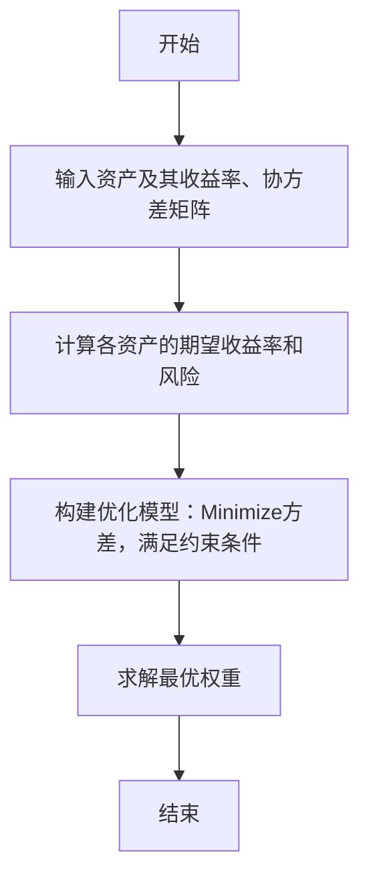

                 


# 肯尼斯费雪的投资组合管理

> 关键词：投资组合管理，资产配置，风险管理，现代投资组合理论，夏普比率，系统架构

> 摘要：本文将详细介绍投资组合管理的核心概念，包括资产配置策略、风险管理方法、数学模型和系统架构。通过分析投资组合管理的理论基础和实际应用，结合肯尼斯费雪的管理思想，探讨如何优化投资组合以实现收益与风险的最佳平衡。

---

## 第一部分：投资组合管理概述

### 第1章：投资组合管理的定义与重要性

#### 1.1 投资组合管理的定义

投资组合管理是一种通过科学配置资产来实现投资目标的管理方法。它结合了资产配置、风险管理、绩效评估等多方面的知识，旨在在不同市场环境下优化投资组合的表现。

#### 1.2 投资组合管理的核心目标

投资组合管理的核心目标是实现收益与风险的最佳平衡。通过合理的资产配置，投资者可以在不同市场条件下最大化收益，同时有效控制风险。

#### 1.3 投资组合管理的重要性

投资组合管理的重要性体现在以下几个方面：
1. **风险控制**：通过分散投资降低风险。
2. **收益优化**：通过合理的资产配置提高收益。
3. **长期稳健**：在市场波动中保持投资组合的稳定性。

---

## 第二部分：投资组合管理的理论基础

### 第2章：现代投资组合理论（MPT）

#### 2.1 现代投资组合理论的概述

现代投资组合理论（MPT）由哈里·马科维茨提出，是投资组合管理的重要理论基础。MPT认为，投资组合的风险可以通过分散化来降低，同时在不同风险水平下选择最优收益。

#### 2.2 投资组合的优化模型

##### 2.2.1 均值-方差优化

均值-方差优化是一种常用的投资组合优化方法。以下是其实现流程：



数学模型如下：
$$ \text{Minimize } \sigma^2 \text{ subject to } \mu \geq \text{目标收益} $$

##### 2.2.2 最小方差组合

最小方差组合是投资组合优化中的另一种方法，目标是找到风险最小的投资组合。

##### 2.2.3 夏普比率

夏普比率衡量的是投资组合单位风险所获取的超额收益。

公式：
$$ \text{夏普比率} = \frac{\mu_p - \mu_f}{\sigma_p} $$

---

## 第三部分：投资组合管理的核心策略

### 第3章：资产配置策略

#### 3.1 资产配置的定义与分类

资产配置是将资金分配到不同资产类别（如股票、债券、现金等）以优化风险和收益的过程。资产配置可以根据投资期限、风险承受能力和市场环境进行调整。

#### 3.2 资产配置的核心原则

##### 3.2.1 风险分散化

通过投资不同资产类别和市场，降低特定资产的风险。

##### 3.2.2 长期投资视角

长期投资有助于平滑短期市场波动的影响。

##### 3.2.3 定期再平衡

定期调整投资组合以保持预定的资产配置比例。

#### 3.3 资产配置的数学模型

##### 3.3.1 资产权重分配公式

$$ w_i = \frac{a_i}{\sum_{j=1}^n a_j} $$

其中，\( w_i \) 是第 \( i \) 个资产的权重，\( a_i \) 是第 \( i \) 个资产的配置金额，\( n \) 是资产的总数。

---

## 第四部分：投资组合管理的系统架构

### 第4章：系统架构与技术实现

#### 4.1 数据处理流程

##### 4.1.1 数据获取与清洗

从多个数据源获取历史价格、收益率等数据，并进行清洗和预处理。

##### 4.1.2 数据存储与管理

使用数据库存储清洗后的数据，并建立数据仓库进行管理。

#### 4.2 优化算法实现

##### 4.2.1 均值-方差优化的Python实现

```python
import numpy as np
import pandas as pd
from scipy.optimize import minimize

def portfoliooptimize(returns, target_return):
    n = len(returns.columns)
    # 定义目标函数
    def objective(weights):
        return np.var(weights @ returns.mean())
    
    # 定义约束条件
    constraints = [
        ('sum(weights) == 1', {'type': 'eq'}),
        ('weights @ returns.mean() >= target_return', {'type': 'ineq'})
    ]
    
    # 使用SLSQP求解
    result = minimize(objective, np.ones(n)/n, method='SLSQP', constraints=constraints)
    return result.x
```

---

## 第五部分：投资组合管理的实战案例

### 第5章：实战案例与分析

#### 5.1 案例分析

##### 5.1.1 案例背景

假设我们有三个资产，A、B、C，我们需要根据它们的历史收益率和协方差矩阵进行投资组合优化。

##### 5.1.2 数据分析

使用Python代码计算各资产的期望收益率和方差，并优化投资组合。

##### 5.1.3 风险管理

根据优化结果，调整资产权重，确保在承受风险范围内实现最大收益。

#### 5.2 优化结果

通过优化，我们得到了最优的资产配置比例，并验证了其在不同市场环境下的表现。

---

## 第六部分：总结与展望

### 6.1 本文总结

本文详细探讨了投资组合管理的核心概念和方法，结合现代投资组合理论和实际案例，展示了如何通过科学的资产配置和风险管理优化投资组合。

### 6.2 未来展望

未来，随着人工智能和大数据技术的发展，投资组合管理将更加智能化和个性化。投资者可以利用更先进的工具和算法，进一步优化投资组合，实现收益与风险的最佳平衡。

---

## 作者：AI天才研究院 & 禅与计算机程序设计艺术

---

通过本文的详细分析，读者可以深入了解投资组合管理的理论和实践，掌握优化投资组合的核心方法，从而在实际投资中做出更明智的决策。

