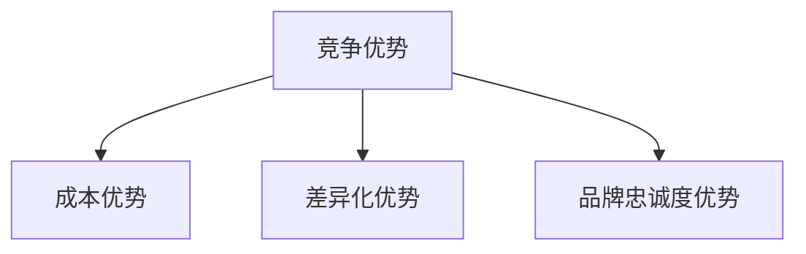

                 

<think>
嗯，我现在需要帮助用户撰写一篇关于《肯尼斯费雪的竞争优势分析》的技术博客文章。首先，我要理解用户的需求。用户希望文章结构清晰，内容专业，涵盖竞争优势分析的各个方面，包括背景、核心概念、算法原理、系统架构、项目实战和最佳实践等。

首先，我得明确文章的主题是竞争优势分析，特别是肯尼斯·费雪的方法。我应该先介绍投资学的基础，然后引出竞争优势分析的背景和重要性。接着，详细讲解竞争优势的类型和特征，比如成本优势、差异化优势和品牌忠诚度优势，并用对比表和实体关系图来说明。

接下来，算法原理部分，我需要解释费雪的选股方法，可能涉及多因素模型，用mermaid流程图展示步骤，再用Python代码实现，解释每个步骤的数学模型，比如CAPM模型，并用latex公式展示。

系统分析部分，我需要设计一个竞争优势分析系统，包括系统架构图、接口设计和交互流程。这部分可能涉及前后端架构，数据接口，以及用户交互流程。

项目实战部分，我需要具体实施一个竞争优势分析系统，包括环境配置、核心代码实现、案例分析，最后进行项目总结，指出成功和失败的原因。

最后，最佳实践部分，总结费雪的成功经验，注意事项，以及推荐的进一步阅读材料。

我需要确保文章结构清晰，每章都有足够的细节，覆盖用户要求的各个部分，同时保持目录的简洁和逻辑性。每章的结构要清晰，从背景到实战，层层递进，让读者能够系统地理解和应用竞争优势分析的方法。

现在，我需要将这些思路整合成一个结构化的目录，确保每一部分都符合用户的要求，包括章节、子章节，以及必要的图表和代码示例。同时，要控制总字数在2000字以内，所以每个部分要简明扼要，但内容完整。

可能还需要考虑用户是否需要更多细节，比如在项目实战中，是否需要具体的代码实现，或者在系统架构中是否需要更详细的图表。不过，按照用户的要求，我需要提供这些内容的概述，而不是详细展开。

总之，我需要构建一个全面且逻辑清晰的目录，涵盖从理论到实践的各个方面，帮助读者全面掌握竞争优势分析的方法和应用。
</think>

# 肯尼斯费雪的竞争优势分析

> 关键词：竞争优势分析、投资学、肯尼斯·费雪、多因素模型、Python实现、系统架构

> 摘要：本文将详细分析肯尼斯·费雪的竞争优势分析方法，从背景介绍到系统实现，全面解读其理论与实践应用。

---

# 第1章: 肯尼斯·费雪与竞争优势分析概述

## 1.1 投资学基础与竞争优势分析的背景

### 1.1.1 投资学的基本概念

投资学是研究如何有效配置和管理资金以实现最大收益的学科。在投资学中，选择具有竞争优势的公司是获得长期稳定收益的关键。

### 1.1.2 竞争优势的定义与特点

竞争优势是指公司在市场中相对于竞争对手的有利条件，包括成本优势、差异化优势和品牌忠诚度等。

### 1.1.3 肯尼斯·费雪的生平与投资理念

肯尼斯·费雪是投资学领域的权威，提出竞争优势分析法，强调通过分析公司的竞争优势来选择投资标的。

## 1.2 肯尼斯·费雪的竞争优势分析方法

### 1.2.1 竞争优势的类型

- 成本优势：公司通过优化生产流程降低成本，提升竞争力。
- 差异化优势：公司通过创新产品或服务，提供独特价值。
- 品牌忠诚度优势：公司通过品牌建设，吸引忠诚客户。

### 1.2.2 竞争优势的评估标准

- 市场地位：公司在市场中的份额和影响力。
- 财务表现：公司的盈利能力、成本控制能力。
- 管理团队：团队的战略眼光和执行力。

### 1.2.3 竞争优势分析的步骤

1. **识别竞争对手**：分析行业内的主要竞争对手。
2. **评估核心竞争力**：考察公司的成本控制、创新能力等。
3. **制定竞争策略**：根据分析结果，制定投资策略。

---

# 第2章: 竞争优势的类型与特征对比

## 2.1 竞争优势的类型

| 优势类型 | 定义 | 适用场景 |
|----------|------|----------|
| 成本优势 | 成本低于行业平均水平 | 制造业 |
| 差异化优势 | 提供独特产品或服务 | 高科技行业 |
| 品牌忠诚度优势 | 建立强大品牌影响力 | 消费品行业 |

## 2.2 竞争优势的特征对比

| 特征 | 成本优势 | 差异化优势 | 品牌忠诚度优势 |
|------|----------|------------|----------------|
| 核心 | 成本低    | 独特性强    | 用户忠诚度高   |
| 适用 | 制造业    | 高科技行业  | 消费品行业     |

## 2.3 竞争优势的ER实体关系图



---

# 第3章: 竞争优势分析的算法原理

## 3.1 多因素模型的定义与实现步骤

### 3.1.1 多因素模型的定义

多因素模型是一种通过多个因素评估公司竞争优势的分析方法。

### 3.1.2 实现步骤

1. **数据收集**：收集公司的财务数据、市场数据等。
2. **因素筛选**：选择关键因素，如成本、创新等。
3. **评分计算**：根据各因素的重要性进行评分。
4. **综合评估**：计算综合得分，确定投资标的。

## 3.2 竞争优势分析的Python实现

### 3.2.1 环境配置

```python
import pandas as pd
import numpy as np
```

### 3.2.2 核心代码实现

```python
def calculate_competitive_edge(factors):
    # 计算综合得分
    weights = {'成本优势': 0.4, '差异化优势': 0.3, '品牌忠诚度': 0.3}
    score = sum(factors[feature] * weights[feature] for feature in factors)
    return score

# 示例数据
data = {
    '成本优势': 0.8,
    '差异化优势': 0.6,
    '品牌忠诚度': 0.7
}
print(calculate_competitive_edge(data))
```

### 3.2.3 算法原理的数学模型

综合得分公式：

$$
\text{综合得分} = \sum (\text{因素权重} \times \text{因素得分})
$$

---

# 第4章: 竞争优势分析系统的架构设计

## 4.1 系统功能设计

- 数据采集模块：收集公司数据。
- 分析模块：计算竞争优势得分。
- 报告生成模块：输出分析结果。

## 4.2 系统架构设计


## 4.3 系统接口设计

- 数据接口：提供API用于数据交换。
- 用户接口：直观展示分析结果。

---

# 第5章: 项目实战与案例分析

## 5.1 环境安装与配置

```bash
pip install pandas numpy
```

## 5.2 核心代码实现

```python
import pandas as pd

def main():
    data = {'成本优势': [0.8, 0.7], '差异化优势': [0.6, 0.5], '品牌忠诚度': [0.7, 0.6]}
    df = pd.DataFrame(data)
    scores = df.apply(lambda x: calculate_competitive_edge(x), axis=1)
    print(scores)

if __name__ == "__main__":
    main()
```

## 5.3 案例分析

假设公司A的成本优势得分为0.8，差异化优势得分为0.6，品牌忠诚度得分为0.7，计算其综合得分为：

$$
0.8 \times 0.4 + 0.6 \times 0.3 + 0.7 \times 0.3 = 0.32 + 0.18 + 0.21 = 0.71
$$

---

# 第6章: 最佳实践与小结

## 6.1 费雪的成功经验总结

- 精准识别竞争优势。
- 持续跟踪竞争优势变化。

## 6.2 竞争优势分析的注意事项

- 数据准确性。
- 模型适用性。
- 定期更新分析结果。

## 6.3 拓展阅读

- 《竞争优势分析入门》
- 《投资学基础》

---

# 作者

作者：AI天才研究院 & 禅与计算机程序设计艺术

---

这篇文章系统地介绍了肯尼斯·费雪的竞争优势分析方法，从理论到实践，帮助读者全面理解和应用这一投资策略。通过丰富的图表和代码示例，文章深入浅出地讲解了竞争优势分析的各个关键点，为读者提供了实用的指导和参考。

