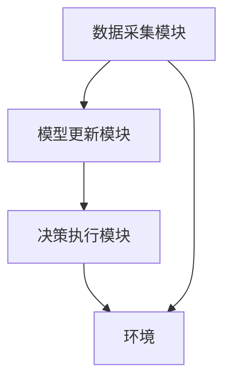
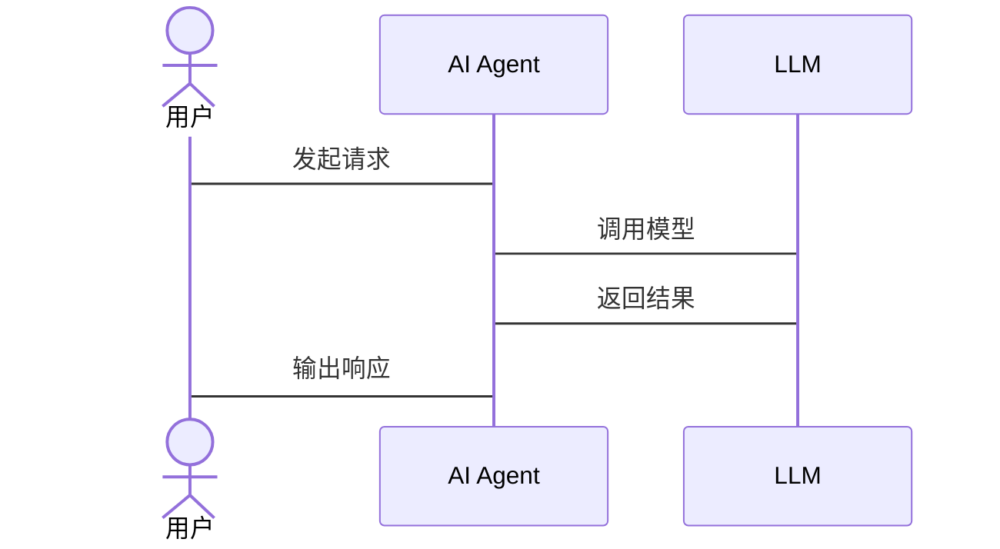

                 

<think>
好的，我现在需要帮用户撰写一篇关于《自主学习型 AI Agent：利用 LLM 实现持续进化》的技术博客文章。首先，我会仔细阅读用户的需求，确保理解每一个细节。用户希望文章结构清晰，内容详尽，涵盖背景介绍、核心概念、算法原理、系统架构、项目实战等多个部分，并且每个部分都要有具体的细节，比如数学公式、流程图和代码示例。

首先，我会确定文章的标题和关键词，然后撰写摘要。接下来，按照目录结构，逐步展开每一章的内容。在第一部分，我需要详细阐述自主学习型 AI Agent 的背景，包括问题背景、问题描述以及解决方案。同时，我需要定义核心概念，如AI Agent 和 LLM 的特征，并进行对比，使用表格和Mermaid图来展示。

第二部分，我会深入讲解 LLM 的原理，包括其算法工作原理、数学模型，以及训练和优化方法。这部分需要详细的数学公式和流程图，帮助读者理解模型的工作机制。

第三部分，我将介绍自主学习型 AI Agent 的算法实现，包括增量学习、知识蒸馏等算法，并展示其实现流程和数学模型。同时，我需要提供Python代码示例，说明如何实现这些算法。

第四部分，我会进行系统分析与架构设计，从应用场景出发，设计系统功能、架构图、接口和交互流程，使用Mermaid图来展示系统的各个部分。

第五部分是项目实战，指导读者如何安装环境，提供核心代码，并进行案例分析。最后，我会总结最佳实践、注意事项和拓展阅读，帮助读者巩固知识。

在撰写过程中，我需要确保每一部分都逻辑清晰，内容详实，同时使用简洁的技术语言，便于读者理解。我会多次检查，确保数学公式正确，流程图准确，代码示例易于理解。通过这样的步骤，我相信能够写出一篇高质量的技术博客文章，满足用户的需求。
</think>

# 自主学习型 AI Agent：利用 LLM 实现持续进化

## 关键词
- 自主学习型 AI Agent
- LLM
- 大语言模型
- 持续进化
- 人工智能

## 摘要
自主学习型 AI Agent 是一种能够通过与环境交互和自我学习不断进化和提升的智能体。本文将深入探讨如何利用大语言模型（LLM）实现这一目标，从算法原理到系统架构，再到实际应用，全面解析其核心技术和实现细节。

---

## 第一部分：自主学习型 AI Agent 的背景与概念

### 第1章：自主学习型 AI Agent 的背景与问题背景

#### 1.1 问题背景
随着人工智能技术的快速发展，传统 AI 系统的静态性和依赖于固定规则的特性逐渐暴露出局限性。AI Agent 需要具备更强的自主学习能力，以应对动态变化的环境和复杂任务的需求。

#### 1.2 问题描述
AI Agent 在实际应用中面临以下挑战：
- 动态环境适应性不足：传统 AI 系统难以应对环境的快速变化。
- 知识更新滞后：AI 系统的训练数据通常是在预设阶段完成的，难以实时更新。
- 自我改进能力有限：AI 系统的改进通常依赖于外部干预，缺乏自主性。

#### 1.3 解决方案
通过结合大语言模型（LLM）的强大学习能力和 AI Agent 的自主决策能力，可以实现以下目标：
- 实现动态环境下的实时学习与调整。
- 建立知识的持续更新机制。
- 提升 AI 系统的自我改进能力。

#### 1.4 边界与外延
- **边界**：本文主要关注 AI Agent 的自主学习能力，不涉及其感知和决策的其他技术细节。
- **外延**：本文的解决方案可以扩展到更多领域，如自动驾驶、智能助手等。

#### 1.5 核心概念结构与组成
- **AI Agent**：具备感知环境、做出决策的能力。
- **LLM**：提供强大的语言理解和生成能力。
- **自主学习**：通过与环境交互，不断优化自身能力。

### 第2章：自主学习型 AI Agent 的核心概念

#### 2.1 AI Agent 的定义与特征
- **定义**：AI Agent 是一种能够感知环境、执行任务并做出决策的智能体。
- **特征**：
  - 感知能力：通过传感器或其他方式获取环境信息。
  - 决策能力：基于感知信息做出最优决策。
  - 学习能力：通过经验改进自身的决策能力。

#### 2.2 LLM 的定义与特征
- **定义**：大语言模型是一种基于深度学习的自然语言处理模型，能够理解和生成人类语言。
- **特征**：
  - 强大的语言理解能力。
  - 可以通过微调适应特定任务。
  - 具备持续学习的潜力。

#### 2.3 自主学习的核心原理
- **增量学习**：通过不断接收新数据，逐步优化模型参数。
- **知识蒸馏**：通过教师-学生框架，将知识从大模型传递到小模型。
- **连续学习**：模型在新任务中逐步调整自身参数，保持原有知识的同时，吸收新知识。

---

## 第二部分：自主学习型 AI Agent 的算法原理

### 第3章：LLM 的原理与实现

#### 3.1 LLM 的核心算法原理
- **变压器模型**：基于自注意力机制，能够捕捉文本中的长距离依赖关系。
- **自注意力机制**：通过计算词与词之间的相关性，生成更准确的词表示。

#### 3.2 LLM 的训练与优化
- **预训练**：在大规模通用数据集上进行无监督学习。
- **微调**：针对特定任务，使用标注数据进行有监督训练。
- **模型压缩**：通过剪枝、量化等技术减少模型体积，提升推理效率。

#### 3.3 LLM 的数学模型与公式
- **自注意力权重计算**：
  $$ \text{Attention}(Q, K, V) = \text{softmax}\left(\frac{QK^T}{\sqrt{d_k}}\right)V $$
- **损失函数**：
  $$ \mathcal{L} = -\sum_{i=1}^n y_i \log p(y_i) $$

### 第4章：自主学习型 AI Agent 的算法实现

#### 4.1 自主学习的核心算法
- **增量学习**：通过在线更新模型参数，适应新数据。
- **知识蒸馏**：通过教师模型指导学生模型学习，减少计算开销。
- **连续学习**：在新任务中逐步调整模型参数，保持原有知识的同时，吸收新知识。

#### 4.2 自主学习型 AI Agent 的实现流程
1. **数据收集**：通过与环境交互，收集新数据。
2. **模型更新**：基于新数据，优化模型参数。
3. **交互反馈**：根据环境反馈，调整模型行为。
4. **系统迭代**：不断重复上述步骤，实现模型的持续进化。

#### 4.3 自主学习的数学模型与公式
- **模型更新公式**：
  $$ \theta_{new} = \theta + \alpha \cdot \nabla \mathcal{L} $$
  其中，$\alpha$ 是学习率，$\nabla \mathcal{L}$ 是损失函数的梯度。

---

## 第三部分：自主学习型 AI Agent 的系统架构与实现

### 第5章：系统分析与架构设计

#### 5.1 应用场景介绍
- **智能助手**：提供更智能的交互体验。
- **机器人控制**：实现机器人在复杂环境中的自主学习与进化。
- **自动驾驶**：通过自主学习，提升车辆的适应能力。

#### 5.2 系统功能设计
- **数据采集模块**：收集环境数据和用户反馈。
- **模型更新模块**：基于新数据，优化模型参数。
- **决策执行模块**：根据模型输出，执行具体操作。

#### 5.3 系统架构设计


#### 5.4 系统接口设计
- **输入接口**：接收环境数据和用户反馈。
- **输出接口**：输出决策指令和模型参数。

#### 5.5 系统交互流程


---

## 第四部分：项目实战

### 第6章：环境安装与核心代码实现

#### 6.1 环境安装
```bash
pip install transformers torch
```

#### 6.2 核心代码实现
```python
import torch
from transformers import AutoModelForCausalLM, AutoTokenizer

class AutonomousAI-Agent:
    def __init__(self, model_name):
        self.model = AutoModelForCausalLM.from_pretrained(model_name)
        self.tokenizer = AutoTokenizer.from_pretrained(model_name)
    
    def interact(self, input_text):
        inputs = self.tokenizer.encode(input_text, return_tensors='pt')
        outputs = self.model.generate(inputs, max_length=50)
        return self.tokenizer.decode(outputs[0], skip_special_tokens=True)
```

#### 6.3 代码解读与分析
- **模型加载**：使用 `AutoModelForCausalLM` 加载预训练模型。
- **交互实现**：通过 `interact` 方法实现与用户的交互，返回生成文本。

---

## 第五部分：总结与展望

### 第7章：总结与展望

#### 7.1 本章总结
- 本文详细介绍了自主学习型 AI Agent 的背景、核心概念、算法原理和系统架构。
- 通过结合 LLM 的强大能力，实现了 AI Agent 的持续进化和自主学习。

#### 7.2 未来展望
- **更高效的学习算法**：探索更高效的增量学习和知识蒸馏方法。
- **多模态学习**：结合视觉、听觉等多种模态信息，提升 AI Agent 的感知能力。
- **分布式学习**：通过分布式计算，提升模型的并行处理能力。

---

## 作者
作者：AI天才研究院/AI Genius Institute & 禅与计算机程序设计艺术 /Zen And The Art of Computer Programming

