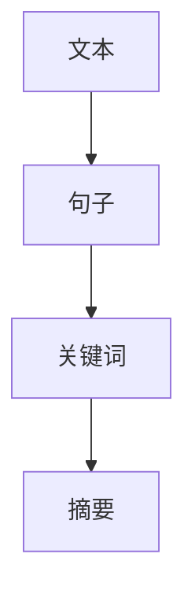
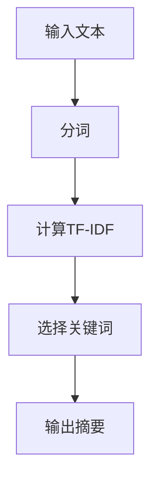
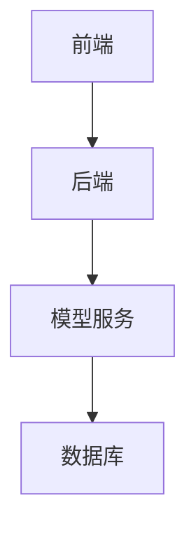

                 


# 自动文本摘要AI Agent：LLM驱动的关键信息提取

## 关键词：自动文本摘要，LLM，关键信息提取，文本挖掘，大语言模型

## 摘要：  
本文探讨了基于大语言模型（LLM）的自动文本摘要技术，分析了其核心原理、算法实现、系统架构，并通过实际案例展示了如何利用LLM进行关键信息提取。文章从背景介绍、核心概念、算法原理、系统架构、项目实战到最佳实践，全面而深入地解析了这一领域的最新进展和应用。

---

# 第1章: 自动文本摘要的背景与挑战

## 1.1 自动文本摘要的基本概念  
文本摘要是指从大量文本中提取关键信息并生成简洁、准确的摘要的过程。其核心目标是保留原文的主要信息，同时去除冗余内容。自动文本摘要的出现，极大提升了信息处理的效率，尤其是在大数据时代，其应用范围涵盖新闻、学术论文、社交媒体等多种场景。  

### 1.1.1 文本摘要的定义与作用  
文本摘要可以分为两类：**抽取式摘要**和**生成式摘要**。抽取式摘要直接从原文中选择关键句子或词语；生成式摘要则通过模型生成新的文本，以更自然的方式表达原文内容。  

文本摘要的作用包括：  
1. 提高信息获取效率，快速了解文档核心内容。  
2. 降低信息过载，便于用户筛选重要信息。  
3. 为后续处理（如信息检索、数据分析）提供基础支持。  

### 1.1.2 自动文本摘要的必要性  
随着互联网信息的爆炸式增长，用户每天面对的信息量呈指数级增长。传统的阅读方式难以应对海量信息的处理需求，自动文本摘要技术成为不可或缺的工具。  

### 1.1.3 传统文本摘要方法的局限性  
传统摘要方法主要依赖关键词提取和句法分析，存在以下问题：  
1. 对上下文语境的理解能力有限。  
2. 无法处理复杂的语义关系。  
3. 生成的摘要可能缺乏流畅性和自然性。  

## 1.2 LLM驱动的关键信息提取  
大语言模型（LLM）的出现，为文本摘要带来了革命性的变化。LLM通过深度学习技术，能够理解上下文、捕捉语义信息，并生成高质量的摘要。  

### 1.2.1 大语言模型的崛起  
大语言模型通过海量数据的训练，掌握了丰富的语言知识和语义理解能力。其核心优势在于能够处理复杂的语义关系，并生成符合语境的文本。  

### 1.2.2 LLM在文本摘要中的优势  
1. **语义理解**：LLM能够理解上下文，生成更自然的摘要。  
2. **灵活性**：支持多种语言和领域，适应性强。  
3. **高效性**：通过模型并行计算，快速生成摘要。  

### 1.2.3 自动文本摘要的未来趋势  
未来，随着模型能力的提升和硬件技术的进步，文本摘要将更加智能化和个性化。例如，基于用户偏好生成定制化摘要，或结合视觉信息生成多模态摘要。  

## 1.3 本章小结  
本章介绍了自动文本摘要的基本概念、必要性和传统方法的局限性，并重点阐述了大语言模型在文本摘要中的应用及其优势。通过这些内容，读者可以理解为什么LLM驱动的关键信息提取是当前研究的热点。

---

# 第2章: 自动文本摘要的核心概念与联系

## 2.1 自动文本摘要的原理  
文本摘要的核心在于如何提取关键信息。抽取式摘要和生成式摘要各有优劣，具体选择取决于应用场景和需求。  

### 2.1.1 抽取式摘要与生成式摘要的对比  
| 属性 | 抽取式摘要 | 生成式摘要 |  
|------|------------|------------|  
| 方法 | 基于关键词提取 | 基于LLM生成 |  
| 优点 | 简洁准确 | 更符合语境 |  
| 缺点 | 可能遗漏上下文 | 计算资源需求高 |  

### 2.1.2 基于LLM的关键信息提取方法  
LLM通过**注意力机制**和**解码器**结构，能够捕捉文本中的关键信息并生成摘要。例如，GPT系列模型通过自回归方式生成文本，BERT模型则通过编码器理解上下文。  

### 2.1.3 摘要质量评估的指标与方法  
常用的评估指标包括：  
1. **ROUGE**：基于n-gram的相似性计算。  
2. **BLEU**：基于n-gram的精确度和重合度计算。  
3. **人工评估**：通过人工判断摘要的准确性和流畅性。  

## 2.2 核心概念的ER实体关系图  


## 2.3 本章小结  
本章通过对比分析抽取式和生成式摘要的方法，探讨了LLM在关键信息提取中的应用，并介绍了摘要质量的评估指标。通过这些内容，读者可以更好地理解自动文本摘要的核心原理和实现方法。

---

# 第3章: 自动文本摘要算法原理

## 3.1 抽取式摘要算法  
抽取式摘要通过计算文本中各部分的重要性，选择最具代表性的内容生成摘要。  

### 3.1.1 基于TF-IDF的关键词提取  
**TF-IDF（Term Frequency-Inverse Document Frequency）**是一种常用的关键词提取方法。其公式为：  
$$ TF-IDF(t) = \frac{TF(t)}{\log(N) - \log(TF_{max}(t))} $$  
其中，\( TF(t) \)是词项\( t \)在文档中的出现次数，\( N \)是文档总数，\( TF_{max}(t) \)是词项\( t \)在文档中的最大出现次数。  

### 3.1.2 基于文本挖掘的句子重要性计算  
句子重要性计算通常基于**PageRank**算法。其核心思想是将句子视为图中的节点，通过计算节点的重要性排序，选择最重要的句子生成摘要。  

### 3.1.3 抽取式摘要的实现流程  


## 3.2 生成式摘要算法  
生成式摘要基于LLM生成新的文本内容。  

### 3.2.1 基于LLM的生成式摘要实现  
生成式摘要的核心是模型的解码过程。模型通过解码器生成序列，选择概率最高的词项组合成句子。  

### 3.2.2 生成式摘要的优化方法  
为了提高生成摘要的质量，可以采用以下优化方法：  
1. **惩罚机制**：对重复词项进行惩罚，避免生成冗余内容。  
2. **奖励机制**：通过奖励模型生成符合语境的内容。  

## 3.3 本章小结  
本章详细介绍了抽取式和生成式摘要的算法原理，并通过流程图展示了实现步骤。通过这些内容，读者可以理解如何基于LLM实现高质量的文本摘要。

---

# 第4章: 自动文本摘要系统分析与架构设计

## 4.1 问题场景介绍  
自动文本摘要系统需要处理多种场景，例如长文档摘要、实时摘要等。  

### 4.1.1 长文档摘要  
长文档摘要需要处理文本的复杂结构和上下文关系。  

### 4.1.2 实时摘要  
实时摘要需要快速生成摘要，适用于新闻报道等场景。  

## 4.2 系统功能设计  
系统功能设计包括文本预处理、摘要生成和结果评估。  

### 4.2.1 文本预处理  
文本预处理包括分词、去除停用词等步骤。  

### 4.2.2 摘要生成  
摘要生成基于LLM模型，支持多种生成方式。  

## 4.3 系统架构设计  
系统架构设计采用微服务架构，包括前端、后端、模型服务和数据库。  

### 4.3.1 系统架构图  


## 4.4 本章小结  
本章通过问题场景分析和系统架构设计，展示了如何构建一个高效的自动文本摘要系统。通过微服务架构，系统能够灵活扩展，满足不同场景的需求。

---

# 第5章: 自动文本摘要项目实战

## 5.1 环境搭建与安装  
项目实战需要安装Python和相关库，例如transformers和numpy。  

### 5.1.1 安装环境  
```bash
pip install transformers numpy
```

## 5.2 核心功能实现  
核心功能包括文本预处理、模型调用和结果展示。  

### 5.2.1 文本预处理  
```python
from transformers import pipeline

summarizer = pipeline("summarization")
text = "..."  # 输入文本
summary = summarizer(text)[0]["summary"]
print(summary)
```

## 5.3 实际案例分析  
以新闻报道为例，展示如何生成高质量的摘要。  

## 5.4 本章小结  
本章通过项目实战，展示了如何基于LLM实现自动文本摘要。通过代码实现和案例分析，读者可以更好地理解理论知识。

---

# 第6章: 最佳实践与小结

## 6.1 最佳实践 tips  
1. 选择合适的模型和参数，确保摘要质量。  
2. 处理长文本时，采用分段处理方法。  
3. 使用多种评估指标，全面评估摘要质量。  

## 6.2 小结  
本文从背景介绍、核心概念、算法实现到系统架构，全面解析了自动文本摘要技术。通过项目实战和最佳实践，读者可以掌握如何基于LLM实现高效的文本摘要。

## 6.3 注意事项  
1. 模型计算资源需求较高，需合理配置硬件。  
2. 注意文本的版权和隐私问题。  
3. 持续关注模型更新和新技术发展。  

## 6.4 拓展阅读  
推荐阅读相关书籍和论文，深入了解大语言模型的内部机制和应用。

---

# 作者：AI天才研究院/AI Genius Institute & 禅与计算机程序设计艺术 /Zen And The Art of Computer Programming

