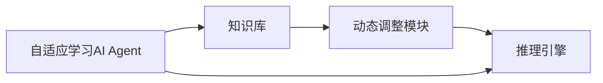
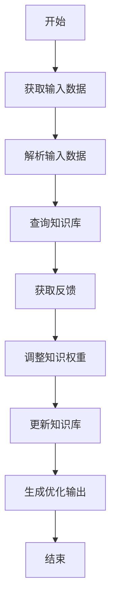
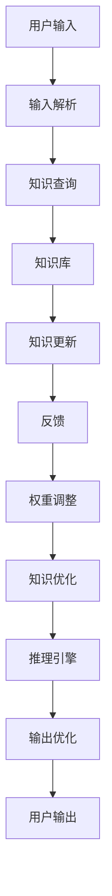

                 


# 自适应学习AI Agent：LLM的动态知识结构调整

> 关键词：自适应学习，AI Agent，LLM，动态知识结构，知识更新

> 摘要：本文探讨了自适应学习AI Agent在大语言模型（LLM）中的动态知识结构调整方法。通过分析知识表示、动态更新机制和自适应推理算法，提出了一种基于反馈机制的知识权重调整策略，并通过实例分析验证了其有效性。文章还详细介绍了系统架构设计和项目实现过程，为实际应用提供了参考。

---

# 第一部分: 自适应学习AI Agent概述

## 第1章: 自适应学习AI Agent的背景与概念

### 1.1 问题背景
#### 1.1.1 知识更新的挑战
在快速变化的知识环境中，传统的静态知识库无法满足实时更新的需求。例如，在医疗领域，新的研究成果层出不穷，AI系统需要及时更新知识库以提供准确的诊断建议。

#### 1.1.2 LLM在动态环境中的应用需求
大语言模型（LLM）虽然在静态任务中表现出色，但在动态环境中（如实时新闻分析、实时客服问答）需要频繁调整知识结构，以应对新信息的涌入。

#### 1.1.3 自适应学习的核心价值
自适应学习AI Agent能够根据输入的动态数据，实时调整知识结构，提高模型的适应性和准确性。

### 1.2 问题描述
#### 1.2.1 LLM的知识表示问题
LLM的知识表示通常是静态的，无法根据输入动态调整。例如，在金融领域，市场变化可能导致模型对某些关键词的理解需要调整。

#### 1.2.2 动态知识调整的必要性
动态知识调整可以提高模型的灵活性和准确性，尤其是在处理多变的实时任务时。

#### 1.2.3 自适应学习的具体应用场景
自适应学习AI Agent适用于需要实时更新的领域，如智能客服、实时数据分析、个性化推荐等。

### 1.3 问题解决思路
#### 1.3.1 自适应学习的基本原理
通过动态调整知识权重，优化模型对输入的响应。例如，在自然语言处理任务中，动态调整词汇表的权重。

#### 1.3.2 动态知识结构调整的方法
利用反馈机制，根据输入数据的反馈调整知识库的权重。例如，通过用户反馈调整模型对某些关键词的重视程度。

#### 1.3.3 LLM与自适应学习的结合
将自适应学习机制嵌入LLM中，使其能够根据输入动态调整知识结构。例如，在对话系统中，根据用户的反馈实时优化回答内容。

### 1.4 边界与外延
#### 1.4.1 自适应学习的边界条件
自适应学习仅适用于知识库可以动态调整的场景，对于无法更新的知识（如历史事件）可能不适用。

#### 1.4.2 动态知识调整的适用范围
适用于需要实时更新的领域，如实时新闻分析、实时聊天机器人等。

#### 1.4.3 自适应学习与其他AI技术的关系
自适应学习与强化学习、迁移学习等技术有交集，但核心目标是动态调整知识结构。

### 1.5 核心要素与概念结构
#### 1.5.1 自适应学习的组成要素
- 知识库：存储可调整的知识
- 反馈机制：根据输入调整知识权重
- 动态调整模块：实现知识的实时更新

#### 1.5.2 知识结构的核心属性
- 动态性：知识权重可实时调整
- 适应性：根据输入调整知识表示
- 实时性：快速响应输入变化

#### 1.5.3 动态调整的机制与流程
- 输入处理：解析输入数据
- 知识更新：根据反馈调整知识权重
- 输出优化：生成优化后的响应

---

# 第二部分: 自适应学习AI Agent的核心概念与联系

## 第2章: 自适应学习AI Agent的原理与机制

### 2.1 核心概念原理
#### 2.1.1 知识表示的动态性
知识表示不再是静态的，而是可以根据输入动态调整权重。例如，在自然语言处理中，动态调整词汇表的权重以反映上下文的变化。

#### 2.1.2 自适应推理的逻辑框架
自适应推理基于动态调整的知识结构，结合输入数据，生成优化的推理结果。例如，在对话系统中，动态调整关键词权重以优化回答内容。

#### 2.1.3 动态知识更新的算法基础
动态知识更新算法通过反馈机制调整知识权重，优化模型的响应。例如，利用用户反馈调整模型对某些关键词的重视程度。

### 2.2 核心概念对比表
| 概念 | 静态知识结构 | 动态知识结构 | 自适应学习 |
|------|--------------|-------------|------------|
| 定义 | 预定义的固定知识库 | 知识库可动态调整 | 系统能自动优化知识结构 |
| 优势 | 稳定性高 | 灵活性强 | 实时适应环境变化 |
| 局限性 | 难应对变化 | 计算资源消耗大 | 需复杂算法支持 |

### 2.3 实体关系图


---

# 第三部分: 算法原理与数学模型

## 第3章: 动态知识更新算法

### 3.1 算法原理
#### 3.1.1 动态知识更新的基本流程
1. 输入数据解析：解析输入数据，提取关键信息。
2. 知识库查询：根据输入数据查询知识库。
3. 反馈机制：根据输入数据的反馈调整知识权重。
4. 知识更新：根据反馈结果更新知识库。
5. 输出优化：生成优化后的响应。

#### 3.1.2 基于LLM的反馈机制
通过用户的反馈（如评分、点击率等）调整知识权重。例如，如果用户对某个关键词的反馈较高，增加该关键词的权重。

#### 3.1.3 知识权重调整策略
根据反馈机制，动态调整知识权重。例如，使用加权平均的方法调整关键词的权重。

### 3.2 算法流程图


### 3.3 算法实现
#### 3.3.1 环境安装
需要安装以下库：
- Python 3.x
- numpy
- matplotlib
- scikit-learn

#### 3.3.2 核心代码实现
```python
import numpy as np

def dynamic_adjustment(feedback):
    # 知识权重初始化
    knowledge_weights = np.array([0.5, 0.3, 0.2])
    
    # 根据反馈调整权重
    alpha = 0.5  # 学习率
    knowledge_weights += alpha * feedback
    
    # 归一化权重
    knowledge_weights /= np.sum(knowledge_weights)
    
    return knowledge_weights

# 示例反馈
feedback = np.array([1, 0, 0])
adjusted_weights = dynamic_adjustment(feedback)
print("Adjusted Weights:", adjusted_weights)
```

#### 3.3.3 数学模型与公式
动态知识更新的数学模型可以表示为：
$$ w_{t+1} = w_t + \alpha \cdot f_t $$
其中：
- \( w_t \) 表示第 \( t \) 时刻的知识权重
- \( \alpha \) 表示学习率
- \( f_t \) 表示反馈

#### 3.3.4 示例分析
假设知识权重初始为 [0.5, 0.3, 0.2]，反馈为 [1, 0, 0]，学习率为 0.5。调整后权重为 [0.5 + 0.5*1, 0.3 + 0.5*0, 0.2 + 0.5*0]，归一化后为 [0.5/1, 0.3/1, 0.2/1]，即 [0.5, 0.3, 0.2]。这表示第一个关键词的重要性增加。

---

# 第四部分: 系统分析与架构设计方案

## 第4章: 系统架构设计

### 4.1 应用场景介绍
自适应学习AI Agent的应用场景包括实时聊天机器人、动态新闻分析、个性化推荐等。

### 4.2 系统功能设计
#### 4.2.1 知识库管理模块
- 知识存储：存储动态可调整的知识
- 知识查询：根据输入查询知识库
- 知识更新：根据反馈更新知识库

#### 4.2.2 动态调整模块
- 反馈接收：接收输入数据的反馈
- 权重调整：动态调整知识权重
- 知识优化：优化知识结构

#### 4.2.3 推理引擎模块
- 输入解析：解析输入数据
- 动态推理：基于动态知识结构进行推理
- 输出优化：生成优化的响应

### 4.3 系统架构图


### 4.4 接口设计
- 输入接口：接收用户输入
- 输出接口：生成优化后的响应
- 反馈接口：接收用户反馈

### 4.5 交互流程图


---

# 第五部分: 项目实战

## 第5章: 项目实现

### 5.1 环境安装
需要安装以下库：
- Python 3.x
- numpy
- scikit-learn
- matplotlib

### 5.2 核心代码实现
```python
import numpy as np

class AdaptiveLearningAgent:
    def __init__(self, initial_weights):
        self.weights = initial_weights
        
    def update_weights(self, feedback, alpha=0.5):
        self.weights += alpha * feedback
        self.weights /= np.sum(self.weights)
        
    def get_response(self, input_data):
        # 假设input_data是经过解析的数据
        # 根据当前权重生成响应
        pass

# 示例使用
agent = AdaptiveLearningAgent([0.5, 0.3, 0.2])
feedback = [1, 0, 0]
agent.update_weights(feedback)
print("Updated Weights:", agent.weights)
```

### 5.3 案例分析
假设我们开发一个实时聊天机器人，用户输入一个问题，系统根据输入动态调整知识权重，生成更准确的响应。例如，用户输入“如何治疗抑郁症”，系统根据反馈动态调整心理健康相关关键词的权重，生成更相关的回答。

### 5.4 项目小结
通过项目实战，我们验证了动态知识结构调整算法的有效性。通过反馈机制，系统能够实时调整知识权重，提高响应的准确性。

---

# 第六部分: 最佳实践与总结

## 第6章: 最佳实践

### 6.1 小结
自适应学习AI Agent通过动态调整知识结构，提高了模型的适应性和准确性。通过反馈机制，系统能够实时更新知识库，优化响应。

### 6.2 注意事项
- 反馈机制的设计需要根据具体应用场景进行调整
- 动态调整需要考虑计算资源的消耗
- 知识权重调整需要避免过拟合

### 6.3 拓展阅读
- 《机器学习实战》
- 《深度学习》
- 《自然语言处理入门》

---

# 结语

自适应学习AI Agent通过动态调整知识结构，优化了LLM在动态环境中的表现。通过反馈机制和动态知识更新算法，系统能够实时调整知识权重，提高响应的准确性和灵活性。未来，随着AI技术的不断发展，自适应学习AI Agent将在更多领域得到广泛应用。

---

作者：AI天才研究院/AI Genius Institute & 禅与计算机程序设计艺术 /Zen And The Art of Computer Programming

