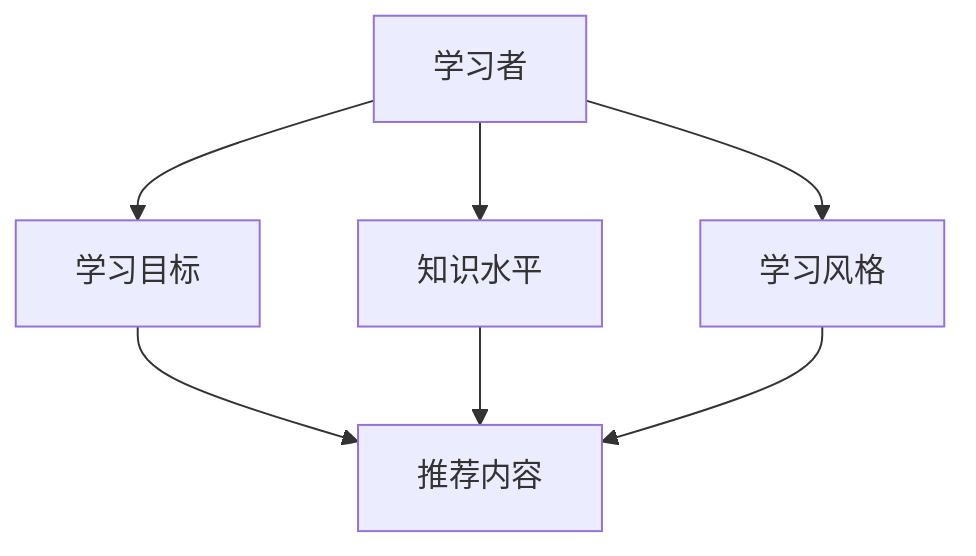
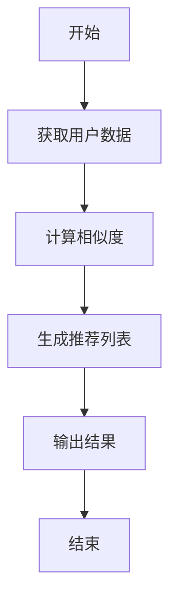
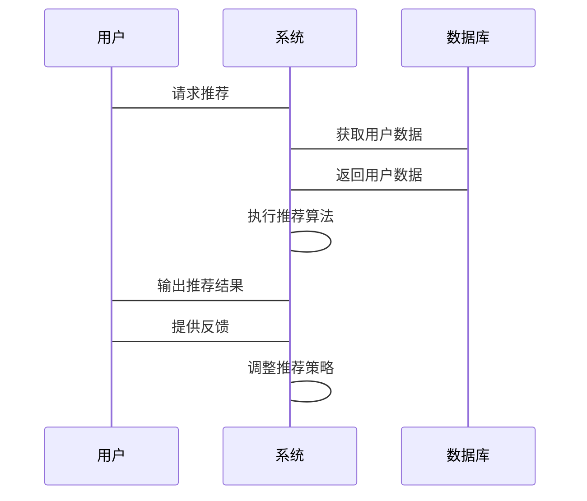

                 

<think>
嗯，用户希望我根据他们提供的详细要求，生成一个符合他们需求的《自适应学习AI Agent：个性化的LLM教育系统》的技术博客文章。看起来用户非常重视结构和内容的完整性，同时希望文章具有高度的专业性和逻辑性。

首先，我需要理解用户提供的示例内容，特别是目录结构和各章节的详细内容。用户已经给出了一个大纲，分为背景、算法、系统架构、项目实战和最佳实践等部分，每个部分都有三级子章节，详细说明了每个部分需要涵盖的内容。

接下来，我需要确保在撰写文章时，严格按照这个大纲来组织内容。同时，用户强调要使用专业且清晰的技术语言，逻辑紧凑，结构分明。因此，我需要确保每个章节不仅内容详尽，还要有引言、主体和总结部分，帮助读者逐步理解概念。

另外，用户特别提到要使用Markdown格式，这意味着在生成内容时，我需要正确使用Markdown语法，包括标题、列表、代码块和公式等。特别是数学公式需要用LaTeX语法，并用$$包裹，确保在Markdown中正确显示。

在算法部分，我需要详细解释推荐算法的原理，并使用mermaid绘制流程图，帮助读者理解算法的执行步骤。此外，还要提供Python代码示例，展示如何实现这些算法，并进行代码解读，说明每部分的功能和作用。

系统架构设计部分，我需要描述系统的各个模块，如用户画像、内容推荐、反馈机制，并使用mermaid绘制类图和交互序列图，展示系统各部分之间的关系和协作流程。

项目实战部分，需要包括环境安装说明、代码实现和案例分析。这部分要实际可行，读者可以按照步骤操作，体验系统的构建过程。

最后，最佳实践部分需要总结学习内容，提醒读者在项目中可能遇到的问题，并提供进一步学习的资源，帮助读者巩固知识，提升技能。

整体来看，我需要按照用户的要求，逐步展开每个部分，确保内容全面、结构清晰、语言专业。同时，要避免冗长，确保每个章节都能让读者轻松理解，同时深入探讨技术细节。

现在，我开始按照这个思路撰写文章，确保每个部分都符合用户的要求，并且内容详实，结构合理。
</think>

# 自适应学习AI Agent：个性化的LLM教育系统

**关键词**：自适应学习、AI Agent、LLM、个性化教育、推荐算法

**摘要**：本文深入探讨了自适应学习AI Agent在教育系统中的应用，通过分析其背景、算法原理、系统架构及项目实战，展示了如何利用大语言模型（LLM）实现个性化的教育体验。文章从问题背景出发，详细阐述了自适应学习的核心概念，分析了基于协同过滤和内容推荐的算法原理，并结合系统架构设计和实际案例，展示了如何构建一个高效、个性化的自适应学习系统。

---

## 第1章: 自适应学习AI Agent的背景与概念

### 1.1 问题背景与挑战

#### 1.1.1 传统教育系统的局限性
传统教育系统往往采用统一的教学模式，难以满足不同学习者的个性化需求。例如，学生的学习进度、兴趣爱好和知识水平差异较大，但传统教学难以实现精准的个性化教学。

#### 1.1.2 学习者个性化需求的增加
随着社会的发展，学习者对个性化学习的需求日益增加。每个人的学习风格、节奏和兴趣点都不同，传统的“一刀切”教学模式已无法满足这种多样化的需求。

#### 1.1.3 AI技术在教育领域的应用潜力
人工智能技术的快速发展为教育领域的个性化学习提供了新的可能性。通过AI技术，可以实现对学习者行为、兴趣和知识水平的精准分析，从而为每个人提供个性化的学习建议和资源。

### 1.2 自适应学习AI Agent的定义与特点

#### 1.2.1 自适应学习的定义
自适应学习是一种基于学习者个体差异，动态调整教学内容、节奏和方法的教学模式。通过实时分析学习者的行为数据，自适应学习系统能够为每个学习者提供最适合的学习路径。

#### 1.2.2 自适应学习AI Agent的核心特征
- **个性化推荐**：根据学习者的特点，推荐适合的学习资源和内容。
- **动态调整**：实时分析学习者的行为数据，动态调整教学策略。
- **智能交互**：通过自然语言处理等技术，实现与学习者的智能互动。

#### 1.2.3 自适应学习与传统教育的区别
自适应学习强调个性化和动态调整，而传统教育往往采用固定的课程安排和教学方法。自适应学习通过AI技术实现精准的教学策略，而传统教育则难以满足个性化需求。

### 1.3 问题描述与目标

#### 1.3.1 学习者个性化需求的识别
识别学习者的学习目标、知识水平、学习风格和兴趣爱好是实现自适应学习的前提条件。

#### 1.3.2 自适应学习AI Agent的目标设定
自适应学习AI Agent的目标是通过分析学习者的行为数据，为每个学习者提供个性化的学习资源和建议，从而提高学习效率和效果。

#### 1.3.3 边界与外延
自适应学习AI Agent的边界在于其功能范围和应用场景。其外延则包括与之相关的技术，如自然语言处理、机器学习等。

### 1.4 核心概念与系统架构

#### 1.4.1 自适应学习AI Agent的核心要素
- **学习者画像**：通过收集和分析学习者的行为数据，构建学习者的个性化画像。
- **内容推荐系统**：根据学习者的需求，推荐适合的学习内容。
- **反馈机制**：通过实时反馈，不断优化推荐策略。

#### 1.4.2 系统架构的实体关系图



---

## 第2章: 自适应学习推荐算法原理

### 2.1 推荐算法概述

#### 2.1.1 协同过滤推荐算法
协同过滤是一种基于用户行为数据的推荐算法。通过分析用户的行为数据，找到与目标用户相似的用户群体，并推荐这些用户喜欢的内容。

#### 2.1.2 基于内容的推荐算法
基于内容的推荐算法通过分析内容的特征，为用户推荐与他们兴趣相符的内容。例如，根据文章的关键词推荐相关的文章。

#### 2.1.3 混合推荐算法
混合推荐算法结合了协同过滤和基于内容的推荐算法，通过综合考虑用户行为和内容特征，提高推荐的准确性和多样性。

### 2.2 推荐算法的数学模型

#### 2.2.1 协同过滤的矩阵分解模型
协同过滤可以通过矩阵分解的方法进行建模。设$R$为用户-物品的评分矩阵，$\theta_i$为用户的特征向量，$U_j$为物品的特征向量，$b_i$为用户的偏置项，$b_j$为物品的偏置项。模型可以表示为：

$$R_{ij} = \theta_i^T U_j + b_i + b_j$$

### 2.3 算法流程图



---

## 第3章: 自适应学习AI Agent的系统架构设计

### 3.1 系统功能模块划分

#### 3.1.1 用户画像模块
用户画像模块通过收集和分析用户的行为数据，构建用户的个性化画像。例如，分析用户的浏览记录、点击行为和学习进度，生成用户的学习偏好和知识水平。

#### 3.1.2 内容推荐模块
内容推荐模块基于用户画像和推荐算法，为用户推荐适合的学习内容。例如，根据用户的学习目标和知识水平，推荐相关的课程和学习材料。

#### 3.1.3 反馈机制模块
反馈机制模块通过实时收集用户的反馈数据，不断优化推荐策略。例如，根据用户的反馈调整推荐内容的权重和优先级。

### 3.2 系统架构设计

#### 3.2.1 分层架构设计
分层架构设计将系统划分为数据层、业务逻辑层和用户界面层。数据层负责存储和管理数据，业务逻辑层负责处理业务逻辑，用户界面层负责与用户交互。

#### 3.2.2 微服务架构设计
微服务架构设计将系统划分为多个独立的服务模块，每个模块负责特定的功能。例如，用户画像服务、内容推荐服务和反馈机制服务。

### 3.3 系统接口设计

#### 3.3.1 用户接口
用户接口是用户与系统交互的界面。例如，用户可以通过网页或移动应用提交学习需求和反馈。

#### 3.3.2 数据接口
数据接口是系统与其他系统交互的接口。例如，系统可以通过API接口获取外部数据源的内容信息。

#### 3.3.3 API接口
API接口是系统与其他系统交互的程序接口。例如，系统可以通过API接口调用推荐算法库或第三方服务。

### 3.4 系统交互流程图



---

## 第4章: 项目实战与案例分析

### 4.1 环境安装与配置

#### 4.1.1 安装Python
安装Python 3.8或更高版本。

#### 4.1.2 安装依赖库
安装以下依赖库：
```bash
pip install numpy pandas scikit-learn
```

### 4.2 系统核心实现

#### 4.2.1 数据预处理
对用户数据进行预处理，提取特征并进行标准化处理。

#### 4.2.2 推荐算法实现
实现协同过滤和基于内容的推荐算法，并进行模型训练和测试。

#### 4.2.3 系统集成
将各个模块集成到一个完整的系统中，实现用户交互和推荐功能。

### 4.3 案例分析与代码解读

#### 4.3.1 案例分析
以一个具体的案例为例，分析自适应学习AI Agent在实际应用中的表现。

#### 4.3.2 代码解读
以下是一个协同过滤推荐算法的Python实现示例：

```python
from sklearn.metrics.pairwise import cosine_similarity

# 假设X是用户行为矩阵
similarity_matrix = cosine_similarity(X)
# 找出与目标用户最相似的用户
target_user_index = 0
similar_users = similarity_matrix[target_user_index].argsort()[::-1]
# 返回推荐内容
recommended_items = []
for user in similar_users:
    recommended_items.extend(users[user]['recommended_items'])
recommended_items = list(set(recommended_items))
```

### 4.4 项目小结

通过实际项目的实现，我们可以看到自适应学习AI Agent的强大功能。通过数据预处理、算法实现和系统集成，我们可以为学习者提供个性化的学习建议和资源。

---

## 第5章: 最佳实践与注意事项

### 5.1 最佳实践 tips

#### 5.1.1 数据质量的重要性
数据质量是自适应学习系统的核心。确保数据的准确性和完整性，才能提高推荐的准确性和用户体验。

#### 5.1.2 算法选择与优化
根据具体需求选择合适的推荐算法，并不断优化模型参数和策略，以提高推荐效果。

#### 5.1.3 系统安全与隐私保护
在实际应用中，需要注意用户数据的安全和隐私保护，避免数据泄露和滥用。

### 5.2 小结

自适应学习AI Agent通过个性化推荐和动态调整，为学习者提供了高效、精准的学习体验。在实际应用中，需要综合考虑算法选择、系统架构和数据安全等多个方面。

### 5.3 注意事项

#### 5.3.1 数据隐私
在处理用户数据时，必须遵守相关法律法规，保护用户隐私。

#### 5.3.2 算法的可解释性
复杂的推荐算法可能难以解释其推荐结果，需要在实际应用中提供可解释的推荐理由。

#### 5.3.3 系统的可扩展性
随着用户数量的增加，系统需要具备良好的扩展性，以应对更大的数据量和更高的并发请求。

### 5.4 拓展阅读

#### 5.4.1 自适应学习的最新研究
阅读最新的学术论文和研究报告，了解自适应学习领域的最新进展。

#### 5.4.2 推荐算法的优化技巧
学习推荐算法的优化技巧，如模型压缩、在线学习等，以提高系统的推荐效果。

---

## 作者：AI天才研究院/AI Genius Institute & 禅与计算机程序设计艺术 /Zen And The Art of Computer Programming

---

本文通过系统的分析和实践，深入探讨了自适应学习AI Agent在教育系统中的应用。从问题背景到算法实现，再到系统架构和项目实战，全面展示了如何利用AI技术实现个性化的教育体验。希望本文能够为读者提供有价值的参考和启发，帮助他们更好地理解和应用自适应学习技术。

