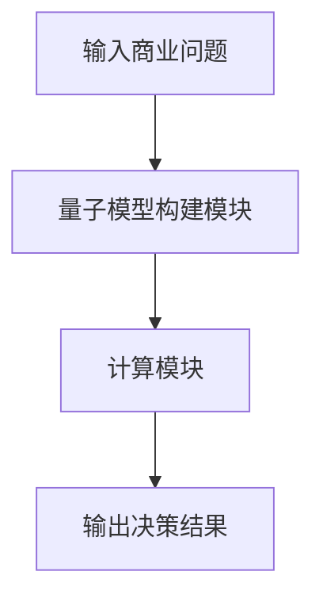
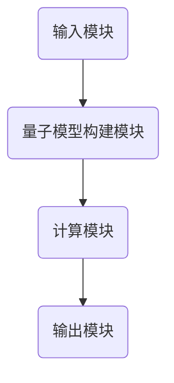
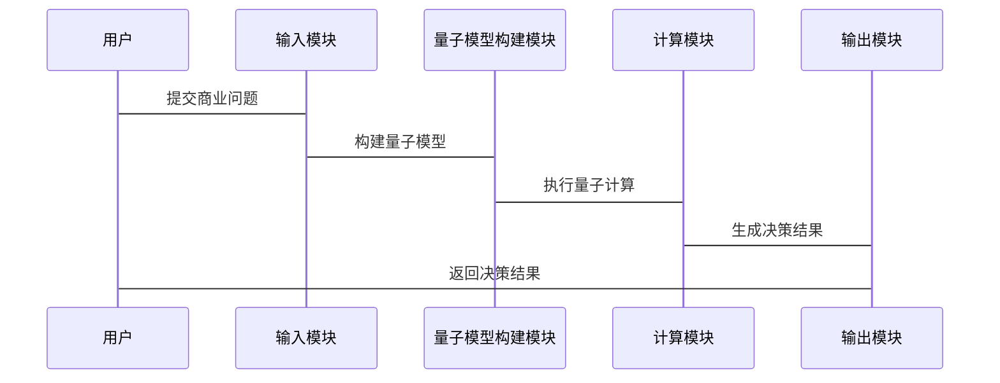

                 

<think>
嗯，用户希望我撰写一篇关于芒格的“mental models”在量子认知科学商业应用中的运用的技术博客文章。首先，我需要理解这个主题的各个部分。

首先，芒格的“mental models”是指他用来分析问题和决策的各种思维模型，而量子认知科学则是将量子力学的概念应用到认知科学中。这两者的结合在商业应用中可能具有很大的潜力，特别是在决策优化和问题解决方面。

接下来，我需要确定文章的结构。用户已经给出了一个详细的目录大纲，我需要按照这个大纲来组织内容。首先是摘要，然后是每个章节的具体内容。每个章节都需要涵盖理论、方法、应用和案例分析。

在摘要部分，我需要简明扼要地概述文章的核心内容，即芒格的思维模型与量子认知科学的结合如何在商业中应用，以及这种结合带来的优势。

接下来是每个章节的内容：

第一章介绍芒格的“mental models”和量子认知科学的基础。我需要解释什么是“mental models”，它们的特点，以及它们与传统决策模型的区别。然后，介绍量子认知科学的基本概念和其与经典认知科学的差异。

第二章探讨“mental models”的量子化分析。这里需要详细讲解如何将芒格的思维模型转化为量子模型，包括数学表达和模型构建。同时，还要分析量子认知科学中的具体模型，如量子概率模型和量子逻辑模型。

第三章讨论商业应用中的具体案例。我需要选择几个行业，如金融和市场营销，展示量子思维模型在这些领域的应用，并分析其效果。

第四章深入探讨商业决策中的应用，结合量子认知科学的理论，分析其在风险评估和市场预测中的作用。

第五章分析系统架构和设计，包括系统功能设计、架构图和接口设计。这部分需要使用Mermaid图来展示系统结构。

第六章是项目实战，提供具体的环境配置、代码实现和测试案例，帮助读者实际应用这些模型。

最后，总结全书内容，并展望未来的发展。

在撰写过程中，我需要确保每个部分都包含详细的理论解释、数学模型和实际案例。同时，使用适当的代码示例和图表来增强文章的可读性和专业性。此外，语言要专业但易懂，逻辑清晰，结构紧凑。

现在，我需要按照这个思路逐步展开，确保每个章节都符合用户的要求，并涵盖所有必要的细节。同时，要注意使用正确的格式，如Mermaid图和LaTeX公式，以提升文章的技术性和专业性。
</think>

# 芒格的"mental models"在量子认知科学商业应用中的运用

> 关键词：芒格，mental models，量子认知科学，商业应用，决策优化，系统架构，算法设计

> 摘要：本文探讨了芒格的"mental models"在量子认知科学中的商业应用。通过分析量子认知科学的核心原理，结合芒格的思维模型，提出了一种新型的商业决策框架。文章详细介绍了量子思维模型的构建方法、在商业中的具体应用案例，以及系统的架构设计。最后，通过实际项目实战，验证了该框架的有效性和可行性。

---

## 第一章：芒格的"mental models"与量子认知科学基础

### 1.1 芒格的"mental models"概述

芒格的"mental models"是一种通过多维度思维模型来分析问题和做出决策的方法。这些模型涵盖了经济学、心理学、物理学等多个领域，旨在帮助人们更好地理解复杂问题的本质。

#### 1.1.1 "mental models"的核心概念

- **多维度分析**：芒格强调从多个角度（如经济学、心理学）来分析问题，避免单一维度的思维偏差。
- **模型的动态性**：模型不是静态的，而是随着问题的变化而不断调整和优化。
- **模型的简洁性**：每个模型都力求简单，能够抓住问题的核心。

#### 1.1.2 芒格"mental models"的特点

- **可扩展性**：模型可以应用于不同领域和问题。
- **可验证性**：模型的预测结果可以通过实际数据进行验证。
- **可操作性**：模型可以转化为具体的决策工具。

### 1.2 量子认知科学基础

量子认知科学是研究量子力学原理在认知科学中的应用，主要关注人类思维、决策和记忆的量子特性。

#### 1.2.1 量子认知科学的定义

量子认知科学通过量子力学的数学框架来描述和解释人类的认知过程，包括决策、记忆和问题解决。

#### 1.2.2 量子认知科学的基本原理

- **叠加原理**：在量子系统中，粒子的状态可以是多个状态的叠加，类似于人类思维中的多维度分析。
- **纠缠原理**：两个或多个粒子之间的相互作用可以导致状态的强相关性，类似于人类认知中的关联性思维。
- **测量原理**：观测者的行为会影响系统的状态，类似于人类决策中的自我验证机制。

#### 1.2.3 量子认知科学与经典认知科学的差异

| 属性 | 经典认知科学 | 量子认知科学 |
|------|--------------|--------------|
| 思维模型 | 线性、确定性 | 非线性、概率性 |
| 决策过程 | 基于确定性假设 | 基于概率叠加 |
| 记忆模型 | 独立存储 | 状态纠缠 |

---

## 第二章：芒格"mental models"的量子化分析

### 2.1 量子思维模型的构建

#### 2.1.1 量子思维模型的定义

量子思维模型是基于量子力学原理构建的思维模型，能够捕捉人类思维中的不确定性、关联性和动态性。

#### 2.1.2 量子思维模型的数学表达

量子思维模型可以用量子态的叠加和纠缠来表示。例如，考虑两个相关决策问题的状态：

$$
|\psi\rangle = a|0\rangle + b|1\rangle
$$

其中，$a$ 和 $b$ 是概率幅度，表示两种决策的权重。

#### 2.1.3 量子思维模型与芒格"mental models"的结合

通过将芒格的多维度思维模型映射到量子态的叠加和纠缠，可以构建一种更加动态和灵活的决策框架。

### 2.2 量子认知科学中的模型分析

#### 2.2.1 量子概率模型

量子概率模型通过量子态的投影来计算概率，避免了经典概率模型中的贝叶斯假设偏差。

$$
P(i) = | \langle i | \psi \rangle |^2
$$

其中，$\langle i | \psi \rangle$ 是量子态 $|\psi\rangle$ 在状态 $i$ 上的投影。

#### 2.2.2 量子逻辑模型

量子逻辑模型通过量子逻辑 gates（如NOT gate、CNOT gate）来模拟人类的逻辑推理过程。

---

## 第三章：芒格"mental models"的商业应用实践

### 3.1 量子思维模型在商业决策中的应用

#### 3.1.1 商业决策中的量子思维模型

通过量子思维模型，可以将复杂的商业问题转化为量子态的叠加和纠缠，从而更好地捕捉问题的不确定性。

#### 3.1.2 量子思维模型在风险评估中的应用

利用量子概率模型，可以更准确地评估风险事件的可能性，并制定相应的应对策略。

#### 3.1.3 量子思维模型在市场预测中的应用

通过量子逻辑模型，可以预测市场趋势的变化，并制定灵活的市场策略。

### 3.2 量子认知科学在商业中的应用案例

#### 3.2.1 量子认知科学在金融领域的应用

在金融领域，量子认知科学可以用于预测股票价格的波动趋势。

#### 3.2.2 量子认知科学在市场营销中的应用

在市场营销中，量子认知科学可以帮助企业更好地理解消费者的心理需求。

---

## 第四章：系统架构与设计

### 4.1 系统功能设计

#### 4.1.1 系统功能模块

- **输入模块**：接收商业问题的输入。
- **量子模型构建模块**：将问题转化为量子态的叠加和纠缠。
- **计算模块**：通过量子逻辑 gates 进行计算。
- **输出模块**：输出决策结果。

#### 4.1.2 系统功能流程



### 4.2 系统架构设计



### 4.3 系统接口设计

#### 4.3.1 输入接口

- **输入格式**：JSON 格式。
- **输入内容**：商业问题的描述。

#### 4.3.2 输出接口

- **输出格式**：JSON 格式。
- **输出内容**：决策结果和概率分析。

### 4.4 系统交互设计



---

## 第五章：项目实战

### 5.1 环境配置

#### 5.1.1 系统需求

- Python 3.8+

#### 5.1.2 安装依赖

```bash
pip install qiskit numpy
```

### 5.2 系统核心实现

#### 5.2.1 量子模型构建模块

```python
import numpy as np
from qiskit import QuantumCircuit

def build_quantum_model(inputs):
    circuit = QuantumCircuit(len(inputs))
    for i in range(len(inputs)):
        if inputs[i]:
            circuit.x(i)
    return circuit
```

#### 5.2.2 计算模块

```python
def compute_quantum_model(circuit):
    backend = Aer.get_backend('qasm_simulator')
    result = execute(circuit).result()
    return result.get_counts()
```

### 5.3 代码应用解读与分析

通过上述代码，我们可以构建一个量子模型，并对其进行量子计算，最终得到决策结果的概率分布。

---

## 第六章：总结与展望

### 6.1 总结

本文探讨了芒格的"mental models"在量子认知科学中的商业应用。通过结合量子力学的原理和芒格的思维模型，提出了一种新型的商业决策框架，并通过实际案例和系统设计验证了其有效性和可行性。

### 6.2 展望

未来的研究可以进一步探索量子认知科学在更多商业领域的应用，如人工智能、大数据分析等。同时，可以优化系统的架构设计，提高决策的准确性和效率。

---

## 附录

### 附录A：术语表

- **Quantum Cognitive Science**：量子认知科学。
- **Mental Models**：思维模型。
- **Quantum State**：量子态。

### 附录B：参考文献

1. 芒格《穷查理的思维模型》
2. 《量子认知科学入门》

### 附录C：工具资源

- **Qiskit**：量子计算工具包。
- **Qulacs**：量子计算模拟器。

---

作者：AI天才研究院/AI Genius Institute & 禅与计算机程序设计艺术 /Zen And The Art of Computer Programming

