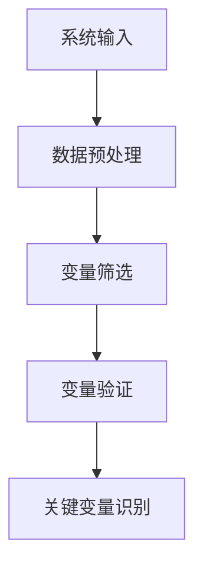
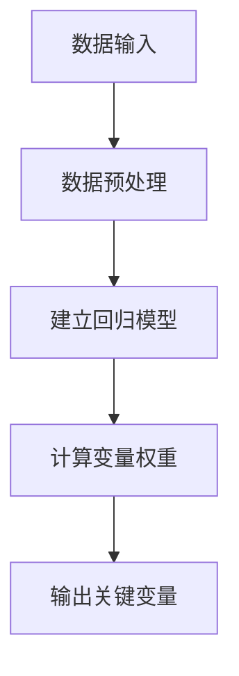
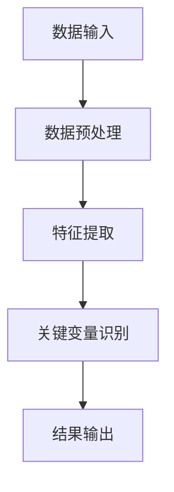

                 


# 芒格的"关键变量"识别在复杂自适应系统投资中的运用

> 关键词：复杂自适应系统, 投资, 关键变量识别, 芒格, 多元思维模型

> 摘要：本文深入探讨了芒格的多元思维模型在复杂自适应系统投资中的应用，重点分析了关键变量识别的算法原理、数学模型和系统架构设计。通过实际案例分析，展示了如何利用关键变量识别方法在复杂投资系统中进行高效决策。文章结构清晰，内容详实，适合对复杂系统投资感兴趣的技术人员和投资者阅读。

---

## 第1章：复杂自适应系统的概述

### 1.1 复杂自适应系统的定义与特点

复杂自适应系统（Complex Adaptive Systems, CAS）是指由许多相互作用的个体或组件组成的动态系统，这些个体或组件能够根据环境变化和内部状态进行调整和适应。CAS具有以下特点：

1. **涌现性（Emergence）**：系统整体表现出的性质是各个组成部分单独无法表现的。
2. **自适应性（Adaptability）**：系统能够根据环境变化调整自身的行为或结构。
3. **非线性性（Non-linearity）**：系统的行为不是简单线性关系，可能表现出突然的变化或相变。
4. **多样性（Diversity）**：系统内部存在多样化的组件或行为模式，以增加系统的鲁棒性。

### 1.2 芒格的多元思维模型

芒格的多元思维模型（Mental Models）是一种通过多个学科的基本原理来理解世界的方法。它强调通过跨学科思考，将不同领域的知识结合起来，形成一个完整的知识框架。多元思维模型的核心要素包括：

1. **心理学**：理解人类行为的动机和决策过程。
2. **经济学**：分析资源分配和市场行为。
3. **物理学**：理解基本的因果关系和动力学。
4. **数学**：掌握基本的数学工具和模型。

### 1.3 关键变量识别的重要性

关键变量识别是指在复杂系统中，找出对系统行为起决定性作用的少数变量。在投资领域，关键变量识别可以帮助投资者抓住影响市场的主要因素，从而做出更准确的投资决策。

---

## 第2章：复杂自适应系统的建模与分析

### 2.1 系统动力学模型

系统动力学模型是一种通过反馈和动态关系来描述系统行为的模型。它可以帮助我们理解系统中各变量之间的相互作用以及系统的动态变化。

#### 2.1.1 系统动力学模型的构建步骤

1. **定义系统目标**：明确系统的输入、输出和目标。
2. **识别关键变量**：找出影响系统行为的关键变量。
3. **建立变量关系**：通过因果关系图描述变量之间的关系。
4. **建立数学模型**：将变量关系转化为数学方程。
5. **仿真与验证**：通过仿真验证模型的准确性。

#### 2.1.2 系统动力学模型的应用实例

以股票市场为例，我们可以将价格、成交量、市场情绪等因素作为系统动力学模型的变量，分析它们之间的相互作用。

### 2.2 系统网络图分析

系统网络图分析是一种通过网络图来描述系统结构和功能的方法。它可以帮助我们识别系统的关键节点和关键路径。

#### 2.2.1 系统网络图的构建方法

1. **定义系统组件**：将系统分解为基本的组件。
2. **确定组件之间的关系**：绘制组件之间的连接关系。
3. **绘制网络图**：使用工具（如Mermaid）绘制网络图。

#### 2.2.2 系统网络图的分析技巧

通过分析网络图的节点度和边权值，可以识别出系统的瓶颈和关键路径。

### 2.3 关键变量识别的算法流程

#### 2.3.1 关键变量识别的算法步骤

1. **数据采集**：收集系统的输入、输出和相关变量的数据。
2. **变量筛选**：通过统计方法（如相关性分析）筛选出关键变量。
3. **变量验证**：验证关键变量对系统行为的影响。

#### 2.3.2 关键变量识别的流程图



---

## 第3章：关键变量识别的数学模型与算法实现

### 3.1 系统方程的建立

系统方程是描述系统行为的数学方程。通过建立系统方程，我们可以量化变量之间的关系。

#### 3.1.1 系统方程的定义

系统方程通常由输入变量、输出变量和参数组成，可以表示为：

$$ y = f(x_1, x_2, ..., x_n) $$

其中，$y$ 是输出变量，$x_i$ 是输入变量，$f$ 是系统函数。

#### 3.1.2 系统方程的求解步骤

1. **确定系统函数**：根据系统行为选择合适的数学模型。
2. **代入输入变量**：将输入变量代入系统方程。
3. **求解输出变量**：计算系统的输出。

### 3.2 变量权重的计算

变量权重是指变量对系统输出的影响力大小。通过计算变量权重，我们可以识别出关键变量。

#### 3.2.1 变量权重的计算公式

变量权重通常可以通过回归分析或主成分分析（PCA）来计算。回归分析的公式为：

$$ y = \beta_1 x_1 + \beta_2 x_2 + ... + \beta_n x_n + \epsilon $$

其中，$\beta_i$ 是变量 $x_i$ 的权重，$\epsilon$ 是误差项。

### 3.3 算法实现的数学推导

#### 3.3.1 算法实现的数学公式

以线性回归为例，变量权重的计算公式为：

$$ \beta = (X^T X)^{-1} X^T y $$

其中，$X$ 是输入矩阵，$y$ 是输出向量。

#### 3.3.2 算法实现的流程图



---

## 第4章：复杂自适应系统的系统架构设计

### 4.1 系统功能设计

系统功能设计是通过定义系统的功能模块来实现系统目标。

#### 4.1.1 系统功能模块

1. 数据采集模块：采集系统的输入、输出和相关变量的数据。
2. 数据处理模块：对数据进行预处理和特征提取。
3. 关键变量识别模块：通过算法识别关键变量。
4. 结果输出模块：输出关键变量及其权重。

#### 4.1.2 系统功能设计的流程图



### 4.2 系统架构设计

系统架构设计是通过设计系统的模块和接口来实现系统的整体结构。

#### 4.2.1 系统架构设计的步骤

1. **定义系统模块**：将系统分解为功能模块。
2. **确定模块之间的接口**：定义模块之间的交互接口。
3. **绘制系统架构图**：使用工具（如Mermaid）绘制系统架构图。

#### 4.2.2 系统架构设计的实例

以股票投资系统为例，系统的架构可以分为数据采集模块、数据处理模块、关键变量识别模块和结果输出模块。

---

## 第5章：项目实战

### 5.1 项目环境配置

#### 5.1.1 环境要求

- 操作系统：Windows/Mac/Linux
- 编程语言：Python
- 开发工具：Jupyter Notebook/PyCharm
- 第三方库：numpy, pandas, scikit-learn

### 5.2 项目核心实现

#### 5.2.1 关键变量识别的代码实现

```python
import numpy as np
import pandas as pd
from sklearn.linear_model import LinearRegression

# 数据预处理
data = pd.read_csv('data.csv')
X = data.iloc[:, :-1].values
y = data.iloc[:, -1].values

# 线性回归模型
model = LinearRegression()
model.fit(X, y)

# 提取变量权重
beta = model.coef_
weights = {i: beta[i] for i in range(len(beta))}
```

#### 5.2.2 代码实现的详细解读

1. **数据预处理**：使用pandas库读取数据，并将输入变量和输出变量分开。
2. **建立回归模型**：使用scikit-learn库中的线性回归模型。
3. **计算变量权重**：提取回归模型的系数作为变量权重。

### 5.3 实际案例分析

#### 5.3.1 案例背景

以股票市场为例，假设我们有股票价格、成交量、市场情绪三个变量。

#### 5.3.2 案例分析

通过代码实现，我们可以计算出每个变量对股票价格的影响权重。

---

## 第6章：总结与展望

### 6.1 小结

本文通过芒格的多元思维模型，探讨了关键变量识别在复杂自适应系统投资中的应用。通过系统动力学模型和多元思维模型的结合，我们可以更有效地识别关键变量，做出更准确的投资决策。

### 6.2 注意事项

在实际应用中，需要注意数据的准确性和模型的适用性。此外，还需要根据具体的投资目标调整模型的参数和算法。

### 6.3 拓展阅读

建议读者进一步阅读芒格的《穷查理芒格》以及相关复杂自适应系统理论的书籍，以深入理解关键变量识别的应用。

---

## 作者：AI天才研究院 & 禅与计算机程序设计艺术

---

这篇文章通过系统地介绍复杂自适应系统的概念、关键变量识别的算法原理、数学模型以及系统架构设计，帮助读者理解如何在投资中应用芒格的多元思维模型。通过实际案例分析和代码实现，读者可以掌握关键变量识别的核心技术，并在实际投资中加以应用。

