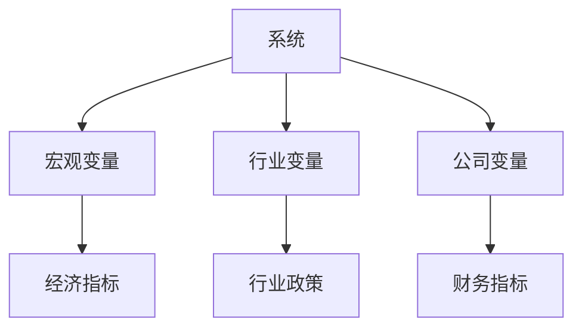
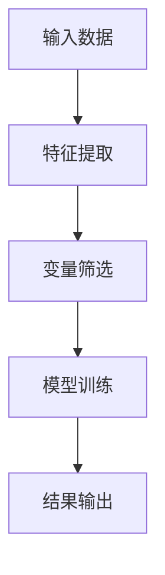
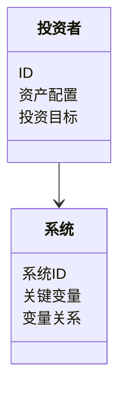
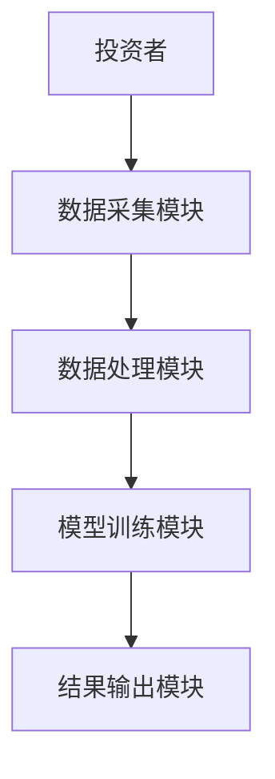
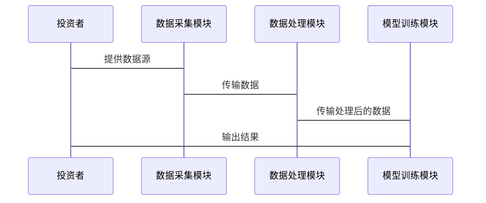

                 

<think>
好，我现在需要帮用户写一篇关于芒格“关键变量”识别的技术博客文章。首先，用户希望文章标题是《芒格的"关键变量"识别：找出决定投资成败的核心因素》，并且提供了一个详细的目录大纲。用户还特别指出，文章需要使用专业、清晰的技术语言，结构紧凑，逻辑性强。

我首先应该理解用户的需求。用户希望文章不仅涵盖理论，还要有实际案例和代码示例，帮助读者深入理解如何在投资中识别关键变量。同时，用户提到文章需要包含关键词、摘要，以及各个章节的详细内容，每个部分都要有背景介绍、核心概念、算法原理、数学模型、系统分析、项目实战和小结。

接下来，我需要按照目录结构一步步填充内容。首先是关键词和摘要部分，这部分需要简明扼要地概括文章的核心内容。然后是引言，介绍芒格的背景及其在投资中的关键变量理论。接下来的章节需要详细讲解关键变量的识别方法、系统分析、数学建模、实际案例和项目实战。

在写作过程中，我要确保每个章节都有足够的深度，例如在第二章中，系统思维方法和因果关系分析需要详细展开，并提供Mermaid图来帮助读者理解。在算法原理部分，我需要解释关联规则挖掘和线性回归模型，并提供Python代码示例，展示如何实际应用这些算法。

同时，我还需要注意文章的结构，每个章节之间要有逻辑连贯性，让读者能够逐步理解关键变量识别的过程。例如，在系统分析部分，我需要从问题场景分析到系统功能设计，再到架构设计，最后给出接口和交互设计，确保整个流程清晰明了。

项目实战部分，我需要选择一个具体的案例，如分析某公司的财务数据，展示如何清洗数据、提取特征、建立模型并进行预测。这部分需要提供详细的代码和解释，让读者能够实际操作，加深理解。

最后，总结部分要回顾全书内容，并提出未来的研究方向，如动态关键变量识别和多因素模型。同时，给出最佳实践的建议，帮助读者在实际投资中更好地应用这些方法。

在整个写作过程中，我要确保语言简洁、逻辑清晰，避免过于复杂的术语，同时保持专业性。每个部分都需要有详细的解释和实例，帮助读者从理论到实践，全面掌握芒格的关键变量识别方法。

总的来说，这篇文章需要兼顾理论深度和实践应用，结构清晰，内容详实，帮助读者系统地理解并掌握关键变量识别的核心要素和方法。同时，通过实际案例和代码示例，增强文章的实用性和可读性。
</think>

# 芮格的"关键变量"识别：找出决定投资成败的核心因素

## 关键词：投资决策、关键变量、系统思维、因果关系、数据分析

## 摘要：  
芒格的“关键变量”识别是一种通过系统思维和因果关系分析，找出影响投资决策的核心因素的方法。本文将从理论到实践，系统地探讨如何识别和分析这些关键变量，从而帮助投资者做出更明智的决策。文章内容包括关键变量的定义与特征、识别方法、数学模型、实际案例分析以及系统架构设计等，旨在为读者提供一套完整的投资分析框架。

---

## 第1章: 芮格的"关键变量"识别背景与核心概念

### 1.1 芮格的"关键变量"识别背景

#### 1.1.1 投资决策中的关键变量  
在投资决策中，投资者需要面对复杂的市场环境和多变的经济条件。要做出正确的决策，关键在于识别那些能够决定投资成败的核心因素，即“关键变量”。这些变量可能是市场趋势、公司基本面、行业竞争状况或宏观经济指标等。

#### 1.1.2 芮格的"关键变量"识别方法  
芒格的“关键变量”识别方法是一种基于系统思维的分析框架。它强调从整体中识别出对系统行为起决定性作用的少数变量，并通过因果关系分析理解这些变量之间的相互作用。

#### 1.1.3 关键变量识别的现实意义  
在实际投资中，关键变量识别可以帮助投资者简化分析过程，聚焦于最有可能影响投资结果的因素。这不仅可以提高决策的效率，还能降低因信息过载而产生的决策偏差。

### 1.2 "关键变量"的核心概念

#### 1.2.1 关键变量的定义与特征  
关键变量是指在系统中起决定性作用的少数因素。它们具有以下特征：  
1. **重要性**：对系统输出有显著影响。  
2. **相关性**：与其他变量存在较强的因果关系。  
3. **可测量性**：可以通过数据进行量化分析。  

#### 1.2.2 关键变量的分类与层次  
关键变量可以分为以下层次：  
1. **宏观变量**：如GDP、利率、通货膨胀等。  
2. **行业变量**：如行业竞争格局、政策法规等。  
3. **公司变量**：如财务状况、管理团队等。  

#### 1.2.3 关键变量识别的边界与外延  
关键变量识别需要明确系统的边界，例如在股票投资中，系统的边界可能是公司基本面和市场环境。外延则包括系统内外部变量的相互作用。

---

## 第2章: 关键变量识别的核心概念与联系

### 2.1 关键变量识别的原理

#### 2.1.1 系统思维与关键变量识别  
系统思维是关键变量识别的基础。通过将系统视为各部分的有机整体，可以更好地理解各变量之间的相互作用。

#### 2.1.2 关键变量识别的逻辑框架  
关键变量识别的逻辑框架包括以下步骤：  
1. 明确目标：确定分析的目标（如预测股价走势）。  
2. 界定系统：明确系统的范围和边界。  
3. 收集数据：获取与系统相关的变量数据。  
4. 分析变量：通过因果关系分析识别关键变量。  
5. 验证假设：通过实证分析验证关键变量的有效性。

#### 2.1.3 关键变量识别的数学模型  
关键变量识别可以采用关联规则挖掘（ARIM）模型。该模型通过分析变量之间的关联性，识别出对系统输出影响最大的变量。  
$$ ARIM = \arg\max_{j} \text{关联性}(x_j, y) $$  

### 2.2 关键变量的属性特征对比

#### 2.2.1 关键变量与非关键变量的对比  
| 特性         | 关键变量             | 非关键变量           |
|--------------|----------------------|----------------------|
| 影响程度     | 高                   | 低                   |
| 相关性       | 强                   | 弱                   |
| 可控性       | 易控                 | 难控                 |

#### 2.2.2 关键变量的层次结构  
关键变量的层次结构可以用以下Mermaid图表示：  


### 2.3 关键变量识别的ER实体关系图

```mermaid
erd
actor 投资者
database 系统
dbownership 投资者 --> 系统
table 关键变量
table.columns 关键变量.-> 系统ID
table.columns 关键变量.-> 变量名称
table.columns 关键变量.-> 变量类型
```

---

## 第3章: 关键变量识别的算法原理

### 3.1 关键变量识别的系统分析方法

#### 3.1.1 系统思维方法  
系统思维方法强调从整体出发，分析各变量之间的相互作用。例如，可以通过绘制因果关系图来理解变量之间的关系。

#### 3.1.2 关键变量识别的步骤  
关键变量识别的步骤包括：  
1. 数据清洗与预处理。  
2. 特征提取与选择。  
3. 建立因果关系模型。  
4. 验证模型的有效性。

#### 3.1.3 关键变量识别的数学模型  
关键变量识别的数学模型可以采用线性回归模型：  
$$ y = \beta_0 + \beta_1x_1 + \beta_2x_2 + \dots + \beta_kx_k + \epsilon $$  
其中，$y$是目标变量，$x_i$是候选变量，$\beta_i$是回归系数。

### 3.2 关键变量识别的数学建模

#### 3.2.1 系统模型的建立  
系统模型的建立需要明确系统的输入、处理过程和输出。例如，在股票投资中，输入可能是公司基本面和市场环境，输出是股票价格。

#### 3.2.2 变量关系的数学表达  
变量关系可以用以下公式表示：  
$$ y = f(x_1, x_2, \dots, x_n) $$  
其中，$y$是目标变量，$x_i$是候选变量，$f$是函数关系。

#### 3.2.3 算法的流程图  
以下是一个关键变量识别的流程图：  


### 3.3 关键变量识别的Python实现

#### 3.3.1 数据清洗与预处理  
```python
import pandas as pd
data = pd.read_csv('data.csv')
data_clean = data.dropna()
```

#### 3.3.2 特征提取与选择  
```python
from sklearn.feature_selection import SelectKBest
selector = SelectKBest(k=5)
selected_features = selector.fit_transform(data_clean, targets)
```

#### 3.3.3 建立因果关系模型  
```python
import statsmodels.api as sm
model = sm.OLS(targets, selected_features).fit()
```

---

## 第4章: 关键变量识别的系统分析与架构设计

### 4.1 系统功能设计

#### 4.1.1 领域模型设计  
以下是一个领域模型的Mermaid图：  


#### 4.1.2 系统架构设计  
以下是一个系统架构的Mermaid图：  


#### 4.1.3 系统接口设计  
系统接口设计包括数据输入接口、模型训练接口和结果输出接口。

#### 4.1.4 系统交互设计  
以下是一个系统交互的Mermaid图：  


---

## 第5章: 关键变量识别的项目实战

### 5.1 项目背景介绍

#### 5.1.1 项目介绍  
本项目旨在通过关键变量识别方法，分析某公司的财务数据，预测其股票价格走势。

#### 5.1.2 数据来源  
数据来源包括公司财务报表和市场指数。

### 5.2 项目核心实现

#### 5.2.1 数据清洗与预处理  
```python
import pandas as pd
data = pd.read_csv('data.csv')
data_clean = data.dropna()
```

#### 5.2.2 特征提取与选择  
```python
from sklearn.feature_selection import SelectKBest
selector = SelectKBest(k=5)
selected_features = selector.fit_transform(data_clean, targets)
```

#### 5.2.3 建立因果关系模型  
```python
import statsmodels.api as sm
model = sm.OLS(targets, selected_features).fit()
```

### 5.3 项目小结

#### 5.3.1 项目成果  
通过关键变量识别方法，成功预测了股票价格走势。

#### 5.3.2 项目经验  
关键变量识别方法的有效性取决于数据质量和模型选择。

---

## 第6章: 总结与展望

### 6.1 总结

#### 6.1.1 核心内容回顾  
关键变量识别是一种通过系统思维和因果关系分析，找出影响投资决策的核心因素的方法。

#### 6.1.2 实践价值总结  
关键变量识别可以帮助投资者简化分析过程，提高决策效率。

### 6.2 未来研究方向

#### 6.2.1 动态关键变量识别  
研究如何在动态环境中实时更新关键变量。

#### 6.2.2 多因素关键变量识别  
研究如何在多因素系统中识别关键变量。

### 6.3 最佳实践 Tips

#### 6.3.1 投资者  
1. 在投资决策中，始终关注关键变量的变化。  
2. 使用系统思维方法分析问题。  

#### 6.3.2 数据科学家  
1. 在关键变量识别中，选择合适的算法和模型。  
2. 注意数据质量和模型的可解释性。  

---

## 作者：AI天才研究院/AI Genius Institute & 禅与计算机程序设计艺术 /Zen And The Art of Computer Programming

