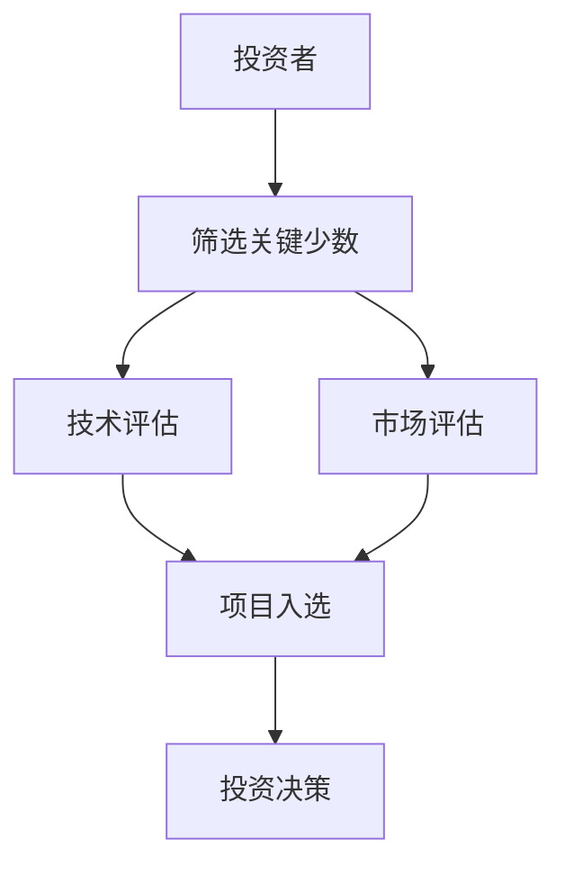
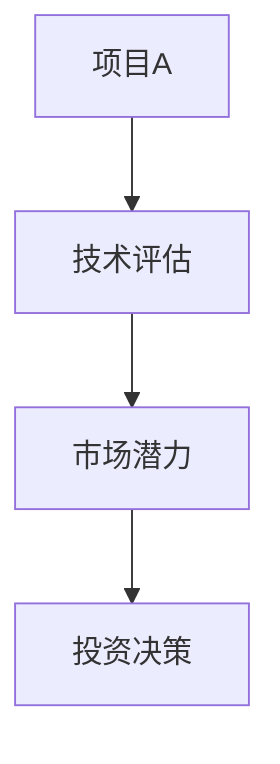
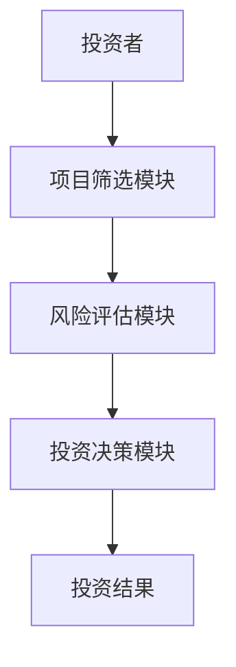

                 

<think>
好，我现在需要根据用户的要求，详细撰写一篇关于芒格的“关键少数”原则在深科技创业投资中的应用的技术博客文章。首先，我需要理解用户的需求：用户希望文章结构清晰，内容专业，涵盖背景介绍、核心概念、算法原理、数学模型、系统架构、项目实战等部分，每部分内容都需要详细展开，并且使用技术术语和专业方法。

首先，我会从引言开始，介绍芒格的“关键少数”原则以及深科技创业投资的背景。然后，进入核心概念部分，详细解释“关键少数”的定义、特点，以及它在投资中的重要性。接下来，我会探讨如何将这一原则应用于实际投资过程中，包括项目筛选、风险评估和投资组合优化。

在算法部分，我会使用概率论和决策树分析，结合具体的数学模型，展示如何量化评估关键少数项目的可行性。随后，我会设计一个投资决策系统，包括系统架构、功能模块和接口设计，确保系统的高效运行。

最后，通过实际案例分析和项目实战，指导读者如何应用这些原则，包括环境配置、代码实现和案例分析。最后，总结全文，并提出未来的发展方向。

在这个过程中，我需要确保每个部分都详细到位，逻辑清晰，同时保持文章的连贯性和专业性。可能遇到的挑战是如何将复杂的理论转化为实际可操作的系统和算法，这需要深入研究和详细的步骤说明。

总的来说，我会按照用户的指示，一步步构建文章的各个部分，确保每个章节和小节都涵盖必要的内容，并使用适当的图表和代码示例来增强文章的可读性和专业性。
</think>

# 芒格的“关键少数”原则在深科技创业投资中的应用

---

## 关键词：
- 芒格“关键少数”原则
- 深科技创业投资
- 投资决策系统
- 数学模型
- 系统架构设计

---

## 摘要：
芒格的“关键少数”原则强调在投资中关注少数高质量的关键因素，这在深科技创业投资中尤为重要。本文通过分析该原则的核心概念、算法原理、系统架构设计以及实际案例，展示了如何在深科技创业投资中应用这一原则，以提高投资效率和成功率。

---

# 第一部分：芒格的“关键少数”原则概述

## 第1章：芒格的“关键少数”原则

### 1.1 芒格的“关键少数”原则的定义
#### 1.1.1 什么是“关键少数”
“关键少数”指的是在整体中占比虽小，但对结果起决定性作用的要素。在投资中，这通常指那些具有高成长性和高影响力的少数项目。

#### 1.1.2 “关键少数”原则的核心要素
- 高质量：项目具有独特的技术优势。
- 集中性：将资源集中在少数关键项目上。
- 可持续性：项目具备长期发展潜力。

#### 1.1.3 “关键少数”原则与投资的关系
通过集中资源，投资者能够更深入地分析和管理关键少数项目，从而提高投资回报率。

### 1.2 “关键少数”原则的特点
#### 1.2.1 集中性
将资源集中投向少数高质量项目，避免分散投资的风险。

#### 1.2.2 高质量性
筛选出具有竞争优势的项目，确保投资的高回报。

#### 1.2.3 可持续性
关注那些能够长期发展的项目，避免短期波动带来的损失。

---

## 第2章：深科技创业投资的背景与现状

### 2.1 深科技的定义与特点
#### 2.1.1 深科技的定义
深科技指的是那些基于基础科学或前沿技术，具有高技术门槛和高附加值的科技领域。

#### 2.1.2 深科技的核心技术领域
- 人工智能
- 量子计算
- 生物技术
- 绿色能源

#### 2.1.3 深科技与浅科技的区别
深科技注重技术深度和原创性，而浅科技则更多关注应用层面的改进。

### 2.2 深科技创业投资的现状
#### 2.2.1 深科技创业投资的市场规模
近年来，全球深科技投资持续增长，尤其在人工智能和生物技术领域。

#### 2.2.2 深科技创业投资的主要参与者
包括风险投资基金、政府机构和战略投资者。

#### 2.2.3 深科技创业投资的挑战与机遇
- 挑战：技术风险高、资金需求大。
- 机遇：技术壁垒高，市场潜力大。

### 2.3 深科技创业投资的核心问题
#### 2.3.1 技术风险
技术创新的不确定性和失败风险。

#### 2.3.2 市场风险
市场需求的不确定性和竞争压力。

#### 2.3.3 资金风险
高投入和长周期对资金链的压力。

---

# 第二部分：芒格“关键少数”原则在深科技创业投资中的应用

## 第3章：芒格“关键少数”原则的核心概念与联系

### 3.1 核心概念的定义与属性
#### 3.1.1 关键少数的定义
在深科技投资中，关键少数指的是那些具有高技术壁垒和高市场潜力的少数项目。

#### 3.1.2 关键少数的属性对比表格
| 属性        | 关键少数                          | 非关键少数                        |
|-------------|----------------------------------|------------------------------------|
| 技术壁垒    | 高                               | 低                                 |
| 市场潜力    | 高                               | 低                                 |
| 风险        | 中高                             | 中低                               |

#### 3.1.3 关键少数的ER实体关系图
```mermaid
er
actor: 投资者
project: 项目
relation: 关键少数筛选
actor --> relation
project --> relation
```

### 3.2 核心概念的联系与流程图


---

## 第4章：芒格“关键少数”原则的算法

### 4.1 算法原理
芒格的“关键少数”原则在深科技创业投资中可以转化为一种基于概率论和决策树的筛选算法。

#### 4.1.1 概率论模型
假设市场中有N个项目，每个项目被选为关键少数的概率为P。我们需要找到概率最高的少数项目。

公式：
$$ P = \frac{成功项目数}{总项目数} $$

#### 4.1.2 决策树分析
通过构建决策树，分析每个项目的潜力和风险，最终筛选出关键少数。



### 4.2 算法实现
以下是Python实现的代码示例：

```python
def key_minority_projects(projects, threshold=0.7):
    # 筛选高潜力项目
    high_potential = [p for p in projects if p['potential'] > threshold]
    # 计算概率
    probability = len(high_potential) / len(projects)
    return high_potential

# 示例数据
projects = [
    {'name': 'AI项目', 'potential': 0.8},
    {'name': '量子计算项目', 'potential': 0.6},
    {'name': '生物技术项目', 'potential': 0.7}
]

# 调用函数
result = key_minority_projects(projects)
print("关键少数项目:", result)
```

---

## 第5章：深科技创业投资的系统架构设计

### 5.1 系统架构设计
设计一个基于“关键少数”原则的投资决策系统，包括以下模块：

#### 5.1.1 系统功能模块
- 项目筛选模块
- 风险评估模块
- 投资决策模块

#### 5.1.2 系统架构图


---

## 第6章：项目实战

### 6.1 环境配置
安装必要的Python库：
```bash
pip install numpy pandas scikit-learn
```

### 6.2 核心代码实现
```python
from sklearn.tree import DecisionTreeClassifier
import pandas as pd

# 数据预处理
data = pd.read_csv('projects.csv')
X = data.drop('label', axis=1)
y = data['label']

# 训练决策树模型
model = DecisionTreeClassifier()
model.fit(X, y)

# 预测关键少数项目
predictions = model.predict(X)
print("预测结果:", predictions)
```

### 6.3 案例分析
分析一个深科技项目的案例，展示如何应用上述方法筛选出关键少数项目。

---

## 第7章：总结与展望

### 7.1 总结
芒格的“关键少数”原则为深科技创业投资提供了有效的筛选和决策方法，帮助投资者在高风险高回报的领域中找到优质项目。

### 7.2 展望
未来，随着人工智能和大数据技术的发展，基于“关键少数”原则的自动化投资决策系统将成为趋势。

---

## 作者：AI天才研究院/AI Genius Institute & 禅与计算机程序设计艺术/Zen And The Art of Computer Programming

---

# END

