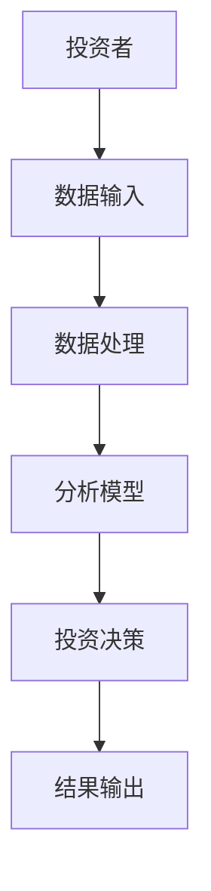

                 


---

# 芒格的"关键少数"原则在科技独角兽投资中的应用

## 关键词：芒格、关键少数、科技独角兽、投资策略、系统分析、项目实战、风险管理

## 摘要：  
本文探讨了芒格的"关键少数"原则在科技独角兽投资中的应用，分析了科技独角兽的特征、评估标准和投资策略。通过理论分析、系统设计和实际案例，展示了如何将"关键少数"原则应用于科技独角兽的投资决策中，构建高效的投资模型，优化投资组合，并实现风险管理。

---

# 第一部分：引言

## 1.1 芒格的"关键少数"原则概述

### 1.1.1 芒格的生平与投资理念  
查理·芒格是伯克希尔·哈撒韦公司的副主席，被誉为“价值投资的第二人”。他提出的关键少数原则强调在复杂系统中，少数关键因素对结果起决定性作用。这种思维方式在投资领域具有重要价值，尤其是在科技独角兽投资中。

### 1.1.2 "关键少数"原则的核心概念  
"关键少数"原则认为，在任何系统中，只有少数关键因素能够对结果产生显著影响。在投资中，这意味着我们需要识别出那些能够决定企业成功与否的关键因素，并集中资源进行分析。

### 1.1.3 科技独角兽的定义与现状  
科技独角兽是指估值超过10亿美元的科技初创公司。这些公司通常具有高成长性、创新性和市场颠覆性。随着科技行业的快速发展，科技独角兽的数量和影响力也在迅速增长。

## 1.2 本文的目的与结构  
本文旨在通过理论分析和实践案例，探讨芒格的"关键少数"原则在科技独角兽投资中的应用。文章结构包括理论基础、系统分析、项目实战和总结展望。

---

# 第二部分：芒格"关键少数"原则的理论基础

## 2.1 "关键少数"原则的核心要素

### 2.1.1 关键少数的定义与特征  
关键少数（Pareto Principle）认为，在任何一组事物中，只有20%的关键因素决定了80%的结果。在投资中，这意味着我们需要识别出那些能够决定企业成功的关键因素。

### 2.1.2 关键少数在投资中的应用框架  
- **关键因素识别**：识别影响企业价值的关键因素，如技术优势、市场需求、团队能力等。  
- **杠杆效应**：集中资源关注关键因素，以最小的投入获得最大的回报。  
- **优先级排序**：根据关键因素的重要性进行优先级排序，制定投资策略。

### 2.1.3 关键少数原则与其他投资策略的对比  
| 投资策略 | 关键少数原则 | 传统分散投资 |  
|----------|--------------|---------------|  
| 核心理念 | 关注少数关键因素 | 分散投资，降低风险 |  
| 风险管理 | 高风险，高回报 | 低风险，低回报 |  
| 适用场景 | 高成长性企业 | 稳定性要求高的企业 |  

## 2.2 科技独角兽的特征与评估标准

### 2.2.1 科技独角兽的核心特征  
- **高成长性**：年增长率超过50%。  
- **创新性**：拥有独特的技术或商业模式。  
- **市场颠覆性**：能够改变行业格局。  
- **团队能力**：创始人和团队具有丰富的经验和能力。  

### 2.2.2 评估科技独角兽的关键指标  
- **技术壁垒**：企业的核心技术是否具有独特性和不可替代性。  
- **市场需求**：产品或服务是否满足市场需求。  
- **财务状况**：企业的盈利能力、现金流和资金链稳定性。  

### 2.2.3 科技独角兽的生命周期与阶段分析  
科技独角兽通常经历以下几个阶段：  
1. **种子阶段**：初创企业，需要资金支持和市场验证。  
2. **成长阶段**：快速扩展市场份额，增加收入。  
3. **成熟阶段**：稳定增长，具备上市条件。  

---

# 第三部分：芒格"关键少数"原则在科技投资中的应用

## 3.1 投资策略与组合构建

### 3.1.1 关键少数原则在投资组合中的应用  
- **关键因素识别**：在科技独角兽投资中，识别企业的技术优势、市场需求和团队能力。  
- **优先级排序**：根据关键因素的重要性进行排序，制定投资策略。  
- **动态调整**：定期评估投资组合，根据市场变化进行调整。

### 3.1.2 科技独角兽的筛选与优先级排序  
- **筛选标准**：高成长性、创新性和市场颠覆性。  
- **优先级排序**：根据企业的核心竞争力和市场潜力进行排序。

### 3.1.3 投资组合的动态调整与优化  
- **定期评估**：根据市场变化和企业表现，动态调整投资组合。  
- **风险管理**：通过分散投资和杠杆控制，降低投资风险。

## 3.2 系统分析与架构设计

### 3.2.1 数据流图与系统架构  
以下是一个科技独角兽投资分析系统的数据流图：



### 3.2.2 分析模型与算法实现

#### 3.2.2.1 数据预处理  
```python
import pandas as pd

# 读取数据
data = pd.read_csv('tech_unicorns.csv')

# 删除缺失值
data = data.dropna()

# 标准化处理
from sklearn.preprocessing import StandardScaler
scaler = StandardScaler()
scaled_data = scaler.fit_transform(data)
```

#### 3.2.2.2 关键因素识别  
```python
from sklearn.decomposition import PCA

# 主成分分析
pca = PCA(n_components=3)
principal_components = pca.fit_transform(scaled_data)

# 提取关键因素
principal_df = pd.DataFrame(principal_components, columns=['PC1', 'PC2', 'PC3'])
```

#### 3.2.2.3 优先级排序  
```python
import numpy as np

# 根据主成分得分排序
rank = principal_df.rank(ascending=False)
```

#### 3.2.2.4 投资组合优化  
```python
import numpy as np

# 定义优化目标
def objective(x):
    return -np.mean(x)  # 最大化期望回报

# 定义约束条件
constraints = [
    {'type': 'eq', 'fun': lambda x: np.sum(x) - 1},  # 投资比例总和为1
    {'type': 'ineq', 'fun': lambda x: x >= 0}  # 投资比例非负
]

# 使用SLSQP求解器优化
from scipy.optimize import minimize

result = minimize(objective, x0=np.array([1/3, 1/3, 1/3]), method='SLSQP', constraints=constraints)
```

### 3.2.3 项目实战：科技独角兽投资分析系统

#### 3.2.3.1 项目环境与安装  
```bash
# 安装依赖库
pip install pandas numpy scikit-learn scipy matplotlib
```

#### 3.2.3.2 核心代码实现  
```python
import pandas as pd
import numpy as np
from sklearn.decomposition import PCA
from scipy.optimize import minimize

# 数据预处理
data = pd.read_csv('tech_unicorns.csv')
data = data.dropna()
scaled_data = StandardScaler().fit_transform(data)

# 主成分分析
pca = PCA(n_components=3)
principal_components = pca.fit_transform(scaled_data)

# 优先级排序
rank = principal_df.rank(ascending=False)

# 投资组合优化
def objective(x):
    return -np.mean(x)

constraints = [
    {'type': 'eq', 'fun': lambda x: np.sum(x) - 1},
    {'type': 'ineq', 'fun': lambda x: x >= 0}
]

x0 = np.array([1/3, 1/3, 1/3])
result = minimize(objective, x0, method='SLSQP', constraints=constraints)
```

#### 3.2.3.3 实际案例分析  
以某科技独角兽为例，分析其技术优势、市场需求和团队能力，结合上述算法进行投资决策。

---

# 第四部分：总结与展望

## 4.1 总结  
芒格的"关键少数"原则在科技独角兽投资中具有重要的应用价值。通过识别关键因素、优先级排序和动态调整，可以有效优化投资组合，降低风险，提高回报率。

## 4.2 未来展望  
未来，随着科技行业的不断发展，"关键少数"原则的应用将更加广泛。结合人工智能和大数据技术，可以进一步提升投资分析的准确性和效率。

---

# 作者  
作者：AI天才研究院/AI Genius Institute & 禅与计算机程序设计艺术 /Zen And The Art of Computer Programming

--- 

# 附录  
附录包括所有代码的完整实现和相关数据集的链接。

