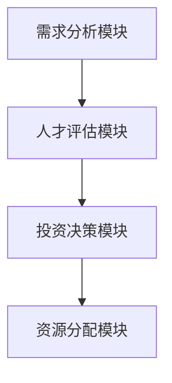
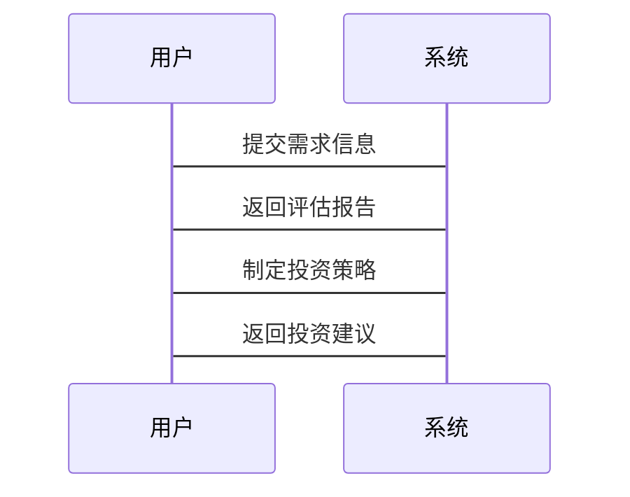

                 


# 芒格的"关键少数"原则在量子科技人才培养投资中的应用

---

## 关键词：
芒格，关键少数，量子科技，人才培养，投资，量子计算，量子信息

---

## 摘要：
本文探讨了芒格的“关键少数”原则在量子科技领域中的应用，特别是如何通过识别关键少数因素来优化人才投资。文章分析了量子科技的基本概念、发展趋势，以及“关键少数”原则在人才培养和投资决策中的具体应用。通过构建数学模型和算法，本文展示了如何利用“关键少数”原则在量子科技领域中实现资源优化配置，提升整体回报。

---

# 正文：

## 第1章: 芒格的"关键少数"原则

### 1.1 "关键少数"原则的定义与核心思想

#### 1.1.1 "关键少数"原则的定义
芒格的“关键少数”原则，也被称为“Lollapaloosa”效应，是指在决策过程中，少数关键因素能够对整体结果产生不成比例的影响。这种原则强调在复杂的系统中，识别和聚焦于关键少数因素，能够以最小的资源投入获得最大的回报。

#### 1.1.2 "关键少数"原则的核心思想
- **聚焦核心**：在决策中，关注少数关键因素，而非试图优化所有因素。
- **杠杆效应**：通过优化关键少数因素，放大整体效果。
- **边际效益递减**：资源的边际效益在达到一定程度后会迅速递减，因此聚焦于关键少数因素能够更有效地利用资源。

#### 1.1.3 "关键少数"原则在投资中的应用
在投资领域，芒格强调关注少数高潜力的领域和公司，通过深入研究和长期持有实现超额回报。这种方法避免了广泛撒网带来的资源浪费和决策复杂性。

---

### 1.2 量子科技的基本概念与发展趋势

#### 1.2.1 量子科技的定义与基本原理
量子科技是基于量子力学原理发展起来的新兴技术，主要包括量子计算、量子通信和量子传感等领域。量子计算的核心在于利用量子叠加和量子纠缠的特性，大幅提高计算速度和效率。

#### 1.2.2 量子科技的发展现状与未来趋势
量子科技目前处于快速发展阶段，各国纷纷加大投入，争夺技术制高点。预计未来几年，量子计算、量子通信等技术将逐步从实验室走向实际应用，成为推动社会进步的重要力量。

#### 1.2.3 量子科技在人才培养中的重要性
量子科技的快速发展需要大量高素质的专业人才。人才培养的质量和数量直接决定了一个国家在量子科技领域的竞争力。因此，如何高效地培养量子科技人才成为各国关注的焦点。

---

## 第2章: 芒格"关键少数"原则与量子科技的结合

### 2.1 "关键少数"原则在量子科技投资中的应用

#### 2.1.1 投资策略的核心要素
在量子科技领域，投资需要关注以下几个关键因素：
- **技术可行性**：技术是否成熟，是否具备商业化潜力。
- **团队实力**：创始团队的经验和能力。
- **市场需求**：技术是否满足实际需求。

#### 2.1.2 关键少数因素的识别
通过分析量子科技领域的关键少数因素，投资者可以优先投资于那些能够对整体结果产生最大影响的项目。

#### 2.1.3 投资策略的优化
- **聚焦高潜力领域**：优先投资量子计算和量子通信等高潜力领域。
- **长期持有**：避免频繁交易，长期持有优质项目。
- **风险管理**：通过分散投资降低风险。

---

### 2.2 量子科技人才培养中的"关键少数"原则

#### 2.2.1 人才培养的核心要素
- **学术背景**：扎实的物理、数学和计算机基础。
- **实践能力**：具备实际项目经验。
- **创新能力**：能够提出新的技术思路。

#### 2.2.2 识别关键少数人才
通过“关键少数”原则，可以识别出那些在学术能力、实践经验和创新能力方面表现突出的优秀人才。

#### 2.2.3 优化人才培养策略
- **资源聚焦**：将资源集中投向关键少数人才。
- **长期培养**：通过系统化的培养计划，提升人才的综合素质。
- **创新激励**：鼓励创新，提供资金和资源支持。

---

## 第3章: 量子科技投资中的关键因素分析

### 3.1 关键因素的识别与分析

#### 3.1.1 技术创新的核心作用
技术创新是量子科技发展的核心驱动力。通过聚焦于技术创新的关键少数因素，可以提升整体技术水平。

#### 3.1.2 人才团队的关键性
人才团队是量子科技发展的核心资源。通过优化人才团队的结构，可以提升整体技术水平和项目成功率。

#### 3.1.3 市场需求的评估与分析
市场需求是量子科技投资的重要依据。通过分析市场需求的关键少数因素，可以制定更加科学的投资策略。

---

## 第4章: 量子科技人才投资中的系统分析

### 4.1 系统架构设计

#### 4.1.1 系统功能设计
- **需求分析模块**：分析市场需求，识别关键少数因素。
- **人才评估模块**：评估人才团队的实力。
- **投资决策模块**：基于分析结果，制定投资策略。

#### 4.1.2 系统架构图


### 4.2 系统交互设计

#### 4.2.1 交互流程
- 用户输入需求信息。
- 系统分析需求，生成评估报告。
- 用户根据评估报告制定投资策略。

#### 4.2.2 交互序列图


---

## 第5章: 量子科技人才投资中的算法实现

### 5.1 算法原理

#### 5.1.1 算法选择
- **蒙特卡洛模拟**：用于评估投资风险。
- **主成分分析（PCA）**：用于识别关键少数因素。

#### 5.1.2 算法实现
```python
import numpy as np
from sklearn.decomposition import PCA

# 示例数据：量子科技领域的多个指标
data = np.array([[8, 6, 9],
                  [5, 7, 8],
                  [7, 5, 8]])

# 进行主成分分析
pca = PCA(n_components=2)
principal_components = pca.fit_transform(data)

print("主成分分析结果：", principal_components)
```

---

## 第6章: 量子科技人才投资中的最佳实践

### 6.1 投资策略优化

#### 6.1.1 关键因素的动态调整
根据市场变化和技术进步，动态调整关键少数因素。

#### 6.1.2 风险管理
通过分散投资和风险对冲，降低投资风险。

### 6.2 人才培养优化

#### 6.2.1 课程设置
- 量子力学基础课程
- 量子计算算法课程
- 实践项目课程

#### 6.2.2 实习与合作
- 与企业合作，提供实习机会
- 组织学术交流活动

---

## 第7章: 结论与展望

### 7.1 研究总结
本文通过分析芒格的“关键少数”原则，探讨了其在量子科技人才培养和投资中的应用。通过系统分析和算法实现，展示了如何利用“关键少数”原则优化资源配置，提升整体回报。

### 7.2 未来展望
随着量子科技的快速发展，未来的研究可以进一步深入，探索“关键少数”原则在更多领域的应用，为量子科技的发展提供更多的理论支持和实践指导。

---

## 注意事项：
- 量子科技领域的投资和人才培养具有高度不确定性和风险性，需谨慎决策。
- 本文的分析基于当前的技术和市场状况，未来可能会发生变化。

---

## 拓展阅读：
- 《穷查理宝典》——芒格投资理念的经典总结
- 《量子计算入门》——量子计算的基本原理和应用
- 《科技投资的逻辑》——科技领域投资的基本方法和策略

---

## 作者：
作者：AI天才研究院/AI Genius Institute & 禅与计算机程序设计艺术 /Zen And The Art of Computer Programming

---

**感谢您的阅读！如需进一步探讨，请随时联系！**

