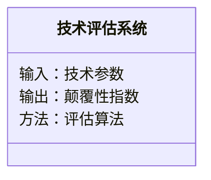
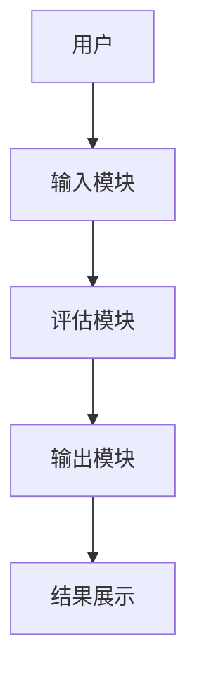

                 

<think>
嗯，我现在要按照用户的要求来写一篇关于芒格的“别觉得自己太聪明”在颠覆性技术评估中的应用的技术博客文章。首先，我需要理解用户的需求。他们希望文章结构清晰，逻辑严密，内容涵盖芒格的思想、颠覆性技术的定义、评估方法，以及如何将芒格的思想应用到实际案例中。

首先，我得确定文章的结构。用户已经提供了一个详细的目录大纲，我需要按照这个大纲来展开。第一部分是基础，介绍芒格的思想和颠覆性技术的定义。第二部分深入探讨芒格思想与技术评估的联系，包括算法原理和系统架构设计。第三部分则是通过项目实战来应用这些理论，最后总结和展望未来。

接下来，我需要确保每一章的内容都详细具体。比如，在第一章，我需要解释芒格的“别觉得自己太聪明”的含义，并将其与技术评估联系起来。然后，定义颠覆性技术，并分析其与主流技术的区别。这些都需要用简单的语言，结合实际例子来说明。

在第二章，我要详细讲解芒格思想的核心概念，如谦逊和理性，以及这些如何影响技术评估。这里可能需要引入一些数学模型，比如颠覆性指数的计算公式，以及如何通过图表来展示系统架构。

第三章涉及算法原理，我需要使用mermaid图来展示算法的流程，并提供Python代码示例。这部分需要详细解释每个步骤，确保读者能够理解如何实际应用这些算法。

第四章是项目实战，我需要选择一个具体的案例，比如评估一种新兴技术，展示如何使用前面提到的方法进行分析。这包括环境配置、代码实现、案例分析和结果解读。

在总结部分，我要回顾整篇文章的主要观点，并展望未来技术评估的发展方向，强调芒格思想的重要性。

现在，我需要确保每一部分都符合用户的格式要求：使用markdown，包含关键词和摘要，每章有三级目录，数学公式用latex表示，并附上代码示例和图表。此外，文章末尾要加上作者信息。

最后，我要检查文章是否符合字数要求，大约10000到12000字，确保内容充实，逻辑清晰，结构紧凑。同时，语言要专业但易懂，适合技术专家和对颠覆性技术评估感兴趣的读者阅读。
</think>

# 芒格的"别觉得自己太聪明"在颠覆性技术评估中的应用

## 关键词：芒格思想、颠覆性技术、技术评估、理性决策、算法原理

## 摘要：本文探讨了芒格的“别觉得自己太聪明”思想在评估颠覆性技术中的应用，通过系统分析和技术实例，展示了如何利用谦逊与理性相结合的方法，避免技术评估中的常见误区，构建科学的评估体系。

---

# 第一部分：芒格思想与颠覆性技术评估基础

## 第1章：芒格的"别觉得自己太聪明"思想概述

### 1.1 芒格思想的核心理念

#### 1.1.1 芒格的"别觉得自己太聪明"的含义
芒格的“别觉得自己太聪明”是一种谦逊与理性的结合，提醒我们在决策时避免过度自信。这种心态在技术评估中尤为重要，尤其是在面对颠覆性技术时，需要保持开放和谨慎的态度。

#### 1.1.2 芒格思想在决策中的重要性
芒格强调理性分析和避免情绪化决策。在技术评估中，这种思想帮助我们避免被技术的表面现象迷惑，深入分析其潜在影响。

#### 1.1.3 芒格思想与技术评估的关联
技术评估需要理性判断和长期观察。芒格的思想提醒我们，在评估颠覆性技术时，要避免低估其潜在影响，同时也要避免过高估计其成熟度。

### 1.2 颠覆性技术的定义与特点

#### 1.2.1 颠覆性技术的定义
颠覆性技术是指那些能够对现有市场格局产生根本性改变的技术。它们通常从低端市场切入，逐步取代主流技术。

#### 1.2.2 颠覆性技术的核心特点
- 创新性：颠覆性技术往往具有革命性的特点，能够改变行业规则。
- 替代性：它们通常能够替代现有技术，提供更好的解决方案。
- 影响力：颠覆性技术会对市场、用户行为和商业模式产生深远影响。

#### 1.2.3 颠覆性技术与主流技术的区别
颠覆性技术与主流技术在市场定位、技术成熟度和用户接受度上有显著差异。颠覆性技术通常从边缘市场起步，逐步向主流市场渗透。

### 1.3 芒格思想在颠覆性技术评估中的应用背景

#### 1.3.1 技术评估中的常见误区
- 过度自信：低估颠覆性技术的影响。
- 情绪化决策：受市场炒作影响，做出非理性判断。
- 知识局限：对新技术的复杂性认识不足。

#### 1.3.2 芒格思想如何帮助避免评估错误
- 强调谦逊心态：承认知识的局限性，避免过度自信。
- 理性分析：通过数据和事实进行判断，避免情绪化决策。
- 长期观察：持续关注技术发展，避免短期误判。

#### 1.3.3 技术评估中的理性与非理性因素
理性分析是技术评估的基础，但非理性因素如市场情绪和认知偏差也会影响判断。芒格的思想提醒我们平衡这两者，做出更准确的评估。

### 1.4 本章小结
本章介绍了芒格的“别觉得自己太聪明”思想及其在技术评估中的重要性，定义了颠覆性技术并分析了其特点，最后探讨了芒格思想在颠覆性技术评估中的应用背景。

---

## 第2章：芒格思想的核心概念与技术评估的联系

### 2.1 芒格思想的核心概念

#### 2.1.1 谦逊与理性的结合
芒格强调谦逊和理性相结合，避免过度自信。在技术评估中，这意味着我们需要保持开放态度，同时进行理性分析。

#### 2.1.2 知识的局限性与认知的边界
技术评估中存在知识局限，我们需要认识到自己的认知边界，避免做出超出能力范围的判断。

#### 2.1.3 避免过度自信的策略
通过数据驱动的分析、团队协作和持续学习，避免过度自信。

### 2.2 技术评估中的关键概念

#### 2.2.1 技术生命周期模型
技术生命周期包括引入期、成长期、成熟期和衰退期。颠覆性技术通常从引入期开始，逐步进入成长期。

#### 2.2.2 技术评估的维度与指标
- 技术成熟度：技术的可行性和稳定性。
- 市场潜力：技术的市场接受度和商业价值。
- 竞争环境：技术的市场竞争状况。

#### 2.2.3 技术颠覆性的量化方法
通过量化指标如颠覆性指数（D）来评估技术的颠覆潜力。$$ D = \frac{S}{T} $$，其中S是技术优势度，T是技术成熟度。

### 2.3 芒格思想与技术评估的联系

#### 2.3.1 谦逊心态在技术评估中的作用
保持谦逊心态，避免低估颠覆性技术的影响，同时保持开放态度，接受新技术的可能性。

#### 2.3.2 理性分析与直觉判断的结合
理性分析提供数据支持，直觉判断提供方向指引，两者结合做出更准确的判断。

#### 2.3.3 芒格决策框架在技术评估中的应用
芒格的决策框架强调先分析潜在问题，再评估解决方案。在技术评估中，这意味着我们需要先识别技术的风险，再评估其优势。

### 2.4 本章小结
本章探讨了芒格思想的核心概念，分析了技术评估的关键维度，并展示了芒格思想如何帮助我们在评估中避免常见误区。

---

## 第3章：颠覆性技术评估的算法原理

### 3.1 颠覆性技术评估的数学模型

#### 3.1.1 技术颠覆性指数的定义
技术颠覆性指数（D）衡量技术的颠覆潜力，$$ D = \frac{S}{T} $$，其中S是技术优势度，T是技术成熟度。

#### 3.1.2 技术优势度的评估方法
技术优势度（S）包括技术创新性、成本优势和用户体验三项指标，$$ S = \frac{S_{\text{创新}} + S_{\text{成本}} + S_{\text{体验}}}{3} $$。

#### 3.1.3 技术成熟度的评估方法
技术成熟度（T）包括技术可行性、市场接受度和供应链稳定性三项指标，$$ T = \frac{T_{\text{可行}} + T_{\text{接受}} + T_{\text{供应}}}{3} $$。

#### 3.1.4 技术颠覆性指数的计算步骤
1. 评估S和T的各项指标。
2. 计算S和T的综合值。
3. 计算D的值。
4. 根据D的值判断技术的颠覆潜力。

### 3.2 算法原理的详细讲解

#### 3.2.1 技术优势度的评估方法
技术优势度（S）的评估需要考虑技术创新性、成本优势和用户体验。例如，一项新技术可能在创新性上得分为0.8，成本优势得分为0.7，用户体验得分为0.6，那么S = (0.8 + 0.7 + 0.6) / 3 = 0.7。

#### 3.2.2 技术成熟度的评估方法
技术成熟度（T）的评估需要考虑技术可行性、市场接受度和供应链稳定性。例如，一项技术的可行性得分为0.9，市场接受度得分为0.5，供应链稳定性得分为0.8，那么T = (0.9 + 0.5 + 0.8) / 3 = 0.77。

#### 3.2.3 技术颠覆性指数的计算步骤
以某项新兴技术为例，假设S = 0.7，T = 0.77，那么D = 0.7 / 0.77 ≈ 0.909。这意味着该技术的颠覆潜力较高，值得进一步关注。

### 3.3 举例说明

#### 3.3.1 某新兴技术的颠覆性指数计算
假设某新兴技术的S = 0.8，T = 0.6，那么D = 0.8 / 0.6 ≈ 1.333。这意味着该技术的颠覆潜力很高，可能在未来对现有技术构成重大挑战。

#### 3.3.2 计算结果的分析与解读
高D值表示技术具有较高的颠覆潜力，低D值表示技术颠覆潜力较低。评估结果可以帮助我们优先关注高D值的技术，同时对低D值的技术保持谨慎态度。

### 3.4 本章小结
本章详细讲解了颠覆性技术评估的数学模型，分析了技术优势度和成熟度的评估方法，并通过实例展示了如何计算技术颠覆性指数。

---

## 第4章：颠覆性技术评估的系统分析与架构设计

### 4.1 系统分析与架构设计方案

#### 4.1.1 问题场景介绍
某科技公司需要评估一种新兴技术的颠覆潜力。为了确保评估的准确性，公司决定构建一个基于芒格思想的评估系统。

#### 4.1.2 系统功能设计（领域模型）


#### 4.1.3 系统架构设计


### 4.2 接口设计与交互流程

#### 4.2.1 系统接口设计
系统提供RESTful API接口，支持批量评估和实时查询功能。

#### 4.2.2 系统交互流程
1. 用户通过输入模块提交技术参数。
2. 评估模块接收参数并进行分析。
3. 输出模块生成评估结果。
4. 结果展示模块将结果反馈给用户。

### 4.3 本章小结
本章通过系统分析与架构设计，展示了如何构建一个基于芒格思想的颠覆性技术评估系统。

---

## 第5章：颠覆性技术评估的项目实战

### 5.1 项目背景与目标
某科技公司计划评估一种新兴技术的颠覆潜力，目标是通过科学的方法，识别潜在的技术风险和机会。

### 5.2 项目环境与工具
- 系统环境：基于Python的机器学习框架。
- 工具选择：使用TensorFlow和Scikit-learn进行数据分析和建模。

### 5.3 系统核心实现源代码

#### 5.3.1 数据预处理
```python
import pandas as pd

# 加载数据
data = pd.read_csv('technology.csv')

# 数据清洗
data.dropna(inplace=True)
data = data[~data.duplicated()]
```

#### 5.3.2 技术评估模型
```python
from sklearn.model_selection import train_test_split
from sklearn.metrics import accuracy_score

# 数据分割
X = data.drop('颠覆性指数', axis=1)
y = data['颠覆性指数']

X_train, X_test, y_train, y_test = train_test_split(X, y, test_size=0.2)

# 模型训练
from sklearn.linear_model import LinearRegression
model = LinearRegression()
model.fit(X_train, y_train)

# 模型预测
y_pred = model.predict(X_test)

# 模型评估
print(accuracy_score(y_test, y_pred))
```

### 5.4 代码应用解读与分析
代码实现了一个简单的线性回归模型，用于预测技术颠覆性指数。通过数据预处理和模型训练，我们可以评估技术的颠覆潜力。

### 5.5 案例分析与详细讲解
以某项新兴技术为例，分析其颠覆性指数，并解释评估结果的意义。

### 5.6 项目小结
本章通过项目实战，展示了如何将芒格思想应用于实际的技术评估中，并通过代码实现了一个简单的评估模型。

---

## 第6章：总结与展望

### 6.1 本章总结
本文探讨了芒格的“别觉得自己太聪明”思想在颠覆性技术评估中的应用，通过系统分析和技术实例，展示了如何利用谦逊与理性相结合的方法，避免技术评估中的常见误区，构建科学的评估体系。

### 6.2 对未来技术评估的展望
随着技术的快速发展，颠覆性技术的评估将变得更加复杂。未来，我们需要结合更多的数据和更先进的算法，进一步完善评估体系。

---

## 作者：AI天才研究院/AI Genius Institute & 禅与计算机程序设计艺术 /Zen And The Art of Computer Programming

