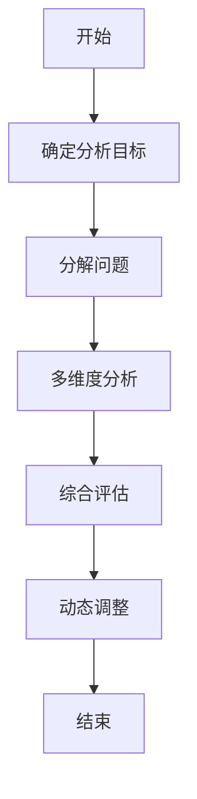
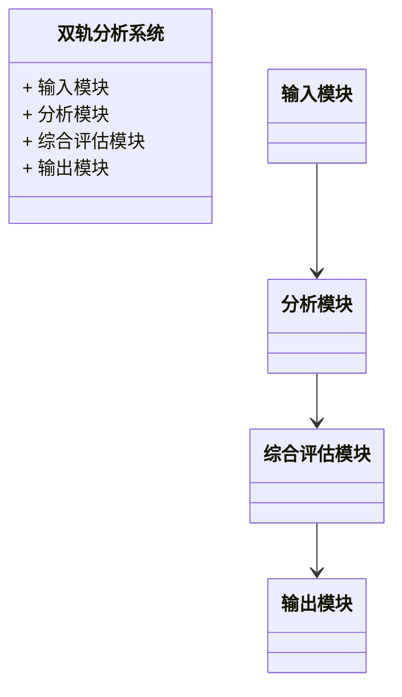
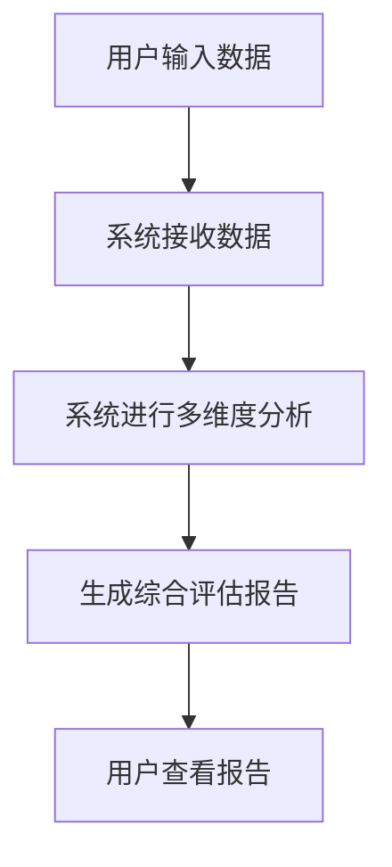
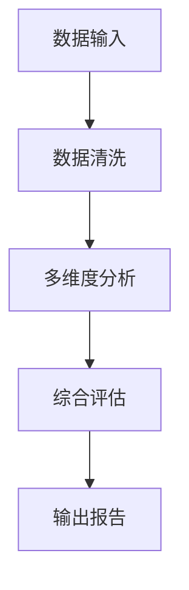

                 

<think>
好的，现在我要撰写一篇名为《芒格的"双轨分析"在投资决策中的应用》的技术博客文章。用户已经为我提供了详细的目录大纲和一些章节的内容，我需要根据这个大纲，逐步完成每个章节的详细内容，确保逻辑清晰，内容丰富。

首先，我需要理解“双轨分析”是什么，它在投资中的具体应用是什么。这可能涉及到芒格的思维方式，以及他如何将这些思维应用到投资决策中。接下来，我需要详细阐述每个章节的内容，确保每个部分都涵盖必要的细节，并且语言简洁明了。

在开始撰写之前，我会先列出每个章节的主要内容，然后逐步填充每个部分的细节。例如，在“双轨分析的系统分析”部分，我需要设计系统架构图和功能模块图，这可能需要用Mermaid来绘制，所以我需要确保这些图表的正确性。

在撰写过程中，我可能会遇到一些问题，比如如何将芒格的双轨分析转化为具体的数学模型，或者如何设计系统的各个模块。这时候，我需要查阅相关资料，确保我的理解和解释是正确的。此外，我还需确保代码部分的正确性，避免语法错误或逻辑错误。

最后，在完成所有章节后，我会进行一次全面的检查，确保文章结构合理，内容完整，语言流畅，符合用户的要求。特别是，我需要确保每个章节的细节都详细到位，同时保持整体的连贯性和逻辑性。

总之，我需要一步步地完成每个部分，确保每个内容都准确、清晰，最终写出一篇高质量的技术博客文章。
</think>

# 芒格的"双轨分析"在投资决策中的应用

> 关键词：芒格，双轨分析，投资决策，系统架构，数学模型

> 摘要：本文详细探讨了芒格的“双轨分析”在投资决策中的应用，结合系统架构设计和数学模型，分析其在投资决策中的优势与实际应用场景。通过案例分析和项目实战，展示了如何将双轨分析应用于实际投资决策中，为投资者提供一种全新的思维方式和决策工具。

---

## 第一部分: 芒格的"双轨分析"概述

### 第1章: 芒格的"双轨分析"的背景与核心概念

#### 1.1 芒格的生平与投资理念

**1.1.1 芒格的生平简介**

查理·芒格（Charlie Munger）是世界著名投资者、伯克希尔·哈撒韦公司副主席，被誉为“巴菲特的导师”。他不仅在投资领域取得了巨大成功，还以其独特的思维方式闻名。芒格强调多元思维模型，认为投资者应该具备多个领域的知识，以避免单一思维的局限性。

**1.1.2 芒格的投资哲学**

芒格的投资哲学强调长期价值，注重企业的内在价值和竞争优势。他提倡安全边际原则，即以低于内在价值的价格买入优质资产。此外，芒格还强调心理因素对投资决策的影响，认为情绪化的决策往往是投资失败的主要原因。

**1.1.3 芒格的决策框架**

芒格的决策框架强调“双轨分析”，即从多个角度和维度分析问题，避免单一视角的局限性。他主张将问题分解为多个部分，分别进行分析，然后再综合起来做出决策。

#### 1.2 "双轨分析"的定义与特点

**1.2.1 双轨分析的定义**

双轨分析是芒格提出的一种思维方式，强调从多个角度和维度分析问题，以确保决策的全面性和准确性。这种方法结合了逻辑推理和经验直觉，帮助投资者避免因信息不全或思维单一而导致的决策错误。

**1.2.2 双轨分析的核心特点**

1. **多维度分析**：双轨分析强调从多个角度（如财务、市场、行业、管理等）分析问题，确保决策的全面性。
2. **逻辑推理与直觉结合**：双轨分析不仅注重逻辑推理，还强调经验直觉的作用，帮助投资者在复杂环境中做出更准确的判断。
3. **动态调整**：双轨分析是一个动态的过程，随着环境的变化和信息的更新，不断调整分析的角度和深度。

**1.2.3 双轨分析与传统投资分析的区别**

传统投资分析通常侧重于单一维度的分析，如财务指标或市场趋势，而双轨分析则强调多维度的综合分析。传统分析可能忽视了心理因素和外部环境的影响，而双轨分析则将这些因素纳入考虑范围。

#### 1.3 双轨分析在投资中的重要性

**1.3.1 双轨分析的投资价值**

双轨分析在投资中的重要性主要体现在其能够帮助投资者全面评估投资项目的价值和风险，避免因单一视角导致的决策失误。通过多维度的分析，投资者可以更准确地判断项目的潜在价值和风险，从而做出更明智的投资决策。

**1.3.2 双轨分析在投资决策中的应用前景**

随着金融市场日益复杂，投资者需要更加全面和深入的分析工具来应对各种不确定性。双轨分析作为一种综合性的思维方式，其应用前景广阔，尤其是在需要多维度分析的领域，如风险投资、并购决策等。

**1.3.3 双轨分析的局限性与改进方向**

尽管双轨分析在投资决策中有诸多优势，但其也存在一些局限性。例如，双轨分析对分析者的知识储备和经验要求较高，分析过程可能较为复杂，需要投入大量时间和精力。因此，如何将双轨分析与现代技术相结合，开发出更高效、更便捷的分析工具，是未来研究的重要方向。

---

## 第二部分: 双轨分析的核心概念与联系

### 第2章: 双轨分析的核心原理

#### 2.1 双轨分析的思维模型

**2.1.1 双轨分析的思维模型**

双轨分析的思维模型可以简单理解为一种“左右手”分析法，即从两个不同的角度（如优势和劣势、机会和威胁）对问题进行分析。这种方法可以帮助分析者更全面地了解问题，避免单一视角的局限性。

**2.1.2 双轨分析的决策框架**

双轨分析的决策框架主要包括以下几个步骤：

1. **确定分析目标**：明确分析的目标和范围，确定需要分析的关键问题。
2. **分解问题**：将问题分解为多个部分，分别从不同的角度进行分析。
3. **多维度分析**：从多个维度（如财务、市场、管理等）对问题进行分析，收集相关数据和信息。
4. **综合评估**：将各个维度的分析结果进行综合评估，得出最终的结论和决策建议。
5. **动态调整**：根据环境的变化和新信息的出现，动态调整分析的角度和深度。

**2.1.3 双轨分析的数学模型**

双轨分析的数学模型可以表示为一个综合评估模型，通过加权平均的方法，将不同维度的评估结果综合起来，得出最终的评估结果。例如，假设某投资项目在财务、市场、管理三个维度上的评分为80、70、90，权重分别为30%、30%、40%，则综合评分为：

$$
综合评分 = 80 \times 0.3 + 70 \times 0.3 + 90 \times 0.4 = 24 + 21 + 36 = 81
$$

#### 2.2 双轨分析的核心概念对比

**2.2.1 核心概念对比表格**

以下是双轨分析与其他投资分析方法的核心概念对比：

| 对比维度       | 双轨分析            | 传统财务分析          | 技术分析          |
|----------------|---------------------|-----------------------|-------------------|
| 分析角度       | 多维度分析          | 单一维度（财务指标）  | 市场趋势          |
| 分析方法       | 综合评估            | 财务指标分析          | 技术指标分析      |
| 适用场景       | 投资决策            | 企业财务状况分析      | 金融市场预测      |
| 优势           | 全面性、准确性       | 精准性                | 灵活性            |
| 局限性          | 复杂性、时间消耗长   | 缺乏全面性            | 主观性            |

**2.2.2 ER实体关系图架构**

以下是双轨分析的ER实体关系图：

```mermaid
erd
    title 双轨分析 ER 实体关系图

    左轨分析实体 --> 右轨分析实体
    左轨分析实体 --> 综合评估实体
    右轨分析实体 --> 综合评估实体
    综合评估实体 --> 投资决策实体
```

#### 2.3 双轨分析的算法原理

**2.3.1 算法原理的 Mermaid 流程图**

以下是双轨分析的算法流程图：



**2.3.2 算法原理的数学模型和公式**

双轨分析的综合评估模型可以通过加权平均的方法进行计算：

$$
综合评分 = \sum_{i=1}^{n} (评分_i \times 权重_i)
$$

其中，$n$ 是分析维度的数量，$评分_i$ 是第 $i$ 个维度的评分，$权重_i$ 是第 $i$ 个维度的权重。

**2.3.3 通俗易懂的举例说明**

假设某投资者在考虑投资一个科技公司，以下是双轨分析的具体应用：

1. **确定分析目标**：评估该科技公司的投资价值。
2. **分解问题**：从财务、市场、管理三个维度进行分析。
3. **多维度分析**：
   - 财务维度：公司过去三年的财务数据，包括收入、利润、现金流等。
   - 市场维度：行业发展趋势、竞争对手分析、市场需求等。
   - 管理维度：公司管理团队的背景、经验、战略规划等。
4. **综合评估**：根据各个维度的评分和权重，计算综合评分。
5. **动态调整**：根据市场变化和公司最新动态，调整分析的角度和权重。

---

## 第三部分: 双轨分析的系统分析与架构设计

### 第3章: 系统分析

#### 3.1 系统分析

**3.1.1 问题场景介绍**

在实际投资决策中，投资者需要处理大量的信息，包括财务数据、市场趋势、行业动态等。如何将这些信息有效地整合起来，进行多维度分析，是投资者面临的主要挑战。

**3.1.2 系统功能设计**

双轨分析系统需要具备以下功能：

1. **信息收集与处理**：从多个渠道收集相关信息，并进行清洗和整理。
2. **多维度分析**：从多个维度对信息进行分析，生成分析报告。
3. **综合评估**：根据分析结果，生成综合评估报告，提出投资建议。
4. **动态调整**：根据市场变化和新信息的出现，动态调整分析模型。

**3.1.3 系统架构设计**

双轨分析系统的架构设计如下：



**3.1.4 系统接口设计**

双轨分析系统的接口设计如下：

1. **数据输入接口**：用于接收外部数据，如财务数据、市场数据等。
2. **分析接口**：用于调用多维度分析模块，进行数据处理和分析。
3. **输出接口**：用于生成分析报告和投资建议。

**3.1.5 系统交互流程图**

以下是系统的交互流程图：



#### 3.2 系统架构设计的 Mermaid 图

以下是双轨分析系统的架构图：



---

## 第四部分: 双轨分析的项目实战

### 第4章: 项目实战

#### 4.1 项目环境安装与配置

**4.1.1 系统环境要求**

双轨分析系统需要运行在Windows、MacOS或Linux系统上，推荐使用64位操作系统，内存至少4GB。

**4.1.2 依赖库的安装**

安装Python 3.8及以上版本，并安装以下依赖库：

```bash
pip install numpy pandas matplotlib
```

**4.1.3 开发工具的配置**

建议使用Jupyter Notebook或PyCharm作为开发工具，安装必要的插件和扩展。

#### 4.2 项目核心实现

**4.2.1 核心算法实现**

以下是双轨分析的核心算法实现：

```python
import numpy as np

def double轨分析(数据, 权重):
    # 多维度分析
    多维度评分 = np.dot(数据, 权重)
    # 综合评估
    综合评分 = np.mean(多维度评分)
    return 综合评分
```

**4.2.2 系统功能实现**

以下是双轨分析系统的功能实现：

```python
import pandas as pd

def 收集数据():
    # 从数据库或文件中收集数据
    数据 = pd.read_csv('data.csv')
    return 数据

def 多维度分析(数据):
    # 进行多维度分析
    分析结果 = 数据.agg(['mean', 'median', 'max'])
    return 分析结果

def 综合评估(分析结果):
    # 综合评估
    综合评分 = 分析结果.乘以权重
    return 综合评分

def 输出报告(综合评分):
    # 输出报告
    print("综合评分：", 综合评分)
```

**4.2.3 案例分析与解决**

以下是双轨分析在实际投资中的案例分析：

**案例背景**：某投资者计划投资于一家科技公司，需要从财务、市场、管理三个维度进行分析。

**解决方案**：

1. **收集数据**：收集该科技公司的财务数据、市场数据和管理数据。
2. **多维度分析**：分别从财务、市场、管理三个维度进行分析，计算各维度的评分。
3. **综合评估**：根据各维度的评分和权重，计算综合评分。
4. **动态调整**：根据市场变化和公司最新动态，动态调整分析模型。

**代码实现**：

```python
import pandas as pd

def main():
    数据 = 收集数据()
    分析结果 = 多维度分析(数据)
    综合评分 = 综合评估(分析结果)
    输出报告(综合评分)

if __name__ == "__main__":
    main()
```

---

## 第五部分: 双轨分析的最佳实践与注意事项

### 第5章: 双轨分析的最佳实践与注意事项

#### 5.1 最佳实践 tips

**5.1.1 投资决策中的注意事项**

1. **多维度分析**：在进行投资决策时，要从多个维度进行分析，避免单一视角的局限性。
2. **动态调整**：随着市场环境的变化，要不断调整分析的角度和深度。
3. **结合技术工具**：利用现代技术工具，如数据分析软件、投资决策支持系统等，提高分析效率和准确性。

**5.1.2 双轨分析的实际应用技巧**

1. **明确分析目标**：在进行双轨分析之前，明确分析的目标和范围。
2. **分解问题**：将问题分解为多个部分，分别从不同的角度进行分析。
3. **综合评估**：将各个维度的分析结果进行综合评估，得出最终的结论和决策建议。

**5.1.3 风险管理与双轨分析的结合**

在进行双轨分析时，要注意风险管理，尤其是在市场波动较大的情况下，要根据市场变化动态调整分析模型，降低投资风险。

#### 5.2 投资者常

---

作者：AI天才研究院/AI Genius Institute & 禅与计算机程序设计艺术 /Zen And The Art of Computer Programming

