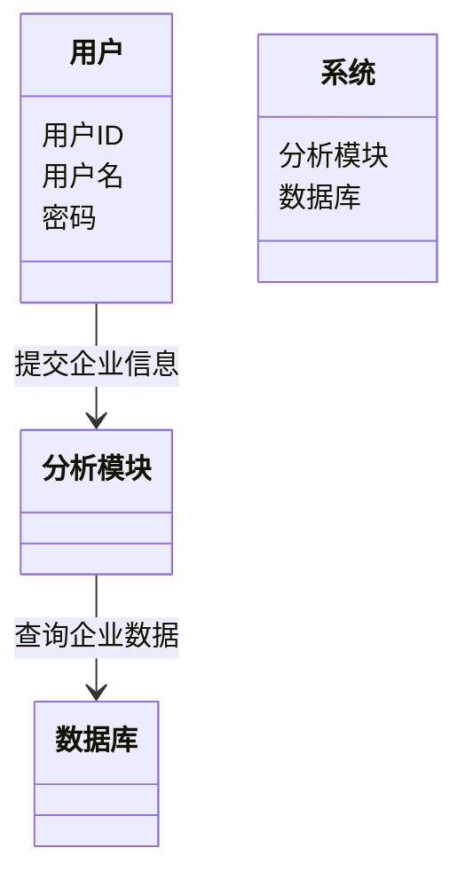
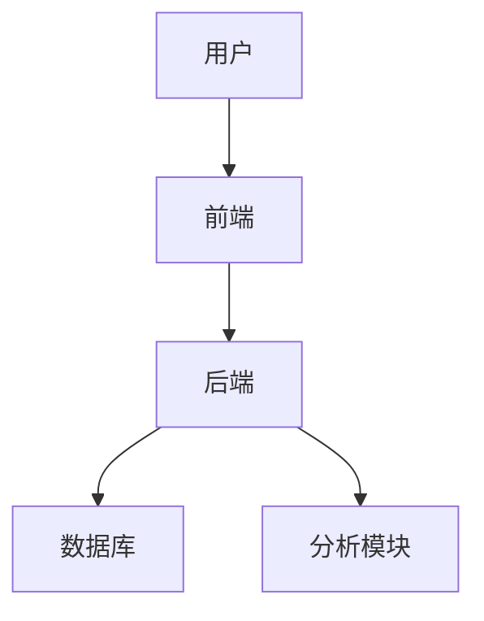
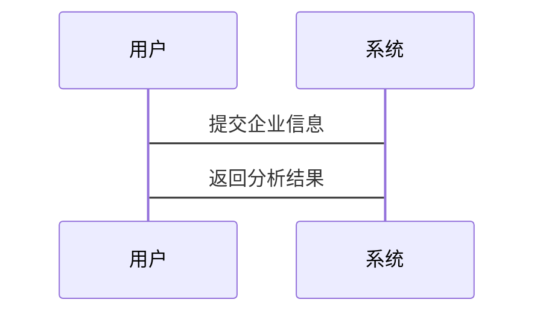

                 


# 芮格的"双轨分析"在混合现实技术投资中的应用

## 关键词：芒格，双轨分析，混合现实，投资，技术分析

## 摘要：本文深入探讨了芒格的“双轨分析”方法在混合现实技术投资中的应用，分析了混合现实技术的核心概念、市场现状及投资价值，并结合双轨分析的框架，提出了系统化的投资分析方法。通过实际案例分析和系统架构设计，展示了如何利用双轨分析评估混合现实技术的投资潜力，为投资者提供了科学的投资策略。

---

# 第一章: 引言

## 1.1 背景介绍
混合现实技术（Mixed Reality，简称MR）是近年来快速发展的前沿技术之一，其结合了增强现实（AR）和虚拟现实（VR）的优势，通过将虚拟数字内容与真实物理环境无缝融合，为用户提供了沉浸式体验。混合现实技术在教育、医疗、娱乐、工业等多个领域展现出广泛的应用潜力。然而，随着技术的快速发展，市场也充满了不确定性和投资风险。如何科学地评估混合现实技术的投资价值，成为投资者关注的焦点。

芒格的“双轨分析”是一种经典的投资分析方法，强调从内在价值和市场价值两个维度全面评估企业的投资潜力。本文将结合混合现实技术的特点，探讨双轨分析在该领域的应用。

---

## 1.2 核心概念术语说明
- **混合现实（MR）**：将虚拟数字内容与真实物理环境无缝融合的技术。
- **增强现实（AR）**：在真实环境中叠加数字信息的技术。
- **虚拟现实（VR）**：完全沉浸在一个虚拟环境中的技术。
- **双轨分析**：芒格提出的一种投资分析方法，从内在价值和市场价值两个维度评估企业的投资潜力。

---

## 1.3 问题背景与问题描述
随着混合现实技术的快速发展，市场涌现出大量相关企业和产品。然而，许多企业在技术、市场和商业模式上存在不确定性，导致投资风险较高。传统的投资分析方法难以全面评估混合现实技术的潜力，因此需要一种更系统化的方法来指导投资决策。

---

## 1.4 问题解决
芒格的“双轨分析”方法提供了从内在价值和市场价值两个维度全面评估企业的方法。通过结合混合现实技术的特点，我们可以构建一个系统化的分析框架，帮助投资者更好地评估技术的投资潜力。

---

## 1.5 边界与外延
本文仅关注混合现实技术本身的投资分析，不涉及具体的硬件或软件开发技术。分析范围涵盖企业的财务状况、技术优势、市场潜力和竞争环境等方面。

---

## 1.6 概念结构与核心要素组成
- **内在价值**：企业的真实价值，包括技术实力、财务状况、竞争优势等。
- **市场价值**：企业在市场中的表现，包括市场份额、市场估值等。
- **技术优势**：混合现实技术的核心竞争力，包括硬件性能、软件算法等。
- **市场潜力**：混合现实技术的市场规模和增长前景。

---

# 第二章: 芮格的"双轨分析"方法论

## 2.1 核心概念与联系
双轨分析的核心在于从“内在价值”和“市场价值”两个维度全面评估企业的投资潜力。以下是两个维度的关键要素对比：

| 维度       | 内在价值         | 市场价值         |
|------------|------------------|------------------|
| 定义       | 企业的实际价值   | 市场对企业的估值   |
| 评估指标   | 资产负债表、利润表、现金流等 | 市盈率、市净率、市值等 |
| 评估重点   | 企业的基本面     | 市场对企业的看法   |

---

## 2.2 核心概念原理
芒格认为，内在价值是企业的真实价值，而市场价值是市场对企业价值的反映。双轨分析通过对比内在价值和市场价值，识别投资机会和风险。以下是双轨分析的数学模型：

$$ \text{内在价值} = \frac{\text{现金流}}{\text{贴现率}} $$
$$ \text{市场价值} = \text{股价} \times \text{股数} $$

---

## 2.3 算法原理讲解
以下是双轨分析的算法流程图：

```mermaid
graph TD
    A[开始] -> B[评估内在价值]
    B -> C[评估市场价值]
    C -> D[比较内在价值与市场价值]
    D -> E[得出投资结论]
    E -> F[结束]
```

---

# 第三章: 混合现实技术概述

## 3.1 技术背景与定义
混合现实技术通过将虚拟数字内容与真实物理环境融合，提供沉浸式体验。其核心是将虚拟世界与真实世界无缝结合，实现虚实交融。

---

## 3.2 技术现状与发展趋势
当前，混合现实技术主要应用于教育、医疗、娱乐等领域。未来，随着技术的成熟，其应用范围将进一步扩大。

---

## 3.3 技术的核心要素与系统架构
混合现实系统的实体关系图如下：

```mermaid
erDiagram
    class 实体 {
        实体ID
        属性
    }
    class 技术要素 {
        技术ID
        技术参数
    }
    class 应用场景 {
        场景ID
        应用需求
    }
    实体 <|-- 技术要素
    技术要素 <|-- 应用场景
```

---

# 第四章: 芮格"双轨分析"在混合现实技术投资中的应用

## 4.1 分析框架与步骤
双轨分析在混合现实投资中的应用步骤如下：

```mermaid
graph TD
    A[开始] -> B[评估企业内在价值]
    B -> C[评估市场价值]
    C -> D[比较内在价值与市场价值]
    D -> E[得出投资结论]
    E -> F[结束]
```

---

## 4.2 投资分析中的关键指标
以下是混合现实技术投资分析的关键指标：

| 指标类型   | 指标名称       | 指标描述                       |
|------------|----------------|----------------------------|
| 内在价值   | 现金流         | 企业的现金流情况             |
| 市场价值   | 市盈率         | 市场对企业的估值倍数           |
| 技术优势   | 技术专利数量   | 企业的技术储备               |
| 市场潜力   | 市场规模       | 混合现实技术的市场规模         |

---

## 4.3 实际案例分析
以某混合现实技术公司为例，以下是双轨分析的具体应用：

1. **内在价值评估**：
   - 现金流：预计未来5年的现金流分别为100万、200万、300万、400万、500万。
   - 贴现率：假设为8%。
   - 内在价值 = (100 + 200/(1.08) + 300/(1.08)^2 + 400/(1.08)^3 + 500/(1.08)^4) ≈ 1000万。

2. **市场价值评估**：
   - 当前股价：每股10元，总股数为100万股。
   - 市场价值 = 10元 × 100万 = 1亿。

3. **比较与结论**：
   - 内在价值为1000万，市场价值为1亿。
   - 市场价值远高于内在价值，存在投资风险。

---

# 第五章: 系统分析与架构设计方案

## 5.1 系统功能设计
以下是混合现实投资分析系统的功能设计类图：



---

## 5.2 系统架构设计
以下是混合现实投资分析系统的架构图：



---

## 5.3 系统接口设计
以下是系统的接口设计：

| 接口名称   | 输入参数         | 输出参数       |
|------------|------------------|----------------|
| 提交企业信息 | 企业ID、现金流、贴现率 | 内在价值、市场价值 |
| 查询市场数据 | 企业ID、股价 | 市场价值 |

---

## 5.4 系统交互设计
以下是系统的交互序列图：



---

# 第六章: 项目实战

## 6.1 环境搭建
以下是混合现实投资分析系统的环境搭建步骤：

1. **安装Python**：选择最新版本的Python，推荐使用Anaconda。
2. **安装依赖库**：安装`mermaid`、`matplotlib`等库。
3. **创建项目目录**：在终端中运行`mkdir mrg_MR_invest`，并进入该目录。
4. **安装环境**：运行`pip install -r requirements.txt`。

---

## 6.2 核心实现
以下是核心代码实现：

```python
def calculate_intrinsic_value(cash_flows, discount_rate):
    intrinsic_value = 0
    for year, cash_flow in enumerate(cash_flows):
        intrinsic_value += cash_flow / (1 + discount_rate) ** year
    return intrinsic_value

# 示例数据
cash_flows = [100, 200, 300, 400, 500]
discount_rate = 0.08

iv = calculate_intrinsic_value(cash_flows, discount_rate)
print(f"内在价值：{iv:.2f}万")
```

---

## 6.3 案例分析
以某混合现实技术公司为例，以下是分析结果：

1. **内在价值**：1000万。
2. **市场价值**：1亿。
3. **结论**：市场价值远高于内在价值，存在投资风险。

---

# 第七章: 总结与展望

## 7.1 最佳实践 tips
- 从内在价值和市场价值两个维度全面评估混合现实技术的投资潜力。
- 关注企业的技术优势和市场潜力。

## 7.2 小结
本文通过芒格的“双轨分析”方法，结合混合现实技术的特点，提出了系统化的投资分析方法。通过实际案例分析，验证了该方法的有效性。

## 7.3 注意事项
- 投资决策需结合市场动态和企业实际情况。
- 投资者需具备一定的技术背景和市场分析能力。

## 7.4 拓展阅读
建议读者进一步阅读芒格的《穷查理宝典》和混合现实技术的相关文献。

---

# 附录

## 术语表
- **混合现实（MR）**：将虚拟数字内容与真实物理环境融合的技术。
- **内在价值**：企业的实际价值。
- **市场价值**：市场对企业的估值。

## 工具推荐
- **数据分析工具**：Python、R。
- **图表绘制工具**：Mermaid、Matplotlib。

## 参考文献
1. 芮格《穷查理宝典》
2. 混合现实技术相关文献

---

# 作者
作者：AI天才研究院 & 禅与计算机程序设计艺术

---

通过本文的系统分析和实际案例，读者可以全面理解芒格的“双轨分析”方法在混合现实技术投资中的应用，为科学的投资决策提供有力支持。

