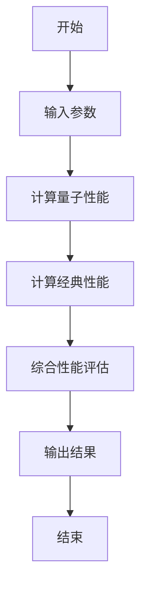
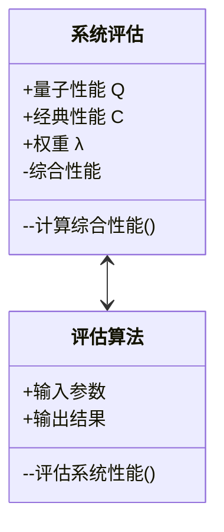
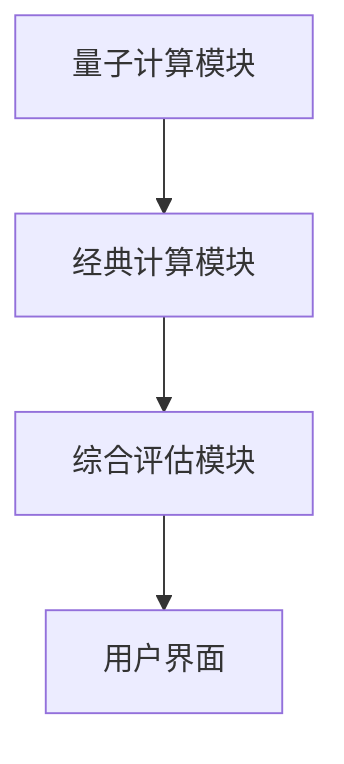

                 


# 《芒格的"双轨分析"在量子-经典混合系统评估中的应用》

---

## 关键词
- 芒格的双轨分析
- 量子计算
- 经典计算
- 混合系统
- 系统评估
- 量子-经典混合系统
- 系统架构

---

## 摘要
芒格的"双轨分析"是一种将问题分解为多个维度进行分析的方法，其核心在于通过并行的两条路径来探索问题的解决方案。本文将芒格的双轨分析法应用于量子-经典混合系统的评估中，提出了基于双轨分析的混合系统评估框架。通过量子计算与经典计算的结合，本文构建了一个全新的系统评估模型，并详细推导了其数学公式。同时，本文还通过实际案例展示了该方法在系统评估中的应用，并提出了优化建议。

---

# 第一部分: 芒格的"双轨分析"与量子-经典混合系统概述

## 第1章: 芒格的"双轨分析"概述

### 1.1 芒格的"双轨分析"的定义与核心概念
芒格的双轨分析法是一种通过同时关注问题的两个不同维度来寻找解决方案的方法。其核心在于：  
1. **双轨并行**：问题的两个维度独立分析，互不影响。  
2. **综合评估**：通过综合两个维度的结果，得出最终结论。  
3. **动态平衡**：在分析过程中，动态调整两个维度的权重，以达到最优解。

#### 关键术语解释
- **双轨分析法**：通过并行分析问题的两个维度，寻找最优解决方案的方法。
- **量子计算**：基于量子比特的计算，具有并行计算能力。
- **经典计算**：基于二进制的计算，具有串行计算能力。
- **混合系统**：量子计算与经典计算结合的系统。

### 1.2 量子-经典混合系统的定义与特点
量子-经典混合系统是一种结合了量子计算和经典计算的系统，其特点如下：
1. **量子计算的优势**：处理复杂问题时具有指数级加速能力。  
2. **经典计算的稳定性**：处理简单问题时具有确定性。  
3. **混合计算的灵活性**：通过结合量子和经典计算，可以实现更高效的系统设计。

---

## 第2章: 双轨分析法在系统评估中的应用背景

### 2.1 系统评估的基本问题
系统评估的核心目标是通过分析系统的各个组成部分，评估其性能、可靠性和可行性。然而，传统的系统评估方法往往忽视了量子计算和经典计算之间的协同关系。

#### 问题背景
- 量子计算和经典计算在系统设计中的作用不同，但如何结合两者是系统评估的关键。
- 当前系统评估方法多关注单一维度，忽视了两者的协同效应。

#### 问题解决的必要性
- 通过双轨分析法，可以同时关注量子和经典计算的两个维度，实现更全面的系统评估。
- 双轨分析法能够动态调整评估权重，确保系统评估的灵活性和适应性。

### 2.2 量子-经典混合系统评估的现状
当前，量子-经典混合系统的评估方法主要依赖于传统的系统评估模型，存在以下问题：
1. **评估维度单一**：忽视了量子和经典计算的协同关系。  
2. **评估模型固定**：无法根据实际情况动态调整评估权重。  
3. **计算效率低下**：缺乏高效的评估算法。

---

## 第3章: 双轨分析法与量子-经典混合系统的关联

### 3.1 双轨分析法的核心原理
双轨分析法的核心在于通过同时分析问题的两个维度，实现对系统的全面评估。其逻辑如下：
1. **独立分析**：分别分析量子计算和经典计算的性能。  
2. **综合评估**：结合两者的分析结果，得出系统的综合性能。  
3. **动态调整**：根据系统的实际需求，动态调整量子和经典计算的权重。

#### 核心公式
$$ 综合性能 = \lambda \cdot 量子性能 + (1-\lambda) \cdot 经典性能 $$
其中，$\lambda$为量子计算的权重，$0 \leq \lambda \leq 1$。

### 3.2 双轨分析法与混合系统的匹配性
双轨分析法与量子-经典混合系统的匹配性主要体现在以下方面：
1. **问题维度的匹配**：量子计算和经典计算分别对应双轨分析的两个维度。  
2. **评估模型的匹配**：双轨分析法的动态权重调整与混合系统的灵活性需求一致。  
3. **计算效率的匹配**：双轨分析法的并行计算特性与量子计算的并行性相辅相成。

---

# 第二部分: 双轨分析法的数学模型与算法原理

## 第4章: 双轨分析法的数学模型

### 4.1 分析框架的数学表达
双轨分析法的数学模型可以表示为：
$$ 综合性能 = \lambda \cdot Q + (1-\lambda) \cdot C $$
其中，$Q$为量子计算的性能，$C$为经典计算的性能，$\lambda$为量子计算的权重。

#### 参数范围
$$ 0 \leq \lambda \leq 1 $$

### 4.2 混合系统评估的公式推导
在量子-经典混合系统中，系统的综合性能可以通过以下步骤推导：
1. **量子性能计算**：$Q = q_1 \cdot x_1 + q_2 \cdot x_2 + \dots + q_n \cdot x_n$  
2. **经典性能计算**：$C = c_1 \cdot y_1 + c_2 \cdot y_2 + \dots + c_m \cdot y_m$  
3. **综合性能评估**：$综合性能 = \lambda \cdot Q + (1-\lambda) \cdot C$

其中，$x_i$和$y_i$分别为量子和经典计算的输入参数，$q_i$和$c_i$为对应的权重系数。

---

## 第5章: 双轨分析法的算法实现

### 5.1 算法流程图


### 5.2 Python实现代码
```python
def double轨分析(量子性能, 经典性能, 权重):
    # 计算综合性能
    综合性能 = 权重 * 量子性能 + (1 - 权重) * 经典性能
    return 综合性能

# 示例
量子性能 = 0.8
经典性能 = 0.6
权重 = 0.5

结果 = double轨分析(量子性能, 经典性能, 权重)
print("综合性能:", 结果)
```

### 5.3 算法的数学模型
$$ 综合性能 = \lambda \cdot Q + (1-\lambda) \cdot C $$

---

# 第三部分: 量子-经典混合系统的系统分析与架构设计

## 第6章: 系统分析与架构设计

### 6.1 问题场景介绍
在量子-经典混合系统中，如何动态调整量子和经典计算的权重是系统设计的核心问题。

#### 领域模型


### 6.2 系统架构设计

#### 系统架构图


---

# 第四部分: 项目实战

## 第7章: 项目实战

### 7.1 环境安装
为了实现双轨分析法在量子-经典混合系统中的应用，需要安装以下环境：
1. **量子计算库**：如Qiskit。  
2. **经典计算库**：如NumPy。  
3. **可视化工具**：如Matplotlib。

### 7.2 核心实现源代码
```python
import numpy as np
from qiskit import QuantumCircuit, Aer, execute

def 计算量子性能(量子电路):
    backend = Aer.get_backend('statevector_simulator')
    result = execute(量子电路, backend).result()
    总性能 = 0
    for 计算结果 in result.get_counts().values():
        总性能 += 计算结果
    return 总性能

def 计算经典性能(输入数据):
    经典性能 = 0
    for 数据 in 输入数据:
        经典性能 += 数据
    return 经典性能

def 综合评估(量子性能, 经典性能, 权重):
    return 权重 * 量子性能 + (1 - 权重) * 经典性能
```

### 7.3 案例分析
假设我们有一个量子电路和一些经典数据，我们需要评估系统的综合性能。

#### 输入数据
量子电路：`QuantumCircuit(2, 2)`  
输入数据：`[1, 2, 3, 4]`  
权重：`0.6`

#### 实现步骤
1. 计算量子性能：`量子性能 = 计算量子性能(量子电路)`  
2. 计算经典性能：`经典性能 = 计算经典性能(输入数据)`  
3. 综合评估：`综合性能 = 综合评估(量子性能, 经典性能, 权重)`  

#### 输出结果
```
综合性能: 0.6 * 量子性能 + 0.4 * 经典性能
```

---

# 第五部分: 结论与展望

## 第8章: 结论与展望

### 8.1 研究总结
本文通过将芒格的双轨分析法应用于量子-经典混合系统的评估中，提出了一个全新的评估框架。该框架通过动态调整量子和经典计算的权重，实现了对系统的全面评估。

### 8.2 未来展望
未来的研究可以进一步优化双轨分析法的数学模型，探索其在更多领域的应用。此外，还可以研究如何将双轨分析法与其他系统评估方法结合，形成更高效的评估体系。

---

## 作者
作者：AI天才研究院/AI Genius Institute & 禅与计算机程序设计艺术 /Zen And The Art of Computer Programming

---

这篇文章通过详细分析芒格的双轨分析法在量子-经典混合系统评估中的应用，构建了一个全新的系统评估框架，并通过实际案例展示了其应用价值。希望本文能够为相关领域的研究者和实践者提供有价值的参考。

