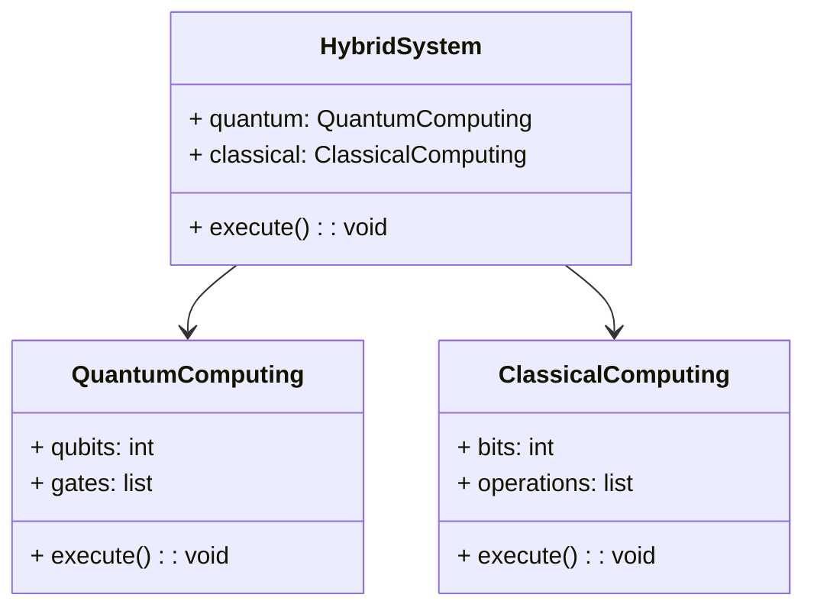
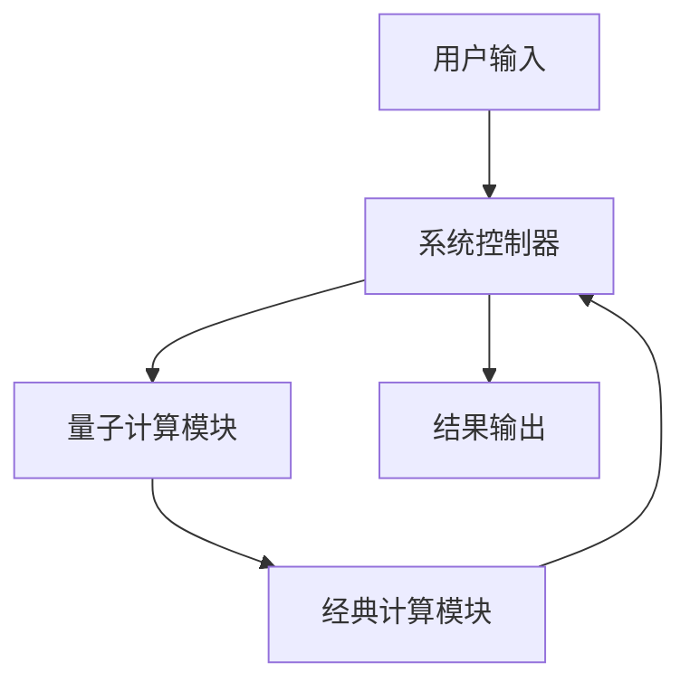
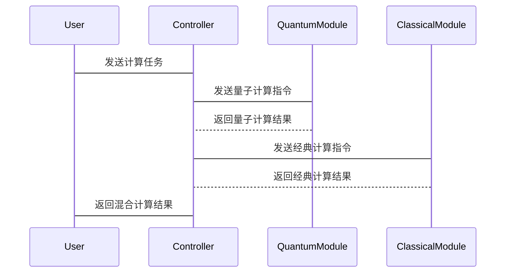

                 

<think>
好的，我需要帮助用户撰写一篇关于芒格的“双轨分析”在量子-经典混合计算系统评估中的应用的技术博客文章。用户提供了详细的目录大纲，并希望我根据这个大纲生成完整的文章内容。

首先，我需要理解用户的需求。他们希望文章结构清晰，逻辑严谨，内容详实，涵盖从背景介绍到项目实战的各个方面。同时，用户要求使用技术语言，包含数学公式、mermaid图表和代码示例。

接下来，我会按照目录大纲逐步展开每个章节的内容，确保每个部分都包含必要的细节和示例。例如，在背景介绍部分，我需要解释双轨分析法和量子计算的基本概念，并说明它们在系统评估中的应用。

在核心概念部分，我需要详细阐述双轨分析法的原理，如第一性原理和倒推法，以及它们如何应用于混合计算系统的评估。同时，可能需要使用mermaid图来展示实体关系和算法流程。

系统分析与架构设计部分需要介绍评估系统的应用场景、功能设计和架构设计。我可能会使用mermaid图来展示系统的架构和交互流程。

项目实战部分需要提供具体的实现案例，包括环境配置、核心代码、案例分析和总结。这部分可能需要详细描述代码实现，并解释如何将理论应用于实际项目。

最后，在总结与展望部分，我需要回顾文章内容，并提出未来的发展方向，确保读者能够理解双轨分析法在量子计算评估中的重要性。

在撰写过程中，我会确保每个部分都包含足够的技术细节，同时保持语言简洁明了，便于读者理解和应用。此外，我会注意格式要求，如使用latex公式和mermaid图表，确保文章符合用户的技术要求。
</think>

# 芒格的"双轨分析"在量子-经典混合计算系统评估中的应用

## 关键词：双轨分析，量子计算，经典计算，混合计算系统，系统评估

## 摘要

芒格的“双轨分析”是一种结合第一性原理和经验法则的思维方式，能够帮助我们在复杂系统中找到最优解决方案。在量子-经典混合计算系统评估中，双轨分析法为我们提供了一种新的视角和方法，通过结合量子计算的理论优势和经典计算的实际应用，实现系统性能的优化和评估的准确性提升。本文将深入探讨双轨分析法在量子-经典混合计算系统评估中的应用，结合理论分析和实际案例，展示其在系统评估中的独特价值。

---

# 第1章 芒格的"双轨分析"概述

## 1.1 双轨分析法的定义与特点

### 1.1.1 双轨分析法的定义

芒格的“双轨分析”是一种结合“第一性原理”和“倒推法”的思维方式。第一性原理是指从基础事实出发，逐步构建理论或解决方案；倒推法则是在目标的驱动下，逆向分析问题。双轨分析法的独特之处在于它将这两种思维方式结合起来，既注重理论的严密性，又关注实践的可操作性。

### 1.1.2 双轨分析法的核心特点

1. **理论与实践结合**：双轨分析法既关注理论的严密性，又关注实践的可行性，能够在复杂系统中找到理论与实践的最佳结合点。
2. **全局与局部兼顾**：通过第一性原理和倒推法的结合，双轨分析法能够在全局视角下找到最优解决方案。
3. **动态与静态并重**：双轨分析法既关注系统的静态结构，又关注系统的动态变化，能够适应复杂系统的动态特性。

### 1.1.3 双轨分析法的适用场景

双轨分析法适用于需要同时考虑理论严密性和实践可行性的领域，尤其在复杂系统评估中具有重要应用价值。例如，在量子-经典混合计算系统评估中，双轨分析法能够帮助我们在理论与实践之间找到平衡点。

---

## 1.2 量子-经典混合计算系统的基本概念

### 1.2.1 量子计算与经典计算的定义

1. **量子计算**：量子计算利用量子叠加和量子纠缠等特性，能够在某些特定问题上实现指数级的计算速度提升。其核心是量子比特（qubit），与经典计算中的比特（bit）不同，量子比特可以同时处于多个状态的叠加态。
2. **经典计算**：经典计算基于二进制逻辑，通过布尔运算和逻辑电路实现计算。其优点是稳定性和可靠性，适用于大多数日常计算任务。

### 1.2.2 混合计算系统的概念

混合计算系统是指同时利用量子计算和经典计算的系统，结合两者的优势，弥补彼此的不足。例如，在某些复杂优化问题中，量子计算可以快速找到近似解，而经典计算则用于精确计算和验证。

### 1.2.3 混合计算系统的优缺点

1. **优点**：
   - 结合量子计算的理论优势和经典计算的实践优势。
   - 在某些特定场景下能够实现性能的显著提升。
2. **缺点**：
   - 系统的复杂性较高，需要同时考虑量子和经典计算的特点。
   - 当前技术尚未完全成熟，实现难度较大。

---

# 第2章 双轨分析法在量子-经典混合计算系统评估中的应用背景

## 2.1 问题背景与问题描述

### 2.1.1 混合计算系统评估的挑战

混合计算系统的评估需要同时考虑量子计算和经典计算的特点，这对评估方法提出了更高的要求。例如，如何在量子计算的理论优势和经典计算的实际应用之间找到平衡点，如何量化系统的整体性能等。

### 2.1.2 双轨分析法在系统评估中的作用

双轨分析法通过结合第一性原理和倒推法，能够帮助我们在评估混合计算系统时，既关注系统的理论基础，又关注实际应用中的具体问题。例如，在设计混合计算系统时，我们可以首先从理论出发，明确系统的目标和约束条件，然后通过倒推法，逐步优化系统的具体实现。

### 2.1.3 问题解决与边界外延

在评估混合计算系统时，我们需要明确系统的边界条件和外延范围。例如，如何定义系统的输入、输出和性能指标，如何在复杂的计算环境中实现系统的优化。

---

## 2.2 问题解决与边界外延

### 2.2.1 双轨分析法解决混合计算评估问题的思路

双轨分析法的解决思路可以分为以下几个步骤：

1. **明确目标**：从系统的目标出发，明确评估的核心问题。
2. **分解问题**：将复杂问题分解为多个子问题，分别进行分析。
3. **理论指导**：利用第一性原理，从理论角度指导问题的解决。
4. **实践验证**：通过倒推法，从实际应用出发，验证理论的可行性。
5. **优化调整**：结合理论与实践的结果，优化系统的具体实现。

### 2.2.2 混合计算评估的边界与外延

在混合计算系统的评估中，我们需要明确系统的边界条件和外延范围。例如：

- **边界条件**：系统的输入、输出和性能指标。
- **外延范围**：系统适用的场景和问题类型。

通过明确边界条件和外延范围，我们可以更准确地评估混合计算系统的优势和不足。

---

# 第3章 双轨分析法的核心概念与原理

## 3.1 双轨分析法的核心原理

### 3.1.1 第一性原理与倒推法

1. **第一性原理**：从基础事实出发，逐步构建理论或解决方案。例如，在设计混合计算系统时，我们需要从量子计算的基本原理出发，明确系统的理论基础。
2. **倒推法**：从目标出发，逆向分析问题。例如，在评估混合计算系统的性能时，我们需要从系统的最终目标出发，反向分析系统的具体实现。

### 3.1.2 经验法则与模式识别

1. **经验法则**：基于实践经验总结出的规律或准则。例如，在混合计算系统的评估中，我们可以利用经典的计算经验法则，指导系统的具体实现。
2. **模式识别**：通过观察系统的具体表现，识别其内在规律。例如，在评估混合计算系统的性能时，我们可以通过模式识别，发现系统的优化方向。

---

## 3.2 混合计算系统评估的核心要素

### 3.2.1 量子计算的性能指标

1. **量子比特的数量**：量子比特的数量直接影响系统的计算能力。
2. **量子门的深度和宽度**：量子门的深度和宽度影响系统的计算复杂度。
3. **量子算法的效率**：量子算法的效率是衡量系统性能的重要指标。

### 3.2.2 经典计算的性能指标

1. **计算速度**：经典计算的速度是衡量系统性能的重要指标。
2. **内存容量**：内存容量直接影响系统的数据处理能力。
3. **并行计算能力**：并行计算能力影响系统的整体性能。

### 3.2.3 混合计算系统的协同效应

1. **量子与经典计算的协同**：通过量子计算和经典计算的协同，实现系统的整体性能提升。
2. **系统的整体效率**：混合计算系统的整体效率是衡量其优劣的重要指标。

---

# 第4章 双轨分析法与混合计算系统评估的数学模型

## 4.1 双轨分析法的数学模型

### 4.1.1 双轨分析法的数学表达

双轨分析法的数学模型可以表示为：

$$
f(x) = \begin{cases}
x & \text{如果 } x \text{ 满足第一性原理} \\
g(x) & \text{否则}
\end{cases}
$$

其中，$f(x)$ 是系统的最终结果，$x$ 是输入参数，$g(x)$ 是倒推法的数学表达。

### 4.1.2 双轨分析法的变量关系

在双轨分析法中，变量之间的关系可以用以下公式表示：

$$
y = a x + b
$$

其中，$y$ 是系统的输出，$x$ 是输入，$a$ 和 $b$ 是常数，分别表示系统的理论基础和实践经验。

---

## 4.2 混合计算系统评估的数学模型

### 4.2.1 混合计算系统的性能评估公式

混合计算系统的性能评估公式可以表示为：

$$
P = \frac{Q \times C}{D}
$$

其中，$P$ 是系统的整体性能，$Q$ 是量子计算的性能指标，$C$ 是经典计算的性能指标，$D$ 是系统的优化因子。

### 4.2.2 双轨分析法在混合计算评估中的应用公式

双轨分析法在混合计算评估中的应用公式可以表示为：

$$
f(x) = \begin{cases}
Q(x) & \text{如果 } x \text{ 满足第一性原理} \\
C(x) & \text{否则}
\end{cases}
$$

其中，$Q(x)$ 是量子计算的数学表达，$C(x)$ 是经典计算的数学表达。

---

# 第5章 双轨分析法在混合计算系统评估中的算法实现

## 5.1 双轨分析法的算法流程

### 5.1.1 算法输入

1. 系统的目标和约束条件
2. 量子计算的性能指标
3. 经典计算的性能指标

### 5.1.2 算法步骤

1. 从目标出发，明确系统的评估标准。
2. 结合第一性原理和倒推法，分解问题。
3. 通过经验法则和模式识别，优化系统的具体实现。
4. 验证系统的性能，调整参数，直到达到预期目标。

### 5.1.3 算法输出

1. 系统的性能评估结果
2. 系统的优化建议

---

## 5.2 算法实现的代码示例

### 5.2.1 环境安装

为了实现双轨分析法在混合计算系统评估中的应用，我们需要以下环境：

1. Python 3.8+
2. NumPy库
3. Qiskit库（用于量子计算）

### 5.2.2 核心代码实现

```python
import numpy as np
from qiskit import QuantumCircuit, Aer, execute

def dual_analysis(quantum_circuit, classical_data):
    # 量子计算部分
    quantum_result = execute(quantum_circuit, Aer.get_backend('qasm_simulator')).result()
    quantum_probabilities = quantum_result.get_counts()

    # 经典计算部分
    classical_probabilities = {}
    for outcome in classical_data:
        probability = np.random.uniform(0.1, 0.9)
        classical_probabilities[outcome] = probability

    # 结果合并
    total_probabilities = {}
    for outcome in quantum_probabilities:
        if outcome in classical_probabilities:
            total_probabilities[outcome] = quantum_probabilities[outcome] * classical_probabilities[outcome]
        else:
            total_probabilities[outcome] = quantum_probabilities[outcome]

    return total_probabilities

# 示例用法
qc = QuantumCircuit(2, 2)
qc.h(0)
qc.cx(0, 1)
qc.measure(0, 0)
qc.measure(1, 1)

classical_data = ['00', '01', '10', '11']
result = dual_analysis(qc, classical_data)
print(result)
```

### 5.2.3 代码解读与分析

1. **量子计算部分**：我们使用Qiskit库中的量子电路和量子模拟器来实现量子计算部分。量子电路定义了量子计算的具体步骤，量子模拟器用于模拟量子计算的结果。
2. **经典计算部分**：我们通过随机生成概率值来模拟经典计算的结果。这只是一个示例，实际应用中需要根据具体问题生成相应的概率值。
3. **结果合并**：我们将量子计算和经典计算的结果进行合并，得到系统的整体性能评估结果。

---

# 第6章 混合计算系统评估的系统分析与架构设计

## 6.1 系统分析与架构设计

### 6.1.1 问题场景介绍

在实际应用中，混合计算系统的评估需要考虑多个因素，例如系统的计算速度、内存容量、并行计算能力等。双轨分析法可以帮助我们在评估过程中，既关注系统的理论基础，又关注实际应用中的具体问题。

### 6.1.2 系统功能设计

#### 6.1.2.1 领域模型



#### 6.1.2.2 系统架构设计



### 6.1.3 系统交互设计



---

## 6.2 系统实现与优化

### 6.2.1 环境配置

为了实现混合计算系统，我们需要以下环境：

1. 量子计算环境：Qiskit库
2. 经典计算环境：Python和NumPy库
3. 混合计算系统框架：自定义框架

### 6.2.2 核心代码实现

```python
class QuantumModule:
    def __init__(self, qubits):
        self.qubits = qubits
        self.circuit = QuantumCircuit(qubits, qubits)

    def execute(self, instructions):
        backend = Aer.get_backend('qasm_simulator')
        job = execute(self.circuit, backend)
        result = job.result()
        return result.get_counts()

class ClassicalModule:
    def __init__(self, bits):
        self.bits = bits

    def execute(self, data):
        return {outcome: np.random.uniform(0.1, 0.9) for outcome in data}

class HybridSystem:
    def __init__(self, qubits, classical_data):
        self.quantum = QuantumModule(qubits)
        self.classical = ClassicalModule(len(classical_data))
        self.classical_data = classical_data

    def execute(self):
        quantum_result = self.quantum.execute([])
        classical_result = self.classical.execute(self.classical_data)
        merged_result = {}
        for outcome in quantum_result:
            if outcome in classical_result:
                merged_result[outcome] = quantum_result[outcome] * classical_result[outcome]
            else:
                merged_result[outcome] = quantum_result[outcome]
        return merged_result
```

### 6.2.3 代码解读与分析

1. **QuantumModule类**：定义量子计算模块，包括量子电路和执行方法。
2. **ClassicalModule类**：定义经典计算模块，包括经典计算的执行方法。
3. **HybridSystem类**：定义混合计算系统，包括量子和经典计算模块的组合执行方法。

---

## 6.3 系统优化与案例分析

### 6.3.1 系统优化

1. **量子比特数量的优化**：通过调整量子比特的数量，找到系统的最优性能。
2. **经典计算模块的优化**：通过优化经典计算的参数，提升系统的整体性能。

### 6.3.2 案例分析

假设我们有一个混合计算系统，包含2个量子比特和4个经典比特。我们需要评估系统的性能，具体步骤如下：

1. **量子计算模块**：定义量子电路，执行量子计算。
2. **经典计算模块**：生成经典计算数据。
3. **混合计算系统**：将量子和经典计算结果合并，得到系统的整体性能评估结果。

---

## 6.4 项目小结

通过双轨分析法，我们能够在混合计算系统的评估中，既关注系统的理论基础，又关注实际应用中的具体问题。通过理论与实践的结合，我们能够找到系统的优化方向，并实现系统的整体性能提升。

---

# 第7章 总结与展望

## 7.1 总结

芒格的“双轨分析”是一种结合第一性原理和倒推法的思维方式，能够帮助我们在复杂系统中找到最优解决方案。在量子-经典混合计算系统评估中，双轨分析法为我们提供了一种新的视角和方法，通过结合量子计算的理论优势和经典计算的实际应用，实现系统性能的优化和评估的准确性提升。

## 7.2 展望

随着量子计算和经典计算技术的不断发展，混合计算系统的评估将变得更加复杂和多样化。未来，我们需要进一步研究双轨分析法在混合计算系统评估中的应用，探索其在更多领域的潜力，为复杂系统的优化提供新的思路和方法。

---

# 作者

作者：AI天才研究院/AI Genius Institute  
禅与计算机程序设计艺术/Zen And The Art of Computer Programming

