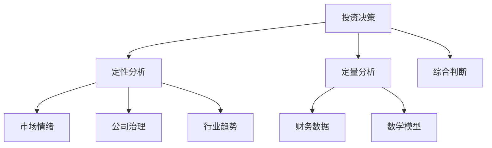
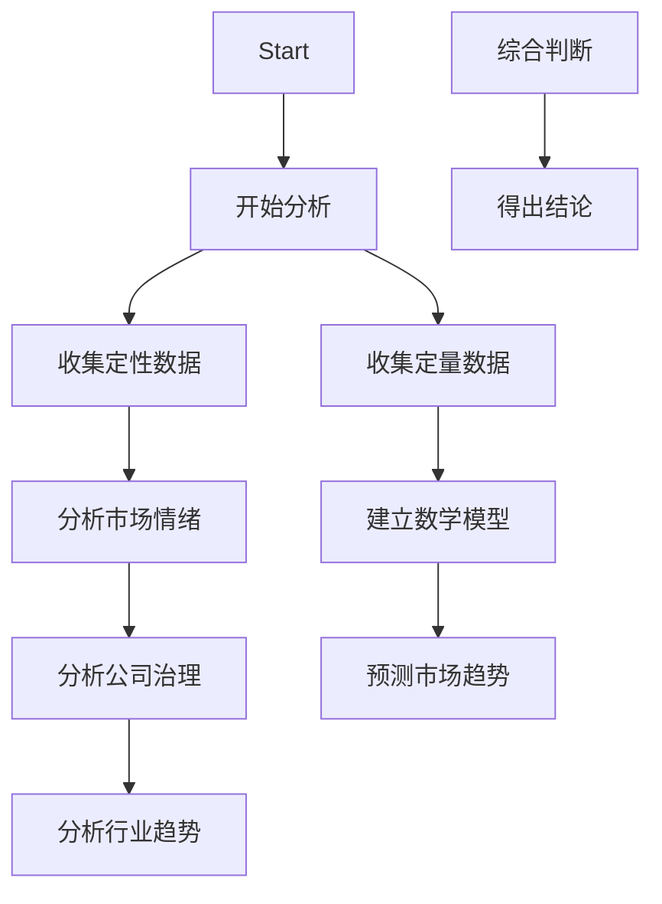

                 

# 芒格的"双轨分析"：定性和定量分析的结合

## 关键词：
- 双轨分析
- 定性分析
- 定量分析
- 投资决策
- 系统架构设计

## 摘要：
芒格的双轨分析是一种结合定性和定量分析的方法，旨在通过综合分析和逻辑推理来做出更准确的投资决策。本文将详细探讨双轨分析的核心思想、定性和定量分析的原理、它们的结合方式以及在投资决策中的实际应用。

---

## 第一部分：芒格的“双轨分析”概述

### 1.1 芒格的背景与思想体系

#### 1.1.1 芒格的生平与职业发展
沃伦·巴菲特的合作伙伴查理·芒格是一位著名的投资家和思想家，他的投资理念深刻影响了现代投资理论。芒格的职业生涯始于法律领域，后来转向投资，逐渐形成了自己独特的哲学和投资理念。

#### 1.1.2 芒格的哲学与投资理念
芒格强调投资中的“安全边际”和“逆向思维”，他认为市场是不确定的，投资者需要通过深入分析来识别低估的投资机会。他的哲学基础来源于心理学、经济学和物理学，强调人类认知的局限性和决策中的情绪因素。

#### 1.1.3 双轨分析的提出与核心思想
双轨分析是芒格提出的一种分析方法，旨在将定性分析和定量分析相结合。这种方法强调在投资决策中既考虑市场的情绪和行为因素（定性分析），又考虑财务数据和数学模型（定量分析）。

### 1.2 双轨分析的定义与核心要素

#### 1.2.1 双轨分析的定义
双轨分析是一种结合定性和定量分析的方法，旨在通过综合分析来提高投资决策的准确性和可靠性。

#### 1.2.2 定性分析与定量分析的对比
| 特性      | 定性分析                     | 定量分析                     |
|-----------|------------------------------|------------------------------|
| 聚焦点     | 市场情绪、公司管理、行业趋势   | 财务数据、数学模型、统计数据   |
| 方法      | 逻辑推理、案例分析           | 数学建模、统计分析             |
| 输出      | 概率性结论                   | 确定性结论                   |

#### 1.2.3 双轨分析的核心要素与框架
双轨分析的核心框架包括以下几个部分：
1. **定性分析**：分析市场情绪、公司治理、行业趋势等非量化因素。
2. **定量分析**：分析财务数据、统计指标、数学模型等量化因素。
3. **综合判断**：结合定性和定量分析的结果，做出最终的投资决策。

### 1.3 双轨分析的理论基础与哲学基础

#### 1.3.1 定性分析的哲学基础
定性分析主要基于心理学和行为经济学的理论，强调人类行为和市场情绪对投资决策的影响。芒格认为，市场参与者的情绪波动是影响股价的重要因素。

#### 1.3.2 定量分析的数学基础
定量分析基于统计学和数学模型，如回归分析、时间序列分析等。这些方法帮助投资者通过数据来预测市场趋势和公司业绩。

#### 1.3.3 双轨分析的综合框架
双轨分析将定性分析和定量分析结合起来，形成了一个完整的分析框架。这个框架不仅考虑数据的量，还考虑市场的质，从而提高了分析的全面性和准确性。

### 1.4 双轨分析在投资决策中的应用

#### 1.4.1 双轨分析的适用场景
双轨分析适用于长期投资决策，特别是在市场不确定性较高的情况下。它可以帮助投资者识别低估的投资机会，同时避免过度依赖数据的片面性。

#### 1.4.2 双轨分析的优势与局限性
- **优势**：综合考虑了市场的定性和定量因素，提高了分析的全面性。
- **局限性**：定性分析的主观性较高，可能导致分析结果的偏差。

#### 1.4.3 双轨分析与其他分析方法的对比
与传统的单一分析方法相比，双轨分析更加注重综合性和系统性，能够更好地应对复杂的投资环境。

---

## 第二部分：定性分析与定量分析的结合

### 2.1 定性分析的原理与方法

#### 2.1.1 定性分析的核心原理
定性分析主要依赖逻辑推理和案例分析，关注市场的情绪、公司的治理结构和行业的趋势等因素。

#### 2.1.2 定性分析的主要方法
- **逻辑推理**：通过分析市场和公司的逻辑关系，预测未来的趋势。
- **案例分析**：通过研究类似案例，寻找投资机会和风险。

#### 2.1.3 定性分析的逻辑框架
1. 确定分析目标。
2. 收集相关信息。
3. 分析市场情绪和行业趋势。
4. 评估公司的治理结构和竞争优势。
5. 得出定性结论。

### 2.2 定量分析的原理与方法

#### 2.2.1 定量分析的核心原理
定量分析基于数学模型和统计方法，通过分析财务数据和市场指标，预测市场的未来走势。

#### 2.2.2 定量分析的主要方法
- **数学建模**：如回归分析、时间序列分析等。
- **统计分析**：如均值-方差分析、风险评估等。

#### 2.2.3 定量分析的数学模型
常用的定量分析模型包括：
1. **资本资产定价模型（CAPM）**：用于评估资产的预期收益。
2. **套利定价理论（APT）**：用于评估资产的风险溢价。

### 2.3 定性分析与定量分析的对比分析

#### 2.3.1 定性分析与定量分析的主要区别
- **分析对象**：定性分析关注非量化因素，定量分析关注量化数据。
- **分析方法**：定性分析依赖逻辑推理，定量分析依赖数学模型。

#### 2.3.2 定性分析与定量分析的优劣势对比
| 特性      | 定性分析                     | 定量分析                     |
|-----------|------------------------------|------------------------------|
| 优势      | 提供市场情绪和行业趋势的洞察 | 提供精确的数值预测             |
| 劣势      | 结果具有主观性               | 结果可能过于片面               |

#### 2.3.3 定性分析与定量分析的互补性
定性分析提供了市场的情绪和趋势信息，而定量分析提供了精确的数据支持。两者的结合能够帮助投资者做出更全面和准确的决策。

### 2.4 双轨分析的综合应用

#### 2.4.1 双轨分析的系统架构设计

#### 2.4.2 双轨分析的算法流程图

#### 2.4.3 双轨分析的实际案例
以苹果公司为例，假设当前市场情绪乐观，但苹果的财务数据显示出增长放缓的迹象。通过双轨分析，投资者可以结合市场情绪和财务数据，综合判断苹果的投资价值。

---

## 总结与建议

### 3.1 本章小结
双轨分析是一种结合定性和定量分析的方法，旨在通过综合分析提高投资决策的准确性和可靠性。本文详细探讨了双轨分析的核心思想、定性和定量分析的原理，以及它们在投资决策中的实际应用。

### 3.2 最佳实践 tips
- 在进行投资决策时，应综合考虑市场的情绪和财务数据。
- 定期回顾和调整分析模型，以适应市场的变化。

### 3.3 注意事项
- 定性分析具有较高的主观性，需要结合实际市场情况谨慎使用。
- 定量分析依赖于数据的准确性和模型的有效性，需要不断优化和更新。

### 3.4 拓展阅读
建议读者进一步阅读芒格的著作《Poor Charlie's Almanack》，以深入了解他的投资理念和双轨分析的详细内容。

---

## 作者信息
作者：AI天才研究院  
联系方式：contact@aitianjiayan.com  

---

通过本文的详细分析，读者可以深入了解芒格的双轨分析，并将其应用于实际的投资决策中。希望本文能为您提供有价值的见解和指导。

