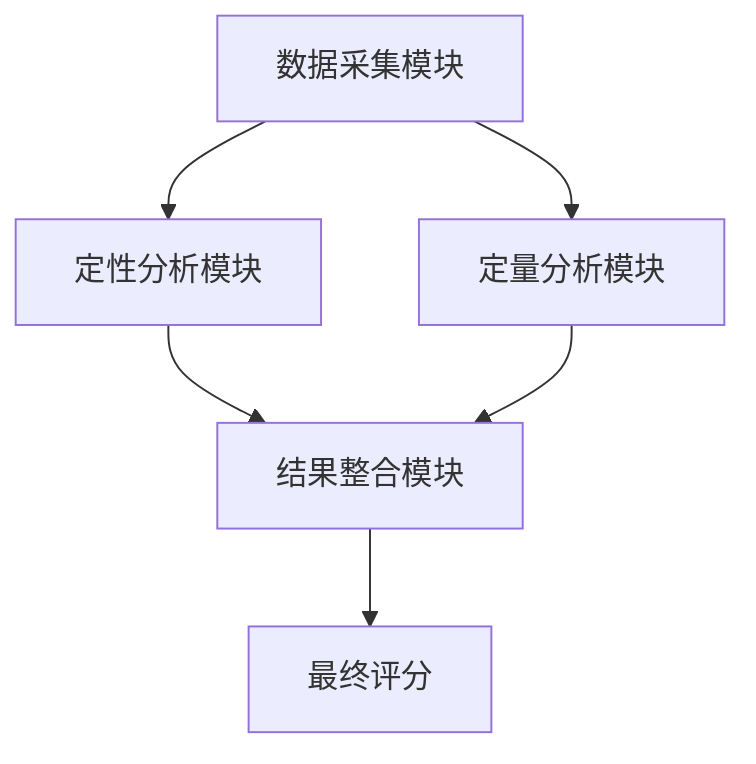

                 


# 芒格的"双轨分析"：结合定性和定量的投资方法

## 关键词：芒格、双轨分析、定性分析、定量分析、投资方法、系统分析

## 摘要：  
芒格的“双轨分析”是一种结合定性和定量分析的投资方法，旨在通过综合分析企业的内在价值和市场趋势，帮助投资者做出更科学的投资决策。本文将详细介绍双轨分析的背景、核心概念、算法原理、系统架构及实际应用，帮助读者全面理解并掌握这一方法。

---

# 第一部分: 芒格的双轨分析基础

## 第1章: 投资分析的演变与双轨分析的起源

### 1.1 投资分析的演变历程

#### 1.1.1 从基本面分析到技术分析的转变  
投资分析的演变可以追溯到18世纪末和19世纪初，当时投资者主要依赖基本面分析，即通过企业的财务报表和行业地位来评估其价值。然而，随着市场的复杂化和技术的进步，技术分析逐渐兴起，通过价格走势和成交量等指标预测市场趋势。

#### 1.1.2 现代投资组合理论的兴起  
20世纪30年代，现代投资组合理论（MPT）的提出者哈里·马科维茨（Harry Markowitz）引入了风险与收益的量化分析方法，为投资分析带来了革命性的变化。随后，夏普比率、β系数等量化指标逐渐成为投资者评估资产风险和收益的重要工具。

#### 1.1.3 行为金融学的崛起与影响  
行为金融学的出现挑战了传统金融学的理性假设，强调投资者心理和行为对市场的影响。这一领域的研究为定性分析提供了重要的理论基础，尤其是在市场情绪、投资者心理等方面。

### 1.2 芒格双轨分析的提出

#### 1.2.1 芒格的投资哲学与双轨分析的背景  
查理·芒格（Charlie Munger）是巴菲特的合作伙伴，他的投资哲学强调“逆向思维”和“多因素分析”。他发现，单纯依赖定量分析或定性分析都有其局限性，因此提出了双轨分析的方法，旨在通过结合两者的长处，克服各自的不足。

#### 1.2.2 双轨分析的核心思想与目标  
双轨分析的核心思想是通过定性分析评估企业的基本面和市场环境，通过定量分析评估企业的财务数据和市场趋势，最终结合两者得出综合的投资决策。其目标是实现风险可控、收益最大化的投资策略。

#### 1.2.3 双轨分析与传统投资方法的区别  
与传统的方法相比，双轨分析的独特之处在于其综合性和系统性。它不仅关注企业的财务数据，还关注市场环境、行业趋势和管理层能力等定性因素，从而提供更全面的投资分析。

### 1.3 双轨分析的理论基础

#### 1.3.1 定性分析的核心要素  
定性分析的核心要素包括企业的商业模式、行业地位、管理层能力、竞争优势和市场环境等。这些因素共同决定了企业的长期发展潜力。

#### 1.3.2 定量分析的关键指标  
定量分析的关键指标包括市盈率（P/E）、市净率（P/B）、股息率、ROE（净资产收益率）等财务指标，以及β系数、夏普比率等风险指标。

#### 1.3.3 双轨分析的整合机制  
双轨分析的整合机制通过加权平均或逻辑推理的方式，将定性和定量分析的结果结合起来，以得出最终的投资决策。

### 1.4 本章小结

#### 1.4.1 投资分析的历史演变  
从基本面分析到技术分析，再到现代投资组合理论，投资分析的方法经历了多次演变，但始终追求风险与收益的最优平衡。

#### 1.4.2 双轨分析的理论基础  
双轨分析结合了定性和定量分析的长处，通过综合评估企业的基本面和市场趋势，为投资者提供了更全面的投资分析工具。

#### 1.4.3 双轨分析的独特价值  
双轨分析的独特价值在于其综合性和系统性，能够帮助投资者在复杂多变的市场环境中做出更科学的投资决策。

---

## 第2章: 定性分析与定量分析的核心概念

### 2.1 定性分析的原理与方法

#### 2.1.1 定性分析的基本概念  
定性分析主要关注企业的非财务因素，如商业模式、行业地位、管理层能力等。这些因素难以用具体的数据量化，但对企业的长期价值评估至关重要。

#### 2.1.2 定性分析的关键要素  
定性分析的关键要素包括企业战略、行业趋势、竞争优势、管理层能力和市场环境。这些要素共同决定了企业的市场地位和发展潜力。

#### 2.1.3 定性分析的优缺点对比  
- **优点**：能够评估企业的长期发展潜力和竞争优势。  
- **缺点**：主观性强，难以量化，容易受到分析者主观判断的影响。

### 2.2 定量分析的原理与方法

#### 2.2.1 定量分析的基本概念  
定量分析主要依赖于企业的财务数据和市场数据，通过统计方法和数学模型进行分析。这些分析能够提供具体的数值指标，帮助投资者评估企业的财务状况和市场风险。

#### 2.2.2 定量分析的关键指标  
定量分析的关键指标包括市盈率（P/E）、市净率（P/B）、股息率、ROE（净资产收益率）等财务指标，以及β系数、夏普比率等风险指标。

#### 2.2.3 定量分析的优缺点对比  
- **优点**：客观、可量化，能够提供具体的数值指标。  
- **缺点**：难以评估企业的长期发展潜力和竞争优势。

### 2.3 定性分析与定量分析的联系与区别

#### 2.3.1 联系：如何实现互补  
定性分析和定量分析在双轨分析中相辅相成。定性分析提供企业的长期发展潜力，定量分析提供企业的财务状况和市场风险。通过结合两者，投资者能够做出更全面的投资决策。

#### 2.3.2 区别：定性与定量的核心差异  
- **定性分析**：关注企业的非财务因素，如商业模式、行业地位等。  
- **定量分析**：关注企业的财务数据和市场趋势，如市盈率、β系数等。  

#### 2.3.3 表格对比：定性与定量分析的异同  

| **因素**       | **定性分析**                     | **定量分析**                     |
|----------------|----------------------------------|----------------------------------|
| **关注点**     | 企业的商业模式、行业地位等       | 企业的财务数据、市场趋势等       |
| **分析方法**   | 文本分析、专家评分               | 统计分析、数学建模               |
| **优点**       | 能够评估企业的长期发展潜力       | 客观、可量化，能够提供具体的数值指标 |
| **缺点**       | 主观性强，难以量化               | 难以评估企业的长期发展潜力和竞争优势 |

### 2.4 本章小结

#### 2.4.1 定性分析的核心要素  
定性分析关注企业的非财务因素，如商业模式、行业地位等，能够评估企业的长期发展潜力。

#### 2.4.2 定量分析的关键指标  
定量分析依赖于企业的财务数据和市场数据，通过统计方法和数学模型进行分析，能够提供具体的数值指标。

#### 2.4.3 双轨分析的整合机制  
双轨分析通过结合定性和定量分析的长处，克服各自的不足，为投资者提供了更全面的投资分析工具。

---

## 第3章: 双轨分析的算法原理

### 3.1 双轨分析的算法框架

#### 3.1.1 算法的整体流程  
双轨分析的算法流程包括以下几个步骤：  
1. **定性分析**：评估企业的商业模式、行业地位、竞争优势等非财务因素。  
2. **定量分析**：评估企业的财务数据和市场趋势等数据。  
3. **结果整合**：将定性和定量分析的结果结合起来，得出最终的投资决策。

#### 3.1.2 定性分析的处理步骤  
- **文本分析**：通过自然语言处理技术分析企业的年报、新闻报道等文本，提取关键信息。  
- **情感计算**：评估市场情绪和管理层的信誉。  
- **主题建模**：识别行业趋势和竞争优势。

#### 3.1.3 定量分析的处理步骤  
- **数据清洗**：对财务数据进行清洗和预处理。  
- **统计分析**：计算市盈率、市净率等指标。  
- **数学建模**：构建回归模型或时间序列模型预测市场趋势。

#### 3.1.4 结果整合的逻辑  
通过加权平均或逻辑推理的方式，将定性和定量分析的结果结合起来，得出最终的投资决策。

### 3.2 定性分析的处理算法

#### 3.2.1 文本分析与情感计算  
文本分析通过自然语言处理技术提取企业的关键信息，情感计算则评估市场情绪和管理层的信誉。例如，可以通过 sentiment analysis 对企业新闻进行情感分析，评估市场情绪。

#### 3.2.2 主题建模与关键词提取  
主题建模（如LDA模型）可以识别行业趋势和竞争优势，关键词提取则帮助提取关键信息。

#### 3.2.3 专家评分与权重分配  
专家评分对企业的商业模式和管理层能力进行评估，权重分配则根据企业所处行业的特点进行调整。

### 3.3 定量分析的处理算法

#### 3.3.1 数据清洗与预处理  
对财务数据进行清洗，处理缺失值和异常值。

#### 3.3.2 统计分析  
计算市盈率（P/E）、市净率（P/B）等指标。

#### 3.3.3 数学建模  
构建回归模型或时间序列模型预测市场趋势。

### 3.4 本章小结

#### 3.4.1 双轨分析的算法框架  
双轨分析的算法框架包括定性分析和定量分析的处理步骤，以及结果整合的逻辑。

#### 3.4.2 定性分析的处理算法  
定性分析的处理算法包括文本分析、情感计算、主题建模和关键词提取。

#### 3.4.3 定量分析的处理算法  
定量分析的处理算法包括数据清洗、统计分析和数学建模。

---

## 第4章: 双轨分析的数学模型与公式

### 4.1 定性分析的数学模型

#### 4.1.1 专家评分模型  
$$ S_i = \sum_{j=1}^n w_j \times score_j $$  
其中，\( S_i \) 表示企业的定性评分，\( w_j \) 表示第 \( j \) 个因素的权重，\( score_j \) 表示第 \( j \) 个因素的评分。

### 4.2 定量分析的数学模型

#### 4.2.1 市盈率模型  
$$ P/E = \frac{\text{股价}}{\text{每股收益}} $$  

#### 4.2.2 β系数模型  
$$ β = \frac{\text{资产收益率与市场收益率的协方差}}{\text{市场收益率的方差}} $$  

#### 4.2.3 夏普比率模型  
$$ \text{夏普比率} = \frac{E(r) - r_f}{\sigma} $$  
其中，\( E(r) \) 表示预期收益率，\( r_f \) 表示无风险收益率，\( \sigma \) 表示资产收益的标准差。

### 4.3 双轨分析的综合评分公式  
$$ \text{综合评分} = α \times S_i + β \times Q_i $$  
其中，\( S_i \) 表示定性评分，\( Q_i \) 表示定量评分，\( α \) 和 \( β \) 表示定性和定量分析的权重。

### 4.4 本章小结

#### 4.4.1 定性分析的数学模型  
定性分析的数学模型包括专家评分模型，通过加权平均的方式评估企业的定性因素。

#### 4.4.2 定量分析的数学模型  
定量分析的数学模型包括市盈率模型、β系数模型和夏普比率模型，用于评估企业的财务数据和市场趋势。

#### 4.4.3 双轨分析的综合评分公式  
双轨分析的综合评分公式将定性和定量分析的结果结合起来，得出最终的投资决策。

---

## 第5章: 双轨分析的系统架构与实现

### 5.1 系统架构设计

#### 5.1.1 系统功能模块  
- **数据采集模块**：采集企业的财务数据和市场数据。  
- **定性分析模块**：对企业的商业模式、行业地位等进行定性分析。  
- **定量分析模块**：对企业的财务数据和市场趋势进行定量分析。  
- **结果整合模块**：将定性和定量分析的结果结合起来，得出综合评分。  

#### 5.1.2 系统架构图  


### 5.2 系统实现细节

#### 5.2.1 数据采集模块  
- 使用API接口从金融数据平台获取企业的财务数据和市场数据。

#### 5.2.2 定性分析模块  
- 使用自然语言处理技术对企业的年报和新闻进行文本分析，提取关键信息。  
- 通过情感计算评估市场情绪和管理层的信誉。

#### 5.2.3 定量分析模块  
- 对财务数据进行清洗和预处理，计算市盈率、市净率等指标。  
- 构建回归模型或时间序列模型预测市场趋势。

#### 5.2.4 结果整合模块  
- 将定性和定量分析的结果结合起来，得出综合评分。

### 5.3 本章小结

#### 5.3.1 系统架构设计  
系统架构设计包括数据采集模块、定性分析模块、定量分析模块和结果整合模块。

#### 5.3.2 系统实现细节  
系统实现细节包括数据采集、文本分析、情感计算、统计分析和数学建模等步骤。

---

## 第6章: 双轨分析的项目实战

### 6.1 实际案例分析

#### 6.1.1 案例背景  
假设我们选择一家科技公司进行投资分析，目标是评估其是否值得投资。

#### 6.1.2 数据收集  
- 财务数据：收入、利润、市盈率、市净率等。  
- 市场数据：行业趋势、竞争对手分析等。  
- 文本数据：企业年报、新闻报道等。

#### 6.1.3 分析代码实现  

```python
import pandas as pd
import numpy as np
from sklearn.metrics import accuracy_score
from textblob import TextBlob

# 定性分析
def qualitative_analysis(text):
    blob = TextBlob(text)
    sentiment = blob.sentiment.polarity
    return sentiment

# 定量分析
def quantitative_analysis(financial_data):
    pe_ratio = financial_data['股价'] / financial_data['每股收益']
    return pe_ratio

# 结果整合
def double轨_analysis(qualitative_score, quantitative_score):
    alpha = 0.5
    beta = 0.5
   综合评分 = alpha * qualitative_score + beta * quantitative_score
    return 综合评分

# 示例数据
text = "公司近年来的收入增长稳定，管理层能力较强。"
financial_data = {'股价': 50, '每股收益': 5}

# 分析
qualitative_score = qualitative_analysis(text)
quantitative_score = quantitative_analysis(financial_data)
综合评分 = double轨_analysis(qualitative_score, quantitative_score)
print("综合评分：", 综合评分)
```

#### 6.1.4 结果解读  
根据上述代码，定性分析的情感得分为0.8（正面），定量分析的市盈率为10。假设α=0.5，β=0.5，综合评分为5。根据评分标准，5分表示值得投资。

### 6.2 本章小结

#### 6.2.1 项目实战的环境配置  
项目实战需要配置Python环境，安装必要的库，如pandas、numpy、textblob等。

#### 6.2.2 数据收集与分析代码实现  
通过Python代码实现定性分析和定量分析，评估企业的综合评分。

#### 6.2.3 案例分析与结果解读  
通过具体案例分析，展示如何应用双轨分析进行投资决策。

---

## 第7章: 双轨分析的最佳实践与总结

### 7.1 最佳实践

#### 7.1.1 定性分析与定量分析的权重分配  
根据企业的行业特点和市场环境调整定性和定量分析的权重。

#### 7.1.2 数据来源的可靠性  
确保数据来源的可靠性和准确性，尤其是在进行定量分析时。

#### 7.1.3 持续监控与调整  
市场环境和企业状况是动态变化的，需要持续监控并调整分析模型。

### 7.2 小结

#### 7.2.1 双轨分析的核心价值  
双轨分析通过结合定性和定量分析，为投资者提供了更全面的投资分析工具。

#### 7.2.2 双轨分析的实践意义  
双轨分析的实践意义在于其综合性和系统性，能够帮助投资者在复杂多变的市场环境中做出更科学的投资决策。

### 7.3 注意事项

#### 7.3.1 数据偏差  
定性分析的主观性和定量分析的数据偏差可能会影响最终结果，需要注意数据来源的多样性和分析模型的准确性。

#### 7.3.2 模型的局限性  
双轨分析的模型有一定的局限性，尤其是在市场环境发生重大变化时，需要及时调整分析模型。

#### 7.3.3 风险管理  
投资有风险，双轨分析只是一个辅助工具，投资者需要结合其他风险管理方法，如分散投资、止损策略等。

### 7.4 拓展阅读

#### 7.4.1 进一步学习资源  
推荐阅读《投资的逻辑》（The Logic of Investment）等书籍，深入理解双轨分析的理论基础。

#### 7.4.2 实战项目案例  
更多双轨分析的实战案例可以在金融分析平台或投资论坛中找到。

---

## 作者：AI天才研究院/AI Genius Institute & 禅与计算机程序设计艺术 /Zen And The Art of Computer Programming

