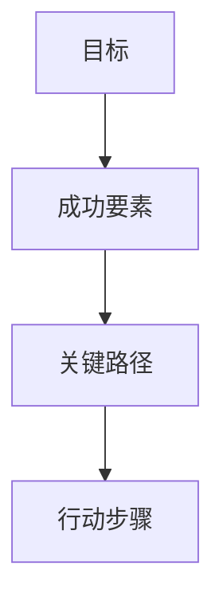
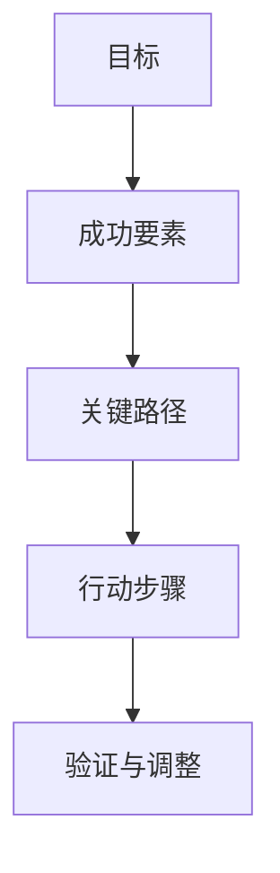
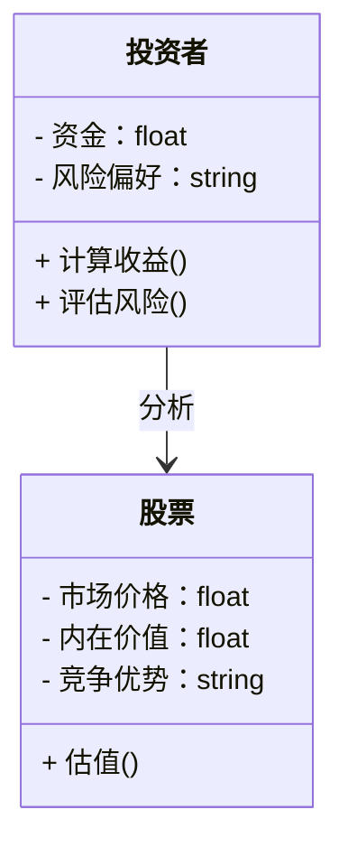
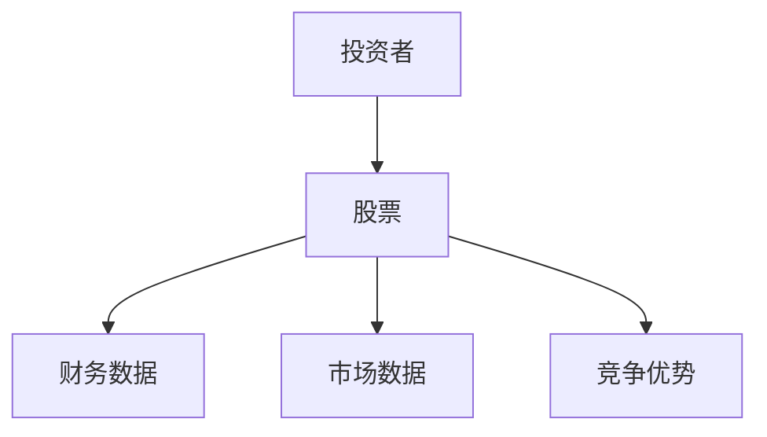
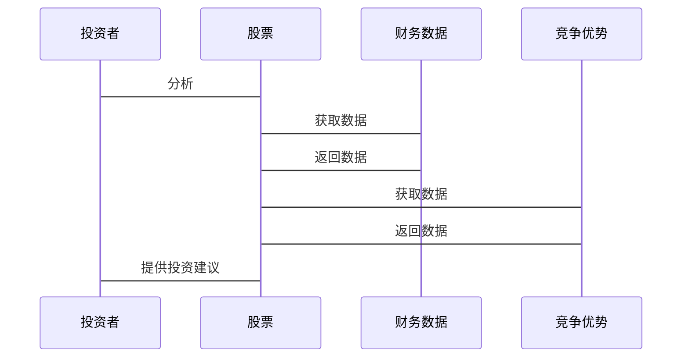

                 


# 芒格的“反向工程”思维在投资中的应用

> 关键词：芒格思维，反向工程，投资策略，价值投资，系统性分析

> 摘要：本文深入探讨了芒格的“反向工程”思维在投资中的应用，通过分析其核心概念、算法原理、数学模型以及系统架构，结合实际案例，为投资者提供了一种全新的思维方式和策略。文章从背景介绍到项目实战，层层递进，旨在帮助读者掌握如何在投资决策中运用逆向思维，提升投资效率和成功率。

---

## 第1章：投资的基本概念与芒格思维的起源

### 1.1 投资的基本概念

投资的本质是通过合理配置资源，以实现资产的保值与增值。投资的核心要素包括：

- **资产**：即投资的对象，可以是股票、债券、房地产等。
- **风险**：投资过程中可能面临的不确定性，影响最终收益的因素。
- **收益**：投资的最终目标，包括短期收益和长期价值。

投资的三大原则：
1. **本金安全**：确保资金不会遭受重大损失。
2. **时间价值**：通过长期投资复利效应实现财富增长。
3. **价值评估**：准确评估资产的真实价值，避免盲目跟风。

### 1.2 芒格思维的起源

芒格（Charlie Munger）是美国著名投资家巴菲特的合作伙伴，其“反向工程”思维源于他对人类心理和决策过程的深刻理解。芒格认为，人类的认知往往存在偏差，而逆向思维可以帮助我们避免这些偏差的影响。

“反向工程”思维的核心在于：
- 从结果出发，逆向推导成功的原因。
- 通过分析成功案例，提炼出关键的成功要素。
- 将这些要素应用于未来的投资决策中。

### 1.3 芒格思维在投资中的应用

芒格的“反向工程”思维在投资中的具体应用包括：
1. **价值投资**：通过分析企业的内在价值，寻找被市场低估的投资标的。
2. **风险管理**：通过逆向思考，识别潜在风险，制定应对策略。
3. **长期规划**：通过分析长期趋势，制定稳健的投资策略。

---

## 第2章：芒格“反向工程”思维的定义与特点

### 2.1 “反向工程”思维的定义

“反向工程”思维是一种从结果出发，逆向推导出成功要素的方法。其核心在于：
- 将目标分解为可执行的步骤。
- 通过分析成功案例，提炼出关键的成功因素。

### 2.2 芒格思维的特点

1. **系统性**：芒格的思维强调从整体出发，将复杂的系统分解为可管理的部分。
2. **实证性**：通过实际案例验证理论的可行性。
3. **理性化**：基于逻辑推理和数据分析，避免情绪化决策。
4. **长期性**：关注长期价值，而非短期波动。

### 2.3 芒格思维的核心要素对比表

| 核心要素 | 正向思维 | 反向思维 |
|----------|----------|----------|
| 起点     | 当前行动 | 目标结果 |
| 方法     | 直接行动 | 逆向推导 |
| 目标     | 追求收益 | 追踪成功 |

### 2.4 芒格思维的ER实体关系图



---

## 第3章：芒格思维在投资中的应用边界

### 3.1 投资领域的适用范围

1. **股票投资**：通过分析企业的财务数据和市场地位，寻找具有竞争优势的企业。
2. **价值投资**：寻找市场价格低于内在价值的投资标的。
3. **风险控制**：通过逆向思维，制定有效的风险管理策略。

### 3.2 应用边界与限制

1. **信息不对称的限制**：投资者可能无法获取足够的信息来准确评估资产价值。
2. **市场非理性的影响**：市场的短期波动可能干扰投资决策。
3. **短期波动的干扰**：投资者可能因短期波动而偏离长期目标。

### 3.3 芒格思维的外延领域

1. **个人决策**：应用于日常生活中的决策，如职业选择、消费习惯等。
2. **企业管理**：应用于公司战略规划和风险管理。
3. **宏观经济分析**：应用于宏观经济政策的制定和评估。

---

## 第4章：芒格思维的算法原理

### 4.1 芒格思维的步骤分解

1. **设定目标**：明确投资目标，如追求稳定的收益。
2. **分析成功案例**：研究成功投资者的策略和方法。
3. **提炼关键要素**：识别成功案例中的关键因素，如企业的竞争优势、财务状况等。
4. **制定策略**：基于关键要素，制定投资策略。
5. **验证与调整**：通过实际操作验证策略的有效性，并根据市场变化进行调整。

### 4.2 芒格思维的算法流程图



---

## 第5章：芒格思维的数学模型

### 5.1 投资收益的数学模型

投资收益的计算公式：

$$
\text{总收益} = \sum_{i=1}^{n} \text{单笔收益}_i
$$

其中，$$\text{单笔收益}_i = \text{卖出价格}_i - \text{买入价格}_i$$。

### 5.2 股票估值的数学模型

股票的内在价值可以用以下公式估算：

$$
\text{内在价值} = \frac{\text{预期现金流}}{\text{折现率}}
$$

其中，折现率通常基于企业的风险水平和市场利率确定。

### 5.3 风险评估的数学模型

风险评估可以通过标准差来衡量：

$$
\text{标准差} = \sqrt{\frac{1}{n} \sum_{i=1}^{n} (\text{收益}_i - \text{平均收益})^2}
$$

---

## 第6章：芒格思维的系统分析与架构设计

### 6.1 问题场景介绍

以股票投资为例，假设我们要分析某家公司的投资价值。首先，我们需要收集公司的财务数据、市场地位、竞争优势等信息。

### 6.2 系统功能设计



### 6.3 系统架构设计



### 6.4 系统接口设计

- 输入接口：投资者输入资金和风险偏好。
- 输出接口：系统输出股票的内在价值和投资建议。

### 6.5 系统交互流程



---

## 第7章：芒格思维的项目实战

### 7.1 环境安装

需要安装Python和相关的数据分析库，如Pandas、NumPy等。

### 7.2 核心实现代码

```python
import pandas as pd
import numpy as np

# 示例数据：某公司的财务数据
data = {
    '收入': [100, 200, 300],
    '成本': [50, 100, 150],
    '利润': [50, 100, 150]
}

df = pd.DataFrame(data)

# 计算毛利率
df['毛利率'] = (df['收入'] - df['成本']) / df['收入']

print(df)
```

### 7.3 代码应用解读与分析

上述代码展示了如何通过数据分析计算公司的毛利率，帮助投资者评估公司的盈利能力。

### 7.4 实际案例分析

以茅台为例，分析其投资价值：

1. **财务数据**：高利润率、稳定的增长。
2. **竞争优势**：品牌效应、强大的渠道网络。
3. **估值**：基于财务数据和竞争优势，估算其内在价值。

### 7.5 项目小结

通过实际案例分析，我们可以看到芒格的“反向工程”思维在投资中的实际应用。

---

## 第8章：芒格思维的最佳实践

### 8.1 小结

芒格的“反向工程”思维是一种强大的投资工具，能够帮助投资者制定科学的投资策略，提升投资效率。

### 8.2 注意事项

1. **避免信息过载**：过多的信息可能干扰决策。
2. **长期坚持**：投资需要耐心和毅力。
3. **持续学习**：市场变化迅速，需要不断更新知识。

### 8.3 拓展阅读

推荐书籍：
1. 《芒格的智慧：决策的艺术》
2. 《价值投资入门》

---

## 作者：AI天才研究院/AI Genius Institute & 禅与计算机程序设计艺术 /Zen And The Art of Computer Programming

---

本文通过系统的分析和实际案例，深入探讨了芒格的“反向工程”思维在投资中的应用。从理论到实践，帮助投资者掌握这一强大的思维方式，提升投资效率和成功率。

