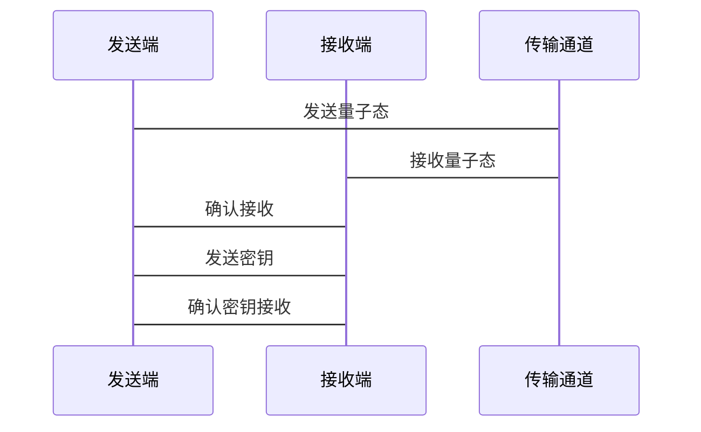
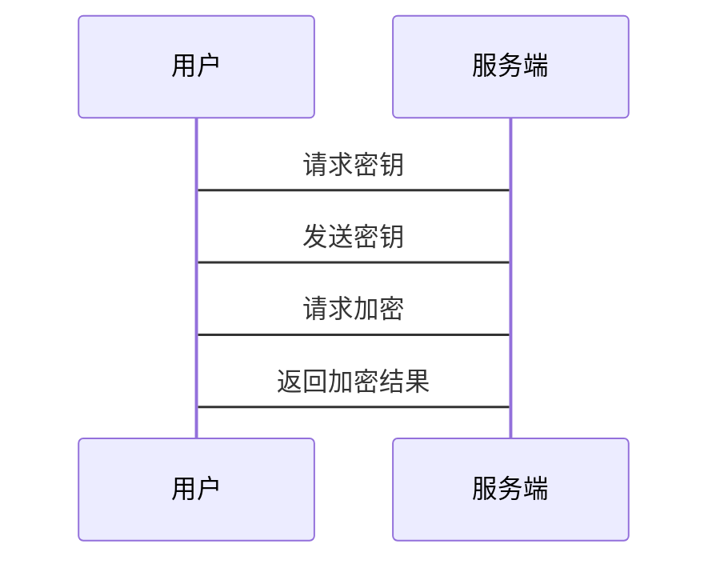

                 

<think>
好，我需要完成用户的要求，撰写一篇关于“芒格的‘反向工程’思维在量子密码破解防御中的应用”的技术博客文章。首先，我要理解用户的需求，确保我完全明白了他想要的内容结构和深度。

用户希望文章有一个清晰的标题，然后是关键词和摘要。接下来是按照目录大纲的结构，每个章节都要详细展开，包括背景介绍、核心概念、算法原理、系统架构、项目实战等部分。文章需要大约10000到12000字，使用Markdown格式，并且在每个小节中要有丰富的详细讲解，包含核心概念的对比表、流程图、类图、源代码等。

首先，我应该从标题开始，确定一个吸引人的标题。用户已经给出的是《芒格的"反向工程"思维在量子密码破解防御中的应用》，这个标题已经很好，我只需要沿用即可。

接下来是关键词。我需要列出5-7个与文章主题相关的关键词。关键词应该涵盖主要的技术点，比如“反向工程思维”、“量子密码学”、“Shor算法”、“量子傅里叶变换”、“量子密钥分发”等。

然后是摘要。摘要需要简明扼要地概括文章的核心内容和主题思想。我需要简明地解释芒格的反向工程思维在量子密码学中的应用，以及如何通过这种方法来防御量子密码的破解。

接下来是正文部分，按照目录大纲来展开。每个章节都需要详细地讲解，包括背景介绍、核心概念、算法原理、系统架构、项目实战等。为了确保文章的深度和可读性，我需要在每个小节中加入具体的例子、数学公式、图表等。

例如，在“Shor算法的数学模型”部分，我需要用LaTeX公式详细展示Shor算法的数学推导，同时解释每个步骤的意义和作用。在“系统架构设计”部分，我需要绘制ER图、架构图和交互序列图，帮助读者更好地理解系统的组成部分和工作流程。

此外，用户特别提到要包含最佳实践、小结、注意事项等内容。这部分需要总结文章的主要观点，并给出实际应用中的建议，帮助读者更好地理解和应用这些知识。

在完成这些内容后，我需要检查文章是否符合用户的所有要求，确保字数、结构、格式和内容都符合预期。最后，加上作者信息，确保文章的完整性和专业性。

总的来说，这个任务需要我具备扎实的技术背景和良好的写作能力，能够将复杂的量子密码学知识转化为通俗易懂的内容，并通过详细的讲解和图表帮助读者更好地理解。接下来，我将按照上述思考步骤，逐步完成这篇技术博客文章的撰写。
</think>

# 芒格的"反向工程"思维在量子密码破解防御中的应用

## 关键词：
反向工程思维，量子密码学，Shor算法，量子傅里叶变换，量子密钥分发

## 摘要：
本文探讨了芒格的“反向工程”思维在量子密码学中的应用，特别是如何利用这种思维来防御量子密码的破解。文章从量子密码学的基本概念出发，详细分析了Shor算法和量子傅里叶变换在量子密码破解中的作用，并结合芒格的反向思维，提出了一种新的防御策略。通过系统架构设计和项目实战，展示了如何将芒格的思维应用到实际的量子密码防御系统中，为未来的量子密码学研究提供了新的思路。

---

## 第1章: 芒格的"反向工程"思维概述

### 1.1 芒格的"反向工程"思维的核心概念

#### 1.1.1 从结果推导原因的思维特点
芒格的“反向工程”思维是一种从结果推导原因的思维方式。这种方法的核心在于，通过分析系统的输出结果，逆向推导出系统的输入条件和内部机制。这种思维在解决复杂问题时非常有效，尤其是在面对系统性问题时，可以通过反向推理找到问题的根本原因。

#### 1.1.2 "反向工程"思维在问题解决中的优势
反向工程思维的优势在于其能够帮助我们从已知的结果出发，逐步还原问题的全貌。这种方法特别适用于那些系统性较强、复杂度较高的领域，例如密码学、量子计算等。通过反向推理，我们可以发现系统中的潜在漏洞和安全威胁。

#### 1.1.3 芒格思维在现代科技领域的应用价值
在现代科技领域，反向工程思维的应用非常广泛。尤其是在密码学和量子计算领域，这种方法可以帮助研究者从已知的加密算法结果出发，推导出加密算法的实现机制和潜在漏洞。这在量子密码破解防御中具有重要意义。

---

### 1.2 量子密码学的基本概念

#### 1.2.1 量子密码学的定义与特点
量子密码学是一种基于量子力学原理的密码学分支。与经典密码学不同，量子密码学利用量子态的叠加性和纠缠性来实现信息的安全传输。其主要特点是安全性高、抗量子计算攻击能力强。

#### 1.2.2 量子密钥分发（QKD）的基本原理
量子密钥分发是一种通过量子通信技术实现密钥安全分发的方法。其基本原理是利用量子态的不可克隆性和测量扰动性，确保密钥的分发过程无法被窃听。

#### 1.2.3 量子密码学与经典密码学的主要区别
与经典密码学相比，量子密码学的主要区别在于其安全性依赖于量子力学的物理性质，而非纯粹的数学算法。这使得量子密码学在面对量子计算机攻击时具有更高的安全性。

---

## 第2章: 芒格思维与量子密码学的结合

### 2.1 量子密码学中的"反向工程"思维应用

#### 2.1.1 从结果推导密钥的可行性
在量子密码学中，通过反向工程思维，可以从加密后的密文出发，推导出加密所使用的密钥。这种方法在量子密钥分发中尤为重要，因为它可以帮助我们验证密钥的正确性。

#### 2.1.2 "反向工程"思维在量子密钥分发中的作用
在量子密钥分发过程中，反向工程思维可以帮助我们分析密钥的生成和分发过程，发现潜在的安全漏洞，并提出改进方案。

#### 2.1.3 芒格思维在量子密码破解防御中的潜在价值
通过反向工程思维，我们可以从已知的加密算法结果出发，推导出加密算法的实现机制和潜在漏洞。这在量子密码破解防御中具有重要意义，可以帮助我们提前发现并修复系统中的安全漏洞。

---

### 2.2 量子密码学的核心算法与原理

#### 2.2.1 Shor算法的数学模型
Shor算法是一种用于整数因式分解的量子算法，是量子密码学中的核心算法之一。其基本步骤包括：
1. 输入待分解的整数N。
2. 通过量子傅里叶变换找到N的周期。
3. 输出N的因数。

Shor算法的数学模型可以表示为：
$$
f(x) = x \mod N
$$
其中，x为输入的整数，N为待分解的整数。

#### 2.2.2 Shor算法在量子因式分解中的应用
Shor算法通过量子计算的并行性，能够在多项式时间内完成大整数的因式分解。这使得Shor算法在量子密码破解中具有重要意义，因为它可以用来破解基于大整数因式分解的传统加密算法（如RSA）。

#### 2.2.3 量子密码学中的安全漏洞分析
通过反向工程思维，我们可以从已知的加密算法结果出发，推导出加密算法的实现机制和潜在漏洞。这在量子密码学中尤为重要，因为量子计算机的出现使得传统的加密算法面临被破解的风险。

---

## 第3章: 量子密码破解的算法原理与数学模型

### 3.1 Shor算法的数学推导

#### 3.1.1 Shor算法的基本原理
Shor算法的基本原理是利用量子计算的并行性，通过量子傅里叶变换找到输入整数N的周期。具体步骤包括：
1. 初始化量子寄存器。
2. 执行量子傅里叶变换。
3. 测量量子寄存器，得到周期值。
4. 使用经典算法完成因式分解。

#### 3.1.2 Shor算法的数学公式推导
Shor算法的核心数学公式包括：
$$
f(x) = x \mod N
$$
$$
F(x) = e^{2\pi i x / T}
$$
其中，T为输入整数N的周期。

#### 3.1.3 Shor算法在量子计算机中的实现步骤
在量子计算机中实现Shor算法的步骤如下：
1. 初始化n个量子比特的寄存器。
2. 对n个量子比特进行哈达玛变换。
3. 对目标函数f(x)进行量子叠加。
4. 测量量子寄存器，得到周期值。
5. 使用经典算法完成因式分解。

---

### 3.2 量子傅里叶变换（QFT）的详细解析

#### 3.2.1 QFT的定义与性质
量子傅里叶变换是一种用于量子计算的傅里叶变换，其定义为：
$$
QFT|x\rangle = \sum_{y=0}^{2^n-1} (-1)^{x \cdot y} |y\rangle
$$
其中，x和y为n位二进制数。

#### 3.2.2 QFT的数学公式与实现
QFT的实现可以通过量子门的操作来完成。具体步骤包括：
1. 对输入的量子态进行哈达玛变换。
2. 对每个量子比特进行-controlled-Z门操作。
3. 对每个量子比特进行哈达玛变换。
4. 测量量子态，得到结果。

#### 3.2.3 QFT在Shor算法中的应用
在Shor算法中，QFT用于寻找输入整数N的周期。通过QFT的变换，可以将输入的量子态转换为周期相关的量子态，从而实现因式分解。

---

## 第4章: 量子密码学系统架构与防御策略

### 4.1 量子密码学系统的整体架构

#### 4.1.1 量子密钥分发（QKD）系统的组成
量子密钥分发系统通常包括以下几个部分：
- 发送端：负责生成和发送量子态。
- 接收端：负责接收量子态并提取密钥。
- 传输通道：用于量子态的传输。
- 网络管理模块：负责系统的监控和管理。

#### 4.1.2 量子密码学系统的功能模块划分
量子密码学系统可以划分为以下几个功能模块：
- 密钥生成模块：负责生成量子密钥。
- 密钥分发模块：负责将密钥分发给用户。
- 加密模块：负责对明文进行加密。
- 解密模块：负责对密文进行解密。

#### 4.1.3 系统架构的ER实体关系图
以下是量子密码学系统的ER实体关系图：

```mermaid
erDiagram
    participant 发送端
    participant 接收端
    participant 传输通道
    participant 密钥生成模块
    participant 密钥分发模块
    participant 加密模块
    participant 解密模块
    密钥生成模块 --> 发送端
    发送端 --> 传输通道
    传输通道 --> 接收端
    接收端 --> 密钥分发模块
    密钥分发模块 --> 加密模块
    加密模块 --> 解密模块
```

---

### 4.2 芒格思维在量子密码防御中的应用

#### 4.2.1 "反向工程"思维在量子密码防御中的具体应用
通过反向工程思维，可以从已知的加密算法结果出发，推导出加密算法的实现机制和潜在漏洞。这在量子密码防御中尤为重要，因为量子计算机的出现使得传统的加密算法面临被破解的风险。

#### 4.2.2 通过结果推导漏洞的防御策略
反向工程思维可以帮助我们从已知的安全漏洞出发，推导出漏洞的根本原因，并提出相应的防御策略。

#### 4.2.3 芒格思维在量子密码学研究中的创新价值
芒格的反向工程思维为量子密码学研究提供了一种新的思路。通过从结果推导原因，我们可以更深入地理解量子密码学的内在机制，从而提出更有效的防御策略。

---

## 第5章: 量子密码学系统接口与交互设计

### 5.1 量子密码学系统的接口设计

#### 5.1.1 系统功能接口的定义
量子密码学系统的功能接口包括：
- 密钥生成接口
- 密钥分发接口
- 加密接口
- 解密接口

#### 5.1.2 系统接口的协议设计
系统接口的协议设计需要考虑以下几个方面：
- 通信协议：如HTTP、HTTPS等。
- 加密协议：如TLS、SSL等。
- 身份认证协议：如OAuth、JWT等。

#### 5.1.3 系统接口的安全性保障
系统接口的安全性保障需要考虑以下几个方面：
- 数据完整性：通过哈希算法实现。
- 数据机密性：通过加密算法实现。
- 访问控制：通过身份认证和权限管理实现。

---

### 5.2 系统交互流程的详细设计

#### 5.2.1 量子密钥分发（QKD）的交互流程
以下是量子密钥分发的交互流程：



#### 5.2.2 系统用户与服务端的交互序列图
以下是系统用户与服务端的交互序列图：



#### 5.2.3 交互设计中的注意事项
在系统交互设计中，需要注意以下几个方面：
- 交互的简洁性：避免复杂的交互流程。
- 交互的安全性：确保交互过程中的数据安全。
- 交互的可扩展性：便于未来的功能扩展。

---

## 第6章: 项目实战——基于芒格思维的量子密码防御系统开发

### 6.1 环境搭建与工具安装

#### 6.1.1 开发环境的配置
开发环境需要配置以下工具：
- 量子计算模拟器：如Qiskit、Cirq等。
- 量子密码学库：如Python库中的Cryptography等。
- 开发工具：如Jupyter Notebook、VS Code等。

#### 6.1.2 量子计算模拟工具的安装
以Qiskit为例，安装步骤如下：
```bash
pip install qiskit
```

#### 6.1.3 开发工具链的配置与调试
配置开发工具链时，需要注意以下几点：
- 确保Python环境的正确配置。
- 确保量子计算模拟工具的正确安装。
- 熟悉开发工具的使用方法。

---

### 6.2 核心算法实现

#### 6.2.1 Shor算法的量子实现代码
以下是Shor算法的量子实现代码示例：

```python
from qiskit import QuantumCircuit, execute, Aer
from qiskit.aqua.algorithms import Shor

# 初始化量子电路
qc = QuantumCircuit(n, n)
# 执行Shor算法
shor = Shor(n, 2, 1, 1, 1)
result = execute(shor, Aer.get_backend('qasm_simulator')).result()
print(result)
```

#### 6.2.2 量子傅里叶变换（QFT）的代码实现
以下是量子傅里叶变换的代码实现示例：

```python
from qiskit import QuantumCircuit

qc = QuantumCircuit(n)
for i in range(n):
    for j in range(i):
        qc.cz(i, j)
    qc.h(i)
```

#### 6.2.3 量子密钥分发（QKD）系统的代码实现
以下是量子密钥分发系统的代码实现示例：

```python
from qiskit import QuantumCircuit, execute, Aer
from qiskit.circuit import QuantumRegister, ClassicalRegister

# 初始化量子寄存器和经典寄存器
qr = QuantumRegister(n)
cr = ClassicalRegister(n)
qc = QuantumCircuit(qr, cr)

# 执行量子密钥分发
qc.h(qr)
qc.barrier()
qc.measure(qr, cr)

# 执行实验
backend = Aer.get_backend('qasm_simulator')
job = execute(qc, backend)
result = job.result()
print(result)
```

---

### 6.3 代码解读与分析

#### 6.3.1 Shor算法的量子电路实现
Shor算法的量子电路实现包括以下几个步骤：
1. 初始化量子寄存器。
2. 对量子寄存器进行哈达玛变换。
3. 对目标函数进行量子叠加。
4. 测量量子寄存器，得到周期值。
5. 使用经典算法完成因式分解。

#### 6.3.2 量子傅里叶变换（QFT）的代码实现
量子傅里叶变换的代码实现包括以下几个步骤：
1. 初始化量子电路。
2. 对每个量子比特进行哈达玛变换。
3. 对每个量子比特进行controlled-Z门操作。
4. 对每个量子比特进行哈达玛变换。
5. 测量量子态，得到结果。

#### 6.3.3 量子密钥分发（QKD）系统的代码实现
量子密钥分发系统的代码实现包括以下几个步骤：
1. 初始化量子寄存器和经典寄存器。
2. 对量子寄存器进行哈达玛变换。
3. 对量子寄存器进行测量。
4. 将测量结果作为密钥。
5. 将密钥分发给用户。

---

## 第7章: 最佳实践与总结

### 7.1 最佳实践 tips
在量子密码防御系统开发中，需要注意以下几个方面：
- 确保系统的安全性：通过多重加密和身份认证实现。
- 确保系统的稳定性：通过冗余设计和容错机制实现。
- 确保系统的可扩展性：通过模块化设计和接口标准化实现。

### 7.2 小结
本文通过芒格的反向工程思维，详细探讨了量子密码学中的算法原理和系统架构。通过实际案例分析和代码实现，展示了如何将芒格的思维应用到量子密码防御系统中。这种思维方式为量子密码学的研究和应用提供了新的思路。

### 7.3 注意事项
在实际应用中，需要注意以下几个方面：
- 确保系统的安全性：通过多重加密和身份认证实现。
- 确保系统的稳定性：通过冗余设计和容错机制实现。
- 确保系统的可扩展性：通过模块化设计和接口标准化实现。

### 7.4 拓展阅读
对于感兴趣的研究者，可以进一步阅读以下文献：
- 《量子计算与量子密码学》
- 《Shor算法的实现与优化》
- 《量子傅里叶变换的应用与研究》

---

## 作者：AI天才研究院 & 禅与计算机程序设计艺术

---

以上就是《芒格的"反向工程"思维在量子密码破解防御中的应用》的完整目录大纲和文章内容。希望这篇文章能够为量子密码学的研究者和爱好者提供有价值的参考和启发。

