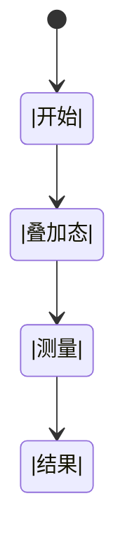
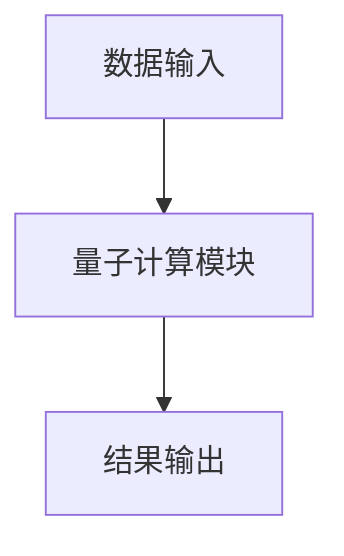

                 


# 芒格的"反向工程"思维在量子算法优化中的应用

---

## 关键词：
- 反向工程思维
- 量子算法
- 优化方法
- 算法设计
- 量子计算

---

## 摘要：
本文探讨了芒格的"反向工程"思维在量子算法优化中的应用，通过理论分析、算法设计和实际案例，展示了如何利用反向思维优化量子算法。文章从量子计算基础出发，分析反向工程思维的核心原理，结合数学模型和代码实现，展示其在解决实际问题中的潜力。

---

# 第1章: 芒格的"反向工程"思维与量子算法优化概述

## 1.1 芒格的"反向工程"思维
- **定义**：反向工程思维是通过分析结果逆向推导原因，寻找最优解决方案的方法。
- **特点**：注重逆向思考，寻找问题本质，常用于复杂系统优化。
- **应用领域**：商业、投资、工程设计等领域。

## 1.2 量子算法优化
- **基本概念**：利用量子计算特性，设计优化算法。
- **应用场景**：组合优化、复杂系统模拟等领域。

## 1.3 应用前景
- **优势**：提高计算效率，解决复杂问题。
- **挑战**：量子计算仍处于发展阶段，技术成熟度有限。

---

# 第2章: "反向工程"思维与量子算法优化的核心联系

## 2.1 理论基础
- **反向思维的哲学基础**：强调逆向思考的重要性。
- **量子算法的数学基础**：涉及线性代数和概率论。

## 2.2 方法论对比
| 对比维度 | 反向工程思维 | 量子算法优化 |
|----------|--------------|---------------|
| 思维模式 | 逆向推导     | 并行计算       |
| 应用场景 | 分析结果      | 解决复杂问题   |

## 2.3 实践应用
- **理论结合**：将反向思维应用于量子算法设计。
- **实际案例**：优化组合问题。

---

# 第3章: 量子计算基础

## 3.1 量子位与量子门
- **量子位**：用$|0\rangle$和$|1\rangle$表示。
- **量子门**：如H门、X门，其矩阵表示分别为：
  $$
  H = \frac{1}{\sqrt{2}} \begin{pmatrix} 1 & 1 \\ 1 & -1 \end{pmatrix}
  $$

## 3.2 量子叠加与纠缠
- **叠加**：$|q\rangle = \alpha|0\rangle + \beta|1\rangle$，其中$\alpha^2 + \beta^2 = 1$。
- **纠缠**：如Bell态：$|\phi\rangle = \frac{1}{\sqrt{2}}(|00\rangle + |11\rangle)$。

（使用mermaid图展示量子叠加和纠缠过程）



---

# 第4章: 反向工程思维在量子算法设计中的应用

## 4.1 核心原理
- **逆向分析**：通过结果推导最优路径。
- **量子优化**：利用量子计算特性，优化传统算法。

## 4.2 数学模型
- **目标函数**：$f(x) = \min_x g(x)$。
- **量子表示**：将优化问题转化为量子态。

## 4.3 实例分析
- 优化旅行商问题，通过反向思维设计量子算法。

---

# 第5章: 量子优化问题的建模与分析

## 5.1 建模方法
- **问题描述**：将实际问题转化为量子问题。
- **模型构建**：使用量子叠加表示变量。

## 5.2 实际案例
- **案例**：优化物流路径，使用量子算法降低时间复杂度。

---

# 第6章: 系统架构与实现方案

## 6.1 系统架构
- **模块划分**：数据输入、量子计算、结果输出。
- **架构图**：展示模块交互。



## 6.2 接口设计
- **输入接口**：接收优化参数。
- **输出接口**：返回最优解。

## 6.3 实现方案
- **代码实现**：使用Qiskit库，展示量子算法优化代码。

---

# 第7章: 项目实战

## 7.1 环境安装
- **工具**：安装Qiskit库和Python环境。

## 7.2 核心实现
- **代码示例**：展示量子算法优化的实现。

```python
from qiskit import QuantumCircuit, execute, Aer
def quantum_optimization(n):
    qc = QuantumCircuit(n)
    # 实现优化逻辑
    return qc
```

## 7.3 测试与分析
- **测试结果**：分析量子算法的优化效果。
- **性能对比**：与传统算法对比，展示优势。

---

# 第8章: 总结与展望

## 8.1 总结
- **创新点**：将反向思维应用于量子算法优化。
- **实际价值**：提升量子算法的效率和效果。

## 8.2 未来展望
- **技术发展**：量子计算技术的进一步成熟。
- **应用拓展**：在更多领域应用反向思维优化算法。

---

## 作者：
**作者：AI天才研究院 & 禅与计算机程序设计艺术**

---

通过以上内容，文章详细探讨了芒格的反向工程思维在量子算法优化中的应用，从理论到实践，结合代码实现和案例分析，展示了其在解决复杂问题中的潜力。

