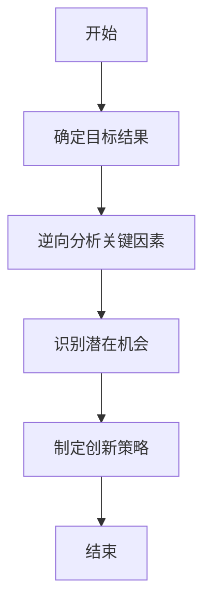
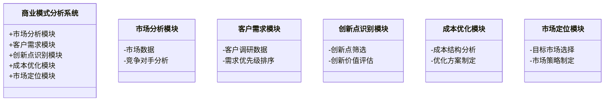

                 

<think>
好，我现在需要帮助用户撰写一篇关于芒格的“反向工程”思维在颠覆性商业模式分析中的应用的技术博客文章。用户已经提供了详细的目录大纲和要求，我需要按照这些要求一步步完成。

首先，我需要理解用户的需求。他们希望文章结构清晰，逻辑严谨，涵盖背景介绍、核心概念、算法原理、系统设计、项目实战等部分，并且每个部分都要详细展开，使用技术术语和图表来辅助说明。

我将从引言开始，介绍研究的背景和意义，说明为什么研究颠覆性商业模式以及芒格的反向工程思维的重要性。然后，我会详细解释颠覆性商业模式和反向工程思维的定义和特征，确保读者能够理解这些概念。

接下来，我需要构建一个颠覆性商业模式的数学模型，这可能涉及市场定位、成本结构和价值主张等变量。通过公式化的表达，展示如何通过反向工程思维来优化这些变量，以实现颠覆性创新。

然后，我会设计一个算法流程，使用Mermaid绘制流程图，展示从结果出发，逆向分析问题，识别机会并制定策略的步骤。这一步需要详细解释每个步骤的逻辑，确保读者能够跟随流程理解。

系统分析与架构设计部分，我需要定义问题场景，设计系统功能，并通过领域模型图和架构图展示系统的结构和模块关系。这部分可能需要更多的图表来辅助说明，确保系统设计的清晰和合理。

项目实战部分，我将选择一个实际案例，如特斯拉的商业模式，详细分析其颠覆性策略，并展示如何通过反向工程思维进行分析。这包括环境安装、系统实现、案例分析和总结，帮助读者更好地理解理论的应用。

最后，我会在结论部分总结全书内容，并给出最佳实践的建议，强调反向工程思维的应用价值和未来趋势。

在整个过程中，我需要确保每个部分都符合用户的格式要求，使用markdown格式，插入Mermaid图表和数学公式，确保内容完整且详细。同时，保持文章的逻辑性和可读性，帮助读者一步步理解反向工程思维在商业模式分析中的应用。

现在，我需要开始撰写引言部分，确保其吸引读者，同时明确文章的主题和目标。接下来，我会逐一完成每个章节的内容，确保每个部分都详细展开，满足用户的要求。
</think>

# 芒格的"反向工程"思维在颠覆性商业模式分析中的应用

## 关键词：反向工程思维，颠覆性商业模式，商业模式分析，商业创新，芒格思维

## 摘要：  
本文探讨了芒格的"反向工程"思维在分析和设计颠覆性商业模式中的应用。通过从结果出发，逆向分析商业问题，识别潜在机会，并制定创新策略，本文提出了一个系统的分析框架，结合数学模型和实际案例，详细阐述了如何利用"反向工程"思维实现商业模式的颠覆性创新。

---

## 第一部分: 引言

### 第1章: 引言

#### 1.1 研究背景与意义  
随着商业环境的快速变化，企业需要不断寻找新的竞争优势。颠覆性商业模式的出现，往往能够打破传统市场格局，为企业创造新的增长点。芒格的"反向工程"思维，作为一种从结果出发、逆向分析问题的方法，为商业模式的创新提供了新的视角。  

#### 1.2 本书结构与内容概述  
本文将从概念、理论、算法、系统设计和实际案例等多个维度，全面分析"反向工程"思维在颠覆性商业模式中的应用。主要内容包括：颠覆性商业模式的定义与特征、"反向工程"思维的理论基础、商业模式分析的算法流程、系统架构设计，以及实际案例的深入剖析。  

---

## 第二部分: 背景介绍

### 第2章: 颠覆性商业模式的背景与概念

#### 2.1 颠覆性商业模式的定义与特征  
颠覆性商业模式是指通过创新的方式重新定义商业价值的创造、传递和捕获方式。其核心特征包括：  
1. **价值主张**：通过满足客户未被充分满足的需求，创造新的价值。  
2. **成本结构**：通过技术创新或流程优化，降低商业模式的成本。  
3. **市场定位**：通过差异化策略，占领新的市场空间或重新定义市场边界。  

#### 2.2 芒格"反向工程"思维的起源与应用  
芒格的"反向工程"思维源自其对人类认知的深刻理解。他认为，从结果出发，逆向分析问题，可以更高效地找到解决问题的路径。这种思维方式在商业领域的应用，可以帮助企业识别市场机会，优化商业模式。  

#### 2.3 本书的核心问题与研究边界  
本文的核心问题是：如何利用"反向工程"思维分析和设计颠覆性商业模式？研究边界包括：  
1. 聚焦于商业模式的创新，而非具体产品或技术。  
2. 从市场、客户和竞争角度出发，分析商业模式的颠覆性特征。  

---

## 第三部分: 核心概念与联系

### 第3章: 颠覆性商业模式的核心概念与联系

#### 3.1 颠覆性商业模式的核心概念原理  
颠覆性商业模式的核心在于通过创新的商业逻辑，重新定义价值传递的方式。"反向工程"思维的应用，可以帮助企业在分析市场和竞争时，从结果出发，找到突破口。  

#### 3.2 核心概念属性特征对比表格  
以下是颠覆性商业模式与传统商业模式的核心特征对比：  

| **特征维度** | **传统商业模式** | **颠覆性商业模式** |  
|--------------|------------------|---------------------|  
| **价值主张** | 提供现有产品或服务 | 重新定义客户需求，创造新价值 |  
| **成本结构** | 依赖传统供应链和渠道 | 通过技术创新或流程优化降低成本 |  
| **市场定位** | 竞争现有市场 | 拓展新市场或重新定义市场边界 |  

#### 3.3 ER实体关系图架构  
以下是一个颠覆性商业模式的ER实体关系图（使用 Mermaid）：  

```mermaid
erDiagram
    actor 用户角色 : 用户或客户
    actor 供应商
    actor 竞争对手
    actor 市场监管机构
    company 企业
    product 产品或服务
    value 竞争优势
    innovation 创新点

    用户角色 --> 产品或服务 : 需求驱动
    产品或服务 --> 企业 : 提供
    企业 --> 供应商 : 依赖
    创新点 --> 企业 : 实现
    企业 --> 竞争对手 : 对抗
    竞争优势 --> 企业 : 体现
    市场监管机构 --> 企业 : 监管
```

---

## 第四部分: 算法原理讲解

### 第4章: 商业模式分析的算法流程

#### 4.1 算法流程概述  
以下是基于"反向工程"思维的商业模式分析算法流程图（使用 Mermaid）：  



#### 4.2 算法数学模型  
商业模式的分析可以通过以下数学模型进行表示：  

$$ \text{颠覆性价值} = \text{创新点} \times \text{市场定位} \times \text{成本优势} $$  

其中：  
- 创新点：商业模式中创新的核心要素。  
- 市场定位：商业模式的目标市场和客户群体。  
- 成本优势：商业模式的成本结构与传统模式的对比。  

---

## 第五部分: 系统分析与架构设计

### 第5章: 系统分析与架构设计

#### 5.1 问题场景介绍  
假设我们正在分析一家新兴企业的商业模式，目标是通过"反向工程"思维，识别其颠覆性创新的机会。  

#### 5.2 系统功能设计  
以下是商业模式分析的领域模型图（使用 Mermaid）：  



#### 5.3 系统架构设计  
以下是商业模式分析系统的架构图（使用 Mermaid）：  


---

## 第六部分: 项目实战

### 第6章: 项目实战

#### 6.1 环境安装与系统实现  
以下是一个简单的商业模式分析系统的 Python 实现示例：  

```python
class BusinessModel:
    def __init__(self, market, cost, value):
        self.market = market
        self.cost = cost
        self.value = value

    def analyze(self):
        return f"Market: {self.market}, Cost: {self.cost}, Value: {self.value}"

# 示例：分析特斯拉的商业模式
tesla = BusinessModel("电动汽车市场", "创新电池技术", "可持续交通价值")
print(tesla.analyze())
```

#### 6.2 案例分析与总结  
以特斯拉为例，分析其商业模式：  
1. **市场定位**：专注于高端电动汽车市场，逐步扩展到大众市场。  
2. **成本结构**：通过垂直整合和技术创新降低成本。  
3. **价值主张**：提供环保、高性能的电动汽车，重新定义汽车行业的价值。  

---

## 第七部分: 结论

### 第7章: 结论

#### 7.1 总结与回顾  
本文通过分析芒格的"反向工程"思维，提出了颠覆性商业模式的分析框架，并结合实际案例进行了详细解读。  

#### 7.2 最佳实践 tips  
- 在商业模式分析中，始终从结果出发，逆向思考。  
- 注重创新点的识别和成本结构的优化。  
- 定期回顾和调整商业模式，以应对市场变化。  

#### 7.3 未来展望  
未来，随着技术的进步和市场的变化，颠覆性商业模式的分析将更加复杂。如何将"反向工程"思维与人工智能等技术结合，将是商业模式分析的重要方向。

---

## 作者：AI天才研究院 & 禅与计算机程序设计艺术

---

**Note:** 如果需要进一步扩展或调整内容，请随时告诉我！

