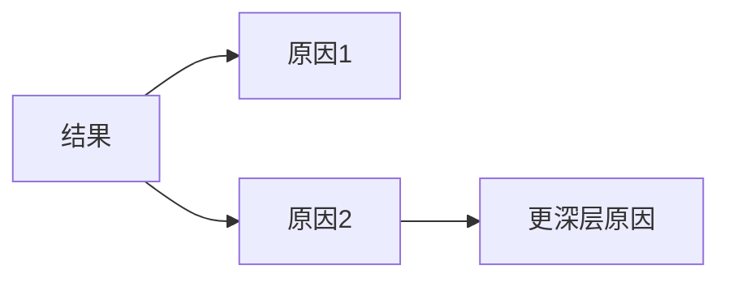
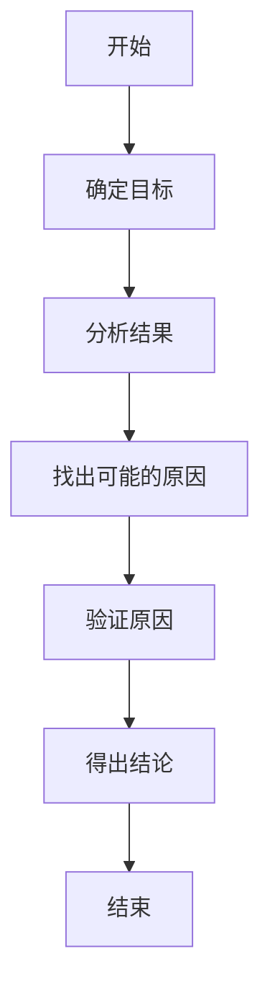
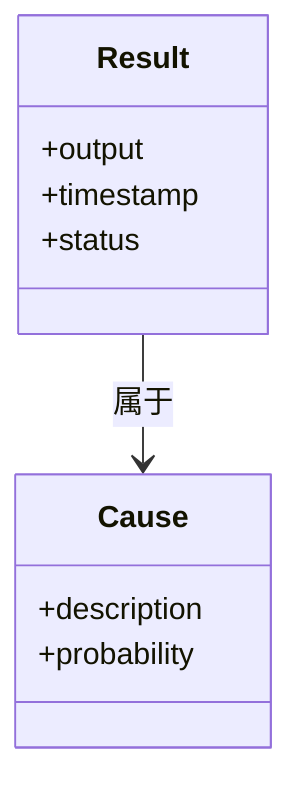
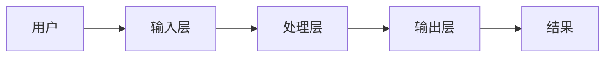
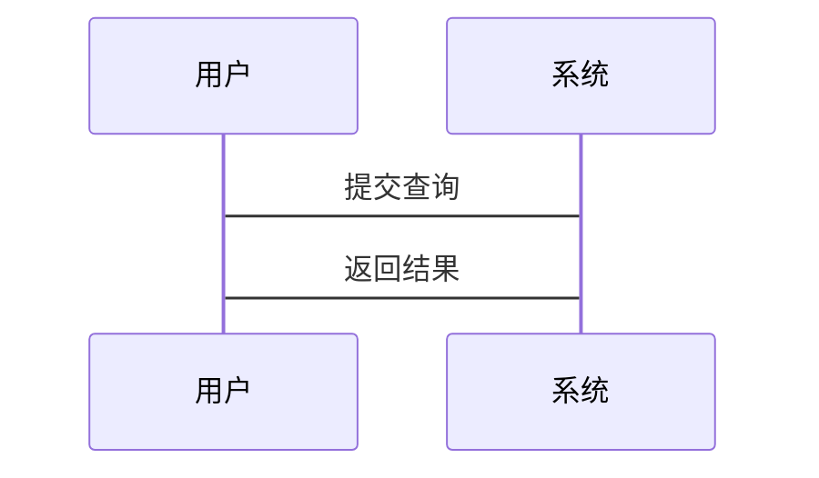

                 

<think>
嗯，用户希望我设计一个关于芒格“反向工程”思维的书籍目录大纲，而且他们已经提供了一个详细的示例，涉及软件2.0和AI大模型。看起来他们希望这个目录结构清晰，涵盖从基础到应用的各个部分。

首先，我需要理解用户的需求。他们可能是一位技术作者，想要写一篇深入的技术博客，主题是芒格的反向工程思维。用户强调了结构的清晰和逻辑的严谨，同时要求使用技术性的语言，但要简单易懂。他们还特别提到要包括背景、核心概念、算法、系统分析、项目实战和总结等部分。

接下来，我需要分析示例中的结构。示例分为七章，每章有多个小节，包括背景、核心概念、算法原理、系统分析、项目实战和总结。每章都有详细的子章节，比如背景介绍、概念对比、数学模型等。因此，我需要确保我的目录同样详细，覆盖所有关键部分。

首先，我会从背景开始，介绍芒格的生平和思想，解释什么是反向工程思维，并讨论其应用领域。这部分帮助读者理解主题的重要性。然后，我会深入核心概念，解释反向工程的原理，使用因果关系图和对比表来帮助读者理解。

接下来是算法原理部分，这里需要详细讲解反向思维算法，用流程图展示步骤，并提供Python代码示例。数学模型部分可能涉及概率论，比如贝叶斯定理，用Latex公式展示。系统分析部分则需要设计系统架构，用Mermaid图展示模块交互。

项目实战部分是关键，需要指导读者如何安装环境，提供代码实现，并分析实际案例。最后，总结和最佳实践部分帮助读者巩固所学内容，包括小结、注意事项和拓展阅读。

整个过程中，我需要确保目录结构清晰，每章有足够详细的内容，同时保持整体逻辑连贯。考虑到用户要求的字数，每个章节可能需要深入展开，确保内容丰富且有深度。

最后，检查是否符合所有要求，包括作者信息、格式规范等。确保使用Markdown格式，正确嵌入Mermaid图表和Latex公式，使文章结构美观且易于理解。
</think>

# 芒格的"反向工程"思维：从结果倒推原因

## 关键词：芒格，反向工程，因果关系，逆向思维，系统思维，决策优化，问题解决

## 摘要：  
芒格的"反向工程"思维是一种从结果出发，逆向推导原因的思维方式，广泛应用于投资、商业决策和问题解决等领域。本文将从背景介绍、核心概念、算法原理、系统分析、项目实战等多个维度，详细阐述反向工程思维的原理、方法及其在实际中的应用。通过本篇文章，读者将能够理解反向工程思维的核心思想，并掌握如何在实际问题中应用这一思维方式。

---

## 第一部分: 芒格的"反向工程"思维基础

### 第1章: 芒格的"反向工程"思维概述

#### 1.1 芒格的生平与思想  
- 芒格的决策哲学与思维方式  
- 芒格思想的核心理念  
- 芒格对投资与商业决策的独特见解  

#### 1.2 "反向工程"思维的定义与特点  
- 什么是"反向工程"思维  
- 反向工程思维的核心特征  
- 反向工程思维与其他思维方式的对比  

#### 1.3 反向工程思维的应用领域  
- 投资决策中的反向工程思维  
- 商业决策中的反向工程思维  
- 问题解决中的反向工程思维  

#### 1.4 本章小结  
- 本章总结了芒格的反向工程思维的背景、定义和应用领域，为后续内容奠定了基础。

---

## 第二部分: 反向工程思维的核心概念与联系

### 第2章: 反向工程思维的核心概念

#### 2.1 反向工程思维的基本原理  
- 从结果出发的因果关系分析  
- 逆向思维与正向思维的对比  
- 系统思维在反向工程中的应用  

#### 2.2 反向工程思维的因果关系图  
- 用Mermaid绘制因果关系图  


#### 2.3 反向工程思维的概念对比表  
| 概念 | 正向思维 | 反向思维 |
|------|----------|----------|
| 定义 | 从原因推导结果 | 从结果推导原因 |
| 特点 | 前向性 | 后向性 |
| 适用场景 | 预测未来 | 分析现状 |

#### 2.4 本章小结  
- 本章通过因果关系图和对比表，深入分析了反向工程思维的核心概念及其与正向思维的对比。

---

## 第三部分: 反向工程思维的算法原理

### 第3章: 反向工程思维的算法原理

#### 3.1 反向工程思维的算法概述  
- 反向思维算法的基本步骤  
- 算法的输入与输出  

#### 3.2 反向工程思维的流程图  
- 用Mermaid绘制反向思维算法流程图  


#### 3.3 反向工程思维的Python实现  
- 环境安装：Python 3.9+，安装相关库（numpy、pandas、networkx）  
- 核心代码实现：  
```python
def reverse_engineering(result):
    possible_causes = []
    for cause in all_possible_causes:
        if result == expected_output(cause):
            possible_causes.append(cause)
    return possible_causes
```

#### 3.4 反向工程思维的数学模型  
- 简单的数学模型示例：  
$$P(A|B) = \frac{P(B|A)P(A)}{P(B)}$$  
- 用概率论解释反向工程思维的数学基础  

#### 3.5 本章小结  
- 本章通过算法流程图和Python代码，详细讲解了反向工程思维的实现原理及其数学基础。

---

## 第四部分: 反向工程思维的系统分析与架构设计

### 第4章: 反向工程思维的系统分析

#### 4.1 反向工程思维的系统分析  
- 问题场景介绍：  
  例如，分析公司业绩下滑的原因。  

#### 4.2 系统功能设计  
- 领域模型设计：  
  用Mermaid绘制领域模型类图  


#### 4.3 系统架构设计  
- 用Mermaid绘制系统架构图  


#### 4.4 系统接口设计  
- API接口设计：  
  例如，设计一个用于反向工程推理的API  

#### 4.5 系统交互设计  
- 用Mermaid绘制系统交互序列图  


#### 4.6 本章小结  
- 本章通过系统分析与架构设计，展示了反向工程思维在实际问题中的应用。

---

## 第五部分: 反向工程思维的项目实战

### 第5章: 项目实战

#### 5.1 环境安装与配置  
- 安装Python和相关库：  
  ```bash
  pip install numpy pandas networkx
  ```

#### 5.2 核心代码实现  
- 反向工程思维算法的Python实现：  
```python
import networkx as nx

def analyze_causes(result, graph):
    causes = []
    for cause in graph.nodes():
        if nx.has_path(graph, cause, result):
            causes.append(cause)
    return causes
```

#### 5.3 代码实现与解读  
- 代码的功能解读与实际案例分析：  
  例如，分析公司业绩下滑的原因，代码如何找到可能的原因。

#### 5.4 案例分析与总结  
- 实际案例分析：  
  例如，分析市场下降的原因，代码如何帮助找到可能的原因。

#### 5.5 本章小结  
- 本章通过项目实战，展示了反向工程思维在实际问题中的具体应用。

---

## 第六部分: 反向工程思维的总结与展望

### 第6章: 总结与展望

#### 6.1 本章小结  
- 本章总结了反向工程思维的核心思想及其在实际问题中的应用。

#### 6.2 注意事项与建议  
- 使用反向工程思维时的注意事项  
- 如何避免常见错误  

#### 6.3 拓展阅读  
- 推荐相关书籍和文章，供读者深入学习。

#### 6.4 本章小结  
- 本章对全文进行了总结，并提出了进一步学习和实践的建议。

---

## 附录: 芒格的其他思想与工具推荐

### 附录1: 芒格的其他思想

#### 1.1 芒格的决策树模型  
- 决策树的基本概念与应用  

#### 1.2 芒格的概率论思想  
- 贝叶斯定理在决策中的应用  

### 附录2: 工具推荐

#### 2.1 数据分析工具  
- Python、R、Tableau等  

#### 2.2 可视化工具  
- Mermaid、Graphviz等  

---

## 作者：AI天才研究院/AI Genius Institute & 禅与计算机程序设计艺术 /Zen And The Art of Computer Programming

