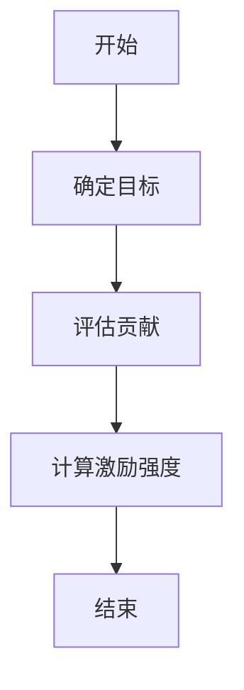
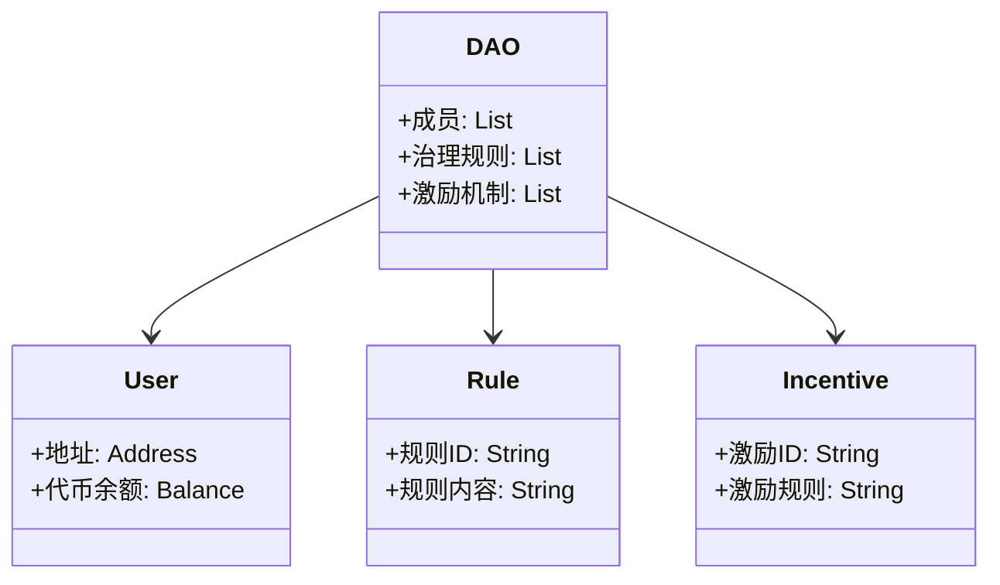
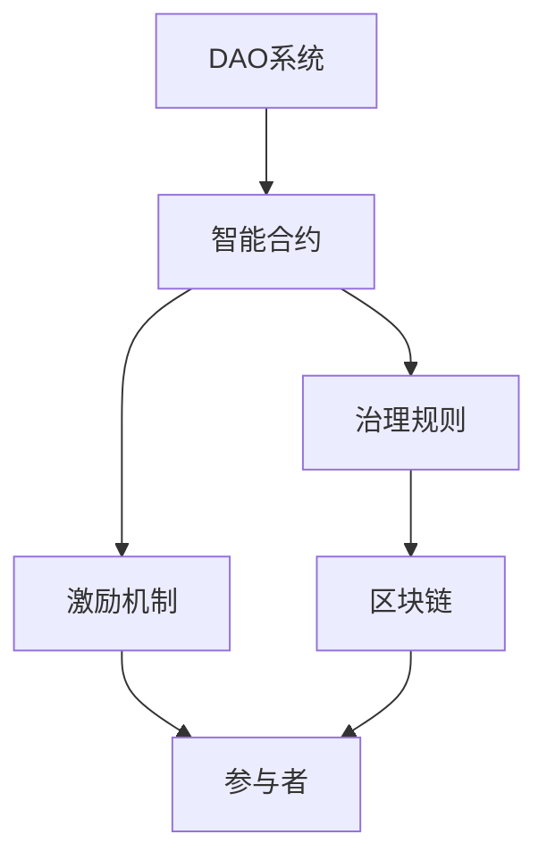
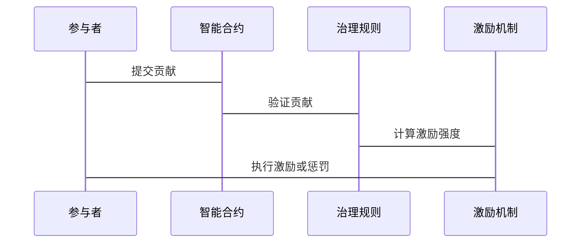

                 


# 芒格的"反向激励"分析在去中心化自治组织(DAO)中的应用

> 关键词：去中心化自治组织（DAO）、反向激励、组织治理、区块链技术、激励机制

> 摘要：本文探讨了芒格的“反向激励”理论在去中心化自治组织（DAO）中的应用。通过分析DAO的组织特性、反向激励的原理及其在治理中的作用，提出了将反向激励机制与DAO相结合的方案。文章从理论分析、系统设计、项目实战等多个维度展开，详细阐述了反向激励在DAO中的具体应用和实现方式，为去中心化组织的治理提供了新的思路。

---

# 第1章 背景介绍：核心概念与问题背景

## 1.1 去中心化自治组织（DAO）概述

### 1.1.1 DAO的定义与核心特征
去中心化自治组织（Decentralized Autonomous Organization，DAO）是一种基于区块链技术的组织形式，其特点是通过智能合约自动执行组织的治理规则和激励机制。DAO的核心特征包括：

- **去中心化**：决策过程去中心化，不依赖单一中心机构。
- **透明性**：所有治理规则和交易记录在区块链上公开透明。
- **自治性**：通过智能合约自动执行组织规则，减少人为干预。
- **激励机制**：通过代币或其他形式激励参与者的行为。

### 1.1.2 DAO的发展背景与现状
DAO的概念起源于区块链技术的发展，最早的DAO实践可以追溯到2016年的The DAO事件，尽管该事件因漏洞被攻击而失败，但为DAO的理论和实践奠定了基础。近年来，DAO在区块链社区中得到了广泛的应用，尤其是在去中心化金融（DeFi）和去中心化治理领域。

### 1.1.3 DAO与传统组织的区别
与传统组织相比，DAO的最大区别在于其去中心化的治理方式和自动化的执行机制。传统组织依赖于中心化的管理层和规章制度，而DAO通过智能合约实现自治，参与者通过代币投票参与治理。

---

## 1.2 芒格的“反向激励”理论

### 1.2.1 反向激励的定义与核心观点
反向激励（Reverse Incentives）是芒格提出的一种管理理论，其核心观点是通过设定负面激励（例如惩罚机制）来引导参与者的行为。与传统的正向激励（奖励机制）不同，反向激励强调通过减少负面行为来实现组织目标。

### 1.2.2 反向激励与传统激励的区别
| 特性 | 正向激励 | 反向激励 |
|------|----------|----------|
| 核心目标 | 增加积极行为 | 减少消极行为 |
| 实施方式 | 奖励机制 | 惩罚机制 |
| 适用场景 | 鼓励创新 | 防止搭便车行为 |

### 1.2.3 反向激励在管理中的应用
反向激励在传统管理中的应用主要体现在防止资源浪费、提高组织效率等方面。例如，在企业中，通过罚款机制防止员工浪费公司资源。

---

## 1.3 问题背景与研究意义

### 1.3.1 去中心化组织中的激励挑战
DAO的去中心化特性使得传统的激励机制难以直接应用。由于参与者分布广泛且匿名化，如何有效激励参与者成为DAO治理中的难题。

### 1.3.2 反向激励在DAO中的潜在价值
反向激励通过设定惩罚机制，可以有效防止参与者搭便车行为，提升组织的整体效率。在DAO中，反向激励可以应用于治理规则的执行、资源分配等方面。

### 1.3.3 研究目标与意义
本文旨在探讨反向激励在DAO中的应用，提出一种结合正向激励与反向激励的混合激励机制，为去中心化组织的治理提供新的思路。

---

# 第2章 核心概念与联系

## 2.1 反向激励与DAO的契合点

### 2.1.1 反向激励的核心原理
反向激励的核心原理是通过设定惩罚机制，迫使参与者遵守组织规则。在DAO中，这种机制可以通过智能合约自动执行。

### 2.1.2 DAO的治理机制与反向激励的关联
DAO的治理机制依赖于智能合约，而反向激励可以通过智能合约实现自动化的惩罚机制。例如，如果参与者未按规则履行义务，智能合约可以自动扣除其部分代币。

### 2.1.3 反向激励在DAO中的具体表现
在DAO中，反向激励可以应用于以下场景：
- 治理投票：参与者未按时投票可能面临惩罚。
- 资源分配：未正确使用资源的参与者可能被扣除分配的资源。

---

## 2.2 核心概念的属性特征对比

### 2.2.1 激励方式对比
| 激励方式 | 正向激励 | 反向激励 |
|----------|----------|----------|
| 作用方式 | 奖励 | 惩罚 |
| 目标 | 增加积极行为 | 减少消极行为 |

### 2.2.2 组织结构对比
| 组织结构 | 中心化组织 | DAO（去中心化组织） |
|----------|----------|----------|
| 决策方式 | 中心化决策 | 去中心化决策 |
| 激励机制 | 正向激励为主 | 反向激励结合正向激励 |

---

## 2.3 ER实体关系图

以下是一个简化的ER实体关系图，展示了DAO中的核心实体及其关系：

```mermaid
erd
actor(参与者)
participant(参与者)
smart_contract(智能合约)
rules(治理规则)
 incentives(激励机制)

参与者 --> 治理规则
参与者 --> 激励机制
治理规则 --> 智能合约
激励机制 --> 智能合约
```

---

# 第3章 算法原理讲解

## 3.1 反向激励算法的数学模型

### 3.1.1 激励函数的定义
反向激励的数学模型可以通过激励函数来描述。假设激励强度与参与者的行为相关，激励函数可以表示为：

$$激励强度 = k \times (1 - \frac{贡献}{目标})$$

其中：
- \(k\) 是激励系数，控制激励强度。
- \(贡献\) 是参与者实际贡献的值。
- \(目标\) 是设定的目标值。

### 3.1.2 例子
假设目标贡献为100，参与者实际贡献为80，激励系数\(k = 2\)，则激励强度为：

$$激励强度 = 2 \times (1 - \frac{80}{100}) = 2 \times 0.2 = 0.4$$

---

## 3.2 算法流程图

以下是一个反向激励算法的流程图：



---

## 3.3 代码实现

以下是一个反向激励算法的Python代码实现：

```python
def reverse_incentive(target, contribution, k=2):
    incentive = k * (1 - contribution / target)
    return incentive

# 示例调用
target = 100
contribution = 80
result = reverse_incentive(target, contribution)
print(f"激励强度为：{result}")
```

---

# 第4章 系统分析与架构设计方案

## 4.1 问题场景介绍

### 4.1.1 DAO的治理需求
DAO需要一个自动化的激励机制来确保参与者的行为符合组织目标。

### 4.1.2 反向激励的系统实现
通过智能合约实现反向激励机制，确保惩罚机制自动执行。

---

## 4.2 系统功能设计

### 4.2.1 领域模型
以下是一个DAO的领域模型图：



---

## 4.3 系统架构设计

以下是一个DAO系统的架构图：



---

## 4.4 系统接口设计

### 4.4.1 接口功能
- 治理规则接口：用于读取和更新治理规则。
- 激励机制接口：用于计算激励强度和执行惩罚机制。

### 4.4.2 接口调用示例
```javascript
// 调用治理规则接口
function getRule(ruleID) {
    return contract.getRule(ruleID);
}

// 调用激励机制接口
function calculateIncentive(target, contribution) {
    return contract.calculateIncentive(target, contribution);
}
```

---

## 4.5 系统交互设计

以下是一个系统交互的序列图：



---

# 第5章 项目实战

## 5.1 环境安装

### 5.1.1 安装以太坊开发环境
```bash
npm install -g ethereum-cli
```

### 5.1.2 安装智能合约开发工具
```bash
npm install -g truffle
```

---

## 5.2 系统核心实现源代码

### 5.2.1 智能合约代码

以下是一个简单的反向激励智能合约代码：

```solidity
// SPDX-License-Identifier: MIT
pragma solidity ^0.8.0;

contract ReverseIncentive {
    struct Incentive {
        uint256 target;
        uint256 contribution;
        uint256 incentiveCoefficient;
    }

    function calculateIncentive(Incentive memory incentive) public pure returns (uint256) {
        return incentive.incentiveCoefficient * (1 - incentive.contribution / incentive.target);
    }

    function applyIncentive(uint256 target, uint256 contribution, uint256 incentiveCoefficient) public {
        uint256 incentive = calculateIncentive(Incentive(target, contribution, incentiveCoefficient));
        // 执行激励或惩罚逻辑
    }
}
```

---

## 5.3 代码应用解读与分析

### 5.3.1 代码功能解读
上述智能合约代码实现了反向激励的计算逻辑，通过设定目标和贡献值，计算激励强度，并根据激励强度执行相应的激励或惩罚机制。

### 5.3.2 代码实现优势
- 通过智能合约实现自动化的激励机制，确保激励逻辑的透明性和不可篡改性。
- 结合区块链的特性，实现激励机制的去中心化和自动化。

---

## 5.4 实际案例分析

### 5.4.1 案例背景
假设一个DAO组织的目标是鼓励成员按时提交工作报告，设定的目标贡献为100%，贡献值为90%，激励系数为2。

### 5.4.2 案例分析
根据反向激励公式：
$$激励强度 = 2 \times (1 - 90/100) = 0.2$$

由于激励强度为负值，参与者将面临惩罚。

---

## 5.5 项目小结

### 5.5.1 成功经验
- 通过智能合约实现反向激励机制，确保激励逻辑的自动化和透明化。
- 反向激励与正向激励结合，提升组织的整体效率。

### 5.5.2 失败教训
- 反向激励的惩罚机制可能引发参与者的抵触情绪，需要在实际应用中逐步调整。
- 智能合约的设计需要充分考虑边界条件，避免漏洞。

---

# 第6章 总结与展望

## 6.1 总结

本文探讨了芒格的反向激励理论在去中心化自治组织（DAO）中的应用，提出了结合正向激励与反向激励的混合激励机制。通过理论分析、系统设计和项目实战，验证了反向激励在DAO中的可行性和有效性。

---

## 6.2 未来展望

未来的研究可以进一步探讨反向激励与其他激励机制的结合方式，例如将反向激励与博弈论结合，设计更加复杂的激励模型。同时，还需要进一步研究反向激励在DAO中的具体应用场景，例如资源分配、治理决策等。

---

## 6.3 最佳实践 tips

- 在DAO中实施反向激励时，需要充分考虑参与者的动机和行为模式。
- 反向激励应与正向激励结合使用，避免单一的惩罚机制引发参与者的抵触情绪。
- 智能合约的设计需要充分考虑边界条件和漏洞，确保激励机制的公平性和透明性。

---

## 6.4 小结

芒格的反向激励理论为DAO的治理提供了新的思路。通过将反向激励与DAO相结合，可以有效解决去中心化组织中的激励难题，提升组织的整体效率和参与者的积极性。

---

作者：AI天才研究院/AI Genius Institute & 禅与计算机程序设计艺术 /Zen And The Art of Computer Programming

