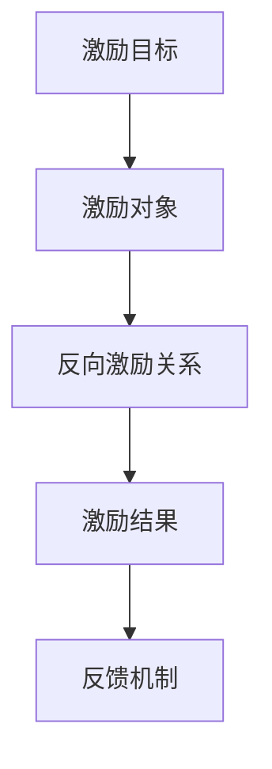
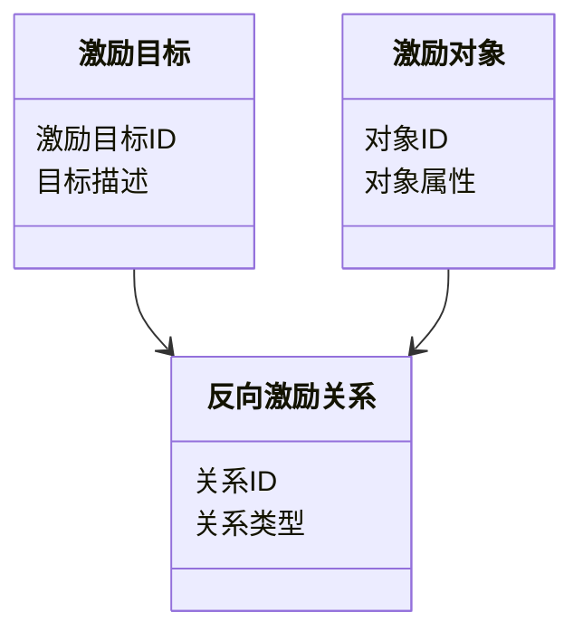

                 


# 芒格的"反向激励"分析在科技创业生态系统中的应用

---

## 关键词：反向激励, 科技创业, 芒格思想, 系统架构, 算法模型, 逆向思维, 项目实战

---

## 摘要：  
芒格的“反向激励”思想是一种以逆向思维为核心的分析方法，其核心在于通过分析问题的对立面或反方向，找到解决问题的新思路。本文将从背景介绍、核心概念、算法原理、系统架构、项目实战等多个维度，详细阐述芒格的“反向激励”分析在科技创业生态系统中的应用。通过案例分析和代码实现，帮助读者理解如何将反向激励思想应用到实际项目中，优化系统设计和提升创新能力。

---

## 第一部分：背景介绍

### 第1章：芒格的“反向激励”概述

#### 1.1 反向激励的定义与核心概念
反向激励是一种以逆向思维为核心的分析方法，其本质是通过分析问题的对立面或反方向，找到解决问题的新思路。芒格的“反向激励”思想强调从反方向入手，通过分析失败案例或潜在风险，优化商业模式或产品设计。

#### 1.2 科技创业生态系统的构成
科技创业生态系统由多个核心要素组成，包括创业者、投资者、技术、市场、政策等。这些要素相互作用，共同构成了一个复杂的系统。反向激励在其中的作用是通过分析潜在风险和失败案例，优化系统的运行效率。

#### 1.3 芒格思想与现代科技创业的结合
芒格的“反向激励”思想在现代科技创业中的应用，主要体现在以下几个方面：
1. 通过分析失败案例，避免重复犯错。
2. 通过逆向思维，发现市场空白或潜在机会。
3. 通过反向激励，优化团队协作和资源配置。

---

## 第二部分：核心概念与联系

### 第2章：反向激励的核心原理

#### 2.1 反向激励的原理分析
反向激励的原理可以通过以下步骤进行分析：
1. 确定激励目标：明确需要优化的目标或问题。
2. 分析激励对象：识别与目标相关的对象或系统。
3. 设定反向激励策略：通过反向思维，制定激励策略。
4. 实施与反馈：将策略应用于实际场景，并根据反馈进行调整。

#### 2.2 反向激励的核心要素
反向激励的核心要素包括激励目标、激励对象、激励关系和激励结果。通过构建ER实体关系图，可以清晰地展示这些要素之间的关系。

```mermaid
entityDiagram {
  class 激励目标 {
    激励目标ID
    目标描述
  }
  class 激励对象 {
    对象ID
    对象属性
  }
  class 反向激励关系 {
    关系ID
    关系类型
  }
  激励目标 --> 反向激励关系
  激励对象 --> 反向激励关系
}
```

---

## 第三部分：算法原理讲解

### 第3章：反向激励的算法模型

#### 3.1 反向激励模型的构建
反向激励模型的构建过程如下：
1. 模型输入：激励目标与激励对象。
2. 模型输出：反向激励策略。
3. 数学表达式：
$$激励策略 = f(反向激励目标, 激励对象属性)$$

#### 3.2 算法流程图


#### 3.3 Python实现示例
以下是反向激励算法的Python实现示例：

```python
def reverse_incentive(incentive_target, incentive_object):
    # 激励目标与激励对象的
    for target in incentive_target:
        for obj in incentive_object:
            # 反向激励关系
            if target not in obj:
                print(f"反向激励关系：{target} -> {obj}")
    return "反向激励策略已生成"

# 示例调用
incentive_target = ["优化效率", "降低风险"]
incentive_object = ["团队协作", "资源配置"]
result = reverse_incentive(incentive_target, incentive_object)
print(result)
```

---

## 第四部分：系统分析与架构设计

### 第4章：系统分析与架构设计

#### 4.1 项目背景介绍
本项目旨在通过反向激励思想优化科技创业生态系统的运行效率。通过分析失败案例和潜在风险，优化团队协作和资源配置。

#### 4.2 系统功能设计（领域模型）


#### 4.3 系统架构设计


---

## 第五部分：项目实战

### 第5章：项目实战

#### 5.1 环境安装
需要安装以下工具：
1. Python 3.x
2. Mermaid 图表工具
3. Markdown 编辑器

#### 5.2 系统核心实现
以下是反向激励算法的核心代码实现：

```python
def reverse_incentive(incentive_target, incentive_object):
    # 激励目标与激励对象的
    for target in incentive_target:
        for obj in incentive_object:
            # 反向激励关系
            if target not in obj:
                print(f"反向激励关系：{target} -> {obj}")
    return "反向激励策略已生成"

# 示例调用
incentive_target = ["优化效率", "降低风险"]
incentive_object = ["团队协作", "资源配置"]
result = reverse_incentive(incentive_target, incentive_object)
print(result)
```

#### 5.3 案例分析
以一家科技创业公司为例，分析如何通过反向激励优化资源配置：
1. 激励目标：优化效率，降低风险。
2. 激励对象：团队协作，资源配置。
3. 反向激励关系：通过分析失败案例，优化资源配置策略。

#### 5.4 项目小结
通过反向激励算法，可以有效优化科技创业生态系统的运行效率，减少资源浪费，提高团队协作能力。

---

## 第六部分：总结与扩展阅读

### 第6章：总结与扩展阅读

#### 6.1 总结
芒格的“反向激励”思想在科技创业生态系统中的应用，可以帮助创业者通过逆向思维优化资源配置，避免重复犯错，发现市场空白，提升创新能力。

#### 6.2 最佳实践 tips
1. 在实际项目中，结合具体场景灵活应用反向激励思想。
2. 使用工具辅助分析，如Mermaid图表、Python代码等。

#### 6.3 注意事项
- 反向激励思想的应用需要结合具体场景，避免生搬硬套。
- 在实际操作中，需注重反馈机制的建立和优化。

#### 6.4 拓展阅读
- 《芒格的决策哲学》
- 《逆向思维与商业策略》
- 《系统思维与科技创业》

---

## 作者：AI天才研究院/AI Genius Institute & 禅与计算机程序设计艺术 /Zen And The Art of Computer Programming

