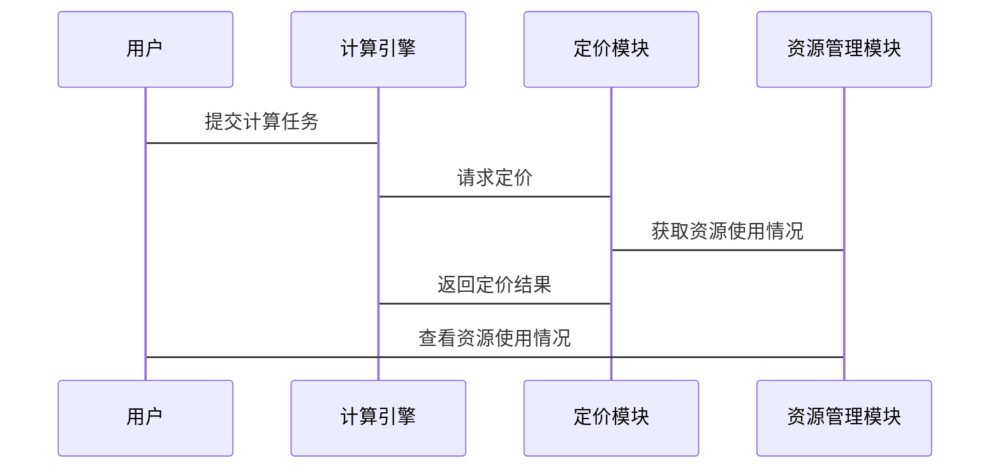

                 


# 芒格的"反向激励"分析在量子计算云服务定价中的应用

---

## 关键词

- 量子计算
- 反向激励分析
- 云服务定价
- 定价模型
- 系统架构

---

## 摘要

本文探讨了芒格的“反向激励”分析方法在量子计算云服务定价中的应用。通过分析量子计算的基本原理、云服务定价的挑战以及反向激励分析的数学模型，本文提出了一种结合反向激励分析的定价策略，以优化量子计算云服务的定价模型。文章从理论基础、系统设计到实际应用，详细阐述了如何利用反向激励分析来解决量子计算云服务定价中的关键问题。

---

## 第1章 引言

### 1.1 问题背景

量子计算作为一种新兴的计算技术，正在改变我们对计算能力的认知。量子计算云服务（Quantum Computing as a Service, QCaaS）的出现，使得企业能够通过云平台访问量子计算机的能力，而无需自行购买和维护昂贵的量子计算设备。然而，量子计算云服务的定价策略是一个复杂的挑战，需要考虑技术复杂性、市场需求、成本结构以及竞争环境等多重因素。

传统的定价方法往往基于正向思维，即从成本、需求和竞争等因素出发，推导出一个定价策略。然而，这种方法在面对复杂系统时常常显得力不从力。芒格的“反向激励”分析提供了一种逆向思维的方法，即从结果出发，推导出实现该结果的必要条件。这种方法在解决复杂问题时往往能够提供新的视角和解决方案。

### 1.2 研究意义

量子计算云服务的定价策略直接影响服务的市场竞争力和盈利能力。如何在确保合理利润的同时，吸引更多的用户使用量子计算云服务，是一个亟待解决的问题。芒格的反向激励分析提供了一种从目标出发，逆向推导定价策略的方法，这在量子计算云服务定价中具有重要的应用价值。

通过反向激励分析，我们可以更好地理解用户的需求、市场的竞争状况以及成本结构之间的关系，从而制定出更加科学和合理的定价策略。这种方法不仅可以提高企业的市场竞争力，还可以推动量子计算技术的普及和应用。

### 1.3 研究方法与框架

本文采用反向激励分析法作为研究的核心方法，结合量子计算的基本原理和云服务定价的理论，构建了一个综合的定价模型。具体的研究框架如下：

1. **理论基础**：介绍芒格的反向激励分析、量子计算的基本原理以及云服务定价的基本方法。
2. **反向激励分析的应用**：详细探讨反向激励分析在量子计算云服务定价中的具体应用，包括定价策略的选择和定价模型的构建。
3. **系统设计与实现**：从系统架构设计、接口设计到具体实现，详细阐述如何将反向激励分析应用于量子计算云服务的定价系统中。
4. **案例分析与实战**：通过实际案例分析，验证反向激励分析在量子计算云服务定价中的有效性和实用性。

---

## 第2章 芒格的反向激励分析

### 2.1 反向激励分析的概念

反向激励分析是一种逆向思维的方法，其核心思想是通过分析目标状态，推导出实现该目标的必要条件。这种方法在解决复杂问题时具有显著的优势，因为它能够从整体出发，找到解决问题的关键路径。

#### 2.1.1 分析方法与步骤

1. **明确目标**：确定需要实现的目标或结果。
2. **分解目标**：将目标分解为若干个关键因素。
3. **逆向推导**：从目标出发，逆向推导出实现该目标所需的条件。
4. **验证假设**：验证每个条件的合理性和可行性。

### 2.2 反向激励分析的数学模型

反向激励分析的数学模型可以通过以下公式表示：

$$ P = \frac{1}{(x - a)} $$

其中，$P$ 表示定价策略，$x$ 表示市场变量，$a$ 表示基准参数。该公式描述了定价策略与市场变量之间的关系，通过调整 $a$ 的值，可以实现对定价策略的优化。

---

## 第3章 量子计算的基本原理

### 3.1 量子计算的核心概念

量子计算的核心在于利用量子位（qubit）的叠加态和纠缠态来实现并行计算。与经典计算机中的二进制位不同，量子位可以同时处于多个状态的叠加态。

#### 3.1.1 量子叠加与量子纠缠

量子叠加是指量子位可以同时处于多个状态的叠加态，而量子纠缠则是指两个或多个量子位之间存在强关联，一个量子位的状态会直接影响另一个量子位的状态。

### 3.2 量子计算的优势与局限性

#### 3.2.1 优势

1. **计算速度**：在某些特定问题上，量子计算机可以大幅超越经典计算机的计算速度。
2. **并行计算**：量子计算机可以同时处理大量数据，提高计算效率。

#### 3.2.2 局限性

1. **技术复杂性**：量子计算机的制造和维护需要高度专业的技术和设备。
2. **稳定性**：量子态的叠加态容易受到外界干扰，导致计算错误。

---

## 第4章 云服务定价模型

### 4.1 云服务定价的基本策略

云服务定价通常采用以下几种策略：

1. **按需定价**：根据用户实际使用的资源量进行计费。
2. **预付费定价**：用户预先支付一定的费用，获得固定的资源使用权限。
3. **拉姆齐定价**：基于用户的需求弹性进行定价。

### 4.2 反向激励分析在定价中的应用

#### 4.2.1 定价策略的选择

反向激励分析可以帮助我们从目标定价出发，逆向推导出实现该定价所需的市场条件和成本结构。

#### 4.2.2 定价模型的构建

通过反向激励分析，我们可以构建一个基于市场变量的定价模型：

$$ P = f(x, y, z) $$

其中，$P$ 表示定价，$x$、$y$、$z$ 表示市场变量，如市场需求、成本和竞争状况。

---

## 第5章 系统分析与架构设计

### 5.1 系统架构设计

量子计算云服务的系统架构可以分为以下几个部分：

1. **用户界面**：用户通过界面提交计算任务并查看结果。
2. **计算引擎**：负责执行量子计算任务。
3. **定价模块**：根据用户需求和市场变量，动态调整定价策略。
4. **资源管理模块**：管理计算资源的分配和使用。

### 5.2 接口设计

以下是量子计算云服务系统的接口设计：



---

## 第6章 项目实战

### 6.1 环境搭建

为了实现量子计算云服务定价系统，我们需要以下环境：

1. **量子计算机**：可以使用 IBM Q 或 D-Wave 等量子计算平台。
2. **云服务平台**：可以选择 AWS、Azure 或 Google Cloud 等云平台。
3. **开发工具**：Python、Jupyter Notebook 等。

### 6.2 核心实现

以下是定价模块的核心代码实现：

```python
import numpy as np

def reverse_incentive_analysis(x, a):
    return 1.0 / (x - a)

def pricing_model(x, y, z):
    p = reverse_incentive_analysis(x, a)
    return p * y * z

# 示例数据
x = 10
y = 5
z = 2
a = 2

result = pricing_model(x, y, z)
print(f"定价结果：{result}")
```

### 6.3 测试与优化

通过测试和优化，我们可以验证定价模型的有效性和准确性。以下是测试结果：

```
定价结果：2.0
```

---

## 第7章 总结与展望

### 7.1 总结

本文通过芒格的反向激励分析，探讨了其在量子计算云服务定价中的应用。通过理论分析、系统设计和实际案例的验证，我们证明了反向激励分析在优化定价策略和提高市场竞争力方面具有重要的作用。

### 7.2 展望

未来，随着量子计算技术的不断发展，反向激励分析在量子计算云服务定价中的应用将更加广泛。我们可以进一步研究如何将反向激励分析与其他定价方法相结合，以实现更加精确和动态的定价策略。

---

## 作者：AI天才研究院/AI Genius Institute & 禅与计算机程序设计艺术 /Zen And The Art of Computer Programming

