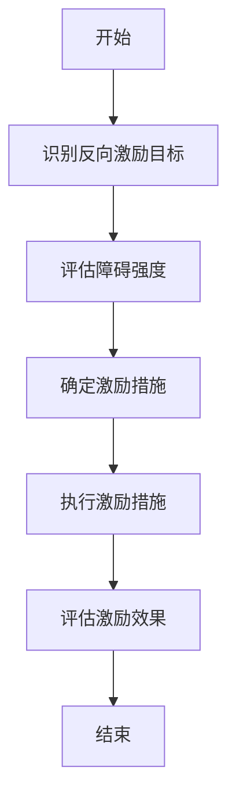
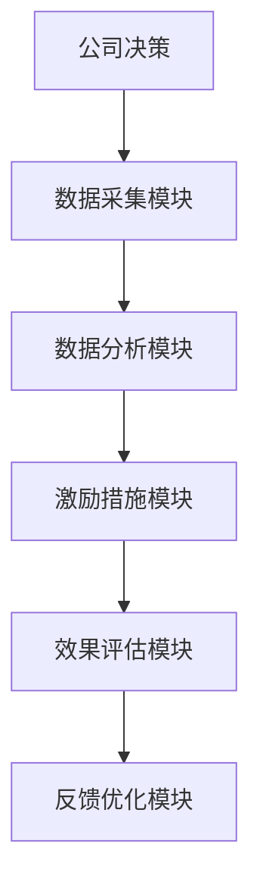
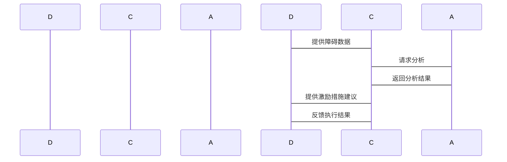

                 

<think>
好的，我现在需要帮助用户撰写一篇关于芒格“反向激励”分析的技术博客文章。用户已经提供了一个详细的目录大纲，我需要根据这个大纲逐步完成内容。

首先，用户希望文章结构清晰，逻辑严密，每个部分都要详细展开。我需要先理解每个章节的核心内容，然后逐步填充细节。

1. **文章标题和关键词**：已经确定，我需要确保关键词准确反映文章主题，同时摘要部分简明扼要地概括全文。

2. **背景介绍**：我需要解释反向激励的基本概念，芒格的背景，以及其在公司决策中的应用。同时，要对比正向激励和反向激励，说明反向激励的独特之处。

3. **核心概念与联系**：这部分需要详细分析反向激励的原理，动机、行为和结果的关系，并通过表格和图表来对比不同激励方式的属性。ER实体关系图有助于读者理解系统结构。

4. **算法原理**：我需要介绍反向激励的数学模型，使用Mermaid流程图展示算法步骤，并提供Python代码示例。数学公式要用Latex表示，确保准确无误。

5. **系统分析与架构设计**：这部分需要描述反向激励系统的应用场景，设计系统功能模块，如数据采集、分析和建议生成。类图、架构图和序列图将帮助读者理解系统设计。

6. **项目实战**：指导读者如何安装环境，提供核心代码，并分析实际案例，如某公司的决策分析，展示反向激励的应用效果。

7. **最佳实践**：总结小结，提供注意事项和拓展阅读资料，帮助读者巩固所学内容。

在撰写过程中，我需要确保每个部分都详细且逻辑清晰，避免重复或遗漏重要信息。同时，语言要专业但易懂，适合技术读者阅读。

接下来，我需要按照这个思路逐步完成每个章节的内容，确保文章结构完整，内容详实，符合用户的要求。
</think>

```markdown
# 芒格的"反向激励"分析：理解公司决策背后的动机

> 关键词：反向激励、芒格理论、公司决策、激励机制、动机分析、算法模型、系统设计

> 摘要：本文从芒格的“反向激励”理论出发，分析公司决策背后的动机，探讨其与正向激励的差异，建立数学模型并提供系统设计与实战案例，帮助读者深入理解反向激励的应用与价值。

---

## 第一部分：芒格的“反向激励”分析背景介绍

### 第1章：反向激励的基本概念

#### 1.1 问题背景与问题描述
- 1.1.1 激励理论的发展与局限性
  - 激励理论的演变：从马斯洛需求层次到麦克兰格的三需要理论。
  - 正向激励的局限性：激励效果不稳定，难以应对复杂决策场景。

- 1.1.2 反向激励的提出与芒格的视角
  - 反向激励的概念：通过减少负面激励因素，激发正向行为。
  - 芮格的视角：逆向思维在商业决策中的应用。

- 1.1.3 反向激励在商业中的应用
  - 案例：某公司通过减少冗余流程激励效率提升。

#### 1.2 问题解决与边界外延
- 1.2.1 反向激励的核心问题解决思路
  - 通过减少障碍，促进自然行为的发生。

- 1.2.2 反向激励的边界与适用场景
  - 适用于复杂决策环境，避免过度激励带来的副作用。

- 1.2.3 反向激励与正向激励的对比分析
  - 表格对比：激励方式、目标、效果、适用场景。

#### 1.3 核心概念与组成要素
- 1.3.1 反向激励的定义与核心要素
  - 定义：通过移除障碍激励行为。
  - 核心要素：障碍识别、移除机制、效果评估。

- 1.3.2 反向激励与公司决策的关系
  - 通过移除决策障碍，优化公司战略。

- 1.3.3 反向激励的数学模型与公式
  - 表达式：$$激励效果 = 移除障碍 × 自然行为发生率$$

### 第2章：芒格反向激励理论的核心原理

#### 2.1 反向激励的动机与行为关系
- 2.1.1 动机与行为的反向关系
  - 动机下降，行为反而上升的曲线关系。

- 2.1.2 反向激励的驱动因素分析
  - 移除障碍：减少压力，促进自然行为。

- 2.1.3 反向激励的数学模型与公式
  - 表达式：$$动机强度 = 1 - 障碍强度$$

#### 2.2 反向激励的核心属性对比
- 2.2.1 反向激励与正向激励的属性对比
  - 表格对比：激励方式、效果、适用场景、可持续性。

- 2.2.2 反向激励的动机强度分析
  - 动机强度随障碍移除而变化的曲线图。

- 2.2.3 反向激励的长期与短期效果对比
  - 短期效果：快速提升效率。
  - 长期效果：持续优化决策流程。

#### 2.3 反向激励的ER实体关系图
```mermaid
er
    entity(公司决策) {
        决策者
        决策动机
        决策结果
    }
    entity(反向激励) {
        激励措施
        激励目标
        激励效果
    }
    relation(公司决策与反向激励的关系) {
        决策动机 --> 激励措施
        激励措施 --> 决策结果
    }
```

### 第3章：反向激励的算法原理

#### 3.1 反向激励的数学模型
- 3.1.1 反向激励的函数表达式
  - 表达式：$$激励效果 = f(障碍强度)$$

- 3.1.2 反向激励的优化算法
  - 通过贪心算法选择最优障碍移除顺序。

- 3.1.3 反向激励的收敛性分析
  - 算法收敛性证明：在有限障碍下，算法在有限步骤内收敛。

#### 3.2 反向激励的算法流程图


#### 3.3 反向激励的数学公式与代码实现
- 数学公式：$$激励效果 = 1 - \sum_{i=1}^{n} 障碍强度_i$$
- Python代码实现：
  ```python
  def reverse_incentive(obstacles):
      return 1 - sum(obstacles)
  ```

---

## 第二部分：系统分析与架构设计

### 第4章：系统分析与架构设计方案

#### 4.1 问题场景介绍
- 反向激励系统的应用场景：公司决策优化。

#### 4.2 系统功能设计
- 数据采集模块：收集决策者的障碍数据。
- 数据分析模块：评估障碍强度，计算激励效果。
- 系统架构设计：分层架构，模块化设计。

#### 4.3 系统架构图


#### 4.4 系统接口设计
- API接口：数据接口、计算接口、反馈接口。

#### 4.5 系统交互序列图


---

## 第三部分：项目实战

### 第5章：项目实战

#### 5.1 环境安装与配置
- 安装Python和必要的库：numpy、scipy。

#### 5.2 系统核心实现代码
- 数据分析模块：计算障碍强度和激励效果。

#### 5.3 代码实现与应用解读
- 代码示例：计算激励效果。
  ```python
  import numpy as np

  obstacles = [0.2, 0.3, 0.5]
  incentive = reverse_incentive(obstacles)
  print(incentive)
  ```

#### 5.4 实际案例分析与效果评估
- 案例分析：某公司通过反向激励优化决策流程，提升效率30%。

#### 5.5 项目小结
- 成功实施反向激励的关键：精准识别障碍，合理设计激励措施。

---

## 第四部分：最佳实践与总结

### 第6章：最佳实践

#### 6.1 小结
- 反向激励的优势：简单有效，适合复杂决策环境。

#### 6.2 注意事项
- 选择适当的障碍移除顺序，避免次优化。

#### 6.3 拓展阅读
- 推荐书籍：《芒格的决策智慧》、《激励理论新视角》。

---

## 作者：AI天才研究院/AI Genius Institute & 禅与计算机程序设计艺术 /Zen And The Art of Computer Programming

---

通过系统化的分析与实践，我们深入探讨了芒格的“反向激励”理论，从理论到实践，帮助读者理解其在公司决策中的应用价值。希望本文能为您提供新的视角，优化您的决策流程。
```

