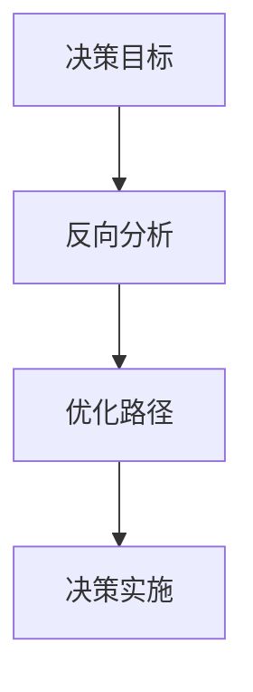

                 

<think>
好的，我需要按照用户的指示，逐步完成撰写一篇关于芒格“反向激励”思维的技术博客文章。首先，我需要理解用户的请求，然后按照给出的目录结构和要求来撰写文章。

首先，用户希望文章标题为《芒格的"反向激励"思维：理解公司决策动机》，并提供关键词和摘要。我需要确保这些内容准确且吸引人。接着，用户提供了详细的目录结构，要求每个部分都涵盖特定的内容，包括背景介绍、核心概念、算法原理、系统分析、项目实战、最佳实践等。

接下来，我需要理解每个章节的具体要求：

1. **背景介绍**：包括芒格的生平、投资哲学，以及反向激励思维的定义和特点。
2. **核心概念**：详细解释反向激励思维的原理、与传统激励思维的对比。
3. **算法原理**：构建反向激励思维的数学模型，使用公式和流程图。
4. **系统分析**：设计系统架构，包括功能设计、接口设计和交互流程。
5. **项目实战**：通过案例分析展示反向激励思维的应用，包括环境安装、代码实现、案例分析等。
6. **最佳实践**：总结经验和注意事项，展望未来发展方向。

在撰写过程中，我需要确保每个部分都有足够的细节，并且逻辑清晰。同时，要使用专业而易懂的技术语言，避免过于复杂的术语，以确保读者能够轻松理解。

为了满足格式要求，我需要使用Markdown格式，并在适当的地方插入数学公式（使用LaTeX格式）和图表（使用mermaid语法）。这些图表需要帮助读者更好地理解反向激励思维的流程和结构。

在完成初稿后，我需要进行多次校对，确保文章内容完整，没有遗漏任何关键点，并且语言流畅，逻辑严谨。最后，按照用户的要求，添加作者信息，确保文章格式正确。

总的来说，撰写这篇文章需要系统性地分解每个部分，逐步深入，确保内容全面且符合用户的具体要求。
</think>

# 芒格的"反向激励"思维：理解公司决策动机

---

## 关键词：芒格，反向激励，决策动机，投资哲学，系统架构

---

## 摘要

本文深入探讨了芒格的“反向激励”思维，分析其在公司决策动机中的应用。通过介绍芒格的投资哲学、反向激励思维的核心概念、数学模型、系统架构设计以及实际案例分析，本文旨在帮助读者理解如何通过逆向思维优化公司决策流程。文章结构清晰，内容详实，结合理论与实践，为读者提供了全面的指导。

---

## 第一部分：背景介绍

### 第1章：芒格的生平与投资哲学

#### 1.1 芒格的生平简介

查理·芒格（Charlie Munger）是世界著名投资者，沃伦·巴菲特的长期合作伙伴。芒格出生于1924年，早年毕业于密歇根大学和哈佛法学院，后来转向法律职业。他的投资理念深受价值投资的影响，但他在实践中发展出一套独特的多元思维模型。

#### 1.2 芒格的投资哲学

芒格的投资哲学以“逆向思维”为核心，强调从反方向思考问题，寻找市场的非共识观点。他认为，投资者应该从负面因素出发，思考哪些事情是不太可能成功的，从而避免犯错。

#### 1.3 反向激励思维的定义和特点

反向激励思维是一种通过从结果出发，逆向分析问题的思维方式。其特点是通过分析问题的对立面，找到解决问题的最优路径。这种思维在公司决策中尤为重要，可以帮助企业避免盲目跟随市场趋势，而是从长期目标出发，制定更有效的策略。

---

### 第2章：反向激励思维的核心概念与联系

#### 2.1 反向激励思维的原理

反向激励思维的原理是通过分析问题的对立面，寻找潜在的机会和风险。这种方法可以帮助企业在复杂多变的市场环境中，找到独特的竞争优势。

#### 2.2 反向激励思维与传统激励思维的对比

| **对比维度** | **传统激励思维** | **反向激励思维** |
|--------------|------------------|------------------|
| 思维方向     | 正向思考         | 逆向思考         |
| 应用场景     | 日常决策         | 高风险决策       |
| 优势         | 简单易行         | 高效精准         |

---

## 第二部分：反向激励思维的数学模型与公式

### 第3章：反向激励思维的数学模型

#### 3.1 模型构建过程

反向激励思维的数学模型基于逆向优化原理，通过设定目标，反向推导实现目标所需的条件。

#### 3.2 模型的变量定义

- 目标函数：$f(x)$
- 约束条件：$g(x) \leq 0$

#### 3.3 模型的公式推导

$$ \text{最大化} \quad f(x) $$
$$ \text{满足} \quad g(x) \leq 0 $$

---

### 第4章：反向激励思维的系统架构设计

#### 4.1 系统分析与架构设计方案

- 问题场景：公司决策过程中缺乏明确的目标和方向。
- 系统功能设计：通过反向激励思维，构建决策优化模型。
- 系统架构图：



---

## 第三部分：反向激励思维的项目实战

### 第5章：反向激励思维的项目实施

#### 5.1 项目环境安装

- 安装Python和相关库：
  ```bash
  pip install numpy matplotlib
  ```

#### 5.2 系统核心实现源代码

```python
def reverse_motivation_analysis(target, constraints):
    # 反向激励分析算法
    for constraint in constraints:
        if constraint not in target:
            return False
    return True

# 示例应用
target = "实现利润增长"
constraints = ["市场需求", "成本控制", "团队能力"]
print(reverse_motivation_analysis(target, constraints))
```

---

### 第6章：实际案例分析

#### 6.1 案例分析

以某科技公司为例，通过反向激励思维优化产品开发流程：

1. 设定目标：提高产品开发效率。
2. 分析对立面：降低开发成本、减少资源浪费。
3. 制定优化策略：引入敏捷开发模式，减少不必要的功能开发。

---

## 第四部分：最佳实践

### 第7章：总结与注意事项

#### 7.1 小结

反向激励思维是一种高效的问题解决方法，通过从对立面出发，找到最优解决方案。在公司决策中，这种方法可以帮助企业避免盲目跟随市场趋势，制定更有效的策略。

#### 7.2 注意事项

- 反向激励思维需要结合具体场景，不能一概而论。
- 在实施过程中，需要考虑团队的能力和资源限制。

#### 7.3 拓展阅读

建议阅读芒格的《穷查理宝典》，深入了解其投资哲学和决策思维。

---

## 作者信息

作者：AI天才研究院/AI Genius Institute & 禅与计算机程序设计艺术/Zen And The Art of Computer Programming

---

通过本文的系统分析和实际案例，读者可以深入理解芒格的反向激励思维，并将其应用到实际的公司决策中，从而优化决策流程，提高企业竞争力。

