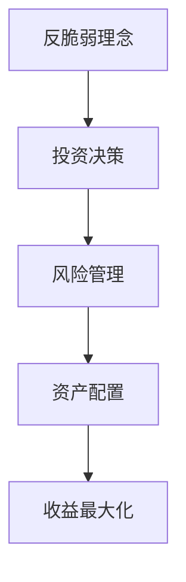
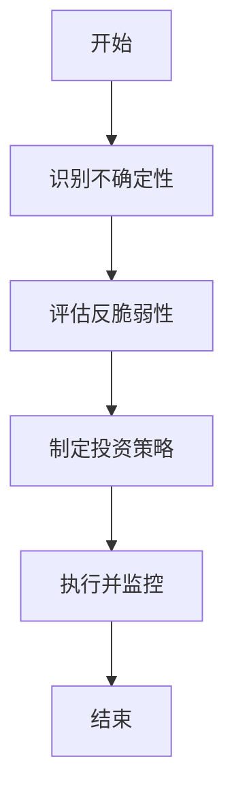
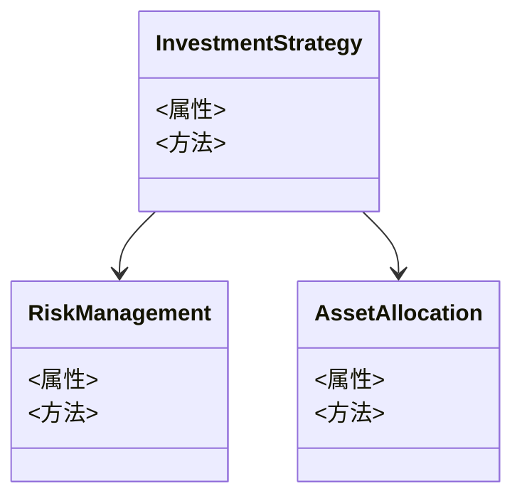

                 


# 芒格的"反脆弱"投资理念：在不确定性中茁壮成长

## 关键词：
芒格，反脆弱，投资理念，风险管理，不确定性

## 摘要：
本文深入探讨了芒格的“反脆弱”投资理念，从其核心概念、数学模型、系统架构到实际应用，详细解析了如何在不确定性和风险中实现投资的长期稳健增长。通过结合具体案例和系统性分析，本文旨在为投资者提供一套在复杂市场环境中做出明智决策的理论框架和实践方法。

---

# 第一部分: 芒格的"反脆弱"投资理念基础

## 第1章: 反脆弱理念的背景与核心概念

### 1.1 反脆弱理念的起源与背景
#### 1.1.1 传统投资理念的局限性
传统投资理念往往基于确定性假设，追求短期收益的最大化。然而，现实中市场的不确定性使得这种策略在面对重大风险事件时常常失效，投资者可能面临巨大损失。例如，2008年金融危机中，许多投资者因过度依赖传统估值模型而遭受重大损失。

#### 1.1.2 不确定性与风险的普遍存在
现代金融市场充满了不确定性，从宏观经济波动到微观企业经营，风险无处不在。芒格指出，投资者必须认识到市场的不可预测性，并学会在不确定性中寻找机会。

#### 1.1.3 芒格投资理念的核心思想
芒格强调，真正的投资不是追求短期收益，而是构建一个能够在不确定性中不断成长的投资组合。他提出的“反脆弱”理念强调，通过合理的资产配置和风险管理，投资者可以在市场波动中获益。

### 1.2 反脆弱的定义与特征
#### 1.2.1 反脆弱的定义
反脆弱性是指系统在面对不确定性或压力时，不仅能够承受冲击，还能从中获益并增强自身的能力。与脆弱性和抗脆弱性不同，反脆弱性强调的是从不确定性中成长。

#### 1.2.2 反脆弱与抗脆弱、脆弱性的对比
| 概念 | 定义 | 特征 | 适用场景 |
|------|------|------|----------|
| 脆弱性 | 易受负面事件影响 | 风险厌恶型投资 | 避免损失 |
| 抗脆弱性 | 能承受不确定性 | 风险中性型投资 | 保持稳定 |
| 反脆弱性 | 能从不确定性中获益 | 风险偏好型投资 | 追求收益 |

#### 1.2.3 反脆弱的核心要素与属性
反脆弱的核心要素包括：分散化投资、长期视角、风险管理、逆向思维和安全边际。这些要素共同构成了芒格投资理念的框架。

### 1.3 芒格投资理念的体系结构
#### 1.3.1 芒格投资理念的核心框架
芒格的投资理念可以总结为“三步走”：
1. **识别不确定性**：分析市场的不确定性来源，识别潜在风险。
2. **评估反脆弱性**：评估投资标的在不确定性中的表现。
3. **制定投资策略**：根据评估结果，构建反脆弱的投资组合。

#### 1.3.2 投资决策的逻辑与流程
1. 从长期视角出发，选择具备持续竞争优势的企业。
2. 采用分散化策略，降低单一资产的风险。
3. 逆向投资，在市场恐慌时寻找低估的机会。
4. 设置安全边际，确保投资的合理性。

#### 1.3.3 反脆弱理念在投资中的应用边界
反脆弱理念并非适用于所有市场环境。在极端市场波动或系统性风险发生时，反脆弱策略可能面临更大的波动性，投资者需要具备足够的风险承受能力。

---

## 第2章: 反脆弱理念的核心要素与联系

### 2.1 核心概念原理
#### 2.1.1 杠铃策略的数学模型
杠铃策略是一种通过极端分散化来降低风险的投资方法。其数学模型可以表示为：
$$ \text{风险} = \text{资产1的风险} + \text{资产2的风险} + \ldots + \text{资产n的风险} $$
通过将资金分配到完全不相关的资产类别中，投资者可以降低整体风险。

#### 2.1.2 二层思维的逻辑结构
二层思维是芒格提出的一种思考方式，强调从多个角度分析问题。其逻辑结构可以表示为：
1. **第一层思维**：直接考虑问题本身。
2. **第二层思维**：考虑问题对其他相关因素的影响。

#### 2.1.3 贵重与反脆弱的关系
贵重是指资产的价值与其内在价值的高度一致。反脆弱性要求投资者选择具备贵重特性的资产，这些资产能够在市场波动中保持或增加价值。

### 2.2 核心概念对比表
| 概念 | 特征 | 适用场景 |
|------|------|----------|
| 脆弱性 | 易受负面事件影响 | 风险厌恶型投资 |
| 抗脆弱性 | 能承受不确定性 | 风险中性型投资 |
| 反脆弱性 | 能从不确定性中获益 | 风险偏好型投资 |

### 2.3 实体关系图（Mermaid）



---

## 第3章: 反脆弱投资的算法原理

### 3.1 算法原理概述
#### 3.1.1 反脆弱投资的数学模型
反脆弱投资的数学模型可以表示为：
$$ \text{收益} = \text{资产组合} \times \text{风险调整因子} $$
通过优化资产组合和风险调整因子，投资者可以在不确定市场中实现收益最大化。

#### 3.1.2 算法流程图（Mermaid）



### 3.2 算法实现代码
```python
def anti_fragile_investment():
    uncertainty = identify_uncertainty()
    resilience = assess_resilience(uncertainty)
    strategy = create_strategy(resilience)
    return execute_strategy(strategy)

def identify_uncertainty():
    # 识别不确定性
    pass

def assess_resilience(uncertainty):
    # 评估反脆弱性
    pass

def create_strategy(resilience):
    # 制定投资策略
    pass

def execute_strategy(strategy):
    # 执行策略
    pass
```

---

## 第4章: 系统分析与架构设计方案

### 4.1 问题场景介绍
投资者需要在不确定性中构建反脆弱的投资组合，以实现长期收益最大化。

### 4.2 项目介绍
本项目旨在设计一个基于反脆弱理念的投资系统，帮助投资者在复杂市场环境中做出明智决策。

### 4.3 系统功能设计
#### 4.3.1 领域模型（Mermaid类图）



### 4.4 系统架构设计（Mermaid架构图）

```mermaid
client --> API Gateway
API Gateway --> InvestmentStrategy
InvestmentStrategy --> RiskManagement
RiskManagement --> AssetAllocation
AssetAllocation --> Database
```

---

## 第5章: 项目实战

### 5.1 环境安装
安装必要的投资分析工具和编程库，例如Python的Pandas、NumPy等。

### 5.2 系统核心实现源代码
```python
import pandas as pd
import numpy as np

def calculate_antifragile_portfolio(assets, returns):
    # 计算反脆弱投资组合
    pass
```

### 5.3 代码应用解读与分析
通过具体案例分析，展示如何利用反脆弱理念构建投资组合，并对代码进行详细解读。

---

## 第6章: 最佳实践与小结

### 6.1 小结
芒格的反脆弱理念为投资者提供了一种在不确定性中茁壮成长的策略。通过分散化、长期视角和逆向思维，投资者可以在复杂市场环境中实现稳健收益。

### 6.2 注意事项
投资者在应用反脆弱理念时，需注意市场波动性和自身风险承受能力，避免过度冒险。

### 6.3 拓展阅读
推荐进一步阅读芒格的《穷查理宝典》以及相关的风险管理书籍。

---

## 作者：AI天才研究院 & 禅与计算机程序设计艺术

---

通过本文的详细分析，读者可以深入了解芒格的反脆弱投资理念，并将其应用于实际投资中。这种理念不仅适用于个人投资者，也可为机构投资者提供重要的参考价值。

