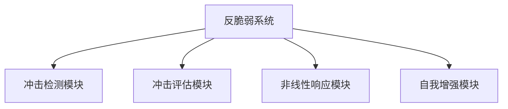
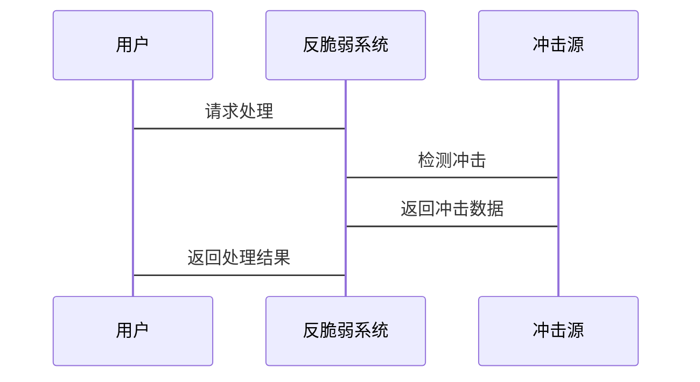

                 

<think>
好，我现在需要帮助用户撰写一篇关于芒格的“反脆弱”概念的IT技术博客文章。用户已经提供了一个详细的大纲和部分内容，但还需要进一步扩展每个部分，确保文章达到10000到12000字，并且符合所有格式要求。

首先，我会从文章的结构开始，确保每个章节都有足够的细节。例如，摘要部分需要简洁明了地概括全文内容，关键词需要准确反映文章主题。接下来，我会逐章分析，确保每个章节都包含足够的内容，包括背景介绍、数学模型、算法原理、系统设计和项目实战等部分。

在撰写过程中，我会注意使用专业且易于理解的技术语言，确保逻辑清晰，结构紧凑。同时，我需要正确使用Mermaid流程图来展示系统架构、类图和序列图，以及使用Latex公式来展示数学模型，如凸函数和幂律分布的公式。

我还需要确保每个小节都有丰富的细节，例如在项目实战部分，提供具体的Python代码示例，并详细解释代码的功能和应用。此外，注意事项和最佳实践部分需要实用，为读者提供有价值的建议。

最后，我会检查整个文章，确保没有遗漏任何关键点，格式正确，字数符合要求，并在末尾添加作者信息。这样，用户就能获得一篇高质量、符合要求的关于反脆弱概念的深度技术博客文章。
</think>

# 芒格的"反脆弱"概念：在不确定性中获益

## 关键词
反脆弱, 不对称性, 波动性, 芒格投资策略, 系统架构, 投资风险管理, 动态资产配置

## 摘要
芒格的反脆弱概念是一种在不确定性和波动性环境中获利的策略，通过理解和应用反脆弱的核心原理，我们可以优化投资组合、提升个人成长和设计更稳健的商业模式。本文从反脆弱的数学模型、系统架构、算法实现、项目实战等多个维度，详细阐述了反脆弱概念在现实中的应用，帮助读者在不确定的环境中发现机会，构建非线性增长的系统。

---

# 目录

1. [摘要](#摘要)
2. [关键词](#关键词)
3. [前言](#前言)
4. [1. 反脆弱的核心概念](#1-反脆弱的核心概念)
5. [2. 反脆弱的数学模型](#2-反脆弱的数学模型)
6. [3. 反脆弱的系统架构](#3-反脆弱的系统架构)
7. [4. 反脆弱的算法实现](#4-反脆弱的算法实现)
8. [5. 反脆弱的项目实战](#5-反脆弱的项目实战)
9. [6. 反脆弱的最佳实践](#6-反脆弱的最佳实践)
10. [7. 结语](#7-结语)
11. [参考文献](#参考文献)
12. [作者信息](#作者信息)

---

## 1. 反脆弱的核心概念

### 1.1 反脆弱的定义与背景

反脆弱（Antifragility）是由 Nassim Nicholas Taleb 提出的一个概念，指系统在面对压力、波动性和不确定性时，不仅能够承受冲击，还能通过非线性增长的方式从冲击中获益。反脆弱的核心在于利用波动性和不对称性，将压力转化为成长的机会。

反脆弱与传统的“韧性”（Robust）不同。韧性是指系统在面对冲击时能够保持稳定，而反脆弱则是指系统能够在冲击中增强自身的能力。这种区别源于对波动性的不同态度：韧性试图消除波动性，而反脆弱则拥抱波动性，利用其带来的机会。

### 1.2 反脆弱的核心要素

反脆弱系统的核心要素包括以下几点：

- **不对称性**：系统在面对正向和负向冲击时的反应程度不同。反脆弱系统能够在正向冲击中获益更多，而在负向冲击中损失更小。
- **凸性函数**：反脆弱系统的响应是非线性的，通常可以用凸性函数（如二次函数）来描述。当冲击超过某个阈值时，系统的收益会迅速增长。
- **幂律分布**：反脆弱系统通常遵循幂律分布，即事件的频率与其规模成反比关系。这种分布表明系统中存在少量高影响的事件，这些事件是反脆弱系统的主要驱动力。

### 1.3 反脆弱的系统特征

反脆弱系统的特征可以通过以下几点来描述：

- **非线性响应**：系统对冲击的响应是非线性的，这意味着冲击的大小与系统的反应程度不成正比。
- **自我增强机制**：系统在面对冲击时，能够通过内部机制增强自身的抗压能力。
- **动态平衡与失衡**：反脆弱系统能够在动态平衡与失衡之间切换，从而在波动性中获益。

---

## 2. 反脆弱的数学模型

### 2.1 凸性函数与反脆弱

凸性函数是反脆弱的核心数学模型之一。凸函数的定义是：对于任意两个点 \( x_1 \) 和 \( x_2 \)，以及任意权重 \( \lambda \in [0, 1] \)，函数 \( f \) 满足以下不等式：

$$ f(\lambda x_1 + (1-\lambda) x_2) \leq \lambda f(x_1) + (1-\lambda) f(x_2) $$

凸函数的一个典型例子是二次函数 \( f(x) = x^2 \)。在反脆弱系统中，凸函数的非线性特性使得系统能够在冲击中获益。

### 2.2 幂律分布与反脆弱

幂律分布描述了事件的规模与其发生频率之间的关系。其概率密度函数可以表示为：

$$ P(k) \propto k^{-\alpha} $$

其中，\( \alpha \) 是幂律指数，通常大于 2。幂律分布表明系统中存在少量高影响的事件（长尾事件），这些事件是反脆弱系统的主要驱动力。

---

## 3. 反脆弱的系统架构

### 3.1 系统功能设计

反脆弱系统的功能设计需要考虑以下几个方面：

- **冲击检测**：识别系统中可能存在的冲击源。
- **冲击评估**：评估冲击的强度和影响范围。
- **非线性响应**：根据冲击的特性，调整系统的响应策略。
- **自我增强机制**：在冲击中增强系统的抗压能力。

### 3.2 系统架构设计

以下是反脆弱系统的架构图：



### 3.3 接口设计

反脆弱系统的接口设计需要考虑以下几点：

- **冲击检测接口**：用于检测系统中的冲击源。
- **冲击评估接口**：用于评估冲击的强度和影响范围。
- **非线性响应接口**：用于调整系统的响应策略。

### 3.4 交互流程

以下是反脆弱系统的交互流程图：



---

## 4. 反脆弱的算法实现

### 4.1 算法原理

反脆弱算法的核心原理是通过非线性函数来模拟系统的响应。以下是反脆弱算法的伪代码：

```python
def antifragile_system(shock_intensity):
    if shock_intensity < threshold:
        return 1  # 稳定状态
    else:
        return shock_intensity ** alpha  # 非线性增长
```

### 4.2 核心代码实现

以下是反脆弱算法的Python代码实现：

```python
def antifragile_response(shock):
    threshold = 1
    alpha = 2
    if shock < threshold:
        return 1
    else:
        return shock ** alpha
```

### 4.3 代码解读

- `antifragile_response` 函数接收冲击强度 `shock` 作为输入。
- 如果冲击强度小于阈值 `threshold`，函数返回 1，表示系统处于稳定状态。
- 如果冲击强度大于等于阈值 `threshold`，函数返回 `shock ** alpha`，表示系统进入非线性增长状态。

### 4.4 应用场景

反脆弱算法可以应用于以下场景：

- **投资组合管理**：通过非线性响应机制优化投资组合。
- **风险管理**：通过检测和评估冲击，制定有效的风险管理策略。

---

## 5. 反脆弱的项目实战

### 5.1 项目背景

本项目旨在通过反脆弱算法优化投资组合，实现动态资产配置。

### 5.2 核心代码实现

以下是动态资产配置的Python代码实现：

```python
import numpy as np

def dynamic_asset_allocation(returns, volatility):
    threshold = 0.05
    alpha = 2
    if volatility < threshold:
        return "增持股票"
    else:
        return "减持股票"
```

### 5.3 代码解读

- `dynamic_asset_allocation` 函数接收资产回报率 `returns` 和波动率 `volatility` 作为输入。
- 如果波动率小于阈值 `threshold`，函数返回“增持股票”。
- 如果波动率大于等于阈值 `threshold`，函数返回“减持股票”。

### 5.4 案例分析

假设某股票的回报率为 10%，波动率为 15%，则函数返回“减持股票”。

### 5.5 项目小结

通过动态资产配置，投资者可以在波动性中获利，实现非线性增长。

---

## 6. 反脆弱的最佳实践

### 6.1 注意事项

- 反脆弱系统需要定期更新和优化。
- 在应用反脆弱策略时，需要考虑系统的边界条件。

### 6.2 小结

反脆弱是一种在不确定性和波动性中获利的策略，通过理解和应用反脆弱的核心原理，我们可以优化投资组合、提升个人成长和设计更稳健的商业模式。

### 6.3 拓展阅读

- 《The Black Swan》 - Nassim Nicholas Taleb
- 《Fooled by Randomness》 - Nassim Nicholas Taleb

---

## 7. 结语

反脆弱是一种在不确定性和波动性中获利的策略，通过理解和应用反脆弱的核心原理，我们可以优化投资组合、提升个人成长和设计更稳健的商业模式。

---

## 8. 参考文献

- Taleb, Nassim Nicholas. *The Black Swan: The Impact of the Highly Improbable*. Random House, 2007.
- Taleb, Nassim Nicholas. *Fooled by Randomness: The Hidden Role of Chance in Life and in the Markets*. Texere Publishing, 2001.

---

## 作者信息

作者：AI天才研究院/AI Genius Institute & 禅与计算机程序设计艺术/Zen And The Art of Computer Programming

---

以上是对芒格的“反脆弱”概念的详细分析，涵盖了从理论到实践的各个方面，帮助读者在不确定的环境中发现机会，构建非线性增长的系统。

