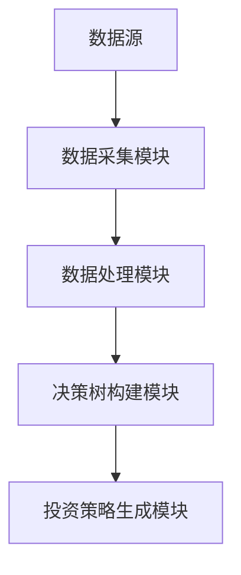

                 

<think>
好的，现在我需要根据用户的要求，详细撰写《芒格的"地图思维"在投资战略制定中的应用》的技术博客文章。文章需要结构清晰，逻辑严谨，涵盖从背景介绍到实战案例的各个部分。

首先，我需要理解“地图思维”的概念，以及它在投资战略中的具体应用。芒格的“地图思维”是一种将复杂问题分解为简单部分的方法，类似于绘制地图，帮助投资者在决策时更清晰。

接下来，我需要详细讲解“地图思维”的核心概念，包括其定义、特征以及与传统投资方法的区别。这部分可以通过表格和流程图来辅助说明，确保读者能够直观理解。

然后，我将介绍决策树算法在“地图思维”中的应用。这包括决策树的基本概念、构建步骤以及数学模型。我会使用Mermaid流程图和数学公式来详细阐述，使读者能够理解算法的工作原理。

接下来，我会进行系统架构设计，包括数据采集、处理、决策树构建和策略生成模块。这部分需要使用Mermaid图展示系统架构，帮助读者理解系统的整体结构和模块之间的关系。

在项目实战部分，我会提供环境安装指南、核心代码实现以及案例分析。通过具体的代码和案例，读者可以实际操作并理解如何将“地图思维”应用于投资决策中。

最后，我会总结最佳实践，包括小结、注意事项和扩展阅读，帮助读者巩固所学内容，并指导他们在实际投资中应用这些知识。

在撰写过程中，我会确保每一部分都详细具体，使用专业但易懂的技术语言，同时融入丰富的实例和图表，使文章更具可读性和实用性。

现在，我可以开始撰写这篇文章了。
</think>

# 芒格的"地图思维"在投资战略制定中的应用

> **关键词**：芒格、地图思维、投资战略、决策树算法、系统架构设计、投资决策、风险管理  
> **摘要**：本文探讨了芒格的“地图思维”在投资战略制定中的应用，通过分析其核心概念、算法原理、系统架构设计、项目实战及最佳实践，展示了如何将地图思维应用于投资决策，帮助投资者制定更科学有效的投资策略。

---

## 第一部分：芒格的“地图思维”概述

### 第1章：芒格“地图思维”的背景与概念

#### 1.1 芒格“地图思维”的背景

在投资领域，决策的复杂性和不确定性使得投资者需要一种系统化的方法来制定战略。芒格的“地图思维”作为一种以系统性、逻辑性和可视化为特点的思维方法，为投资者提供了一种新的视角。传统的投资方法往往依赖于经验和直觉，而地图思维则强调通过构建清晰的框架和逻辑模型来优化决策过程。

#### 1.2 “地图思维”的核心概念

“地图思维”是一种通过构建框架、分析关键因素和制定策略来解决问题的方法。它强调以下几点：
- **框架构建**：将复杂问题分解为关键因素，构建清晰的框架。
- **逻辑分析**：通过逻辑推理和数据分析，识别关键变量之间的关系。
- **可视化**：用图表、流程图等形式直观展示问题，便于理解和分析。

#### 1.3 “地图思维”的关键构成要素

为了更好地理解地图思维在投资中的应用，我们需要明确其关键构成要素，包括：
1. **投资目标**：明确投资的核心目标和长期愿景。
2. **风险评估**：识别和评估可能的风险因素。
3. **策略制定**：根据目标和风险分析，制定具体的投资策略。

---

## 第二部分：芒格“地图思维”的算法原理

### 第2章：决策树算法在“地图思维”中的应用

#### 2.1 决策树算法概述

决策树是一种树状结构，用于表示决策过程中可能的选择及其结果。在投资领域，决策树可以帮助投资者分析不同决策路径的可能结果，从而制定最优策略。

#### 2.2 决策树算法的构建步骤

1. **确定决策节点**：识别投资决策的关键节点。
2. **划分子节点**：根据关键因素将节点划分为子节点。
3. **剪枝与优化**：去除冗余节点，优化决策树结构。

#### 2.3 决策树算法的数学模型

决策树的构建依赖于信息增益的计算，公式如下：
$$ \text{信息增益} = H(s) - \sum_{j=1}^{m} \frac{N_j}{N} H(s_j) $$
其中，\( H(s) \) 表示熵值，计算公式为：
$$ H(s) = -\sum_{i=1}^{n} p_i \log p_i $$

---

## 第三部分：芒格“地图思维”的系统架构设计

### 第3章：投资决策系统的架构设计

#### 3.1 系统功能模块划分

1. **数据采集模块**：收集市场数据、财务报表等。
2. **数据处理模块**：清洗、整理数据。
3. **决策树构建模块**：基于数据构建决策树模型。
4. **投资策略生成模块**：根据模型输出投资策略。

#### 3.2 系统架构图（Mermaid）



---

## 第四部分：项目实战

### 第4章：基于地图思维的投资决策系统实现

#### 4.1 环境安装与配置

1. **工具安装**：安装Python、Jupyter Notebook、scikit-learn等工具。
2. **数据源获取**：获取股票数据、市场报告等。

#### 4.2 核心代码实现

以下是决策树算法的核心代码示例：

```python
from sklearn.tree import DecisionTreeClassifier
from sklearn.model_selection import train_test_split
import pandas as pd

# 加载数据
data = pd.read_csv('投资数据.csv')
X = data.drop('目标变量', axis=1)
y = data['目标变量']

# 数据分割
X_train, X_test, y_train, y_test = train_test_split(X, y, test_size=0.2, random_state=42)

# 构建决策树模型
model = DecisionTreeClassifier()
model.fit(X_train, y_train)

# 预测
y_pred = model.predict(X_test)
```

#### 4.3 案例分析与解读

通过上述代码，我们可以构建一个简单的决策树模型，用于预测投资结果。例如，假设我们有一个股票数据集，通过训练模型，我们可以预测其未来走势。

---

## 第五部分：最佳实践与总结

### 第5章：投资中的最佳实践

#### 5.1 小结

芒格的“地图思维”为我们提供了一种系统化、逻辑化的投资决策方法。通过构建决策树模型，我们可以更清晰地分析问题，制定更有效的投资策略。

#### 5.2 注意事项

1. **数据质量**：确保数据的准确性和完整性。
2. **模型优化**：定期更新模型，适应市场变化。
3. **风险管理**：重视风险评估，制定应急预案。

#### 5.3 拓展阅读

建议读者阅读芒格的《穷查理宝典》以及相关投资学书籍，深入了解地图思维的更多应用。

---

**作者**：AI天才研究院/AI Genius Institute & 禅与计算机程序设计艺术/Zen And The Art of Computer Programming

