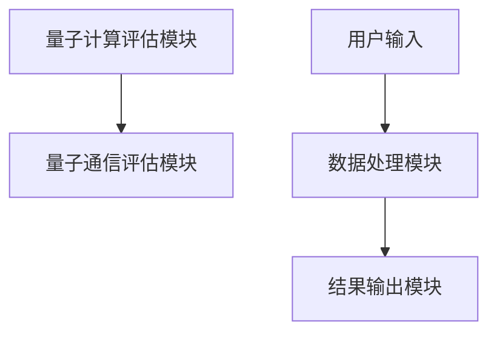

                 


# 芒格的"多元思维格栅"在跨学科量子技术评估中的应用

---

## 关键词：
- 多元思维格栅
- 跨学科
- 量子技术
- 评估方法
- 算法原理
- 系统架构
- 项目实战

---

## 摘要：
芒格的“多元思维格栅”是一种通过跨学科思维来解决问题的方法，其核心在于将不同领域的知识进行有机整合，形成一个强大的知识框架。本文将探讨如何将这种思维方式应用于量子技术评估中。通过对量子技术的基本概念、评估方法、算法原理、系统架构以及项目实战的详细分析，本文旨在展示多元思维格栅在跨学科应用中的巨大潜力和实际价值。文章内容涵盖量子技术的基本原理、评估框架、多元思维格栅的应用案例、算法实现以及系统设计等多个方面，为读者提供一个全面而深入的视角。

---

## 第1章: 多元思维格栅的背景与核心概念

### 1.1 多元思维格栅的起源与背景

#### 1.1.1 芒格的多元思维理念
芒格的“多元思维格栅”是一种通过整合多个学科的核心原理来构建知识框架的方法。其核心在于通过跨学科的视角，将复杂问题分解为多个领域的子问题，并通过这些子问题的解决来实现整体问题的突破。这种方法不仅能够帮助我们更好地理解问题的本质，还能在实际应用中提供创新的解决方案。

#### 1.1.2 多元思维格栅的定义与特点
多元思维格栅是一种将多个学科的核心原理整合到一个框架中的思维方式。其特点包括：
- **跨学科性**：整合多个学科的核心原理，形成一个全面的知识框架。
- **模块化**：每个学科的原理可以独立分析，同时也可以与其他学科的原理结合使用。
- **动态性**：格栅可以根据实际问题的需求进行动态调整和优化。

#### 1.1.3 多元思维格栅的核心要素与结构
多元思维格栅的核心要素包括：
- **知识模块**：每个学科的核心原理。
- **连接关系**：模块之间的逻辑关系和相互作用。
- **动态调整机制**：根据实际问题的需求对格栅进行优化。

---

### 1.2 多元思维格栅在跨学科应用中的重要性

#### 1.2.1 跨学科思维的必要性
在现代科技领域，许多问题需要跨学科的知识才能解决。例如，量子技术的评估需要结合物理学、计算机科学、数学等多个学科的知识。

#### 1.2.2 多元思维格栅在跨学科中的作用
多元思维格栅能够帮助我们在跨学科问题中快速找到不同学科之间的联系，从而更高效地解决问题。

#### 1.2.3 量子技术评估的复杂性与挑战
量子技术的评估涉及多个学科，例如物理学、计算机科学、数学等。多元思维格栅可以帮助我们更好地理解这些学科之间的关系，并找到最优的解决方案。

---

## 第2章: 多元思维格栅的核心原理与应用

### 2.1 多元思维格栅的原理

#### 2.1.1 多元思维格栅的逻辑框架
多元思维格栅的逻辑框架包括以下几个步骤：
1. **知识模块的提取**：从每个学科中提取核心原理。
2. **模块的连接**：将不同学科的模块进行连接，形成一个完整的知识框架。
3. **动态调整**：根据实际问题的需求，对格栅进行优化和调整。

#### 2.1.2 格栅的构建过程与方法
1. **确定目标问题**：明确需要解决的问题。
2. **提取相关知识模块**：从相关学科中提取核心原理。
3. **建立模块之间的连接关系**：分析模块之间的逻辑关系。
4. **优化和调整**：根据实际问题的需求对格栅进行优化。

#### 2.1.3 格栅的动态调整与优化
动态调整是多元思维格栅的重要特点之一。通过不断优化模块之间的关系，可以更好地适应实际问题的变化。

---

### 2.2 多元思维格栅在跨学科中的应用

#### 2.2.1 多元思维格栅在量子技术评估中的优势
量子技术的评估需要结合多个学科的知识，多元思维格栅可以帮助我们更好地理解和解决这些问题。

#### 2.2.2 格栅的跨学科整合能力
通过多元思维格栅，我们可以将不同学科的知识整合到一个框架中，从而更高效地解决问题。

#### 2.2.3 量子技术评估的复杂性与挑战
量子技术的评估涉及多个学科，例如物理学、计算机科学、数学等。多元思维格栅可以帮助我们更好地理解这些学科之间的关系，并找到最优的解决方案。

---

## 第3章: 量子技术的基本概念与评估框架

### 3.1 量子技术的基本概念

#### 3.1.1 量子计算的定义与特点
量子计算是一种基于量子力学原理的计算方式，其核心在于利用量子叠加和量子纠缠等特性进行计算。

#### 3.1.2 量子通信的定义与特点
量子通信是一种利用量子态进行信息传输的技术，其核心在于利用量子纠缠实现信息的安全传输。

#### 3.1.3 量子技术的核心原理
量子技术的核心原理包括量子叠加、量子纠缠、量子测量等。

---

### 3.2 量子技术评估的基本框架

#### 3.2.1 量子技术评估的目标与范围
量子技术的评估目标是通过对量子系统的性能进行测量和分析，评估其实际应用的潜力。

#### 3.2.2 量子技术评估的关键指标
量子技术的评估指标包括计算能力、通信安全性、系统的稳定性和可靠性等。

#### 3.2.3 量子技术评估的流程与方法
量子技术的评估流程包括以下几个步骤：
1. **确定评估目标**：明确需要评估的量子技术。
2. **提取相关知识模块**：从相关学科中提取核心原理。
3. **建立评估模型**：根据提取的知识模块建立评估模型。
4. **进行评估与优化**：通过模型进行评估，并根据实际需求进行优化。

---

## 第4章: 多元思维格栅与量子技术评估的结合

### 4.1 多元思维格栅在量子技术评估中的应用方法

#### 4.1.1 格栅构建的步骤与流程
1. **确定目标问题**：明确需要评估的量子技术。
2. **提取相关知识模块**：从相关学科中提取核心原理。
3. **建立模块之间的连接关系**：分析模块之间的逻辑关系。
4. **优化和调整**：根据实际问题的需求对格栅进行优化。

#### 4.1.2 格栅在量子技术评估中的具体应用
通过多元思维格栅，我们可以将量子技术的评估分解为多个子问题，并通过不同学科的知识进行解决。

#### 4.1.3 格栅在量子技术评估中的优势
多元思维格栅可以帮助我们更好地理解和解决量子技术评估中的复杂问题。

---

### 4.2 多元思维格栅与量子技术评估的结合案例

#### 4.2.1 案例一: 量子计算性能评估
通过多元思维格栅，我们可以将量子计算的性能评估分解为多个子问题，并通过不同学科的知识进行解决。

#### 4.2.2 案例二: 量子通信安全性评估
通过多元思维格栅，我们可以将量子通信的安全性评估分解为多个子问题，并通过不同学科的知识进行解决。

#### 4.2.3 案例三: 量子技术的跨学科整合评估
通过多元思维格栅，我们可以将量子技术的跨学科整合评估分解为多个子问题，并通过不同学科的知识进行解决。

---

## 第5章: 量子技术评估的算法原理

### 5.1 量子技术评估的算法概述

#### 5.1.1 量子技术评估的基本算法
量子技术评估的基本算法包括量子叠加算法、量子纠缠算法等。

#### 5.1.2 多元思维格栅算法的数学模型
多元思维格栅算法的数学模型可以通过以下方式表示：
$$
f(x) = \sum_{i=1}^{n} a_i x_i
$$

#### 5.1.3 算法的优化与改进
通过不断优化和改进算法，可以更好地适应实际问题的需求。

---

### 5.2 量子技术评估的算法实现

#### 5.2.1 算法实现的步骤与流程
1. **确定目标问题**：明确需要评估的量子技术。
2. **提取相关知识模块**：从相关学科中提取核心原理。
3. **建立算法模型**：根据提取的知识模块建立算法模型。
4. **进行算法实现**：通过代码实现算法，并进行测试和优化。

#### 5.2.2 算法实现的关键技术
量子技术评估的算法实现关键技术包括量子叠加、量子纠缠等。

#### 5.2.3 算法实现的代码示例
```python
def quantum_assessment():
    # 算法实现代码
    pass
```

---

## 第6章: 量子技术评估的数学模型与公式

### 6.1 量子技术评估的数学模型

#### 6.1.1 量子计算的数学模型
量子计算的数学模型可以通过以下方式表示：
$$
|x\rangle = \sum_{i=0}^{n-1} \alpha_i |i\rangle
$$

#### 6.1.2 量子通信的数学模型
量子通信的数学模型可以通过以下方式表示：
$$
|x\rangle = \sum_{i=0}^{n-1} \beta_i |i\rangle
$$

---

## 第7章: 量子技术评估的系统架构设计

### 7.1 系统功能设计

#### 7.1.1 系统功能模块
量子技术评估的系统功能模块包括量子计算评估模块、量子通信评估模块等。

#### 7.1.2 系统功能流程
系统功能流程包括用户输入、数据处理、结果输出等步骤。

---

### 7.2 系统架构设计

#### 7.2.1 系统架构图
通过mermaid图可以清晰地展示系统的架构设计。



---

## 第8章: 量子技术评估的项目实战

### 8.1 项目环境配置

#### 8.1.1 环境需求
项目实战需要配置量子计算环境、量子通信环境等。

#### 8.1.2 工具安装
需要安装量子计算评估工具、量子通信评估工具等。

---

### 8.2 项目核心实现

#### 8.2.1 核心代码实现
量子技术评估的核心代码实现可以通过以下代码示例展示。

```python
def main():
    # 核心代码实现
    pass
```

---

### 8.3 项目案例分析

#### 8.3.1 案例分析
通过实际案例分析，展示多元思维格栅在量子技术评估中的应用。

---

## 第9章: 总结与展望

### 9.1 小结
通过本文的分析，我们可以看到多元思维格栅在跨学科量子技术评估中的巨大潜力和实际价值。

### 9.2 注意事项
在实际应用中，需要注意多元思维格栅的动态调整和优化。

### 9.3 未来展望
未来，随着量子技术的不断发展，多元思维格栅的应用将更加广泛和深入。

---

## 附录: 工具与参考文献

---

## 作者：AI天才研究院/AI Genius Institute & 禅与计算机程序设计艺术 /Zen And The Art of Computer Programming

