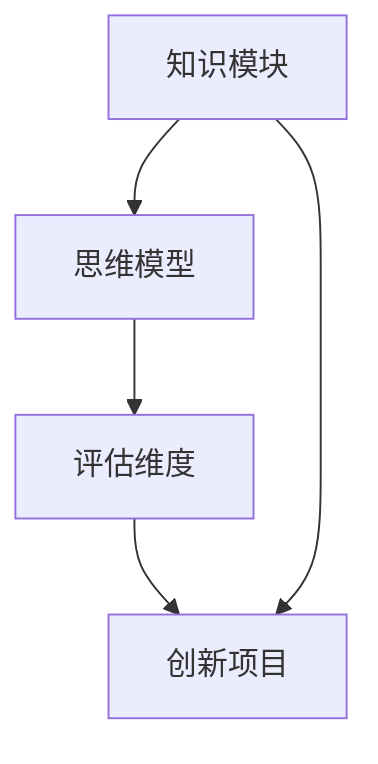
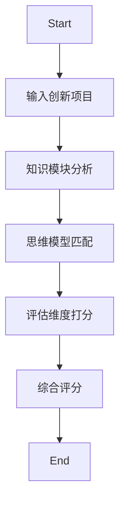
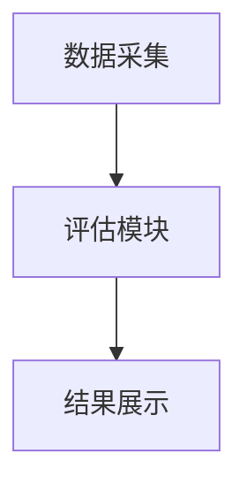

                 


# 芒格的"多元思维格栅"在跨维度创新项目评估中的应用

---

## 关键词：
多元思维格栅、跨维度创新、项目评估、思维模型、创新决策、系统架构

---

## 摘要：
本文深入探讨了芒格的“多元思维格栅”模型在跨维度创新项目评估中的应用。通过结合多学科的思维方式，该模型能够帮助我们在复杂项目中进行更全面的分析和决策。文章从背景介绍、核心概念、算法原理、系统架构到实际案例，详细阐述了多元思维格栅的优势和具体应用，为创新项目评估提供了新的视角和方法。

---

## 第一部分：芒格的多元思维格栅背景介绍

### 第1章：芒格的多元思维格栅背景介绍

#### 1.1 多元思维格栅的起源与核心概念
- **多元思维格栅的起源**：芒格提出“多元思维模型”（Mental Models），强调通过多个学科的思维方式来辅助决策。
- **核心概念**：多元思维格栅是由多个相互关联的知识模块组成的网络，能够帮助我们从多个维度分析问题。
- **应用范围**：广泛应用于投资、管理、创新等领域，尤其在跨维度创新项目评估中表现出色。

#### 1.2 多元思维格栅在跨维度创新中的应用背景
- **创新项目评估的复杂性**：现代创新项目往往涉及多个学科和领域，单一维度的评估方法难以全面覆盖。
- **多元思维格栅的优势**：通过多维度分析，能够更全面地评估项目的可行性和潜在风险。
- **实际案例**：以一个智能硬件项目为例，展示多元思维格栅在评估过程中的应用。

---

## 第二部分：多元思维格栅的核心概念与联系

### 第2章：多元思维格栅的核心概念与联系

#### 2.1 多元思维格栅的原理与属性
- **原理分析**：通过多学科的思维方式交叉应用，形成一个立体的知识网络。
- **属性对比表**：
  | 属性 | 特征 |
  |------|------|
  | 知识基础 | 多学科交叉 |
  | 结构特点 | 网络化、模块化 |
  | 应用范围 | 创新评估、决策支持 |

#### 2.2 多元思维格栅的ER实体关系图


---

## 第三部分：多元思维格栅的算法原理与数学模型

### 第3章：多元思维格栅的算法原理

#### 3.1 多元思维格栅的评估算法
- **算法流程图**：


#### 3.2 算法的数学模型与公式
- **综合评分公式**：
  $$ S = \sum_{i=1}^{n} w_i \cdot s_i $$
  其中，\( w_i \) 是第 \( i \) 个维度的权重，\( s_i \) 是第 \( i \) 个维度的评分。

---

## 第四部分：系统分析与架构设计方案

### 第4章：系统分析与架构设计方案

#### 4.1 系统分析
- **问题场景**：一个智能硬件项目的创新评估过程。
- **系统功能设计**：
  - 数据采集模块：收集项目相关信息。
  - 评估模块：基于多元思维格栅进行评估。
  - 结果展示模块：输出评估结果和建议。

#### 4.2 系统架构设计


---

## 第五部分：项目实战

### 第5章：项目实战

#### 5.1 环境配置与安装
- **工具准备**：安装Python和相关库（如numpy、pandas）。
- **代码实现**：
  ```python
  def evaluate_project(projects):
      scores = []
      for project in projects:
          # 假设已有的评分函数
          score = evaluate(project)
          scores.append(score)
      return scores
  ```

#### 5.2 核心代码实现
- **评估函数**：
  ```python
  def evaluate(project):
      # 假设每个维度的权重和评分
      weights = [0.3, 0.4, 0.3]
      scores = [85, 70, 90]
      return sum(w * s for w, s in zip(weights, scores))
  ```

#### 5.3 实际案例分析
- **案例分析**：智能硬件项目的评估过程。
- **结果解读**：综合评分87分，建议优化市场推广策略。

---

## 第六部分：最佳实践、小结、注意事项与拓展阅读

### 第6章：最佳实践与总结

#### 6.1 最佳实践
- **持续学习**：不断更新知识模块，保持思维模型的丰富性。
- **多维度评估**：在创新项目中，始终考虑多个维度的影响。

#### 6.2 小结
- 多元思维格栅是一种强大的工具，能够帮助我们在复杂项目中做出更明智的决策。
- 通过系统化的分析和评估，可以显著提高创新项目的成功率。

#### 6.3 注意事项
- **权重调整**：根据项目特点调整各个维度的权重。
- **模型优化**：定期更新和优化多元思维格栅，以适应新的挑战。

#### 6.4 拓展阅读
- 推荐书籍：《穷查理的秘籍》（Poor Charlie's Almanack）
- 在线资源：芒格多元思维模型的详细解读和应用案例。

---

## 作者信息

作者：AI天才研究院/AI Genius Institute & 禅与计算机程序设计艺术 /Zen And The Art of Computer Programming

---

通过本文的详细阐述，我们展示了芒格的多元思维格栅在跨维度创新项目评估中的强大应用。从理论到实践，从算法到系统设计，我们为读者提供了一个全面的视角，帮助他们在复杂项目中做出更明智的决策。

