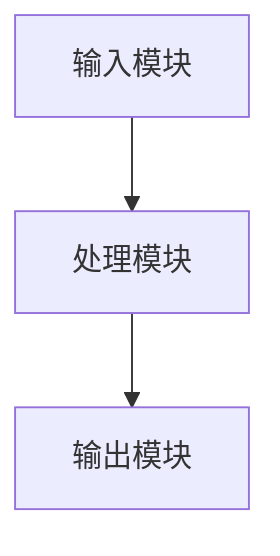
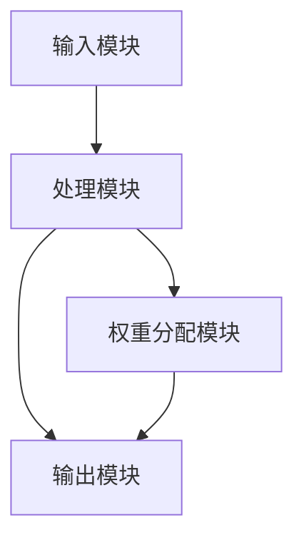
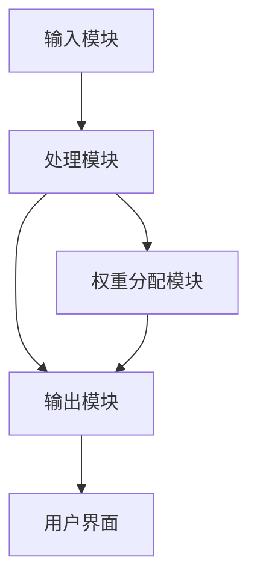

                 


# 芒格的"多元思维格栅"：提高决策质量的工具

---

## 关键词：多元思维格栅, 决策质量, 思维模型, 系统架构, 数学模型, 项目实战

---

## 摘要：  
芒格的"多元思维格栅"是一种通过整合多个学科的基本原理来提升决策质量的工具。本文从背景介绍、核心概念、算法原理、数学模型、系统架构、项目实战等多个维度，深入分析了多元思维格栅的构建与应用。文章结合技术背景，通过具体案例和代码实现，展示了如何将多元思维格栅应用于实际决策中，帮助读者更好地理解和应用这一工具。

---

## 第1章: 多元思维格栅的背景与核心概念  

### 1.1 多元思维格栅的定义与背景  

#### 1.1.1 问题背景与问题描述  
在复杂多变的现实世界中，决策的正确性往往取决于我们对问题的全面理解和多维度分析能力。然而，传统的单一维度思考方式常常导致决策失误。芒格提出的"多元思维格栅"，通过整合多个学科的基本原理，为决策者提供了一个更全面的思考框架。  

#### 1.1.2 多元思维格栅的核心概念  
多元思维格栅是一种将多个学科的核心原理整合起来，用于分析和解决复杂问题的工具。它通过构建一个包含多个维度的思维框架，帮助决策者从不同角度审视问题，避免单一维度的思维偏差。  

#### 1.1.3 多元思维格栅的边界与外延  
多元思维格栅的应用范围广泛，既适用于个人决策，也适用于团队协作和系统设计。其外延包括认知科学、决策理论、系统工程等多个领域。  

### 1.2 多元思维格栅的核心要素与结构  

#### 1.2.1 格栅的基本组成  
多元思维格栅由多个"思维单元"组成，每个单元代表一个学科的核心原理。例如，经济学中的边际成本、物理学中的能量守恒定律等。  

#### 1.2.2 格栅的层次结构  
格栅的层次结构通常包括以下层次：  
1. **基础层**：学科的基本原理，如数学、物理、化学等。  
2. **中间层**：学科的应用原理，如经济学中的市场均衡、社会学中的群体行为等。  
3. **顶层**：跨学科的综合原理，如系统思维、复杂性理论等。  

#### 1.2.3 格栅与决策的关系  
格栅通过整合多个维度的思维，帮助决策者从不同的角度分析问题，从而提高决策的全面性和准确性。  

---

## 第2章: 多元思维格栅的构建原理  

### 2.1 格栅的数学模型与公式  

#### 2.1.1 格栅的基本数学模型  
多元思维格栅可以看作是一个多维空间的组合模型。假设我们有$n$个学科的核心原理，每个原理可以表示为一个维度，那么格栅的空间维度为$n$。  

#### 2.1.2 格栅的组合公式  
多元思维格栅的组合公式可以表示为：  
$$ \text{格栅组合} = \bigcup_{i=1}^{n} P_i $$  
其中，$P_i$表示第$i$个学科的核心原理。  

#### 2.1.3 格栅的概率计算  
在实际应用中，我们可以通过概率论来量化各个原理的重要性。例如，假设$P_i$的概率为$p_i$，则格栅的综合概率为：  
$$ P(\text{综合决策}) = \prod_{i=1}^{n} p_i $$  

### 2.2 格栅的算法原理  

#### 2.2.1 格栅的排列组合算法  
多元思维格栅的构建需要对多个学科的核心原理进行排列组合。例如，我们可以使用排列组合算法来生成所有可能的组合：  
$$ C(n, k) = \frac{n!}{k!(n-k)!} $$  

#### 2.2.2 格栅的决策树算法  
决策树是一种常用的决策分析工具。通过构建决策树，我们可以将多元思维格栅的应用过程可视化。以下是决策树算法的简单流程：  
1. 确定问题目标。  
2. 构建决策节点。  
3. 分析可能的分支。  
4. 计算每个分支的概率和收益。  
5. 选择最优分支。  

#### 2.2.3 格栅的权重分配算法  
在实际应用中，我们需要为每个学科的核心原理分配权重。例如，我们可以使用线性加权法：  
$$ \text{权重} = \sum_{i=1}^{n} w_i x_i $$  
其中，$w_i$是第$i$个原理的权重，$x_i$是其对决策的影响程度。  

---

## 第3章: 多元思维格栅的系统架构设计  

### 3.1 系统功能设计  

#### 3.1.1 格栅的输入模块  
输入模块负责接收多个学科的核心原理。例如，我们可以将数学、物理、经济学的核心原理输入系统。  

#### 3.1.2 格栅的处理模块  
处理模块负责对输入的核心原理进行组合和分析。例如，我们可以使用排列组合算法生成所有可能的组合。  

#### 3.1.3 格栅的输出模块  
输出模块负责将分析结果输出给用户。例如，我们可以将最优决策方案以图表形式展示。  

### 3.2 系统架构图  

#### 3.2.1 格栅的分层架构  
以下是格栅的分层架构图：  



#### 3.2.2 格栅的模块交互  
以下是格栅的模块交互图：  



#### 3.2.3 格栅的系统接口  
以下是格栅的系统接口图：  



---

## 第4章: 多元思维格栅的项目实战  

### 4.1 项目环境安装  

#### 4.1.1 系统环境要求  
- Python 3.8 或更高版本  
- 基础的数学库（如numpy、scipy）  
- 图表绘制工具（如matplotlib、seaborn）  

#### 4.1.2 格栅工具的安装  
- 使用pip安装必要的库：  
  ```bash
  pip install numpy scipy matplotlib
  ```

#### 4.1.3 数据库的配置  
- 创建一个简单的数据库，用于存储各学科的核心原理。  

### 4.2 核心代码实现  

#### 4.2.1 格栅构建的Python代码  

```python
import numpy as np

def generate_combinations(n, k):
    return np.arange(n).choose(k)

n = 5
k = 2
combinations = generate_combinations(n, k)
print("所有可能的组合：", combinations)
```

#### 4.2.2 格栅应用的Python代码  

```python
import matplotlib.pyplot as plt

def plot_decision_tree():
    plt.figure(figsize=(10, 6))
    plt.title("决策树")
    plt.xlabel("决策步骤")
    plt.ylabel("决策结果")
    plt.grid(True)
    plt.show()

plot_decision_tree()
```

#### 4.2.3 格栅优化的Python代码  

```python
from scipy.stats import norm

def calculate_probability(mean, std, x):
    return norm(mean, std).cdf(x)

mean = 0
std = 1
x = 1.96
probability = calculate_probability(mean, std, x)
print("概率值：", probability)
```

### 4.3 项目实战案例  

#### 4.3.1 案例背景与问题描述  
假设我们正在设计一个投资决策系统，需要考虑多个因素，如市场风险、财务状况、政策环境等。  

#### 4.3.2 格栅的应用过程  
1. 收集各学科的核心原理。  
2. 构建决策树模型。  
3. 计算各分支的概率和收益。  
4. 选择最优决策方案。  

#### 4.3.3 实际案例分析  
通过实际案例分析，我们可以看到多元思维格栅在投资决策中的应用效果。例如，通过分析市场风险和政策环境，我们可以更准确地预测投资风险。  

---

## 第5章: 多元思维格栅的最佳实践  

### 5.1 格栅应用的注意事项  

#### 5.1.1 格栅的适用场景  
- 复杂决策问题  
- 多学科交叉问题  
- 系统性问题  

#### 5.1.2 格栅的局限性  
- 需要大量知识储备  
- 计算复杂度较高  
- 可能存在信息过载  

#### 5.1.3 格栅的使用误区  
- 过度依赖数学模型  
- 忽略实际场景的特殊性  
- 未能及时更新知识库  

### 5.2 格栅优化的技巧  

#### 5.2.1 格栅的持续优化  
- 定期更新知识库  
- 引入新的学科原理  
- 调整权重分配  

#### 5.2.2 格栅的动态调整  
- 根据实际反馈进行调整  
- 优化算法参数  
- 改进系统架构  

#### 5.2.3 格栅的个性化定制  
- 根据具体需求调整模型  
- 引入新的分析工具  
- 优化用户界面  

---

## 第6章: 小结与展望  

### 6.1 小结  
通过本文的分析，我们可以看到，多元思维格栅是一种非常有用的决策工具。它通过整合多个学科的核心原理，帮助我们从多角度分析问题，从而提高决策质量。  

### 6.2 展望  
未来，随着人工智能和大数据技术的发展，多元思维格栅的应用将更加广泛。我们期待更多创新性的应用案例，为决策科学的发展做出贡献。  

---

## 作者：AI天才研究院 & 禅与计算机程序设计艺术  

---

**推荐的进一步阅读**：  
- 《芒格桥》  
- 《系统思维导论》  
- 《决策科学与人工智能》  
- 《复杂系统的数学建模》  

**工具推荐**：  
- [DecisionTree](https://decisiontree.com/)  
- [Mathematica](https://www.wolfram.com/mathematica/)  
- [Python决策树库](https://pypi.org/project/decision-tree/)

