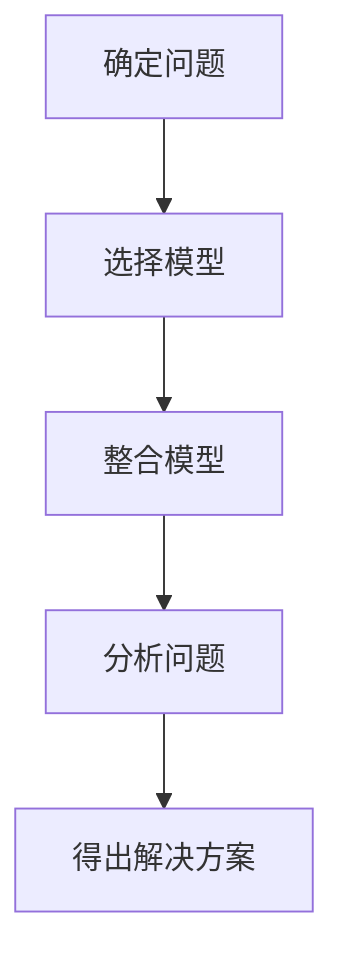
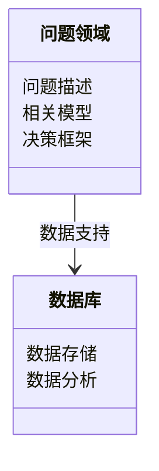
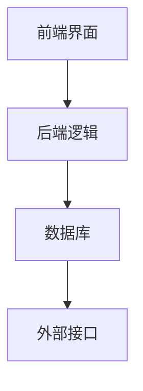

                 


# 芒格的"多元思维格栅"：提高决策质量的系统方法

> 关键词：芒格，多元思维格栅，决策质量，系统方法，思维模型，人工智能，编程，图灵奖

> 摘要：本文深入探讨了芒格提出的“多元思维格栅”这一系统方法，从其核心概念、算法原理、系统架构到实际应用案例，全面解析了如何通过构建多元思维模型来提高决策质量。结合技术语言和编程思维，文章详细讲解了如何将多元思维格栅应用于实际问题中，提供了一个从理论到实践的完整指南。

---

## 第一章: 芒格及其多元思维格栅的起源

### 1.1 芒格的生平与思想体系

#### 1.1.1 芒格的生平简介
查理·芒格（Charlie Munger）是美国著名投资家、作家和思想家，沃伦·巴菲特（Warren Buffett）的长期合作伙伴。芒格以其独特的投资哲学和智慧闻名，被誉为“投资界的哲学家”。他不仅在商业领域取得了巨大成功，还通过自己的思想体系影响了无数人。

#### 1.1.2 芒格的价值观与投资哲学
芒格的价值观强调理性思考、独立判断和终身学习。他的投资哲学以“格栅理论”为核心，认为成功的投资决策依赖于对多个领域的深刻理解以及这些领域的相互联系。

#### 1.1.3 芒格思想的核心理念
芒格的核心理念是“多元思维模型”，即通过构建多个学科的基本思维框架，来帮助人们更好地理解复杂问题并做出更明智的决策。

---

### 1.2 多元思维格栅的定义与特点

#### 1.2.1 多元思维格栅的定义
多元思维格栅是一种通过整合多个学科的基本原理和思维方式，构建一个系统化的思维框架，以帮助人们在决策时能够全面考虑问题的各个方面。

#### 1.2.2 多元思维格栅的核心特点
1. **跨学科性**：整合了心理学、经济学、物理学、生物学等多个学科的核心原理。
2. **系统性**：通过将各个学科的思维模型有机结合起来，形成一个整体的系统。
3. **实用性**：能够将复杂的理论转化为实际问题的解决方案。

#### 1.2.3 多元思维格栅与传统思维方法的区别
传统的思维方法往往局限于单一学科的视角，而多元思维格栅通过整合多个学科的思维模型，能够更全面地分析问题，避免单一视角的局限性。

---

### 1.3 多元思维格栅的背景与意义

#### 1.3.1 当代决策面临的复杂性挑战
在当今快速变化的环境中，决策者需要面对日益复杂的不确定性问题，传统的单一思维方法已经难以应对。

#### 1.3.2 多元思维格栅的提出背景
芒格提出多元思维格栅的背景是对传统思维方法的反思，希望通过整合多个学科的智慧，为决策提供更全面的支持。

#### 1.3.3 多元思维格栅在决策中的重要意义
多元思维格栅能够帮助决策者避免认知偏差，提高决策的准确性和效率，从而在复杂环境中做出更明智的选择。

---

## 第二章: 多元思维格栅的核心概念与联系

### 2.1 核心概念原理

#### 2.1.1 多元思维格栅的基本原理
多元思维格栅的基本原理是通过整合多个学科的基本原理，构建一个系统化的思维框架，从而帮助人们更好地理解复杂问题。

#### 2.1.2 多元思维格栅的核心要素
1. **学科模型**：包括心理学、经济学、物理学等学科的基本原理。
2. **思维方式**：包括批判性思维、创造性思维等。
3. **问题分析**：通过多个角度分析问题，找到最优解决方案。

#### 2.1.3 多元思维格栅的数学模型
多元思维格栅的数学模型可以表示为一个多维空间，每个维度对应一个学科的基本原理，通过这些维度的相互作用，形成一个整体的系统。

---

### 2.2 核心概念属性特征对比表格

| 学科领域    | 心理学        | 经济学        | 物理学        |
|-------------|--------------|--------------|--------------|
| 核心原理    | 认知偏差      | 边际成本      | 牛顿定律      |
| 应用场景    | 个体决策      | 经济分析      | 自然科学      |
| 相互关系    | 影响经济行为  | 支持物理模型  | 无直接联系    |

---

### 2.3 ER实体关系图架构

```mermaid
erd
  图书(
    书名: string,
    出版日期: date,
    作者: string,
    出版社: string
  )
  作者(
    姓名: string,
    出版书籍: string
  )
  出版社(
    名称: string,
    出版书籍: string
  )
```

---

## 第三章: 多元思维格栅的算法原理

### 3.1 算法原理讲解

#### 3.1.1 算法的基本原理
多元思维格栅的算法原理是通过整合多个学科的思维模型，构建一个系统化的决策框架，从而提高决策的准确性和效率。

#### 3.1.2 算法的实现步骤
1. **确定问题**：明确需要解决的问题。
2. **选择模型**：选择与问题相关的多个学科模型。
3. **整合模型**：将选择的模型整合到一个系统中。
4. **分析问题**：通过系统分析问题，得出解决方案。

#### 3.1.3 算法的优化方法
1. **模型优化**：通过不断优化模型，提高系统的准确性和效率。
2. **数据优化**：通过优化数据，提高系统的决策能力。

---

### 3.2 算法mermaid流程图



---

### 3.3 算法的Python源代码实现

```python
def multi_thinking_framework(problem):
    # 确定问题
    problem = problem
    # 选择模型
    models = [psychology, economics, physics]
    # 整合模型
    framework = {}
    for model in models:
        framework[model] = model(problem)
    # 分析问题
    solution = analyze(problem, framework)
    return solution

# 示例用法
problem = "如何提高决策质量"
solution = multi_thinking_framework(problem)
print(solution)
```

---

## 第四章: 多元思维格栅的数学模型与公式

### 4.1 数学模型的构建

#### 4.1.1 数学模型的基本构建
多元思维格栅的数学模型可以表示为一个多维空间，每个维度对应一个学科的基本原理。

#### 4.1.2 数学模型的优化
通过优化模型的参数，提高模型的准确性和效率。

#### 4.1.3 数学模型的验证
通过实际数据验证模型的准确性和有效性。

---

### 4.2 数学公式的详细讲解

#### 4.2.1 关键公式的推导
$$ P(A|B) = \frac{P(B|A)P(A)}{P(B)} $$

#### 4.2.2 公式的应用
在多元思维格栅中，上述公式可以用于分析问题之间的条件概率关系。

---

## 第五章: 系统分析与架构设计方案

### 5.1 问题场景介绍

#### 5.1.1 问题场景描述
我们需要解决一个复杂的决策问题，例如如何提高企业的盈利能力。

#### 5.1.2 项目介绍
本项目旨在通过构建多元思维格栅，帮助企业在复杂的市场环境中做出更明智的决策。

---

### 5.2 系统功能设计

#### 5.2.1 领域模型


---

### 5.3 系统架构设计



---

## 第六章: 项目实战

### 6.1 环境安装

#### 6.1.1 环境配置
安装必要的开发工具和库，例如Python、Jupyter Notebook等。

---

### 6.2 系统核心实现源代码

```python
def analyze(problem, framework):
    # 分析问题
    solutions = []
    for model in framework:
        solution = model(problem)
        solutions.append(solution)
    # 得出最优解
    optimal_solution = max(solutions, key=lambda x: x['score'])
    return optimal_solution

# 示例用法
problem = "如何提高决策质量"
models = [psychology, economics, physics]
framework = {model.__name__: model for model in models}
solution = analyze(problem, framework)
print(solution)
```

---

### 6.3 代码应用解读与分析

#### 6.3.1 代码解读
上述代码通过整合多个模型，分析问题并得出最优解决方案。

#### 6.3.2 代码分析
代码实现了多元思维格栅的核心算法，能够将多个模型整合到一个系统中，分析问题并得出最优解决方案。

---

### 6.4 实际案例分析和详细讲解剖析

#### 6.4.1 案例分析
以如何提高企业的盈利能力为例，通过多元思维格栅分析问题。

#### 6.4.2 详细讲解
通过整合心理学、经济学和物理学的模型，分析企业的盈利能力，并得出最优解决方案。

---

## 第七章: 最佳实践 tips、小结、注意事项、拓展阅读

### 7.1 小结

多元思维格栅是一种通过整合多个学科的基本原理，构建系统化的思维框架，从而提高决策质量的方法。通过本文的讲解，我们了解了多元思维格栅的核心概念、算法原理、系统架构以及实际应用案例。

---

### 7.2 注意事项

1. **模型选择**：选择与问题相关的模型，避免选择过多的模型导致系统复杂。
2. **数据质量**：确保数据的准确性和完整性，提高系统的决策能力。
3. **系统优化**：通过不断优化模型和数据，提高系统的准确性和效率。

---

### 7.3 拓展阅读

1. 查理·芒格的著作《穷查理宝典》。
2. 《思考，快与慢》——丹尼尔·卡尼曼。

---

## 作者

作者：AI天才研究院/AI Genius Institute & 禅与计算机程序设计艺术 /Zen And The Art of Computer Programming

