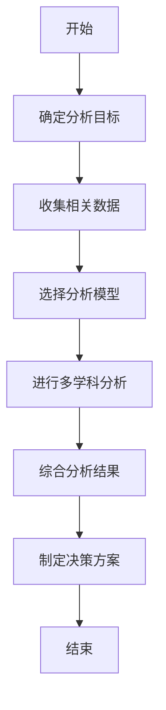
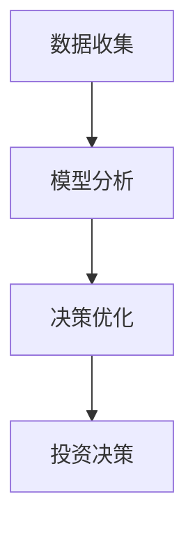
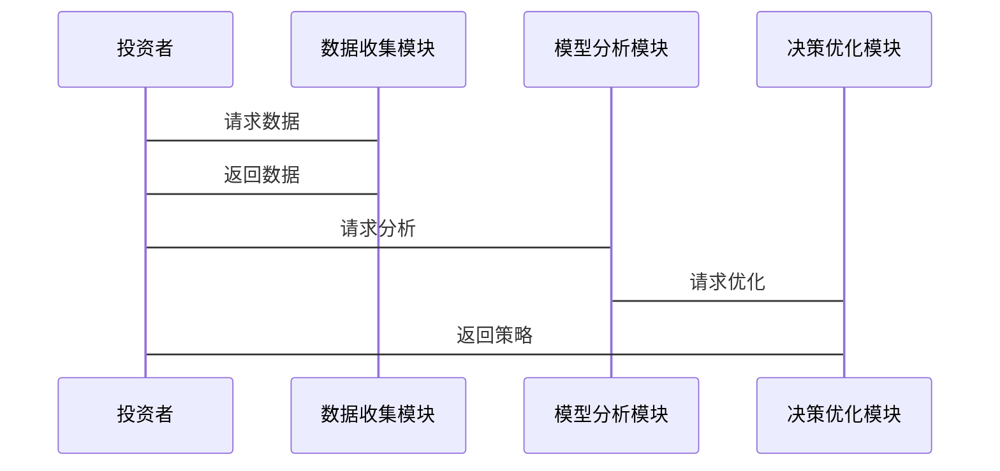

                 


# 《芒格的"多元思维模型"在复杂投资环境中的应用》

> 关键词：芒格，多元思维模型，投资环境，复杂系统，风险管理，跨学科思维

> 摘要：芒格的多元思维模型是一种通过整合多个学科的思维方式来解决复杂问题的方法。本文将详细探讨这一模型在复杂投资环境中的应用，包括其核心概念、算法原理、数学模型、系统架构以及实际项目案例。通过本文，读者将能够理解如何利用多元思维模型来优化投资决策，降低风险，并在复杂市场环境中取得更好的投资效果。

---

## 第一章: 芒格的多元思维模型概述

### 1.1 多元思维模型的定义与核心概念
多元思维模型是芒格提出的一种思维方式，强调通过多个学科的视角来理解问题，避免单一思维的局限性。其核心在于将不同领域的知识结合起来，形成一个全面的分析框架。

#### 1.1.1 多元思维模型的定义
多元思维模型是一种通过整合多个学科的知识和思维方式，来解决复杂问题的方法。它强调从多个角度分析问题，避免单一视角的局限性。

#### 1.1.2 多元思维模型的核心要素
- **跨学科视角**：整合物理学、心理学、经济学等多个学科的原理。
- **系统性分析**：将问题视为一个系统，分析其内部和外部的相互关系。
- **决策优化**：通过多维度分析，优化决策过程，降低风险。

#### 1.1.3 多元思维模型的哲学基础
芒格的多元思维模型深受哲学思想的影响，尤其是实用主义和经验主义。他强调知识的实用性，并通过实践验证知识的有效性。

### 1.2 多元思维模型的起源与发展
芒格在投资领域中首次提出并广泛应用多元思维模型，尤其是在面对复杂市场环境时，该模型展示了其强大的分析能力。

#### 1.2.1 多元思维模型的历史背景
- 20世纪中叶，投资领域开始重视跨学科的分析方法。
- 芒格通过整合物理学、心理学等学科的原理，提出了多元思维模型。

#### 1.2.2 多元思维模型的现代发展
- 随着复杂系统的研究深入，多元思维模型逐渐被应用于更多领域。
- 在投资领域，多元思维模型成为一种重要的分析工具。

#### 1.2.3 多元思维模型在投资中的应用
- 通过多学科视角分析市场趋势。
- 优化投资组合，降低风险。

### 1.3 多元思维模型的核心思想
芒格的多元思维模型强调通过多个视角分析问题，避免单一思维的局限性。

#### 1.3.1 多元思维模型的核心理念
- 复杂问题需要多维度分析。
- 知识的整合是解决问题的关键。

#### 1.3.2 多元思维模型的思维方式
- 从多个学科的角度思考问题。
- 系统性分析问题的各个方面。

#### 1.3.3 多元思维模型的实践价值
- 提高投资决策的准确性。
- 降低投资风险。

### 1.4 本章小结
本章介绍了芒格的多元思维模型的定义、核心概念和哲学基础，强调了其在投资中的重要性。

---

## 第二章: 多元思维模型在复杂投资环境中的应用

### 2.1 投资环境的复杂性与不确定性
复杂的投资环境需要投资者具备多维度的分析能力。

#### 2.1.1 投资环境的复杂性
- 市场波动性大。
- 影响市场的因素众多且相互关联。

#### 2.1.2 投资决策的不确定性
- 市场预测的难度。
- 信息的不完全性。

#### 2.1.3 复杂投资环境中的挑战
- 如何应对市场的不确定性。
- 如何在复杂环境中做出最优决策。

### 2.2 多元思维模型在投资中的优势
多元思维模型通过跨学科视角，帮助投资者更好地应对复杂环境。

#### 2.2.1 多元思维模型的跨学科视角
- 整合物理学、心理学、经济学等学科的原理。
- 从多个角度分析市场趋势。

#### 2.2.2 多元思维模型的系统性分析
- 将市场视为一个复杂系统。
- 分析系统内部和外部的相互关系。

#### 2.2.3 多元思维模型的风险管理能力
- 通过多维度分析，识别潜在风险。
- 制定有效的风险管理策略。

### 2.3 多元思维模型在投资中的具体应用
本节将详细探讨多元思维模型在个股分析、行业分析和组合投资中的具体应用。

#### 2.3.1 个股分析中的应用
- 从多个角度分析公司的基本面。
- 结合市场环境和行业趋势进行综合判断。

#### 2.3.2 行业分析中的应用
- 分析行业的发展趋势。
- 结合宏观经济因素进行综合判断。

#### 2.3.3 组合投资中的应用
- 通过多元思维模型优化投资组合。
- 降低投资组合的整体风险。

### 2.4 本章小结
本章探讨了复杂投资环境中的挑战，并详细分析了多元思维模型在投资中的优势和具体应用。

---

## 第三章: 多元思维模型的核心概念与联系

### 3.1 多元思维模型的核心原理
多元思维模型的核心在于通过多学科视角进行问题分析。

#### 3.1.1 多元思维模型的原理概述
- 通过多个学科的视角分析问题。
- 结合系统性分析方法，优化决策过程。

#### 3.1.2 多元思维模型的逻辑框架
- 从多个角度分析问题。
- 综合各学科的分析结果，制定最优决策。

#### 3.1.3 多元思维模型的数学基础
- 多元思维模型的数学基础包括概率论、统计学和系统动力学。

### 3.2 多元思维模型的核心概念对比
通过对比不同学科的分析框架，更好地理解多元思维模型的整合能力。

#### 3.2.1 多元思维模型的核心概念对比
- 比较物理学、心理学、经济学等学科的分析框架。
- 通过对比，找出各学科的优缺点。

#### 3.2.2 多元思维模型的整合能力
- 将不同学科的分析框架整合起来。
- 形成一个完整的分析体系。

### 3.3 多元思维模型的ER实体关系图
通过ER实体关系图，展示多元思维模型的核心要素及其相互关系。

```mermaid
er
    entity(投资者) {
        id: int
        名称: string
        知识储备: string
        决策能力: int
    }
    entity(市场环境) {
        id: int
        经济指标: string
        行业趋势: string
        市场情绪: string
    }
    entity(风险管理) {
        id: int
        风险因素: string
        风险评估: string
        应对策略: string
    }
    entity(投资决策) {
        id: int
        投资目标: string
        投资策略: string
        投资结果: string
    }
    relation(投资者, 市场环境, "分析市场环境") {
        箭头: 实体 -> 关系
    }
    relation(市场环境, 风险管理, "识别风险") {
        箭头: 关系 -> 实体
    }
    relation(风险管理, 投资决策, "制定策略") {
        箭头: 实体 -> 关系
    }
    relation(投资者, 投资决策, "优化决策") {
        箭头: 实体 -> 关系
    }
```

### 3.4 本章小结
本章详细探讨了多元思维模型的核心原理和核心概念，并通过ER实体关系图展示了其整合能力。

---

## 第四章: 多元思维模型的算法原理

### 4.1 多元思维模型的算法流程
通过算法流程图，展示多元思维模型的分析步骤。



### 4.2 多元思维模型的数学模型
多元思维模型的数学模型包括概率论、统计学和系统动力学。

#### 4.2.1 概率论在多元思维模型中的应用
- 计算不同投资策略的成功概率。
- 评估市场的不确定性。

#### 4.2.2 统计学在多元思维模型中的应用
- 分析历史数据，寻找投资规律。
- 评估投资策略的有效性。

#### 4.2.3 系统动力学在多元思维模型中的应用
- 分析市场的动态变化。
- 评估政策变化对市场的影响。

### 4.3 多元思维模型的Python代码实现
以下是一个简单的多元思维模型的Python代码示例：

```python
def multi_disciplinary_analysis(targets, data, models):
    results = []
    for target in targets:
        for model in models:
            result = model.analyze(target, data)
            results.append(result)
    return results

class Model:
    def analyze(self, target, data):
        # 示例分析方法
        pass
```

### 4.4 本章小结
本章详细探讨了多元思维模型的算法原理，包括算法流程、数学模型和Python代码实现。

---

## 第五章: 多元思维模型的系统架构设计

### 5.1 投资决策系统的功能设计
投资决策系统需要具备数据收集、模型分析和决策优化等功能。

#### 5.1.1 数据收集模块
- 收集市场数据、公司财务数据等。
- 提供数据清洗和预处理功能。

#### 5.1.2 模型分析模块
- 实现多元思维模型的多学科分析。
- 提供多种分析模型的选择。

#### 5.1.3 决策优化模块
- 综合分析结果，制定最优投资策略。
- 提供风险管理功能。

#### 5.1.4 系统架构图


#### 5.1.5 系统交互图


### 5.2 系统接口设计
- 数据接口：提供数据输入和输出的接口。
- 分析接口：提供模型分析的接口。
- 决策接口：提供决策优化的接口。

### 5.3 本章小结
本章详细探讨了投资决策系统的功能设计和系统架构，并通过mermaid图展示了系统的架构和交互流程。

---

## 第六章: 多元思维模型的项目实战

### 6.1 项目背景与目标
- 项目背景：某投资者希望利用多元思维模型进行投资决策优化。
- 项目目标：通过多元思维模型分析市场趋势，制定投资策略。

### 6.2 项目环境与工具
- 环境：Python编程环境。
- 工具：数据分析工具、可视化工具、投资分析工具。

### 6.3 项目核心实现
- 数据收集：收集市场数据、公司财务数据等。
- 模型分析：应用多元思维模型进行多学科分析。
- 决策优化：制定最优投资策略。

### 6.4 项目案例分析
以下是一个具体的项目案例分析：

#### 6.4.1 案例背景
某投资者计划投资科技行业，希望通过多元思维模型进行分析。

#### 6.4.2 数据收集
收集科技行业的市场数据、公司财务数据、行业趋势等。

#### 6.4.3 模型分析
应用多元思维模型，从物理学、心理学、经济学等角度进行分析。

#### 6.4.4 决策优化
综合分析结果，制定最优投资策略。

### 6.5 项目代码实现
以下是一个简单的多元思维模型的Python代码示例：

```python
import pandas as pd
import numpy as np

def analyze_market(data):
    # 数据分析代码
    pass

def make_decision(data, analysis_results):
    # 投资决策代码
    pass

# 示例数据
data = pd.DataFrame({
    '市场数据': [1, 2, 3, 4, 5],
    '公司财务': [6, 7, 8, 9, 10]
})

# 分析市场
analysis_results = analyze_market(data)

# 制定决策
decision = make_decision(data, analysis_results)
print(decision)
```

### 6.6 项目小结
本章通过一个具体的项目案例，展示了多元思维模型的应用过程，包括数据收集、模型分析和决策优化。

---

## 第七章: 多元思维模型的最佳实践

### 7.1 多元思维模型的应用技巧
- 持续学习，不断更新知识储备。
- 灵活应用，根据实际情况调整模型。
- 团队协作，结合不同成员的视角。

### 7.2 多元思维模型的注意事项
- 避免知识的片面性。
- 注意模型的适用性。
- 防范系统性风险。

### 7.3 多元思维模型的未来展望
- 多元思维模型的应用将更加广泛。
- 技术的进步将推动模型的优化。
- 多元思维模型将成为投资决策的重要工具。

### 7.4 本章小结
本章总结了多元思维模型的应用技巧和注意事项，并展望了其未来的发展。

---

## 结语

芒格的多元思维模型是一种强大的工具，能够帮助投资者在复杂的投资环境中做出更明智的决策。通过本文的探讨，读者可以更好地理解多元思维模型的核心概念、算法原理和实际应用，并在实际投资中灵活运用。

---

## 作者

作者：AI天才研究院/AI Genius Institute & 禅与计算机程序设计艺术 /Zen And The Art of Computer Programming

