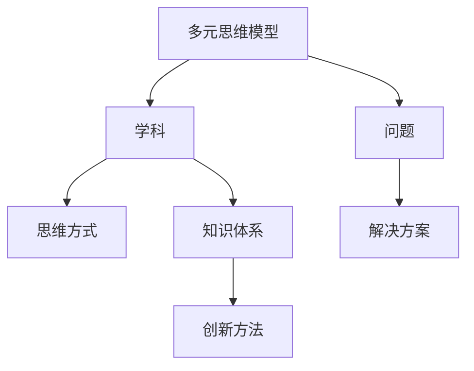
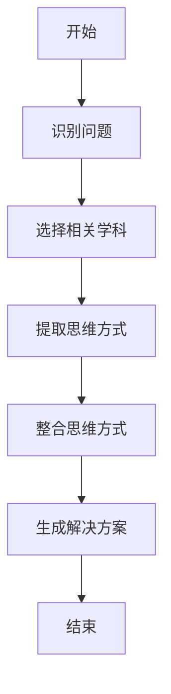
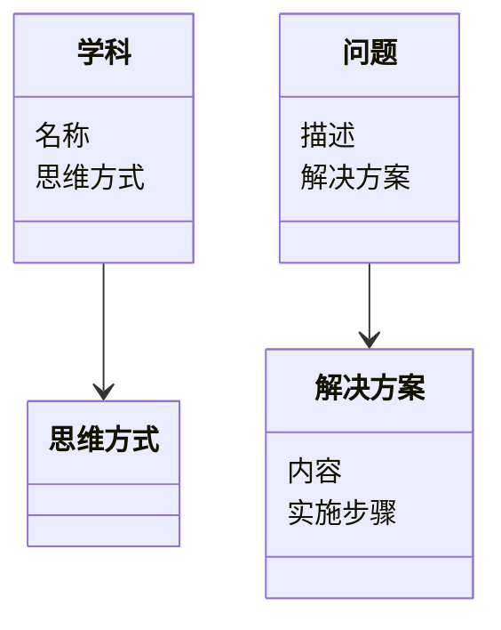
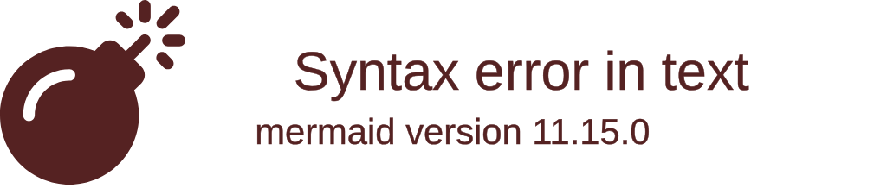
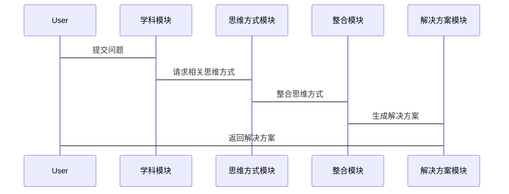

                 

<think>
嗯，用户希望我写一篇关于芒格的“多元思维模型”在跨界创新中的应用的技术博客文章。首先，我需要理解多元思维模型是什么，它如何应用到创新中。然后，我得考虑文章的结构，确保逻辑清晰，内容丰富。用户还特别强调了关键词、摘要和详细目录，所以我要确保这些部分准确无误。

接下来，我需要思考每个章节的具体内容，比如在背景介绍中，解释多元思维模型的定义和它在创新中的作用。在核心概念部分，要详细阐述其特点和与其他模型的对比。算法部分，可能需要展示一个具体的例子，比如使用Python代码来说明如何应用多元思维模型解决问题。

系统分析与架构设计部分，我需要用Mermaid图来展示系统架构和流程，这可能有点挑战，但我会尽力画出清晰的图表。项目实战部分，我需要选择一个实际案例，详细描述如何应用多元思维模型，包括环境配置和代码实现。

最后，总结与展望部分，我要回顾全文，指出多元思维模型的重要性，并展望其未来的发展。在写作过程中，我要确保语言专业但易懂，逻辑严密，结构紧凑，符合用户的要求。

总之，我需要一步步分析，确保每个部分都详细覆盖，满足用户的技术需求，同时保持文章的连贯性和深度。
</think>

# 芒格的"多元思维模型"在跨界创新中的应用

> 关键词：芒格，多元思维模型，跨界创新，系统架构，算法原理，项目实战

> 摘要：芒格的多元思维模型是一种通过整合多个学科的思维方式来解决复杂问题的方法。本文将从背景介绍、核心概念、算法原理、系统架构设计、项目实战等方面，详细阐述多元思维模型在跨界创新中的应用。通过实际案例分析和代码实现，展示如何利用多元思维模型解决实际问题，为创新者提供系统化的方法论指导。

---

## 第一部分：多元思维模型的核心概念与背景

### 第1章：多元思维模型的定义与背景

#### 1.1 多元思维模型的定义
芒格的多元思维模型是一种通过整合多个学科的思维方式来解决复杂问题的方法。其核心思想是：通过广泛涉猎不同领域的知识，形成一个多维度的思维框架，从而在面对问题时能够从多个角度寻找解决方案。

#### 1.2 多元思维模型的特点
- **多元性**：整合多个学科的思维方式，形成多维度的视角。
- **系统性**：将各个学科的思维方式有机地结合在一起，形成一个完整的系统。
- **实用性**：能够直接应用于实际问题的解决。

#### 1.3 多元思维模型的应用场景
- **跨界创新**：在不同领域之间寻找结合点，形成新的解决方案。
- **复杂问题解决**：通过多维度的视角，找到问题的根源并提出解决方案。
- **知识管理**：通过整合不同领域的知识，形成一个高效的知识管理体系。

#### 1.4 多元思维模型的核心要素
- **知识体系**：广泛涉猎不同领域的知识，形成一个多维度的知识网络。
- **思维模式**：将不同领域的思维方式整合在一起，形成一个多维度的思维框架。
- **创新方法**：通过多维度的思维方式，提出创新的解决方案。

---

## 第二部分：多元思维模型的核心概念与联系

### 第2章：多元思维模型的核心原理

#### 2.1 多元思维模型的原理
- **系统架构**：将不同学科的思维方式整合成一个系统，形成一个多维度的思维框架。
- **层级结构**：从基础学科到应用学科，形成一个层级分明的结构。
- **动态平衡**：在不同学科之间找到平衡点，确保各个学科的思维方式能够有机结合。

#### 2.2 多元思维模型的属性特征对比
| 思维模型 | 单一思维模型 | 多元思维模型 |
|----------|--------------|--------------|
| **特点** | 专注于单一领域，解决特定问题。 | 跨界整合多个领域的思维方式，解决复杂问题。 |
| **优缺点** | 优点：解决问题速度快，方法简单。缺点：视角单一，无法应对复杂问题。 | 优点：视角多维，能够应对复杂问题。缺点：学习成本高，整合难度大。 |

#### 2.3 多元思维模型的ER实体关系图


---

## 第三部分：多元思维模型的算法原理讲解

### 第3章：多元思维模型的算法原理

#### 3.1 多元思维模型的算法流程


#### 3.2 算法的数学模型与公式
- **数学模型**：将多元思维模型看作一个复杂系统，可以用图论中的图模型来表示。
- **公式**：$$ \text{解决方案} = \sum_{i=1}^{n} \text{思维方式}_i $$
  其中，$$ n $$ 表示思维方式的数量。

#### 3.3 算法的实现与代码
```python
def multi_p思维_model(subjects):
    solutions = []
    for subject in subjects:
        # 提取思维方式
        thinking_way = subject.thinking_way
        # 整合思维方式
        integrated_way = integrate(thinking_way)
        solutions.append(integrated_way)
    return solutions

# 示例
subjects = [physics, biology, economics]
solutions = multi_p思维_model(subjects)
print(solutions)
```

---

## 第四部分：多元思维模型的系统分析与架构设计

### 第4章：系统分析与架构设计方案

#### 4.1 问题场景介绍
在创新过程中，我们常常需要解决复杂的问题，例如如何将人工智能技术应用到教育领域。通过多元思维模型，我们可以整合教育学、心理学、计算机科学等多个学科的思维方式，提出创新的解决方案。

#### 4.2 系统功能设计


#### 4.3 系统架构设计


#### 4.4 系统接口设计
- **输入接口**：接收问题描述和相关学科列表。
- **输出接口**：输出整合后的解决方案。

#### 4.5 系统交互设计


---

## 第五部分：项目实战

### 第5章：项目实战

#### 5.1 环境配置
- **工具**：Python 3.8+
- **库**：networkx, matplotlib

#### 5.2 系统核心实现源代码
```python
import networkx as nx
import matplotlib.pyplot as plt

def multi_p思维_model(subjects):
    G = nx.Graph()
    for subject in subjects:
        G.add_node(subject)
        for thinking_way in subject.thinking_way:
            G.add_edge(subject, thinking_way)
    return G

subjects = ['physics', 'biology', 'economics']
G = multi_p思维_model(subjects)
nx.draw(G, with_labels=True)
plt.show()
```

#### 5.3 代码实现与解读
- **代码功能**：将不同学科和思维方式整合到一个图中，展示它们之间的关系。
- **解读**：通过图的可视化，可以清晰地看到不同学科和思维方式之间的联系。

#### 5.4 实际案例分析
- **案例**：将人工智能技术应用到教育领域。
- **分析**：通过整合教育学、心理学、计算机科学等多个学科的思维方式，提出创新的解决方案，例如个性化学习系统。

#### 5.5 项目小结
通过实际案例分析，我们可以看到多元思维模型在跨界创新中的巨大潜力。通过整合不同学科的思维方式，我们可以提出更创新、更高效的解决方案。

---

## 第六部分：总结与展望

### 第6章：总结与展望

#### 6.1 最佳实践 tips
- **广泛涉猎**：不断学习新知识，扩大知识面。
- **多维度思考**：在解决问题时，尝试从多个角度思考。
- **跨界整合**：将不同领域的知识和技术结合起来，提出创新的解决方案。

#### 6.2 小结
芒格的多元思维模型是一种非常强大的工具，能够帮助我们在跨界创新中找到新的解决方案。通过整合不同学科的思维方式，我们可以提出更创新、更高效的解决方案。

#### 6.3 展望
随着技术的发展和知识的积累，多元思维模型的应用场景将更加广泛。未来，我们可以将多元思维模型应用到更多的领域，例如医疗、能源、交通等，为社会的发展做出更大的贡献。

---

## 作者

作者：AI天才研究院/AI Genius Institute & 禅与计算机程序设计艺术 /Zen And The Art of Computer Programming

