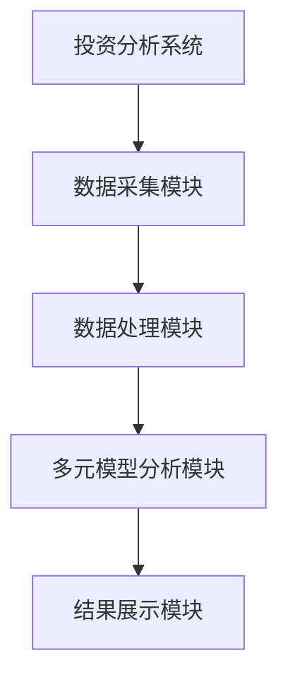

                 


```markdown
# 芒格的多元思维模型：在投资中的实际应用

> 关键词：芒格，多元思维模型，投资，系统架构，决策树，概率论，风险管理

> 摘要：芒格的多元思维模型是一种通过多个学科的思维方式来解决复杂问题的方法，尤其在投资领域中，这种模型可以帮助投资者更全面地分析和评估潜在的投资机会和风险。本文将详细介绍芒格多元思维模型的核心概念、算法原理、系统架构设计以及在投资中的实际应用案例，并通过具体代码实现和数据分析来展示其在投资决策中的优势。

---

## 第一部分: 芒格的多元思维模型概述

### 第1章: 芒格的生平与思想体系

#### 1.1 芒格的生平简介
查理·芒格（Charlie Munger）是世界著名投资者和作家，出生于1924年，目前仍活跃在投资领域。他与沃伦·巴菲特共同创立了伯克希尔哈撒韦公司，并通过长期的价值投资策略取得了巨大成功。芒格的思想体系以多元思维模型为核心，强调通过跨学科的思维方式来解决问题。

#### 1.2 芒格的哲学与投资理念
芒格认为，投资不仅仅是对市场的分析，更是对人性的理解。他提倡投资者应该具备广泛的知识储备，包括心理学、经济学、物理学等学科的基本原理。这种跨学科的思维方式可以帮助投资者避免情绪化决策，并更全面地评估投资机会。

---

### 第2章: 多元思维模型的核心概念

#### 2.1 多元思维模型的定义
多元思维模型（Multi-Model Thinking）是指通过多个不同的学科或思维方式来分析和解决问题的方法。与单一思维模型不同，多元思维模型强调综合运用多种视角来全面理解问题的本质。

#### 2.2 多元思维模型与投资的关系
在投资领域，多元思维模型可以帮助投资者避免过度依赖单一的分析方法，从而更全面地评估公司的基本面、行业趋势以及市场风险。通过综合运用多个学科的思维方式，投资者可以做出更为明智的投资决策。

---

## 第二部分: 多元思维模型的算法与数学模型

### 第3章: 多元思维模型的算法原理

#### 3.1 多元思维模型的算法流程
1. **问题分析**：明确投资目标和问题背景。
2. **多模型分析**：从多个学科视角对问题进行分析。
3. **综合评估**：结合各模型的分析结果，综合评估投资机会。
4. **决策制定**：基于综合评估结果，制定投资策略。

#### 3.2 多元思维模型的数学公式
多元思维模型的核心在于通过综合多个因素来评估投资价值。以下是一个简单的数学公式示例：

$$
\text{投资价值} = \sum_{i=1}^{n} w_i \times f_i
$$

其中，$w_i$ 是第 $i$ 个因素的权重，$f_i$ 是第 $i$ 个因素的评估值。

---

### 第4章: 多元思维模型的系统架构设计

#### 4.1 系统功能设计
1. **数据采集**：收集公司财务数据、行业趋势等。
2. **模型分析**：运用多元思维模型对数据进行分析。
3. **结果展示**：将分析结果以可视化形式呈现。

#### 4.2 系统架构图


---

## 第三部分: 多元思维模型在投资中的实际应用

### 第5章: 投资中的问题场景

#### 5.1 投资中的常见问题
1. **如何评估公司的财务状况？**
2. **如何分析行业竞争格局？**
3. **如何预测市场趋势？**

#### 5.2 多元思维模型的应用场景
在分析一家公司时，可以通过多元思维模型从财务、行业、管理等多个角度进行综合评估。

---

### 第6章: 项目实战与案例分析

#### 6.1 项目环境与工具安装
1. **环境配置**：安装Python、Jupyter Notebook等工具。
2. **数据获取**：收集目标公司的财务数据和行业报告。

#### 6.2 核心算法实现
```python
import pandas as pd
import numpy as np

# 示例数据：公司财务数据
data = {
    '收入': [100, 200, 300],
    '利润': [20, 30, 40],
    '增长率': [0.1, 0.15, 0.2]
}
df = pd.DataFrame(data)

# 应用多元思维模型进行评估
def multi_model_analysis(df):
    # 财务状况分析
    revenue_growth = df['收入'].pct_change().mean()
    profit_margin = df['利润'] / df['收入']
    
    # 行业竞争分析
    industry_competition = df['收入'].quantile(0.75)
    
    return {
        '财务状况': revenue_growth,
        '利润率': profit_margin.mean(),
        '行业竞争': industry_competition
    }

result = multi_model_analysis(df)
print(result)
```

#### 6.3 案例分析
以苹果公司为例，分析其财务状况、行业竞争地位以及管理团队的稳定性。

---

## 第四部分: 总结与展望

### 第7章: 总结与注意事项

#### 7.1 总结
芒格的多元思维模型在投资中具有重要的应用价值。通过综合运用多个学科的思维方式，投资者可以更全面地评估投资机会，并做出更明智的投资决策。

#### 7.2 注意事项
在实际应用中，投资者需要注意以下几点：
1. **数据的准确性**：确保输入数据的准确性和完整性。
2. **模型的适用性**：根据具体情况选择合适的模型和分析方法。
3. **风险管理**：制定有效的风险管理策略，以应对市场波动。

---

## 作者信息

作者：AI天才研究院/AI Genius Institute & 禅与计算机程序设计艺术 /Zen And The Art of Computer Programming
```

