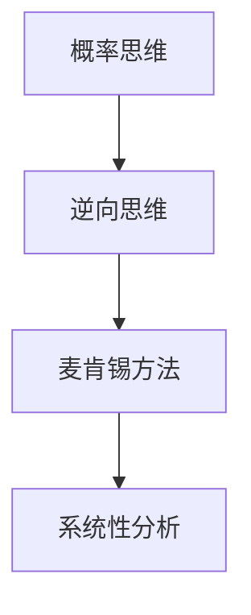
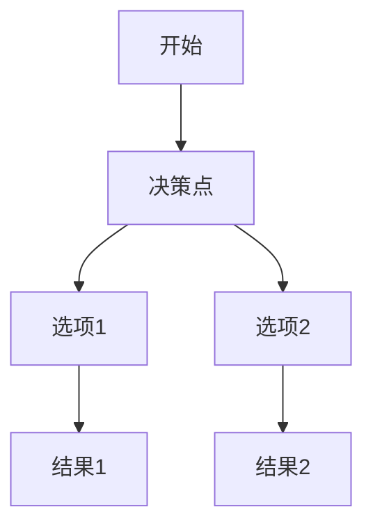
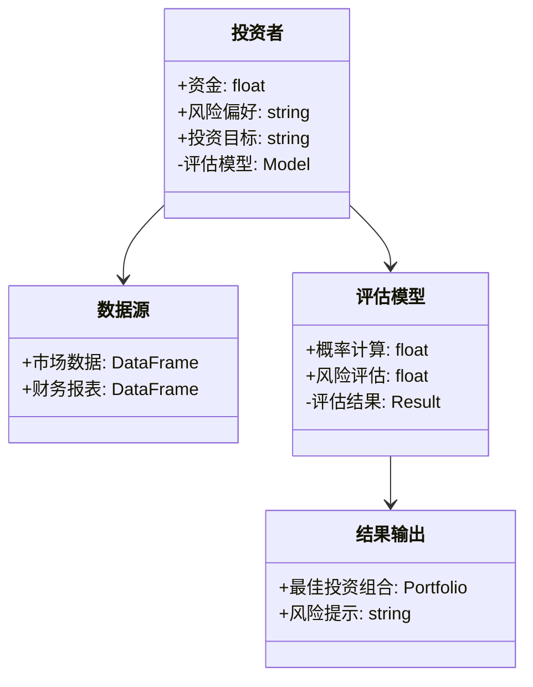

                 


# 芒格的多元思维模型：应对复杂投资环境

> 关键词：芒格，多元思维模型，投资，决策框架，系统性分析

> 摘要：本文深入探讨了芒格的多元思维模型，分析其在复杂投资环境中的应用。通过概率思维、逆向思维等核心概念的讲解，结合数学模型和系统架构设计，展示了如何将这些模型转化为实际的投资决策工具。文章还提供了具体案例分析和项目实战，帮助读者理解并应用多元思维模型。

---

## 第一部分：芒格的多元思维模型概述

### 第1章：芒格的多元思维模型背景

#### 1.1 芒格的生平与思想体系

芒格（Charlie Munger）是沃伦·巴菲特的长期合作伙伴，以他的多元思维模型闻名。他强调通过多个学科的交叉应用来解决复杂问题，认为单一的思维模式不足以应对现实中的复杂性。

#### 1.2 多元思维模型的核心概念

多元思维模型是一种将多个学科和思维工具结合起来的分析框架。它通过整合概率论、逆向思维等方法，帮助投资者全面评估风险和机会。

#### 1.3 多元思维模型的哲学基础

芒格的决策框架基于实用性哲学，强调通过系统性分析来避免认知偏差，从而做出更理性的决策。

### 第2章：多元思维模型的核心概念与联系

#### 2.1 核心概念原理

- **概率思维**：通过分析事件发生的概率，评估其可能的影响。
- **逆向思维**：从结果出发，反向推导可能的原因。
- **麦肯锡方法**：结构化分析问题，确保全面考虑各种因素。

#### 2.2 概念属性特征对比表

| 概念       | 描述                                                                 |
|------------|----------------------------------------------------------------------|
| 概率思维    | 通过概率分析事件的可能性，帮助做出更合理的决策。                     |
| 逆向思维    | 从结果出发，反向推导可能的原因，避免忽视关键因素。                 |
| 麦肯锡方法  | 结构化分析问题，确保全面考虑各种因素，提高决策的系统性。             |

#### 2.3 核心概念的联系



---

## 第二部分：算法原理与数学模型

### 第3章：算法原理讲解

#### 3.1 决策树分析

决策树是一种结构化的分析工具，帮助投资者在多个选项中选择最优解。



#### 3.2 蒙特卡洛模拟

通过模拟不同情景，评估投资风险和回报。

```python
import random

def simulate_investment():
    returns = []
    for _ in range(1000):
        return random.uniform(0.05, 0.1)
        returns.append(return)
    return returns

simulated_returns = simulate_investment()
print(simulated_returns)
```

### 第4章：数学模型

#### 4.1 概率计算

使用贝叶斯定理更新概率。

$$ P(A|B) = \frac{P(B|A) \cdot P(A)}{P(B)} $$

---

## 第三部分：系统分析与架构设计

### 第5章：系统架构设计

#### 5.1 投资决策支持系统架构



---

## 第四部分：项目实战

### 第6章：投资决策支持系统实现

#### 6.1 环境配置

安装所需的Python库：

```bash
pip install pandas numpy matplotlib
```

#### 6.2 核心实现

```python
import pandas as pd
import numpy as np

def calculate_probability(events):
    probabilities = []
    for event in events:
        prob = len([e for e in events if e <= event]) / len(events)
        probabilities.append(prob)
    return probabilities

events = [0.05, 0.06, 0.07, 0.08]
probabilities = calculate_probability(events)
print(probabilities)
```

---

## 第五部分：总结与最佳实践

### 第7章：总结

芒格的多元思维模型通过结合多个学科的工具和方法，帮助投资者在复杂环境中做出更明智的决策。本文详细探讨了其核心概念、算法原理和系统架构，并通过具体案例展示了其应用。

### 第8章：最佳实践 tips

- **持续学习**：不断更新知识储备，丰富多元思维模型。
- **模型更新**：根据市场变化，调整模型参数。
- **风险管理**：定期评估投资组合，降低风险。

---

作者：AI天才研究院 & 禅与计算机程序设计艺术

