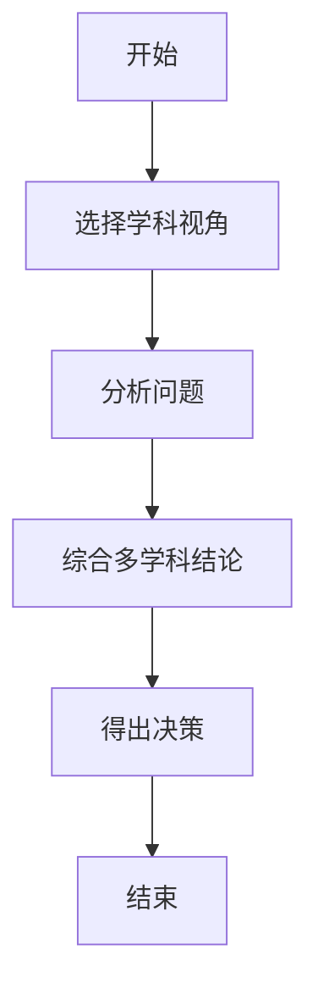
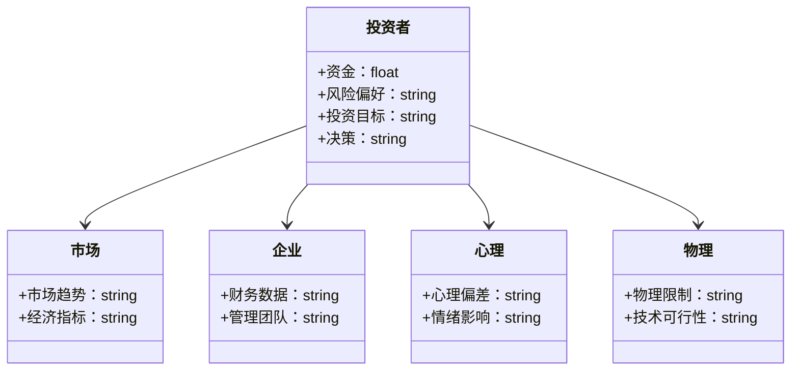

                 


# 芒格的"多元思维模型"：提高投资决策的全面性

## 关键词：芒格、多元思维模型、投资决策、系统分析、算法原理、项目实战

## 摘要：芒格的多元思维模型是一种通过多学科视角来提高投资决策的系统性方法。本文将从背景介绍、核心概念、算法原理、系统分析、项目实战等多方面深入剖析这一模型，帮助读者更好地理解和应用。

---

# 第一部分: 多元思维模型的背景与核心概念

## 第1章: 芒格的多元思维模型概述

### 1.1 多元思维模型的起源与背景

#### 1.1.1 芝加克拉尔曼的芒格及其投资理念

查理·芒格（Charlie Munger）是沃伦·巴菲特（Warren Buffett）的长期合作伙伴，也是伯克希尔哈撒韦公司的重要决策者。芒格的投资理念不同于传统的财务分析，他更注重通过跨学科的思维方式来分析问题。他认为，投资者必须摒弃单一学科的思维限制，转而采用多元思维模型，才能在复杂的市场环境中做出更全面的决策。

#### 1.1.2 多元思维模型的定义

多元思维模型（Multi-Disciplinary Thinking Model）是一种通过整合多个学科的原理和方法来分析问题的思维方式。它强调从物理学、心理学、经济学、社会学等多个学科的角度去理解问题的本质，从而避免单一视角的局限性。

#### 1.1.3 多元思维模型与投资决策的关系

在投资决策中，传统的分析方法往往只关注财务数据或市场趋势，而忽略了其他重要因素。芒格的多元思维模型通过整合多个学科的视角，帮助投资者更全面地理解企业的基本面、市场的波动性以及人类行为的复杂性，从而提高决策的准确性和可靠性。

### 1.2 多元思维模型的核心概念与特点

#### 1.2.1 多元思维模型的定义

多元思维模型是一种通过整合多个学科的原理和方法来分析问题的思维方式，强调从多个角度去理解和解决问题。

#### 1.2.2 多元思维模型的核心特点

1. **多学科视角**：芒格的多元思维模型强调从多个学科（如心理学、经济学、物理学等）的角度去分析问题，避免单一视角的局限性。
2. **系统性**：多元思维模型注重系统性思考，将问题放在更大的系统中去分析，而不是孤立地看待问题。
3. **动态性**：芒格的模型强调动态调整和适应，随着环境的变化不断优化决策。

#### 1.2.3 多元思维模型与传统投资决策的区别

传统的投资决策往往依赖于单一的财务分析或市场预测，而多元思维模型则通过整合多个学科的视角来提高决策的全面性和准确性。

---

## 第2章: 多元思维模型的核心概念与联系

### 2.1 核心概念原理

#### 2.1.1 多元思维模型的多学科视角

芒格的多元思维模型强调从多个学科的角度去分析问题，例如：

1. **心理学**：研究人类行为和决策中的心理偏差。
2. **经济学**：分析市场的供需关系和价值规律。
3. **物理学**：理解事物的基本原理和因果关系。

#### 2.1.2 多元思维模型的系统性特征

多元思维模型将问题放在一个更大的系统中去分析，关注系统中各个部分之间的相互作用和影响。

#### 2.1.3 多元思维模型的动态性特征

芒格的模型强调动态调整和适应，随着环境的变化不断优化决策。

### 2.2 核心概念属性特征对比表格

#### 表2-1: 多元思维模型与传统投资决策的对比

| 特性               | 多元思维模型                     | 传统投资决策                     |
|--------------------|----------------------------------|----------------------------------|
| 分析视角           | 多学科视角                      | 单一学科视角（如财务或市场）    |
| 系统性             | 强调系统性思考                 | 偏向局部分析                     |
| 动态性             | 强调动态调整和适应               | 偏向静态分析                     |

### 2.3 ER实体关系图架构

#### 图2-1: 多元思维模型的实体关系图

```mermaid
erd
actor 投资者
actor 市场
actor 企业
actor 心理
actor 物理
```

---

## 第3章: 多元思维模型的算法原理

### 3.1 算法原理讲解

#### 图3-1: 多元思维模型的算法流程图（使用mermaid）



### 3.2 算法实现

#### 代码3-1: 多元思维模型的Python实现示例

```python
def multi_disciplinary_analysis(subjects):
    results = []
    for subject in subjects:
        analysis = analyze_subject(subject)
        results.append(analysis)
    return combine_results(results)

def analyze_subject(subject):
    # 根据具体学科进行分析
    pass

def combine_results(results):
    # 综合多个学科的分析结果
    pass
```

---

## 第4章: 系统分析与架构设计方案

### 4.1 系统分析

#### 4.1.1 问题场景介绍

在投资决策中，投资者需要考虑企业的财务状况、市场环境、管理团队等多个因素。传统的分析方法往往只关注财务数据或市场趋势，而忽略了其他重要因素。

#### 4.1.2 系统功能设计

通过多元思维模型，投资者可以构建一个系统化的决策框架，整合多个学科的分析结果，从而做出更全面的决策。

#### 图4-1: 领域模型（mermaid类图）



### 4.2 系统架构设计

#### 图4-2: 系统架构设计（mermaid架构图）

```mermaid
container 系统架构 {
    组件1：数据采集模块
    组件2：多学科分析模块
    组件3：决策优化模块
    组件4：结果输出模块
}
```

---

## 第5章: 项目实战

### 5.1 环境安装

#### 5.1.1 安装必要的Python库

```bash
pip install numpy pandas matplotlib
```

### 5.2 系统核心实现源代码

#### 代码5-1: 多元思维模型的核心实现

```python
def multi_disciplinary_analysis(subjects):
    results = []
    for subject in subjects:
        analysis = analyze_subject(subject)
        results.append(analysis)
    return combine_results(results)

def analyze_subject(subject):
    # 根据具体学科进行分析
    pass

def combine_results(results):
    # 综合多个学科的分析结果
    pass
```

### 5.3 代码应用解读与分析

通过上述代码，投资者可以实现多元思维模型的核心功能，包括数据采集、多学科分析以及结果输出。

### 5.4 实际案例分析和详细讲解剖析

#### 5.4.1 案例介绍

以某企业的投资决策为例，投资者需要从财务、市场、管理等多个角度进行分析。

#### 5.4.2 分析过程

1. **财务分析**：评估企业的盈利能力、资产负债情况等。
2. **市场分析**：分析市场的供需关系和竞争格局。
3. **管理分析**：评估企业管理团队的能力和稳定性。
4. **心理分析**：研究投资者的心理偏差和情绪影响。

### 5.5 项目小结

通过多元思维模型，投资者可以更全面地分析问题，从而做出更准确的投资决策。

---

## 第6章: 总结与最佳实践

### 6.1 小结

芒格的多元思维模型是一种通过多学科视角来提高投资决策的系统性方法。通过整合多个学科的原理和方法，投资者可以更全面地理解和分析问题，从而做出更准确的决策。

### 6.2 注意事项

1. **避免单一视角**：投资者需要从多个学科的角度去分析问题，避免单一视角的局限性。
2. **动态调整**：随着环境的变化，投资者需要不断优化和调整决策。
3. **持续学习**：多元思维模型需要不断学习和积累多个学科的知识。

### 6.3 拓展阅读

1. 查理·芒格的著作《穷查理宝典》
2. 《Thinking, Fast and Slow》
3. 《The Power of Multi-Disciplinary Thinking》

---

## 作者：AI天才研究院/AI Genius Institute & 禅与计算机程序设计艺术 /Zen And The Art of Computer Programming

