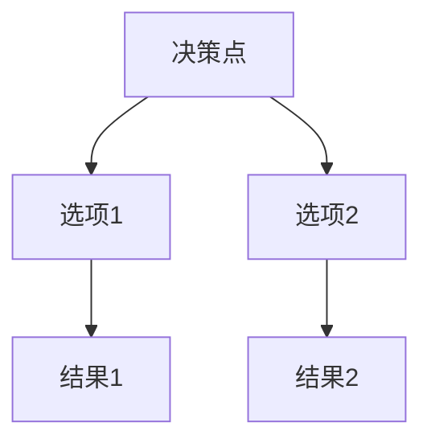

                 


```markdown
# 芒格的多学科知识在投资决策中的作用

> 关键词：芒格、多学科、投资决策、心理学、经济学

> 摘要：本文探讨了芒格如何运用多学科知识提升投资决策的质量。通过分析心理学、经济学和物理学的核心原理，结合实际案例，揭示了芒格决策框架的构建与应用。文章详细介绍了心理偏差、行为偏差、决策树、概率思维和逆向思维等关键概念，并展示了这些方法在投资中的实际应用。

---

## 第一部分: 芒格的多元思维模型与决策框架

### 第1章: 多元思维模型的核心原理

#### 1.1 多元思维模型的定义与特点
多元思维模型（Multi-Model Thinking）是指通过整合多个学科的原理和方法，形成一个全面的分析框架。芒格将其应用于投资决策中，通过多维度的分析来降低决策风险。

#### 1.2 多元思维模型的核心要素
- **心理学**：理解人类行为和心理偏差。
- **经济学**：分析市场机制和价值评估。
- **物理学**：理解系统运行的客观规律。
- **数学**：运用概率和统计方法进行分析。

#### 1.3 多元思维模型在投资中的应用
通过整合多学科知识，芒格能够从多个角度评估投资项目，从而做出更明智的决策。

---

### 第2章: 芒格的决策框架

#### 2.1 决策框架的构成
- **目标设定**：明确投资目标和风险承受能力。
- **信息收集**：全面收集和分析相关数据。
- **决策分析**：通过多学科方法评估选项。
- **风险控制**：制定风险管理策略。

#### 2.2 决策框架的实际应用案例
通过具体案例，展示芒格如何运用决策框架进行投资决策。

---

## 第二部分: 多学科知识体系与投资决策

### 第3章: 心理学与投资决策

#### 3.1 心理偏差对投资的影响
- **确认偏差**：倾向于相信支持自己观点的信息。
- **损失厌恶**：对损失的恐惧导致决策失误。
- **从众心理**：盲目跟随市场趋势。

#### 3.2 如何克服心理偏差
- **自我反思**：定期评估自己的决策过程。
- **知识储备**：通过学习增强决策能力。
- **决策训练**：通过模拟训练提高决策水平。

---

### 第4章: 经济学与投资决策

#### 4.1 经济学原理在投资中的应用
- **价值评估**：通过经济学原理分析资产的真实价值。
- **市场效率**：理解市场的有效性和无效性。

#### 4.2 经济学模型与投资决策
- **成本收益分析**：评估投资项目的经济效益。
- **市场结构分析**：理解市场中的供需关系。

---

### 第5章: 物理学与投资决策

#### 5.1 物理学原理在投资中的应用
- **系统稳定性**：分析投资系统的稳定性。
- **能量守恒**：理解资源分配的规律。

#### 5.2 物理学模型与投资决策
- **杠杆原理**：分析财务杠杆对投资的影响。
- **动力学分析**：理解市场变化的动态过程。

---

## 第三部分: 投资决策中的心理因素

### 第6章: 心理偏差与行为偏差

#### 6.1 心理偏差对投资的影响
- **过度自信**：导致冒险行为。
- ** anchoring effect**：对初始信息的过度依赖。

#### 6.2 行为偏差对投资的影响
- **herd behavior**：盲目跟随市场趋势。
- ** loss aversion**：对损失的过度关注。

#### 6.3 如何克服心理偏差
- **自我反思**：定期评估自己的决策过程。
- **知识储备**：通过学习增强决策能力。
- **决策训练**：通过模拟训练提高决策水平。

---

## 第四部分: 决策框架的构建与应用

### 第7章: 决策树的构建与应用

#### 7.1 决策树的基本概念
- **决策节点**：表示决策点。
- **结果节点**：表示可能的结果。

#### 7.2 决策树的实际应用案例
通过具体案例，展示如何通过决策树进行投资决策。

---

### 第8章: 概率思维与投资决策

#### 8.1 概率的基本概念
- **条件概率**：在给定条件下某事件发生的概率。
- **贝叶斯定理**：更新概率的公式。

#### 8.2 概率在投资中的应用
- **风险评估**：通过概率分析评估投资风险。
- **投资组合优化**：通过概率分析优化投资组合。

---

### 第9章: 逆向思维与投资

#### 9.1 逆向思维的定义与特点
- **反向思考**：从对立面思考问题。

#### 9.2 逆向思维在投资中的应用
- **价值投资**：寻找被市场低估的投资机会。
- **风险管理**：通过逆向思维识别潜在风险。

---

## 第五部分: 总结与启示

### 第10章: 芒格的多学科方法总结

#### 10.1 多元思维模型的总结
- **整合多学科知识**：提升投资决策的质量。
- **持续学习**：保持知识的更新与扩展。

#### 10.2 决策框架的总结
- **目标明确**：确保决策过程的清晰。
- **风险管理**：降低投资风险。

---

### 第11章: 投资决策的最佳实践

#### 11.1 心理因素的注意事项
- **自我反思**：定期评估自己的心理状态。
- **情绪管理**：保持冷静，避免情绪化决策。

#### 11.2 多学科知识的应用
- **持续学习**：不断扩展知识领域。
- **实际应用**：将理论应用于实际投资决策。

---

## 第六部分: 项目实战与系统架构

### 第12章: 投资决策系统的构建

#### 12.1 系统功能设计
- **数据收集**：收集市场数据和相关信息。
- **分析模块**：应用多学科方法进行分析。
- **决策模块**：生成投资决策方案。

#### 12.2 系统架构设计
- **数据层**：存储市场数据和历史信息。
- **逻辑层**：实现多学科分析的算法。
- **界面层**：用户友好的操作界面。

---

## 第七部分: 作者信息

作者：AI天才研究院/AI Genius Institute & 禅与计算机程序设计艺术 /Zen And The Art of Computer Programming

---

## 附录: 相关图表与代码

### 附录A: 决策树的 mermaid 图


### 附录B: 概率计算的 Python 代码
```python
import numpy as np
from scipy.stats import norm

# 示例概率计算
mu = 0
sigma = 1
x = 1.96
p = norm.cdf(x, mu, sigma)
print(p)
```

---

通过以上结构，文章详细阐述了芒格的多学科知识在投资决策中的应用，结合了理论分析和实际案例，帮助读者更好地理解和应用这些方法。
```

