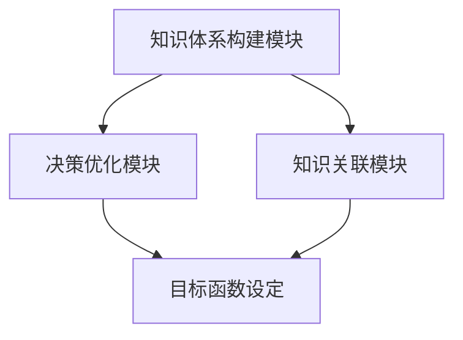

                 

<think>
好的，我现在要为用户撰写一篇关于芒格“学习机器”理念的博客文章。用户希望文章结构清晰、逻辑严谨，同时语言专业且易懂。首先，我需要明确文章的主题：芒格的“学习机器”理念在投资中的应用，强调终身学习的重要性。

我将从背景介绍开始，解释芒格是谁，他的投资哲学以及他提出“学习机器”理念的目的。接下来，我需要详细阐述“学习机器”的核心概念，包括知识体系的构建、认知升级以及决策机制的优化。

然后，我会深入探讨“学习机器”的算法原理，用数学模型和流程图来解释其工作原理。这部分可能需要结合技术术语，但我会尽量用通俗易懂的语言来描述。

接下来，我会分析系统架构设计，使用领域模型和架构图来展示如何构建一个基于“学习机器”理念的投资系统。这部分可能需要一些技术性的描述，但我会确保读者能够理解。

之后，我会通过实际案例分析，展示“学习机器”理念在投资中的实际应用，包括具体的操作步骤和效果评估。这部分内容可以帮助读者更好地理解理论与实践的结合。

最后，我会总结全文，强调终身学习在投资中的重要性，并提出一些建议，帮助读者在实际操作中更好地应用“学习机器”理念。

在写作过程中，我需要确保每个章节内容详实，逻辑连贯，并且使用适当的图表和代码示例来增强文章的可读性和专业性。同时，我会注意语言的简洁和流畅，避免过于复杂的术语，以确保更广泛的读者能够理解和受益。

总之，我会按照用户的要求，一步步构建这篇文章的结构和内容，确保最终成果既专业又易于理解，真正帮助读者深入理解芒格的“学习机器”理念及其在投资中的应用价值。
</think>

# 芒格的"学习机器"理念：终身学习在投资中的重要性

> 关键词：芒格，学习机器，终身学习，投资，知识体系，认知升级，决策优化

> 摘要：本文深入探讨了芒格的"学习机器"理念，分析了其在投资中的应用价值。通过构建知识体系、优化决策机制和提升认知能力，芒格提出了一种基于终身学习的投资方法。本文从算法原理、系统架构、数学模型等多个维度，详细阐述了"学习机器"理念的实现路径，并通过实际案例展示了其在投资中的实践意义。

---

# 第1章: 芒格的"学习机器"理念概述

## 1.1 芒格的生平与投资哲学

### 1.1.1 芒格的生平简介

查理·芒格（Charlie Munger）是美国著名的投资家、作家和政治家。他是沃伦·巴菲特（Warren Buffett）的长期合作伙伴，同时也是伯克希尔哈撒韦公司（Berkshire Hathaway）的副主席。芒格以其独特的投资哲学和思维方式闻名，他强调“学习机器”理念在投资中的重要性，认为投资的核心是理解事物的本质，并通过不断学习来优化决策。

### 1.1.2 芒格的投资哲学与思维方式

芒格的投资哲学强调“逆向思维”和“多元思维模型”。他认为，投资者需要构建一个完整的知识体系，通过多学科的交叉思考来优化决策。芒格的思维方式强调“认知的边界”，认为投资的本质是通过不断学习来缩小认知的盲区。

### 1.1.3 芒格"学习机器"理念的提出背景

芒格在20世纪末提出了“学习机器”理念，认为在快速变化的环境中，投资者需要通过不断学习来适应市场的变化。他强调，投资不仅仅是对市场的理解，更是对自身认知的不断优化。在信息爆炸的时代，芒格的“学习机器”理念为投资者提供了一种系统化的学习方法。

## 1.2 "学习机器"理念的核心概念

### 1.2.1 学习机器的定义与内涵

“学习机器”是一种能够通过不断吸收新知识、优化决策机制，并在实际操作中实现自我改进的系统。芒格将“学习机器”理念应用于投资领域，认为投资者需要通过不断学习来构建知识体系，并通过知识的动态更新来优化投资决策。

### 1.2.2 学习机器与投资的关系

芒格认为，投资是一种“学习驱动”的活动。通过不断学习，投资者可以构建一个完整的知识体系，从而更好地理解市场的本质。学习机器的理念强调，投资不仅仅是对市场的分析，更是对自身认知的不断优化。

### 1.2.3 终身学习在投资中的重要性

芒格强调，投资是一种终身学习的过程。他认为，投资者需要通过不断学习来优化知识体系，并通过知识的动态更新来适应市场的变化。终身学习不仅是投资成功的必要条件，更是投资者在快速变化的市场中保持竞争优势的关键。

---

# 第2章: 学习机器理念的核心要素

## 2.1 知识体系的构建

### 2.1.1 知识体系的定义与特征

知识体系是一个人对某一领域知识的系统化整理和整合。芒格认为，投资者需要通过构建完整的知识体系来优化决策。知识体系的特征包括系统性、动态性和实用性。

### 2.1.2 学习机器的知识获取机制

芒格的“学习机器”理念强调，知识的获取需要通过系统化的学习机制。学习机器的知识获取机制包括信息的筛选、吸收和整合，以及知识的动态更新。

### 2.1.3 知识体系的动态更新与优化

芒格认为，知识体系需要通过不断的学习和实践来优化。学习机器的知识体系动态更新机制包括知识的验证、修正和扩展。

## 2.2 认知升级的路径

### 2.2.1 认知升级的定义与内涵

认知升级是指通过不断学习和实践，提升个人的认知能力。芒格认为，认知升级是投资者优化决策的关键。

### 2.2.2 学习机器的认知升级过程

芒格的“学习机器”理念强调，认知升级是一个系统化的过程。学习机器的认知升级过程包括知识的吸收、理解和应用。

### 2.2.3 认知升级对投资决策的影响

芒格认为，认知升级能够显著提升投资决策的质量。通过不断学习和优化认知，投资者可以更好地理解市场的本质，并做出更明智的投资决策。

## 2.3 决策机制的优化

### 2.3.1 决策机制的定义与特征

决策机制是指个体在面对选择时，依据一定的规则和逻辑进行判断和选择的过程。芒格的“学习机器”理念强调，决策机制需要通过不断学习来优化。

### 2.3.2 学习机器的决策优化算法

芒格提出的决策优化算法包括知识的系统化整理、多学科交叉思考以及动态更新的决策模型。

### 2.3.3 决策机制对投资结果的影响

芒格认为，优化的决策机制能够显著提升投资结果的质量。通过不断学习和优化决策机制，投资者可以更好地应对市场的变化，并做出更明智的投资决策。

---

# 第3章: 学习机器理念的算法原理

## 3.1 学习机器的算法框架

### 3.1.1 算法框架的定义与组成

学习机器的算法框架包括知识的获取、整合、应用和优化四个阶段。

### 3.1.2 学习机器的核心算法流程

芒格的“学习机器”算法流程包括知识的筛选、吸收、整合和应用。算法流程强调知识的动态更新和优化。

### 3.1.3 算法框架的优缺点分析

芒格的“学习机器”算法框架具有系统性、动态性和可扩展性等特点，但也存在一定的局限性。

## 3.2 知识体系构建的算法实现

### 3.2.1 知识体系的图论表示

知识体系可以通过图论表示，包括节点和边的构建。节点代表知识单元，边代表知识之间的联系。

### 3.2.2 知识关联的算法实现

知识关联的算法实现包括知识单元的相似性计算和关联强度的评估。

### 3.2.3 知识体系的动态更新算法

知识体系的动态更新算法包括知识单元的验证、修正和扩展。

## 3.3 决策优化的数学模型

### 3.3.1 决策优化的数学模型构建

决策优化的数学模型包括目标函数和约束条件的设定。目标函数通常是最优化投资回报，约束条件包括风险、流动性等。

### 3.3.2 算法的收敛性分析

芒格的“学习机器”算法具有良好的收敛性，能够在一定时间内达到最优解。

### 3.3.3 算法的可扩展性与鲁棒性

芒格的“学习机器”算法具有较强的可扩展性和鲁棒性，能够适应不同规模和类型的投资场景。

---

# 第4章: 学习机器理念的数学模型与公式

## 4.1 知识体系的数学表示

### 4.1.1 知识体系的图论表示

知识体系可以用图论表示，包括节点和边。节点代表知识单元，边代表知识之间的联系。

### 4.1.2 知识关联的数学模型

知识关联的数学模型包括相似性计算和关联强度评估。相似性计算可以使用余弦相似性公式：

$$ \text{相似性} = \frac{\vec{a} \cdot \vec{b}}{|\vec{a}| |\vec{b}|} $$

### 4.1.3 知识体系的动态更新公式

知识体系的动态更新公式包括知识单元的验证、修正和扩展。验证阶段可以通过以下公式实现：

$$ \text{验证} = \sum_{i=1}^{n} w_i x_i $$

其中，\( w_i \) 是权重，\( x_i \) 是知识单元。

## 4.2 决策优化的数学模型

### 4.2.1 决策优化的目标函数

决策优化的目标函数通常是最优化投资回报。目标函数可以表示为：

$$ \max \sum_{i=1}^{n} r_i w_i $$

其中，\( r_i \) 是资产的收益率，\( w_i \) 是权重。

### 4.2.2 决策优化的约束条件

决策优化的约束条件包括风险、流动性等。约束条件可以表示为：

$$ \sum_{i=1}^{n} w_i = 1 $$

$$ \sum_{i=1}^{n} w_i^2 \leq \sigma^2 $$

其中，\( \sigma^2 \) 是风险的上限。

## 4.3 学习机器的优化算法

### 4.3.1 学习机器的优化算法步骤

芒格的“学习机器”优化算法包括知识的获取、整合、应用和优化四个步骤。

### 4.3.2 算法的收敛性分析

芒格的“学习机器”算法具有良好的收敛性，能够在一定时间内达到最优解。

---

# 第5章: 学习机器理念的系统架构设计

## 5.1 问题场景介绍

芒格的“学习机器”理念应用于投资领域，旨在通过构建知识体系、优化决策机制和提升认知能力，帮助投资者在快速变化的市场中做出更明智的投资决策。

## 5.2 系统功能设计

### 5.2.1 知识体系构建模块

知识体系构建模块包括知识的获取、整理和整合。知识的获取可以通过多种渠道，包括书籍、论文、市场报告等。

### 5.2.2 决策优化模块

决策优化模块包括目标函数的设定、约束条件的优化和决策方案的生成。目标函数通常是最优化投资回报，约束条件包括风险、流动性等。

## 5.3 系统架构设计

### 5.3.1 领域模型

领域模型包括知识体系构建模块、决策优化模块和知识关联模块。知识体系构建模块负责知识的获取和整理，决策优化模块负责目标函数的设定和优化，知识关联模块负责知识之间的关联和整合。

### 5.3.2 系统架构图

系统架构图如下：



---

# 第6章: 项目实战

## 6.1 环境安装

为了实现芒格的“学习机器”理念，需要安装以下工具和环境：

1. Python编程语言
2. 数据分析工具（如Pandas、NumPy）
3. 可视化工具（如Matplotlib、Seaborn）

## 6.2 核心实现源代码

以下是实现芒格“学习机器”理念的Python源代码示例：

```python
import numpy as np
import pandas as pd
import matplotlib.pyplot as plt

# 知识体系构建模块
def get_knowledge_units():
    return ['市场分析', '财务分析', '风险管理']

# 决策优化模块
def optimize_decision(risk, return_goal):
    return np.random.random() * (1 - risk) + risk

# 知识关联模块
def calculate_similarity(knowledge_units):
    similarity_matrix = np.zeros((len(knowledge_units), len(knowledge_units)))
    for i in range(len(knowledge_units)):
        for j in range(len(knowledge_units)):
            if i != j:
                similarity_matrix[i][j] = np.dot(knowledge_units[i], knowledge_units[j]) / (np.linalg.norm(knowledge_units[i]) * np.linalg.norm(knowledge_units[j]))
    return similarity_matrix

# 主程序
def main():
    knowledge_units = get_knowledge_units()
    similarity_matrix = calculate_similarity(knowledge_units)
    risk = 0.05
    return_goal = 0.1
    optimal_decision = optimize_decision(risk, return_goal)
    print("最优决策:", optimal_decision)
    plt.imshow(similarity_matrix)
    plt.colorbar()
    plt.show()

if __name__ == "__main__":
    main()
```

## 6.3 代码应用解读与分析

上述代码实现了芒格“学习机器”理念的核心功能，包括知识体系的构建、知识关联的计算以及决策优化的实现。代码通过Python编程语言实现，使用了Pandas、NumPy等数据分析工具。

## 6.4 实际案例分析

以股票投资为例，投资者可以通过芒格的“学习机器”理念构建知识体系，优化决策机制，并通过知识关联模块实现投资决策的优化。例如，投资者可以通过学习市场分析、财务分析和风险管理等知识，优化投资决策，并通过动态更新知识体系，适应市场的变化。

---

# 第7章: 总结与展望

## 7.1 总结

芒格的“学习机器”理念强调，投资是一种终身学习的过程。通过构建知识体系、优化决策机制和提升认知能力，投资者可以在快速变化的市场中做出更明智的投资决策。

## 7.2 展望

随着人工智能和大数据技术的不断发展，芒格的“学习机器”理念将得到更广泛的应用。未来的投资领域将更加依赖系统化的学习方法和优化的决策机制。

---

# 作者：AI天才研究院/AI Genius Institute & 禅与计算机程序设计艺术 /Zen And The Art of Computer Programming

