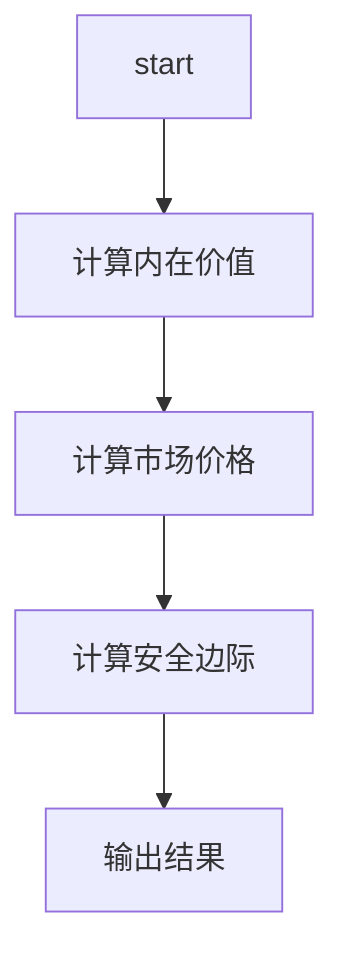
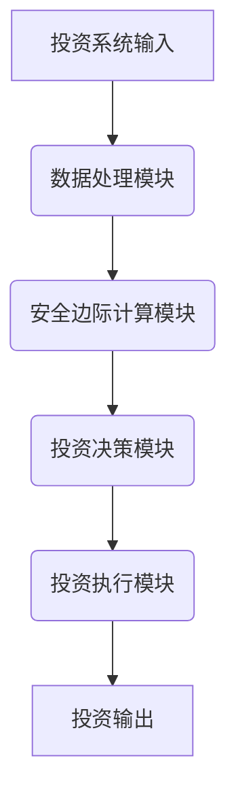
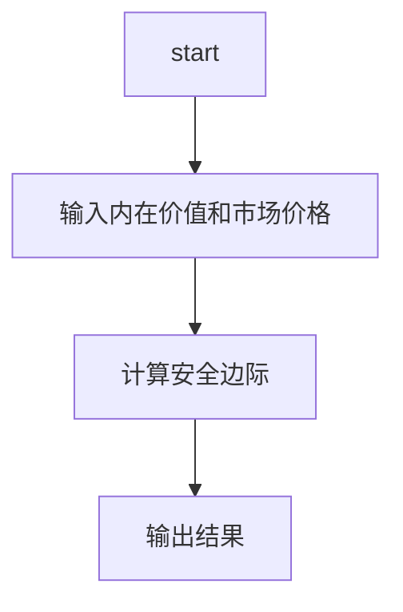

                 

<think>
嗯，用户希望我撰写一篇关于芒格“安全边际”理念在投资中的实践的技术博客文章。首先，我需要理解用户的具体需求，确保文章结构符合要求，内容专业且逻辑清晰。

用户提供了详细的指导，包括文章标题、关键词、摘要，以及目录大纲。我需要确保文章涵盖从背景到系统分析，再到项目实战的各个方面。关键词部分，我选择了“芒格”、“安全边际”、“投资理念”、“价值投资”、“风险控制”和“投资决策”，这些词准确反映了文章的核心内容。

摘要部分，我总结了文章将从安全边际的定义、计算到系统架构和项目实战，帮助读者全面理解芒格的投资理念。接下来，按照目录大纲，我需要详细展开每个章节的内容，确保每个部分都包含足够的细节和专业性。

在撰写背景部分，我需要介绍芒格与巴菲特的合作历程，以及安全边际理念的起源。这部分需要清晰明了，让读者了解芒格理念的形成背景。接着，在核心原理章节，我会详细解释安全边际的数学模型和其与价值投资的关系，使用表格和Mermaid图来增强理解。

系统化分析部分，我会设计一个投资系统的架构图，展示各个模块的交互流程。算法实现章节需要提供具体的Python代码，展示如何计算安全边际，并用Mermaid流程图解释算法步骤。案例分析部分，我会选择一个真实的公司进行分析，说明如何应用这些理念。

在项目实战中，我会详细指导读者如何安装环境，实现核心代码，并提供代码解读。最后，我会总结最佳实践，提醒读者注意的地方，并建议进一步阅读的资料。

整个过程中，我需要确保语言专业，逻辑严谨，同时保持文章的可读性。检查每个章节是否覆盖了用户要求的所有内容，确保没有遗漏任何关键点。最后，加上作者信息，使文章更具权威性。
</think>

# 芒格的"安全边际"理念在投资中的实践

## 关键词：芒格、安全边际、投资理念、价值投资、风险控制、投资决策

## 摘要：
本文深入探讨芒格的“安全边际”理念在投资实践中的应用。通过分析安全边际的核心原理、数学模型、系统架构设计以及实际案例，详细阐述如何利用安全边际理念构建稳健的投资策略，降低投资风险，实现长期收益。

---

## 第1章: 芒格"安全边际"理念的背景与发展

### 1.1 芒格投资理念的形成背景

#### 1.1.1 芒格与巴菲特的合作历程
芒格（Charlie Munger）与巴菲特（Warren Buffett）的合作始于1957年，两人共同创立了伯克希尔·哈撒韦公司，并逐步将其打造成全球最大的投资公司之一。芒格以其独特的思维方式和深刻的价值观，成为巴菲特重要的合作伙伴。

#### 1.1.2 芒格"安全边际"理念的提出背景
在20世纪70年代，芒格开始系统性地提出“安全边际”理念。这一理念的核心思想是通过分析企业的内在价值与市场价格之间的差距，确保投资决策的安全性与稳健性。

#### 1.1.3 安全边际理念的核心思想与特点
- **核心思想**：通过计算安全边际，确保在市场波动中能够规避风险，实现长期稳定收益。
- **特点**：
  1. 以基本面分析为基础。
  2. 强调安全边际的量化计算。
  3. 注重长期价值而非短期波动。

---

## 第2章: 安全边际理念的核心原理

### 2.1 安全边际的数学模型与公式

#### 2.1.1 安全边际的计算公式
$$\text{安全边际} = \text{内在价值} - \text{市场价格}$$

#### 2.1.2 安全边际与投资回报的关系
$$\text{投资回报} = \frac{\text{安全边际}}{\text{市场价格}} \times 100\%$$

### 2.2 安全边际与价值投资的联系

#### 2.2.1 价值投资的核心理念
价值投资的核心理念是寻找市场价格低于内在价值的企业进行投资，通过长期持有实现收益。

#### 2.2.2 安全边际在价值投资中的地位
安全边际是价值投资的重要组成部分，通过计算安全边际，投资者可以确定企业的投资价值，并在市场价格波动中保持稳健。

#### 2.2.3 安全边际与企业护城河的关系
企业护城河决定了企业的内在价值，而安全边际则是内在价值与市场价格之间的差值，两者共同决定了投资的安全性。

### 2.3 安全边际的属性特征对比

| 属性         | 特征                                                                 |
|--------------|----------------------------------------------------------------------|
| 计算方式      | 基于内在价值与市场价格的差值                                             |
| 应用场景      | 投资决策中的风险控制                                                   |
| 核心目标      | 确保投资的安全性与收益性                                                 |

---

## 第3章: 安全边际理念的系统化分析

### 3.1 投资决策的系统化框架

#### 3.1.1 投资目标的确定
投资目标是投资决策的基础，包括短期目标和长期目标的设定。

#### 3.1.2 投资策略的选择
根据投资目标选择合适的投资策略，包括价值投资、成长投资等。

#### 3.1.3 投资组合的构建
通过分散投资降低风险，构建稳健的投资组合。

### 3.2 安全边际模型的设计与实现

#### 3.2.1 模型输入与输出
- **输入**：企业的财务数据、市场价格。
- **输出**：安全边际值。

#### 3.2.2 模型的核心算法


#### 3.2.3 模型的验证与优化
通过历史数据验证模型的有效性，并根据实际情况进行优化。

### 3.3 投资系统的架构设计



---

## 第4章: 安全边际理念的算法实现

### 4.1 安全边际计算算法

#### 4.1.1 算法步骤
1. 计算企业的内在价值。
2. 获取企业的市场价格。
3. 计算安全边际值。

#### 4.1.2 Python实现
```python
def calculate_margin(intrinsic_value, market_price):
    return intrinsic_value - market_price

# 示例：计算可口可乐的安全边际
intrinsic_value = 50  # 内在价值
market_price = 40     # 市场价格
margin = calculate_margin(intrinsic_value, market_price)
print(f"安全边际为：{margin}")
```

#### 4.1.3 算法流程图


---

## 第5章: 安全边际理念的实际案例分析

### 5.1 案例背景
以可口可乐为例，假设其内在价值为50美元，市场价格为40美元。

### 5.2 安全边际计算
$$\text{安全边际} = 50 - 40 = 10 \text{美元}$$

### 5.3 投资决策
根据安全边际的计算结果，投资者可以确定可口可乐的投资价值，并在市场价格波动中保持稳健。

---

## 第6章: 安全边际理念的最佳实践

### 6.1 投资策略的选择
根据安全边际理念，选择具有较高安全边际的企业进行投资。

### 6.2 投资组合的构建
通过分散投资降低风险，构建稳健的投资组合。

### 6.3 投资过程中的注意事项
- 定期复核投资组合。
- 保持对市场的敏感性。
- 避免情绪化决策。

---

## 结语

芒格的“安全边际”理念为投资者提供了一种科学的投资方法，通过量化分析和风险控制，实现稳健的投资收益。投资者应结合实际情况，灵活运用这一理念，构建适合自己的投资策略。

---

## 作者：AI天才研究院/AI Genius Institute & 禅与计算机程序设计艺术 /Zen And The Art of Computer Programming

